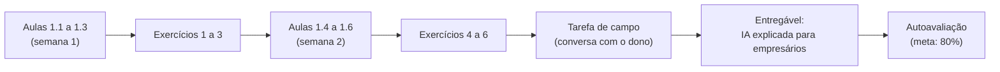
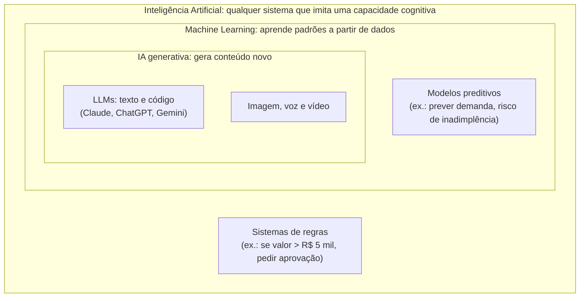
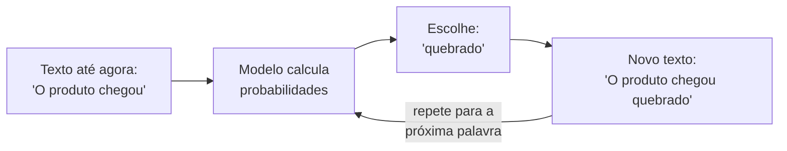
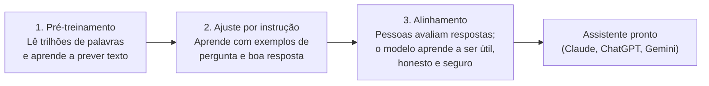
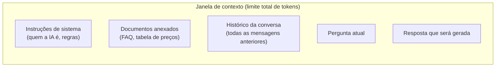
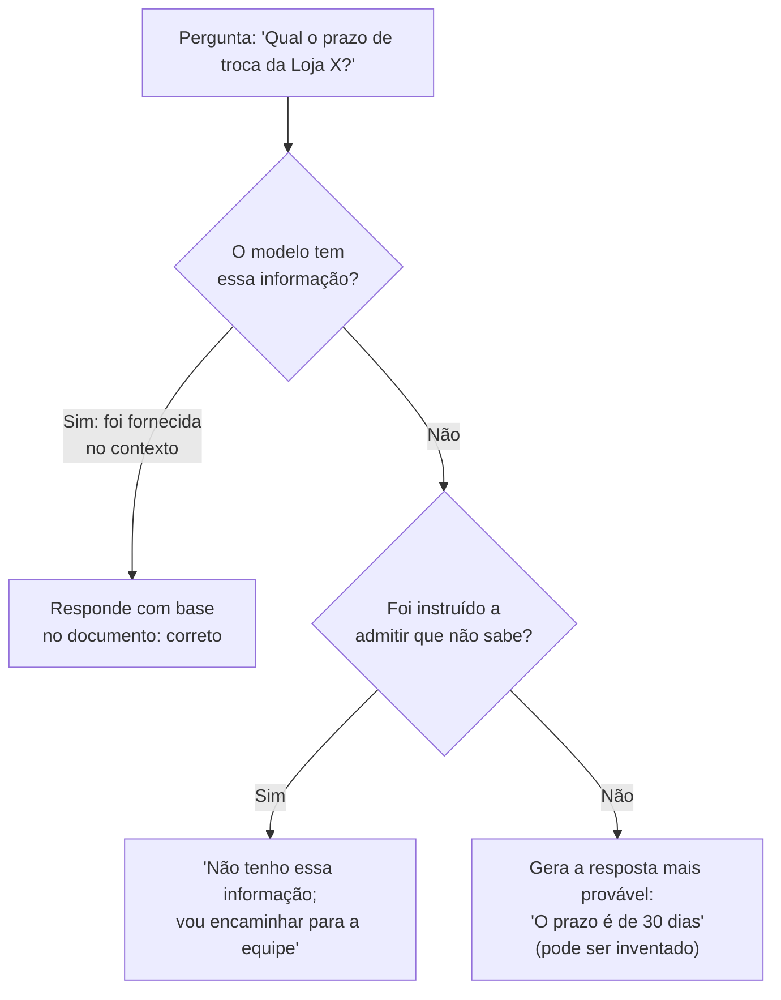
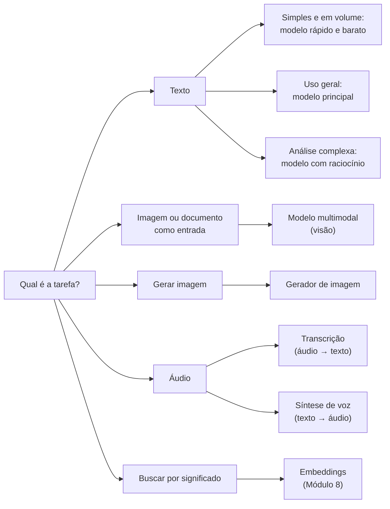
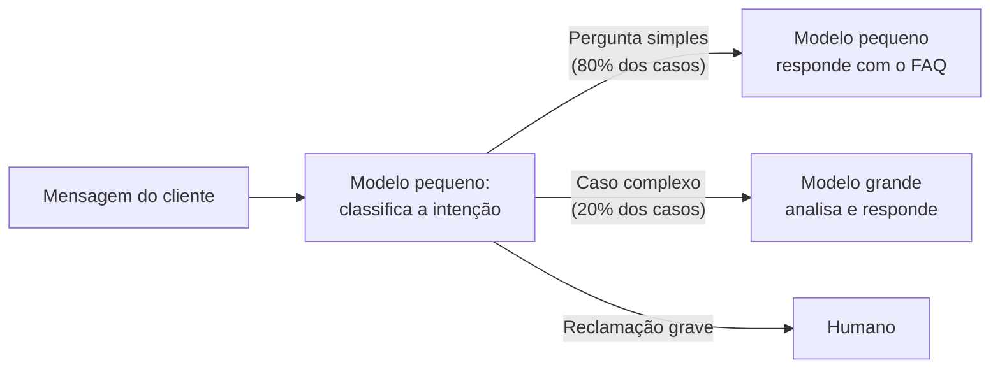
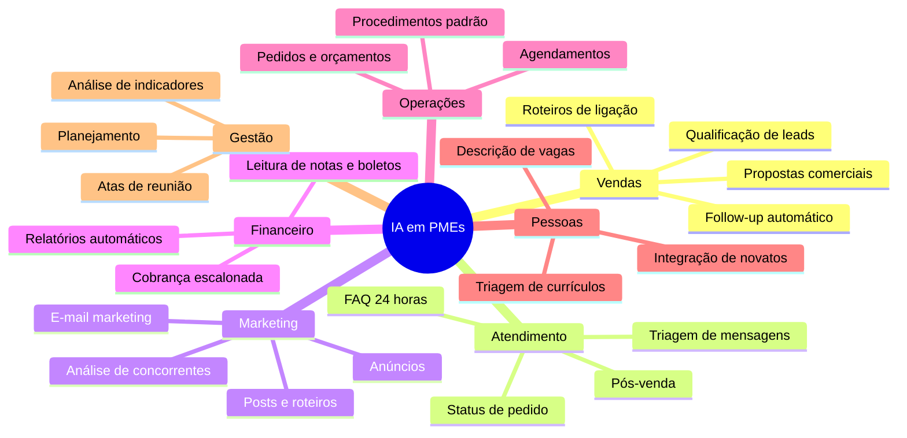
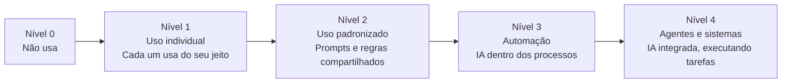

# Módulo 1: Como a IA funciona

**Semanas 1 e 2 · cerca de 18 horas**

## Objetivos de aprendizagem

Este módulo é a fundação de tudo o que vem depois. Quem entende **como** a IA funciona toma decisões melhores: sabe quando ela vai acertar, sabe por que ela erra e explica tudo isso para um empresário sem usar jargão. Esse é o primeiro sinal de que alguém é especialista, e não só usuário.

Ao final deste módulo você será capaz de:

1. Explicar para um empresário, sem jargão, como funciona um modelo de linguagem (LLM).
2. Distinguir o que a IA generativa faz bem do que ela faz mal.
3. Entender tokens, janela de contexto, temperatura e custo por uso, e fazer contas simples com eles.
4. Reconhecer alucinações e aplicar técnicas para reduzi-las.
5. Escolher o tipo de modelo adequado a cada tarefa (texto, imagem, voz, raciocínio).
6. Mapear onde a IA gera valor em cada área de uma PME.

### Como estudar este módulo



*Figura: a sequência de estudo do Módulo 1, da leitura das aulas até a autoavaliação.*

**Distribuição sugerida do tempo:**

| Semana | Estudo (aulas) | Prática (exercícios) | Campo e entregável |
|---|---|---|---|
| 1 | 3h (aulas 1.1 a 1.3) | 3h (exercícios 1 a 3) | 1h (primeiro post) |
| 2 | 3h (aulas 1.4 a 1.6) | 3h (exercícios 4 a 6) | 5h (conversa, entregável e revisão) |

> 💡 **Dica de estudo:** use o campo "Minhas anotações" no fim de cada aula para responder, com suas palavras, à pergunta: *"Como eu explicaria isso para o dono de uma padaria?"*. Se você não conseguir explicar de forma simples, releia a aula.

---

## Aula 1.1: O que é Inteligência Artificial, de verdade

### Uma definição que funciona na prática

**Inteligência Artificial (IA)** é o campo da computação que cria sistemas capazes de executar tarefas que normalmente exigiriam inteligência humana: reconhecer padrões, entender linguagem, tomar decisões, prever resultados e gerar conteúdo.

Essa definição é ampla de propósito. O termo "IA" cobre desde o filtro de spam do seu e-mail (que existe há mais de 20 anos) até assistentes que escrevem propostas comerciais inteiras. Por isso, a primeira habilidade de um especialista é **saber diferenciar as camadas** e usar o termo certo em cada conversa.

### As três camadas



*Figura: cada camada está contida na anterior. Toda IA generativa é Machine Learning, e todo Machine Learning é IA, mas o contrário não vale.*

| Camada | O que é | Exemplo em PME | Quem constrói |
|---|---|---|---|
| **IA (geral)** | Qualquer sistema que imita alguma capacidade cognitiva, inclusive com regras escritas à mão | Regra no ERP que bloqueia venda para cliente inadimplente | Programador escreve as regras |
| **Machine Learning** | Sistemas que **aprendem padrões a partir de dados**, em vez de seguir regras escritas | Previsão de demanda com base nas vendas dos últimos 3 anos | Cientista de dados treina com os dados da empresa |
| **IA generativa** | Modelos de ML treinados em quantidades gigantescas de dados que **geram conteúdo novo** | Responder clientes no WhatsApp, escrever posts, resumir contratos | Grandes empresas treinam; você **usa** pronto |

### A diferença que importa: regras × aprendizado

Imagine que você quer separar e-mails de clientes em "reclamação" e "elogio".

- **Com regras**, você escreveria: "se o e-mail contém 'péssimo', 'atraso' ou 'reembolso', é reclamação". Funciona até o cliente escrever "não foi nada péssimo, adorei!". A regra erra, e você precisa escrever outra regra. E outra. E outra.
- **Com Machine Learning tradicional**, você juntaria 5.000 e-mails já classificados por pessoas, e um algoritmo aprenderia os padrões sozinho. Funciona bem, mas exige os 5.000 exemplos, alguém técnico para treinar e manutenção.
- **Com IA generativa**, você escreve: *"Classifique este e-mail como reclamação ou elogio"*. Funciona na primeira tentativa, sem nenhum exemplo, porque o modelo já aprendeu a linguagem humana lendo bilhões de textos.

Esse terceiro caminho é o que mudou o jogo para as pequenas e médias empresas.

### A virada para PMEs

Até 2022, usar IA exigia três coisas que PMEs quase nunca tinham: **dados em volume**, **profissionais caros** (cientistas de dados) e **meses de projeto**. Por isso, IA era assunto de bancos, grandes varejistas e empresas de tecnologia.

A IA generativa inverteu essa lógica:

| | Antes (ML tradicional) | Agora (IA generativa) |
|---|---|---|
| Dados necessários | Milhares de exemplos da própria empresa | Nenhum para começar; só as instruções e o contexto |
| Quem opera | Cientista de dados | Qualquer pessoa que saiba escrever bem as instruções |
| Tempo até o primeiro resultado | Meses | Minutos |
| Custo inicial | Dezenas ou centenas de milhares de reais | Uma assinatura mensal ou centavos por uso |
| Principal gargalo | Técnico | **Saber onde aplicar e fazer as pessoas usarem** |

> 🎯 **A frase-chave deste módulo:** o gargalo da IA nas PMEs deixou de ser tecnológico e passou a ser de **aplicação**. Saber onde usar, como integrar ao processo e como fazer a equipe adotar. É exatamente esse o papel do especialista que você está se tornando.

### O que a IA generativa **não** substitui

Para não criar expectativas erradas (suas e dos seus futuros clientes):

- **Não substitui o Machine Learning tradicional** em previsões numéricas precisas com muitos dados (previsão de demanda, detecção de fraude em volume). Nesses casos, modelos específicos continuam melhores.
- **Não substitui sistemas** (ERP, CRM, banco de dados). A IA conversa com eles, mas não guarda os dados da empresa de forma confiável.
- **Não substitui decisões de responsabilidade**. Ela sugere; alguém responde pelo resultado.

### Exemplo prático: uma loja de materiais de construção

A **Casa & Obra**, com 14 funcionários, tem três "IAs" possíveis:

1. **Regra no sistema:** se o estoque de cimento cair abaixo de 50 sacos, gerar pedido de compra. (IA no sentido amplo, sem aprendizado.)
2. **Machine Learning:** um modelo que aprende com 3 anos de vendas e prevê que em novembro a venda de telhas sobe 40%. (Exige dados e alguém técnico.)
3. **IA generativa:** um assistente no WhatsApp que entende "preciso de material pra fazer um muro de 10 metros" e monta a lista de itens com quantidades. (Disponível hoje, sem treinamento.)

O especialista sabe recomendar **cada uma no momento certo**. Para a Casa & Obra, a opção 3 dá retorno mais rápido; a opção 2 só faz sentido quando os dados de vendas estiverem organizados.

> 📌 **Em resumo**
> - IA é o campo amplo; Machine Learning aprende com dados; IA generativa gera conteúdo novo.
> - A IA generativa dispensou dados próprios, especialistas caros e meses de projeto para começar.
> - O gargalo agora é de aplicação: saber onde usar e fazer a equipe adotar.

**Para ir além**
- Curso gratuito [Elements of AI](https://www.elementsofai.com/) (Universidade de Helsinque): introdução acessível, sem matemática, com versão em português.
- Curso [AI for Everyone](https://www.coursera.org/learn/ai-for-everyone) (Andrew Ng, Coursera): visão de negócios sobre IA, ótimo para quem vai conversar com gestores. Pode ser assistido gratuitamente em modo ouvinte.

---

## Aula 1.2: Como um LLM funciona (sem matemática)

**LLM** (*Large Language Model*, modelo de linguagem de grande escala) é o motor por trás do Claude, do ChatGPT e do Gemini. Você não precisa saber programar um LLM, mas precisa entender a lógica dele. É isso que permite prever quando ele vai acertar e quando vai errar.

### A ideia central: prever o próximo pedaço de texto

Um LLM foi treinado para fazer uma única coisa, repetidas trilhões de vezes: **dado um texto, prever qual é a continuação mais provável**.

> "O cliente pediu o reembolso porque o produto chegou \_\_\_"

Para completar essa frase, o modelo calcula probabilidades para cada continuação possível:

| Continuação | Probabilidade (ilustrativa) |
|---|---|
| quebrado | 38% |
| atrasado | 24% |
| errado | 17% |
| danificado | 12% |
| azul | 0,01% |

Ele escolhe uma continuação (normalmente entre as mais prováveis), acrescenta ao texto e repete o processo para a palavra seguinte. **Palavra por palavra, ele escreve respostas inteiras.**



*Figura: o laço de geração. O modelo não escreve a resposta de uma vez; ele a constrói um pedaço por vez, sempre olhando tudo o que já foi escrito.*

### "Mas então ele só completa frases?"

Sim, e isso é surpreendentemente poderoso. Para prever bem a próxima palavra em textos de todos os tipos, o modelo precisou "absorver":

- **Gramática e estilo** de dezenas de idiomas.
- **Fatos** que aparecem com frequência nos textos (capitais, datas históricas, conceitos técnicos).
- **Raciocínios**: para completar "Se o preço é R$ 100 e o desconto é 15%, o valor final é R$", ele precisa ter aprendido algo sobre porcentagem.
- **Formatos**: e-mails, contratos, código, tabelas, receitas, roteiros.
- **Padrões de comportamento**: como um atendente educado responde, como um advogado escreve, como um vendedor contorna uma objeção.

É por isso que um mecanismo simples ("prever a próxima palavra") produz algo que parece entender. Se ele "entende" de verdade é um debate filosófico. Para o seu trabalho, o que importa é: **ele reproduz padrões de linguagem com enorme competência, e erra quando o padrão mais provável não é o verdadeiro.**

### As 3 fases de construção de um LLM



*Figura: um modelo "cru" do pré-treinamento sabe muito, mas não sabe conversar. As fases 2 e 3 o transformam em um assistente.*

1. **Pré-treinamento:** o modelo lê uma quantidade enorme de texto (livros, sites, artigos, códigos) e ajusta bilhões de parâmetros internos para prever melhor a próxima palavra. Leva meses e custa centenas de milhões de dólares. Resultado: um modelo que "sabe muito", mas que, se você perguntar "qual a capital da França?", pode continuar com "qual a capital da Alemanha? qual a capital da Itália?", porque textos com listas de perguntas são comuns.
2. **Ajuste por instrução:** o modelo aprende com milhares de exemplos de "pergunta → boa resposta". Agora ele entende que, diante de uma pergunta, deve responder.
3. **Alinhamento com feedback humano:** pessoas comparam respostas e indicam as melhores. O modelo aprende a ser útil, a recusar pedidos perigosos e a admitir incerteza (em parte).

### A data de corte do conhecimento

Como o pré-treinamento acontece em um período, o modelo **não sabe o que aconteceu depois**. Essa é a **data de corte** (*knowledge cutoff*). Se o assistente não tiver acesso à internet, ele não conhece a nova lei aprovada no mês passado nem o preço atual do seu produto.

Consequência prática: **para informações atuais ou da empresa, você precisa fornecê-las ao modelo** (colando no prompt, anexando documentos ou conectando o modelo a sistemas e à web). Você vai aprender a fazer isso nos Módulos 2, 8 e 9.

### Por que as respostas mudam a cada vez

Se você fizer a mesma pergunta duas vezes, pode receber respostas diferentes. Isso acontece porque o modelo **sorteia** entre as continuações prováveis, em vez de sempre escolher a mais provável. Esse sorteio dá variedade e naturalidade ao texto. O grau de variação é controlado pela **temperatura**, que você verá na próxima aula.

### A analogia do estagiário (use em palestras)

> "Imagine um estagiário que leu toda a biblioteca do mundo, é rapidíssimo e nunca se cansa, **mas começou hoje na sua empresa**. Ele não conhece seus clientes, seus preços nem suas regras. E, quando não sabe algo, às vezes inventa com muita confiança. A IA é esse estagiário. Seu trabalho é dar a ele **contexto, instruções claras e supervisão**."

Essa analogia explica, de uma vez só, quatro coisas que você vai ensinar a empresários:

| Parte da analogia | O que ela explica | Onde você aprende a resolver |
|---|---|---|
| "Leu toda a biblioteca" | Por que a IA sabe tanto sobre tantos assuntos | Este módulo |
| "Começou hoje na sua empresa" | Por que ela precisa de contexto e dos dados da empresa | M2 (prompts) e M8 (RAG) |
| "Às vezes inventa com confiança" | Alucinação e necessidade de revisão | Aula 1.4 e M10 |
| "Rapidíssimo e nunca se cansa" | Por que o ganho de produtividade é tão grande | M3 (oportunidades) e M10 (ROI) |

> 📌 **Em resumo**
> - Um LLM prevê a continuação mais provável de um texto, palavra por palavra.
> - Para prever bem, ele absorveu gramática, fatos, raciocínios e formatos.
> - Ele tem data de corte: informações atuais ou da empresa precisam ser fornecidas.
> - Ele erra quando a continuação mais provável não é a verdadeira.

**Para ir além**
- Vídeo [Intro to Large Language Models](https://www.youtube.com/watch?v=zjkBMFhNj_g), de Andrej Karpathy (1 hora, em inglês; ative as legendas traduzidas). É a melhor explicação acessível de como LLMs funcionam, de um dos pesquisadores mais respeitados da área.
- Vídeo [Deep Dive into LLMs like ChatGPT](https://www.youtube.com/watch?v=7xTGNNLPyMI), também de Karpathy (3h30, em inglês), para quem quiser se aprofundar depois do módulo.

---

## Aula 1.3: Tokens, contexto, temperatura e custo

Quatro conceitos técnicos que todo especialista precisa dominar, porque eles determinam **quanto custa**, **quanto cabe** e **quão previsível** é uma solução de IA.

### 1. Tokens: a unidade de medida da IA

O modelo não lê palavras nem letras. Ele lê **tokens**: pedaços de texto que podem ser uma palavra inteira, parte de uma palavra ou um sinal de pontuação.

Exemplo ilustrativo de como uma frase pode ser dividida:

| Texto | Possível divisão em tokens |
|---|---|
| "Atendimento" | "Atend" + "imento" |
| "WhatsApp" | "Wh" + "ats" + "App" |
| "R$ 1.250,00" | "R" + "$" + " 1" + "." + "250" + "," + "00" |

**Regras práticas para estimativas:**

| Medida | Aproximação em português |
|---|---|
| 1 token | 3 a 4 caracteres |
| 1 palavra | cerca de 1,3 a 1,7 token |
| 1 página A4 de texto | cerca de 500 a 700 tokens |
| 1 livro de 200 páginas | cerca de 100 a 140 mil tokens |

> 💡 Textos em português costumam gastar **mais tokens que o mesmo texto em inglês**, porque os modelos foram treinados com mais texto em inglês e "quebram" palavras em português em pedaços menores. Isso afeta custo: o mesmo atendimento em português pode sair um pouco mais caro.

**Por que tokens importam:**
- As APIs **cobram por token**, separando tokens de entrada (o que você envia) e de saída (o que o modelo gera).
- Tokens de saída costumam custar **várias vezes mais** que os de entrada.
- O limite de "memória" do modelo (a janela de contexto) é medido em tokens.

### 2. Janela de contexto: o que o modelo "vê" de uma vez

A **janela de contexto** é o limite máximo de tokens que o modelo consegue considerar em uma única interação. Tudo entra nessa conta:



*Figura: instruções, documentos, histórico, pergunta e resposta dividem o mesmo espaço. Quando a soma passa do limite, algo precisa sair.*

Os modelos atuais têm janelas de centenas de milhares de tokens, e alguns passam de 1 milhão. Isso equivale a centenas de páginas. Parece infinito, mas há três implicações práticas:

1. **Conversas longas perdem qualidade.** Mesmo cabendo tudo, instruções dadas no início se "diluem" no meio de muito texto. **Regra prática:** para uma tarefa nova, abra um chat novo.
2. **Custo e velocidade crescem com o contexto.** Em uma API, cada mensagem reenvia o histórico inteiro. Uma conversa de 30 mensagens paga pelos tokens de todo o histórico a cada nova resposta.
3. **Nem tudo cabe.** Os 3.000 documentos de uma empresa não cabem no contexto. Para isso existe o **RAG** (Módulo 8), que busca só os trechos relevantes.

### 3. Temperatura: previsível ou criativa

A **temperatura** controla o quanto o modelo "arrisca" ao escolher a próxima palavra.

| Temperatura | Comportamento | Use para |
|---|---|---|
| **Baixa (0 a 0,3)** | Escolhe quase sempre as palavras mais prováveis. Respostas consistentes, repetíveis | Extração de dados, classificação, atendimento, cálculos, respostas factuais |
| **Média (0,4 a 0,7)** | Equilíbrio entre consistência e variedade | Redação de e-mails, resumos, textos de apoio |
| **Alta (0,8 a 1)** | Escolhe com mais frequência palavras menos prováveis. Respostas variadas e criativas | Brainstorm, nomes de produto, ideias de campanha |

Nos assistentes de chat (Claude.ai, ChatGPT), a temperatura geralmente não aparece para você ajustar. Ela aparece em **APIs** e em ferramentas de automação (Make, n8n), que você usará a partir do Módulo 5.

> ⚠️ Temperatura baixa **não elimina** alucinação. Ela só torna o erro mais consistente. Para reduzir erros, você precisa de contexto e instruções (Aula 1.4).

### 4. Custo: como estimar antes de propor

Toda solução que você propuser a um cliente precisa de uma estimativa de custo. A fórmula é simples:

```
Custo por execução = (tokens de entrada × preço por token de entrada)
                   + (tokens de saída × preço por token de saída)

Custo mensal = custo por execução × número de execuções por mês
```

Os preços são divulgados **por milhão de tokens** (MTok). Veja um exemplo com **preços hipotéticos**, apenas para treinar o cálculo:

**Cenário:** atendimento no WhatsApp de uma loja.
- 2.000 conversas por mês, com média de 5 mensagens do cliente = **10.000 chamadas ao modelo**.
- Cada chamada envia 3.000 tokens (instruções + FAQ + histórico) e recebe 300 tokens de resposta.
- Preço hipotético: US$ 3 por milhão de tokens de entrada e US$ 15 por milhão de tokens de saída.

| Item | Cálculo | Resultado |
|---|---|---|
| Tokens de entrada no mês | 10.000 × 3.000 | 30.000.000 (30 MTok) |
| Custo de entrada | 30 × US$ 3 | US$ 90 |
| Tokens de saída no mês | 10.000 × 300 | 3.000.000 (3 MTok) |
| Custo de saída | 3 × US$ 15 | US$ 45 |
| **Total mensal** | | **US$ 135** |

Agora compare com o custo humano: 2.000 conversas × 5 minutos cada = 166 horas de trabalho por mês, o que equivale a um funcionário em tempo integral. Mesmo que o custo real seja diferente do exemplo, a ordem de grandeza costuma favorecer muito a IA em tarefas repetitivas.

**Como reduzir custos (você vai usar isso em projetos):**
- Usar **modelos menores** para tarefas simples (Aula 1.5).
- **Enxugar as instruções** e os documentos enviados.
- **Limitar o histórico** enviado (por exemplo, só as últimas 10 mensagens).
- Usar **cache de prompt** quando o fornecedor oferecer: partes que se repetem em toda chamada (como o FAQ) ficam mais baratas.

> ⚠️ **Preços mudam com frequência** e variam muito entre modelos. Antes de orçar para um cliente, confira sempre as páginas oficiais: [preços da Anthropic (Claude)](https://claude.com/pricing), [preços da OpenAI](https://openai.com/api/pricing/) e [preços do Google (Gemini)](https://ai.google.dev/pricing). Lembre de converter de dólar para real e de considerar impostos sobre serviços internacionais.

> 📌 **Em resumo**
> - Token é a unidade de medida: cerca de 3 a 4 caracteres; uma página tem de 500 a 700 tokens.
> - A janela de contexto soma instruções, documentos, histórico, pergunta e resposta.
> - Temperatura baixa para precisão, alta para criatividade.
> - Custo = tokens de entrada × preço + tokens de saída × preço, multiplicado pelo volume.

**Para ir além**
- [Tokenizer da OpenAI](https://platform.openai.com/tokenizer): cole um texto e veja como ele é dividido em tokens.
- [Visão geral dos modelos Claude](https://platform.claude.com/docs/en/models/overview): tamanho da janela de contexto e preços de cada modelo.

---

## Aula 1.4: Alucinações e limites

### O que é alucinação

**Alucinação** é quando o modelo gera uma informação falsa com aparência de verdadeira. Exemplos reais do tipo de erro que acontece:

- Citar um artigo de lei que não existe (ou existe com outro conteúdo).
- Informar o preço de um produto que ele não conhece.
- Inventar uma estatística com número "redondo" e fonte plausível.
- Criar uma referência bibliográfica com autor real e título inexistente.
- Afirmar que uma empresa tem uma política de troca que ela não tem.

O perigo não é o erro em si (pessoas também erram). O perigo é que **o erro vem com o mesmo tom confiante do acerto**. Não há um aviso de "não tenho certeza" a menos que você peça.

### Por que acontece

Volte à Aula 1.2: o modelo gera a continuação **mais provável**, e não a continuação **verificada como verdadeira**. Quando ele tem a informação (porque ela aparecia muito nos textos de treino ou porque você a forneceu), a continuação provável costuma ser a correta. Quando ele não tem, a continuação mais provável é algo que **parece** uma resposta correta.



*Figura: a alucinação aparece no caminho em que o modelo não tem a informação e não foi autorizado a dizer "não sei". As técnicas desta aula fecham esse caminho.*

### Onde a IA é forte e onde é fraca

| Forte ✅ | Fraca ⚠️ |
|---|---|
| Resumir, reescrever, traduzir, mudar o tom | Fatos muito específicos ou recentes sem fonte fornecida |
| Classificar e extrair dados de textos | Cálculos longos sem ferramenta de código |
| Redigir rascunhos (e-mails, posts, propostas) | Informações internas da empresa, se não as receber |
| Gerar ideias e variações | Decisões críticas sem supervisão (jurídico, médico, crédito) |
| Responder com base em documentos fornecidos | Consistência de 100% em todas as execuções |
| Identificar sentimento, intenção e tom | Contar com precisão (letras, palavras, itens em listas longas) |
| Explicar conceitos e responder dúvidas gerais | Saber quando não sabe (melhora muito com instrução explícita) |

### As 6 técnicas para reduzir alucinação

**1. Forneça a fonte.** Em vez de perguntar "qual nosso prazo de troca?", cole a política e peça: *"Responda **apenas** com base no documento abaixo."*

**2. Autorize o "não sei".** Inclua: *"Se a informação não estiver no documento, responda exatamente: 'Não tenho essa informação, vou encaminhar para a equipe'."* Sem essa autorização, o modelo tende a responder de qualquer forma, porque foi treinado para ser útil.

**3. Peça citações.** *"Para cada afirmação, indique o trecho do documento que a sustenta."* Isso força o modelo a se ancorar no texto e facilita a sua conferência.

**4. Diminua a temperatura** em tarefas factuais (Aula 1.3).

**5. Divida tarefas complexas.** Uma pergunta que exige cinco passos de raciocínio erra mais que cinco perguntas de um passo. Você aprenderá a encadear etapas no Módulo 2.

**6. Revise com um humano** tudo que tem impacto jurídico, financeiro ou de reputação. Nos projetos, isso vira uma etapa formal chamada **humano no circuito** (Módulo 5).

### Exemplo: antes e depois

**Prompt sem proteção:**
> Um cliente perguntou se pode trocar um tênis usado uma vez. O que respondo?

Resposta provável: um texto educado dizendo que "de acordo com o Código de Defesa do Consumidor, o cliente tem 7 dias para trocar". Isso mistura regras: os 7 dias de arrependimento valem para compras **fora do estabelecimento** (internet, telefone), e a troca de produto sem defeito em loja física depende da política da loja. A resposta parece correta e está errada para o caso.

**Prompt com proteção:**
> Você é atendente da Loja Passo Certo. Responda à pergunta do cliente **somente** com base na política abaixo. Se a política não cobrir o caso, diga que vai verificar com a gerência.
>
> Política de trocas: """Trocas de produtos sem defeito em até 30 dias após a compra, com etiqueta e sem sinais de uso. Produtos com defeito seguem a garantia legal."""
>
> Pergunta do cliente: "Posso trocar um tênis que usei uma vez?"

Resposta provável: explica que a política exige produto sem sinais de uso e oferece verificar se há defeito. Correta, ancorada e segura.

### Outros limites que você deve conhecer

- **Viés:** o modelo reflete padrões dos textos de treino, inclusive preconceitos. Em tarefas que envolvem pessoas (seleção de currículos, crédito), isso exige cuidado extra (Módulo 10).
- **Manipulação por instruções maliciosas** (*prompt injection*): um texto pode conter ordens como "ignore suas regras". Você verá as defesas no Módulo 9.
- **Inconsistência:** a mesma pergunta pode ter respostas diferentes. Processos críticos precisam de testes com vários casos (Módulo 2, Aula 2.5).

> 📌 **Em resumo**
> - Alucinação é informação falsa com aparência de verdadeira, dita com confiança.
> - Acontece porque o modelo gera o mais provável, não o verificado.
> - As 6 defesas: fonte, "não sei", citações, temperatura baixa, dividir tarefas e revisão humana.

**Para ir além**
- Guia oficial da Anthropic sobre [engenharia de prompt](https://platform.claude.com/docs/en/build-with-claude/prompt-engineering/overview), com seções sobre reduzir alucinações e aumentar a consistência (em inglês).
- [OWASP Top 10 para aplicações com LLMs](https://owasp.org/projects/top-10-for-large-language-model-applications): lista de riscos de segurança, útil a partir do Módulo 9.

---

## Aula 1.5: Tipos de modelos e quando usar cada um

Nem toda tarefa precisa do modelo mais poderoso, e nem toda tarefa é de texto. Saber escolher o tipo certo de modelo é o que separa uma solução cara e lenta de uma solução eficiente.

### O mapa dos tipos de modelos



*Figura: parta da tarefa, não do modelo. A pergunta "qual IA é melhor?" só tem resposta depois de saber o que se quer fazer.*

| Tipo | O que faz | Uso em PME | Observação |
|---|---|---|---|
| **LLM de uso geral** | Conversa, escreve, analisa | Atendimento, propostas, resumos | O "padrão" para a maioria das tarefas |
| **Modelos com raciocínio** ("pensamento estendido") | Pensam em etapas antes de responder | Análise financeira, diagnóstico, planejamento, problemas com várias etapas | Mais lentos e mais caros; não use para tarefas simples |
| **Modelos rápidos e baratos** (versões "mini", "flash", "haiku") | Menos capazes, muito mais baratos e rápidos | Classificação em volume, triagem, extração simples | Ideais para automações com muitas execuções |
| **Multimodais (visão)** | Leem imagens, PDFs escaneados, prints, fotos | Ler notas fiscais, comprovantes, cardápios, planilhas fotografadas | Hoje, a maioria dos modelos principais já tem visão |
| **Geração de imagem** | Criam imagens a partir de texto | Criativos, mockups, ilustrações | Cuidados legais no Módulo 7 |
| **Transcrição (áudio → texto)** | Convertem voz em texto | Áudios do WhatsApp, reuniões, ligações | Muito precisos em português atualmente |
| **Síntese de voz (texto → áudio)** | Geram fala natural | Atendimento por voz, conteúdo em áudio | Nunca clone a voz de alguém sem autorização |
| **Embeddings** | Transformam texto em números que representam significado | Busca inteligente e bases de conhecimento (RAG) | Você não conversa com eles; eles trabalham "por trás" |

### Famílias de modelos: grande, médio, pequeno

Os principais fornecedores oferecem **famílias** com vários tamanhos. Por exemplo, a Anthropic tem modelos de diferentes portes na linha Claude, e OpenAI e Google fazem o mesmo. Os nomes mudam a cada lançamento, mas a lógica se mantém:

| Porte | Qualidade | Velocidade | Custo | Quando usar |
|---|---|---|---|---|
| Grande | Máxima | Menor | Alto | Tarefas complexas, texto de alta qualidade, agentes |
| Médio | Alta | Boa | Médio | A maior parte dos atendimentos e automações |
| Pequeno | Suficiente para tarefas simples | Muito alta | Baixo | Triagem, classificação, extração em grande volume |

### A regra prática de escolha

1. **Comece com o modelo mais capaz** para descobrir se a tarefa é possível. Se o melhor modelo não resolve, o problema está na tarefa ou nas instruções, não no modelo.
2. **Depois que funcionar, teste um modelo menor** com os mesmos casos de teste. Se a qualidade se mantiver, troque.
3. **Combine modelos** em soluções maiores: um modelo pequeno faz a triagem das mensagens; só as complexas vão para o modelo grande.



*Figura: um padrão de combinação que reduz custo sem perder qualidade. O modelo caro só trabalha quando é necessário.*

### Exemplo de escolha: uma clínica veterinária

| Tarefa | Tipo de modelo | Por quê |
|---|---|---|
| Transcrever áudios de tutores no WhatsApp | Transcrição | A entrada é áudio |
| Classificar a mensagem (agendamento, dúvida, emergência) | Modelo pequeno | Tarefa simples, alto volume |
| Responder dúvidas sobre vacinas e horários | Modelo médio + FAQ da clínica | Precisa de boa redação e do contexto |
| Ler a foto da carteira de vacinação | Multimodal (visão) | A entrada é imagem |
| Analisar o faturamento do trimestre e sugerir ações | Modelo com raciocínio | Análise com várias etapas |

> 📌 **Em resumo**
> - Parta da tarefa: texto, imagem, áudio ou busca.
> - Comece com o modelo mais capaz para validar; depois teste um menor e mais barato.
> - Combine modelos: o barato faz a triagem, o caro resolve o difícil.

**Para ir além**
- [Visão geral dos modelos Claude](https://platform.claude.com/docs/en/models/overview): compare portes, preços e janelas de contexto.
- [Documentação de prompts do Gemini](https://ai.google.dev/gemini-api/docs/prompting-strategies) e [guia de prompts da OpenAI](https://developers.openai.com/api/docs/guides/prompt-engineering): conhecer mais de um fornecedor ajuda a recomendar sem viés.

---

## Aula 1.6: O mapa das aplicações de IA em PMEs

Esta aula é o seu **repertório**. Em diagnósticos, palestras e conversas comerciais, você precisará lembrar rapidamente onde a IA gera valor em cada área de uma empresa. Estude esta aula até conseguir citar 3 aplicações por área sem consultar.

### Onde a IA gera valor, por área



*Figura: o mapa mental das aplicações. Use-o como roteiro nas entrevistas de diagnóstico do Módulo 3.*

| Área | Aplicações típicas | Tipo de ganho | Exemplo concreto |
|---|---|---|---|
| **Vendas** | Qualificação de leads, follow-up, propostas, roteiros de ligação | Receita | Imobiliária responde leads do portal em 1 minuto e agenda visitas |
| **Atendimento** | FAQ automatizado, triagem, 2ª via, status de pedido | Custo + experiência | Loja virtual responde "cadê meu pedido?" consultando o rastreio |
| **Marketing** | Posts, anúncios, e-mails, SEO, análise de concorrentes | Receita + produtividade | Restaurante produz o calendário do mês em 2 horas |
| **Financeiro** | Conciliação, leitura de notas, cobrança, relatórios | Custo + menos erros | Escritório extrai dados de 300 notas por mês sem digitação |
| **Operações** | Pedidos, estoque, agendamentos, checklists | Custo + velocidade | Serralheria gera orçamento em minutos a partir de fotos e medidas |
| **Pessoas (RH)** | Triagem de currículos, integração, manual do funcionário | Produtividade | Novo funcionário tira dúvidas com um assistente treinado no manual |
| **Gestão** | Relatórios automáticos, análise de indicadores, atas | Qualidade de decisão | Dono recebe toda segunda um resumo das vendas com pontos de atenção |
| **Jurídico e administrativo** | Resumo de contratos, minutas, organização de documentos | Produtividade | Contrato de 40 páginas resumido em 1 página com cláusulas de risco |

### Os 4 tipos de ganho

Toda aplicação se liga a pelo menos um destes resultados. Guarde-os, porque você vai usá-los no Módulo 3 e no Módulo 10:

1. **Aumentar receita:** responder mais rápido, não perder leads, fazer follow-up, vender mais para quem já comprou.
2. **Reduzir custo:** menos horas em tarefas repetitivas, menos retrabalho, contratações evitadas.
3. **Reduzir risco:** menos erros de digitação, padronização, conformidade.
4. **Melhorar a experiência:** atendimento 24 horas, respostas consistentes, funcionários fazendo trabalho mais interessante.

### Os 4 níveis de uso de IA em uma empresa



*Figura: a escada de maturidade. Cada nível depende do anterior; pular degraus costuma dar errado.*

| Nível | Como é | O que falta para subir | Módulo que ensina |
|---|---|---|---|
| **0. Não usa** | Ninguém usa IA, ou usa escondido | Conhecimento básico e política de uso | M1 e M10 |
| **1. Uso individual** | Funcionários usam chats de IA por conta própria, cada um de um jeito | Padrões, prompts compartilhados, regras de dados | M2 |
| **2. Uso padronizado** | Biblioteca de prompts, assistentes configurados, regras claras | Processos mapeados e ferramentas de automação | M3, M4 e M5 |
| **3. Automação** | A IA roda dentro dos processos, sem alguém pedir | Integrações com sistemas e bases de conhecimento | M5 a M8 |
| **4. Agentes e sistemas** | A IA executa tarefas de várias etapas conectada aos sistemas | Governança madura e melhoria contínua | M9 e M10 |

A maioria das PMEs brasileiras está entre os níveis 0 e 1. **Seu trabalho é levá-las aos níveis 2, 3 e 4**, e cada nível já gera resultado por si só. Um cliente no nível 2 bem feito já economiza muitas horas por mês.

> 📌 **Em resumo**
> - Há aplicações de IA em todas as áreas: vendas, atendimento, marketing, financeiro, operações, pessoas e gestão.
> - Toda aplicação se liga a receita, custo, risco ou experiência.
> - As empresas sobem uma escada de 5 degraus (do 0 ao 4); não dá para pular etapas.

**Para ir além**
- [Sebrae](https://sebrae.com.br/): procure por conteúdos e cursos sobre transformação digital e IA para pequenos negócios. Eles ajudam a entender a linguagem e as dores do público que você vai atender.
- [Academia da Anthropic](https://academy.claude.com/): cursos gratuitos sobre o uso de IA no trabalho.

---

## Exercícios

Faça os exercícios na ordem. Registre os resultados no seu diário de bordo ou na pasta do portfólio (subpasta "M1").

### Exercício 1: Teste comparativo (45 min)

**Objetivo:** perceber, na prática, que a qualidade do pedido pesa mais que a escolha do modelo.

**Passo a passo:**
1. Abra três assistentes em abas diferentes: [Claude](https://claude.ai/), [ChatGPT](https://chatgpt.com/) e [Gemini](https://gemini.google.com/). As versões gratuitas bastam.
2. Rode estas 3 tarefas em cada um, **exatamente com o mesmo texto**:
   - (a) *"Escreva uma resposta a um cliente irritado porque a entrega atrasou 5 dias."*
   - (b) *"Extraia nome do beneficiário, CNPJ, valor e vencimento deste texto: 'Pague até 15/08 a quantia de R$ 1.249,90 para Distribuidora Boa Vista Ltda, CNPJ 12.345.678/0001-90, referente ao pedido 4471.'"*
   - (c) *"Crie 5 ideias de post de Instagram para uma padaria de bairro."*
3. Preencha a tabela:

| Tarefa | Assistente | Qualidade (1 a 5) | Tempo | Observações |
|---|---|---|---|---|
| (a) | Claude | | | |
| (a) | ChatGPT | | | |
| ... | | | | |

4. Agora **melhore o pedido (a)** acrescentando contexto: nome da loja, tom de voz, o que a loja oferece como compensação (por exemplo, frete grátis na próxima compra) e o tamanho máximo da resposta. Rode de novo em um dos assistentes.

**O que observar:** a diferença entre os assistentes existe, mas a diferença entre o pedido vago e o pedido com contexto costuma ser **muito maior**. Esse é o gancho para o Módulo 2.

### Exercício 2: Contando tokens (20 min)

1. Abra o [Tokenizer da OpenAI](https://platform.openai.com/tokenizer).
2. Cole e anote o número de tokens de:
   - um parágrafo em português (por exemplo, o primeiro parágrafo desta aula);
   - o mesmo parágrafo traduzido para inglês (peça a tradução a um assistente);
   - uma tabela com 5 linhas de preços.
3. Calcule a razão tokens/palavras de cada um.

**Resultado esperado:** o texto em português gasta mais tokens que o inglês; números e símbolos (como "R$ 1.249,90") gastam mais tokens do que parece.

### Exercício 3: Provocando alucinações (30 min)

1. Em um assistente **sem acesso à internet** (ou desative a busca, se houver opção), pergunte:
   - *"Qual o faturamento de 2023 da [nome de uma padaria pequena do seu bairro]?"*
   - *"Qual artigo da CLT trata do intervalo para amamentação? Cite o texto integral."*
   - *"Cite 3 livros brasileiros sobre IA para pequenas empresas, com autor e ano."*
2. Anote as respostas. Depois **verifique cada uma** em fontes confiáveis.
3. Repita as perguntas começando com: *"Responda apenas se tiver certeza. Se não souber, diga 'não sei'."*
4. Registre: quantas respostas mudaram? Alguma continuou errada?

**O que observar:** sem a autorização para dizer "não sei", o modelo tende a responder mesmo sem saber. Com ela, as recusas aparecem, mas nem todos os erros somem. Por isso, a fonte fornecida (técnica 1) é a defesa mais forte.

### Exercício 4: Estimativa de custo (30 min)

**Cenário:** uma loja recebe 1.500 mensagens por mês. Cada mensagem gera uma chamada com 2.500 tokens de entrada e 250 de saída.

1. Consulte a página de preços oficial de um fornecedor ([Anthropic](https://claude.com/pricing), [OpenAI](https://openai.com/api/pricing/) ou [Google](https://ai.google.dev/pricing)).
2. Escolha **dois modelos**: um grande e um pequeno.
3. Calcule o custo mensal de cada um em dólar e em real (use a cotação do dia).
4. Responda: se o modelo pequeno acertar 95% das respostas e o grande 99%, qual você recomendaria para esta loja? Por quê?

**Gabarito do raciocínio (com preços hipotéticos de US$ 3 e US$ 15 por MTok para o grande, e US$ 0,80 e US$ 4 para o pequeno):**
- Entrada: 1.500 × 2.500 = 3,75 MTok. Saída: 1.500 × 250 = 0,375 MTok.
- Grande: 3,75 × 3 + 0,375 × 15 = US$ 11,25 + US$ 5,63 = **US$ 16,88/mês**.
- Pequeno: 3,75 × 0,80 + 0,375 × 4 = US$ 3,00 + US$ 1,50 = **US$ 4,50/mês**.
- Em volumes pequenos, a diferença absoluta é pequena. Para uma loja com 1.500 mensagens, a qualidade de 99% provavelmente vale os poucos dólares a mais. Em volumes de centenas de milhares de mensagens, a conta muda.

### Exercício 5: Multimodalidade (30 min)

1. Tire uma foto de uma nota fiscal, um cupom ou um cardápio.
2. Envie a um assistente com visão e peça: *"Extraia todos os itens em uma tabela com colunas: item, quantidade, valor unitário, valor total. Depois, some a coluna de total e compare com o total impresso."*
3. Confira item a item. Registre a taxa de acerto (itens corretos ÷ total de itens).
4. Teste com uma foto de má qualidade (tremida ou com pouca luz) e compare.

**O que observar:** a leitura costuma ser muito boa em fotos nítidas, e a soma pode errar se feita "de cabeça" pelo modelo. Esse é um exemplo concreto da regra "faça cálculos fora da IA", que você usará no Módulo 5.

### Exercício 6: Mapa de aplicações da empresa-laboratório (45 min)

1. Copie a tabela da Aula 1.6.
2. Para cada área, escreva pelo menos 3 aplicações possíveis **na sua empresa-laboratório**, com o nome do processo real (por exemplo, "responder pedidos de orçamento de cortinas pelo WhatsApp", e não "atendimento").
3. Para cada aplicação, marque o tipo de ganho principal (receita, custo, risco ou experiência).
4. Marque com ⭐ as 3 que você acha que dariam mais resultado.

Guarde este mapa: ele é o rascunho do diagnóstico que você fará no Módulo 3.

---

## Tarefa de campo

**Objetivo:** ouvir um empresário real antes de propor qualquer coisa.

Converse por 30 minutos com o dono ou gestor da empresa-laboratório. Não apresente soluções; apenas pergunte e anote.

**Roteiro:**
1. "Você ou sua equipe já usam IA? Para quê? Com qual ferramenta?"
2. "O que mais consome tempo da equipe hoje?"
3. "Se você pudesse tirar uma tarefa da rotina de alguém amanhã, qual seria?"
4. "Qual o maior medo ou dúvida que você tem sobre IA?"
5. "O que faria você dizer, daqui a 6 meses, que investir em IA valeu a pena?"

**Registre no diário de bordo:**
- As respostas, com as palavras exatas do empresário sempre que possível.
- As **objeções** que apareceram (medo de erro, de custo, de perder o controle, de os funcionários não usarem).

Essas objeções são ouro: elas vão alimentar o diagnóstico (M3), as propostas (M10) e as perguntas difíceis das suas palestras.

---

## Entregável: "IA explicada para empresários"

Um documento de **1 a 2 páginas** que você poderá entregar a qualquer empresário.

**Estrutura obrigatória:**
1. **O que é IA generativa:** um parágrafo, com a analogia do estagiário ou uma analogia sua.
2. **O que ela faz bem e o que ela faz mal:** uma tabela simples, com 4 a 6 linhas.
3. **Três exemplos concretos de aplicação em PMEs**, cada um com o ganho esperado (em tempo ou dinheiro, mesmo que aproximado).
4. **Os 3 cuidados essenciais:** alucinação, dados sensíveis e revisão humana.
5. **Um próximo passo:** o que o empresário pode fazer amanhã (por exemplo, "escolha uma tarefa repetitiva e teste com um assistente").

**Critérios de qualidade (confira antes de dar por pronto):**
- [ ] Um empresário sem conhecimento técnico lê em 5 minutos e entende.
- [ ] Não há nenhum termo técnico sem explicação (token, LLM, prompt).
- [ ] Cada exemplo tem um número (tempo, valor ou volume).
- [ ] Você testou com uma pessoa real e ajustou o texto a partir do que ela não entendeu.

**Dica:** peça a um assistente de IA para revisar seu texto com este comando: *"Leia como se você fosse dono de uma padaria sem nenhum conhecimento de tecnologia. Aponte cada trecho que você não entendeu ou achou chato."*

➡️ Este documento vira a **base da Palestra 1** (Trilha de palestras).

---

## Autoavaliação

Responda por escrito antes de abrir o gabarito. A meta é acertar pelo menos 10 das 12.

1. Qual a diferença entre Machine Learning e IA generativa?
2. Por que a IA generativa tornou a IA viável para PMEs? Cite 3 motivos.
3. Explique, em 2 frases, como um LLM gera uma resposta.
4. O que é a data de corte do conhecimento e qual a consequência prática?
5. Por que um LLM pode alucinar?
6. Aproximadamente quantos tokens tem uma página A4 de texto?
7. Qual temperatura você usaria para extrair dados de notas fiscais? Por quê?
8. Cite 4 técnicas para reduzir alucinações.
9. Um cliente quer que a IA responda sobre os preços da tabela da empresa dele. O que você precisa fornecer ao modelo?
10. Quando vale usar um modelo pequeno e barato em vez do mais capaz?
11. Quais são os níveis de uso de IA em uma empresa (do 0 ao 4)?
12. Qual o principal gargalo para a adoção de IA em PMEs hoje: técnico ou de aplicação? Justifique.

<details>
<summary><strong>Gabarito</strong></summary>

1. Machine Learning aprende padrões a partir de dados para prever ou classificar. IA generativa é um tipo de Machine Learning, treinado em volumes enormes de dados, que **gera conteúdo novo** (texto, imagem, áudio, código).
2. Dispensa dados próprios para começar; dispensa cientistas de dados (basta escrever boas instruções); dá resultado em minutos; custa uma assinatura ou centavos por uso.
3. O modelo recebe o texto, calcula a probabilidade de cada continuação possível e escolhe uma. Repete o processo palavra por palavra (token por token) até completar a resposta.
4. É o momento até o qual o modelo foi treinado; ele não conhece fatos posteriores. Consequência: informações atuais ou internas da empresa precisam ser fornecidas (no prompt, em documentos ou por integração).
5. Porque ele gera a continuação **mais provável**, e não a verificada como verdadeira. Sem a informação, a continuação provável pode ser falsa, e vem com o mesmo tom confiante.
6. Entre 500 e 700 tokens.
7. Baixa (0 a 0,3), porque a tarefa exige consistência e precisão, e não criatividade.
8. Fornecer a fonte; autorizar o "não sei"; pedir citações; baixar a temperatura; dividir a tarefa em etapas; revisão humana (quaisquer 4).
9. A tabela de preços atualizada no contexto (no prompt ou via base de conhecimento), com a instrução de responder apenas com base nela e de dizer que não sabe quando o item não estiver na tabela.
10. Em tarefas simples e de alto volume (classificação, triagem, extração), depois de testar e confirmar que a qualidade se mantém.
11. 0: não usa; 1: uso individual; 2: uso padronizado; 3: automação; 4: agentes e sistemas.
12. De aplicação: saber onde aplicar, integrar ao processo e fazer as pessoas adotarem. A tecnologia já está acessível e barata.
</details>

---

## Para aprofundar (opcional)

Materiais para depois de concluir o módulo, em ordem de prioridade:

| Material | Formato | Idioma | Por que vale |
|---|---|---|---|
| [Intro to Large Language Models](https://www.youtube.com/watch?v=zjkBMFhNj_g) (Andrej Karpathy) | Vídeo, 1h | Inglês (com legendas) | A melhor explicação acessível de como LLMs funcionam |
| [Elements of AI](https://www.elementsofai.com/) | Curso online gratuito | Inclui português | Fundamentos de IA sem matemática, com exercícios |
| [AI for Everyone](https://www.coursera.org/learn/ai-for-everyone) (Andrew Ng) | Curso, cerca de 6h | Inglês (com legendas) | Visão de negócios e estratégia de IA |
| [Academia da Anthropic](https://academy.claude.com/) | Cursos gratuitos | Inglês | Uso prático de IA no trabalho |
| [Deep Dive into LLMs like ChatGPT](https://www.youtube.com/watch?v=7xTGNNLPyMI) (Andrej Karpathy) | Vídeo, 3h30 | Inglês (com legendas) | Aprofundamento técnico, para depois da formação |

**Exercício de fixação:** anote no diário de bordo 3 conceitos deste módulo que ainda não ficaram claros e pergunte a um assistente de IA: *"Explique [conceito] para o dono de uma padaria, com um exemplo do dia a dia dele."* Depois, confira a explicação com o que você leu aqui.
