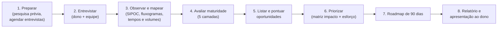
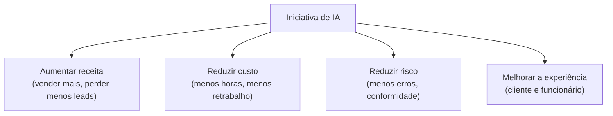
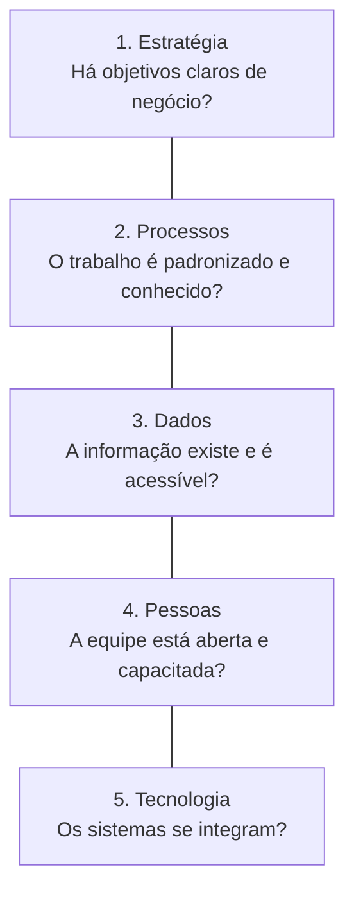
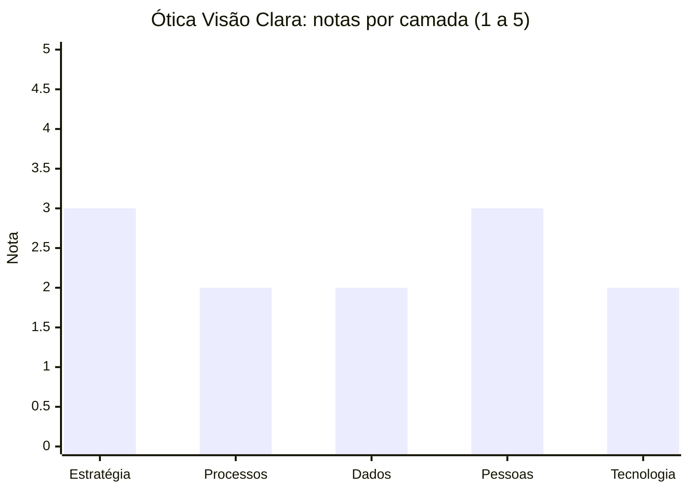
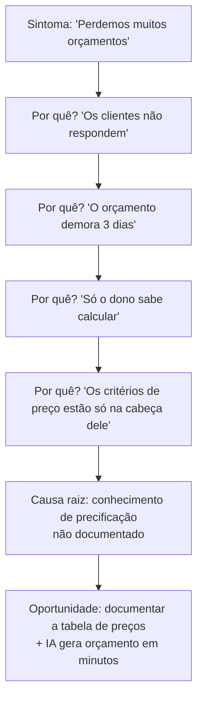
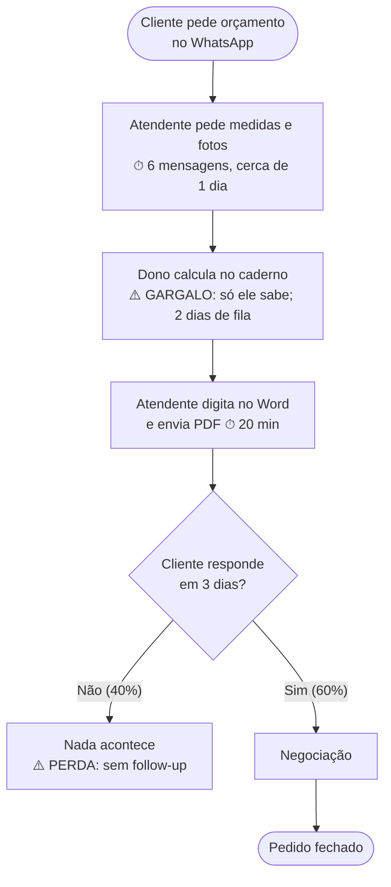
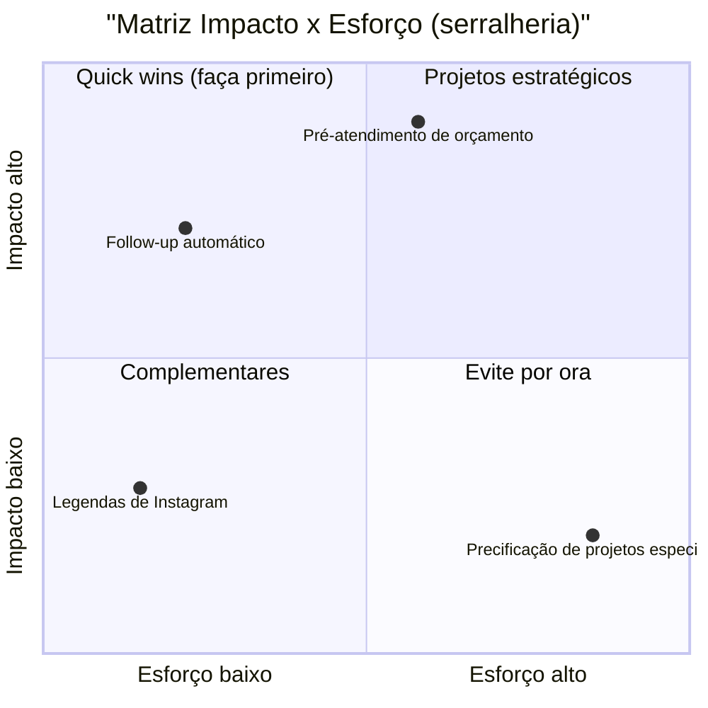
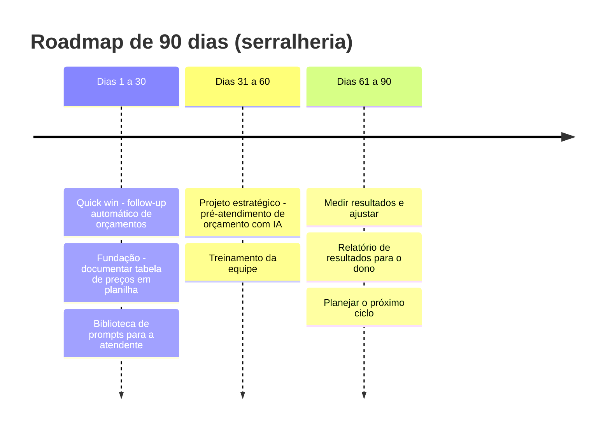
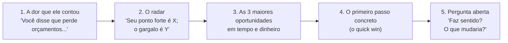

# Módulo 3: Análise estrutural e identificação de oportunidades

**Semanas 5 a 7 · cerca de 27 horas**

## Objetivos de aprendizagem

Este é o módulo mais importante da formação. Ferramentas qualquer pessoa aprende em algumas semanas; **saber onde aplicar IA com retorno** é o que faz de você um especialista, e é o que um consultor cobra bem para fazer.

Ao final deste módulo você será capaz de:

1. Conduzir entrevistas de diagnóstico com donos e equipe, sem enviesar as respostas.
2. Mapear processos (SIPOC e fluxograma) e encontrar gargalos e desperdícios.
3. Avaliar a maturidade da empresa com o **Diagnóstico em 5 camadas**.
4. Identificar oportunidades e **pontuá-las** com critérios objetivos.
5. Construir um **roadmap de 90 dias** realista.
6. Redigir e apresentar um relatório de diagnóstico profissional.

### O processo completo do diagnóstico



*Figura: as 8 etapas de um diagnóstico. As aulas deste módulo seguem essa ordem, e o seu entregável final é o relatório da etapa 8.*

**Calendário do módulo:**

| Semana | Estudo | Campo |
|---|---|---|
| 5 | Aulas 3.1 a 3.3 | Agendar entrevistas na empresa-laboratório |
| 6 | Aulas 3.4 e 3.5 | Fazer as entrevistas, observar e mapear processos |
| 7 | Aula 3.6 | Pontuar, montar roadmap, redigir e apresentar o relatório |

---

## Aula 3.1: A mentalidade certa ("problema primeiro, IA depois")

### O erro número 1

O erro mais comum de quem começa: **chegar com a solução**. "Vamos colocar um chatbot!", "Você precisa de um agente de IA!". O especialista chega com **perguntas**, porque sabe que a mesma tecnologia pode ser um sucesso em uma empresa e um desperdício em outra.

Pense em um médico: ele não receita antes de examinar. Um consultor que receita IA antes de diagnosticar está vendendo tecnologia, não resultado.

### Os 3 princípios

**1. Negócio antes de tecnologia.** Toda iniciativa de IA deve se ligar a um de 4 resultados:



*Figura: se uma iniciativa não se liga claramente a pelo menos um desses resultados, ela é um experimento, e não um projeto.*

**2. Processo antes de automação.** Automatizar um processo ruim gera um processo ruim mais rápido. Às vezes a melhor recomendação é: "primeiro organize a tabela de preços; depois colocamos a IA para responder sobre ela". Isso não é perder uma venda; é ganhar a confiança do cliente.

**3. Pequeno, medido, escalado.** Comece com uma vitória rápida (2 a 4 semanas), meça o resultado e só depois expanda. Projetos grandes que tentam resolver tudo de uma vez são os que mais fracassam.

### Sinais de que uma tarefa é boa candidata para IA

| Sinal | Pergunta para confirmar | Exemplo |
|---|---|---|
| **Repetitiva e frequente** | Acontece várias vezes por dia ou semana? | Responder "qual o horário?" 40 vezes por dia |
| **Envolve texto, voz ou imagem** | A tarefa é ler, escrever, classificar, resumir ou responder? | Ler notas fiscais e digitar no sistema |
| **Segue um padrão** | Existe um "jeito certo" de fazer que dá para explicar? | Montar orçamento a partir de medidas |
| **Consome tempo caro ou atrasa o cliente** | Quem faz ganha bem? O cliente espera? | O dono gasta 6 horas por semana em relatórios |
| **O erro é tolerável ou revisável** | Se errar, alguém percebe antes do dano? | Rascunho de e-mail revisado antes do envio |

### Sinais de alerta

| Sinal de alerta | Por que é problema | O que recomendar |
|---|---|---|
| Decisão de alto impacto sem revisão possível | Um erro pode causar prejuízo grave ou problema legal | IA apenas como apoio; decisão com humano |
| O processo não existe ou muda toda semana | Não há o que ensinar à IA | Padronizar o processo primeiro |
| Os dados não existem ou estão inacessíveis | A IA não terá do que se alimentar | Organizar os dados primeiro |
| Volume muito baixo (2 vezes por mês) | O custo de implementar não se paga | Um prompt na biblioteca resolve |
| Ninguém na empresa quer mudar | A solução não será usada | Começar pela sensibilização e por um quick win pessoal |

### Exemplo: duas empresas, mesma ideia, recomendações opostas

Duas clínicas pedem "um chatbot no WhatsApp":

- **Clínica A:** recebe 80 mensagens por dia, tem agenda em sistema com API e uma recepcionista sobrecarregada. **Recomendação:** chatbot com agendamento integrado. Alto retorno.
- **Clínica B:** recebe 8 mensagens por dia, a agenda é um caderno e a recepcionista responde em minutos. **Recomendação:** primeiro, digitalizar a agenda; o chatbot não se paga ainda. Um conjunto de respostas rápidas no WhatsApp Business resolve.

O mesmo pedido, respostas diferentes. É isso que um diagnóstico faz.

> 📌 **Em resumo**
> - O especialista chega com perguntas, não com soluções.
> - Toda iniciativa se liga a receita, custo, risco ou experiência.
> - Processo antes de automação; pequeno, medido e escalado.

---

## Aula 3.2: O Diagnóstico em 5 camadas

### Para que serve

Antes de listar oportunidades, você precisa saber **o que a empresa consegue sustentar**. Uma empresa pode ter ótimas oportunidades e não estar pronta para nenhuma delas. O Diagnóstico em 5 camadas mede essa prontidão.



*Figura: as 5 camadas avaliadas. Cada uma recebe uma nota de 1 a 5.*

### A régua de avaliação

| Camada | Nota 1 (inicial) | Nota 3 (intermediário) | Nota 5 (avançado) |
|---|---|---|---|
| **1. Estratégia** | Ninguém pensou em IA; sem objetivos claros | Dono interessado; objetivos gerais ("crescer") | Metas claras e mensuráveis; IA vista como alavanca para elas |
| **2. Processos** | Tudo "na cabeça" das pessoas; cada um faz de um jeito | Processos principais conhecidos, pouco documentados | Processos documentados, com indicadores e responsáveis |
| **3. Dados** | Informação em papel, WhatsApp pessoal, cadernos | Planilhas e algum sistema, pouco integrados | Sistemas (ERP, CRM) com dados organizados e acessíveis por API |
| **4. Pessoas** | Resistência ou medo; baixa familiaridade digital | Alguns usam IA por conta própria | Equipe treinada, com "campeões" de IA e cultura de experimentação |
| **5. Tecnologia** | Sem sistemas; e-mail pessoal | Ferramentas em nuvem soltas (Google, WhatsApp Business) | Ferramentas integradas, com API, e alguma automação |

**Notas 2 e 4** ficam entre as descrições. Use-as quando a empresa está em transição.

### Perguntas para dar a nota

| Camada | Perguntas |
|---|---|
| Estratégia | Quais são as metas do ano? Há números? O dono sabe dizer onde quer chegar? |
| Processos | Se o responsável faltar, alguém consegue fazer? Existe algum passo a passo escrito? |
| Dados | Onde está a lista de clientes? E as vendas? Dá para exportar em planilha? |
| Pessoas | Quantos já usaram IA? Como a equipe reagiu à última ferramenta nova? |
| Tecnologia | Quais sistemas são usados? Algum tem integração com outro? Tem API? |

### Como interpretar

| Média das 5 notas | Situação | Recomendação |
|---|---|---|
| **Até 2** | Fundação fraca | Quick wins individuais (prompts, assistentes) e **organizar processos e dados**. Não proponha agentes. |
| **De 2 a 3,5** | Pronta para o básico | **Automações pontuais** e **atendimento com IA** nos canais que já existem |
| **Acima de 3,5** | Pronta para avançar | **Integrações, bases de conhecimento (RAG) e agentes** |

### A camada mais fraca manda

> 🎯 A camada **mais fraca** limita todas as outras. Uma empresa com Estratégia 5 e Dados 1 **não** consegue um agente que consulta o estoque, porque o estoque não está em lugar nenhum que a IA possa ler.

Por isso, seu roadmap deve **sempre** incluir uma ação para fortalecer a camada mais fraca, mesmo que ela não seja "de IA".

### Exemplo: a Ótica Visão Clara

| Camada | Nota | Evidência |
|---|---|---|
| Estratégia | 3 | Quer abrir a 3ª loja, mas sem metas numéricas |
| Processos | 2 | Atendimento e venda variam por vendedora |
| Dados | 2 | Sistema local sem API; relatórios copiados à mão para o Excel |
| Pessoas | 3 | Equipe jovem, alguns usam ChatGPT por conta própria |
| Tecnologia | 2 | WhatsApp Business em 2 celulares; sistema isolado |
| **Média** | **2,4** | Camada limitante: Dados e Tecnologia |

**Leitura:** a ótica está pronta para o básico. Um atendimento com IA para perguntas frequentes funciona (não depende do sistema). Um agente que consulta o estoque de armações não funciona ainda, porque o sistema não tem API.

### Visualização para o dono

Apresente as notas em um **gráfico de radar** (Google Sheets e Excel fazem isso em "Inserir gráfico → Radar"). O ponto fraco salta aos olhos, e o dono entende em segundos.



*Figura: as mesmas notas em gráfico de barras. Dados e Tecnologia são as camadas limitantes; o roadmap precisa atacá-las.*

> 📌 **Em resumo**
> - O diagnóstico em 5 camadas mede se a empresa está pronta: Estratégia, Processos, Dados, Pessoas e Tecnologia.
> - A média indica o tipo de solução; a camada mais fraca indica o que precisa ser fortalecido.
> - Apresente em radar ou barras: o dono entende o gargalo na hora.

---

## Aula 3.3: Entrevistas de diagnóstico

### Quem entrevistar

| Quem | Duração | Objetivo |
|---|---|---|
| **Dono ou sócio** | 60 min | Estratégia, dores, metas, orçamento, medos |
| **2 a 4 pessoas da operação** | 30 a 45 min cada | Como o trabalho acontece **de verdade** |
| **2 ou 3 clientes** (opcional) | 15 min cada | A experiência do outro lado do balcão |

Por que ouvir a operação? Porque o dono descreve como o processo **deveria** funcionar. Quem executa descreve como ele **funciona**. A diferença entre as duas versões é onde estão as melhores oportunidades.

### Antes da entrevista

- **Pesquise a empresa:** site, Instagram, avaliações no Google, anúncios ativos. Chegue sabendo o que ela vende e o que os clientes elogiam e reclamam.
- **Peça autorização para gravar.** A gravação permite transcrever com IA e evita que você perca informação anotando.
- **Leve o roteiro** ([modelo de roteiro de entrevista](templates/roteiro-entrevista-diagnostico.md)), mas não o siga como um questionário: use-o como checklist.

### Técnicas de entrevista

**1. Perguntas abertas.** "Me conte como funciona desde que o cliente chama até a entrega" gera muito mais informação que "Vocês usam WhatsApp?".

**2. Peça para mostrar.** "Pode me mostrar na tela como você faz isso?" Observar vale mais que ouvir. Você vai descobrir, por exemplo, que "enviar o orçamento" envolve abrir 3 programas e copiar dados à mão.

**3. Quantifique sempre.** Cada dor precisa de números:
- "Quantas vezes por dia?"
- "Quanto tempo leva cada vez?"
- "Quantas pessoas fazem isso?"
- "Quanto isso custa quando dá errado?"

Sem números, você não calcula retorno (Módulo 10), e sem retorno não há proposta convincente.

**4. Os 5 porquês.** Repita "por quê?" até chegar à causa raiz:



*Figura: os 5 porquês transformam um sintoma vago em uma causa que pode ser resolvida. Note que a oportunidade tem uma parte "não IA" (documentar) e uma parte "IA".*

**5. Não proponha soluções durante a entrevista.** Se você disser "isso dá para resolver com um chatbot", o entrevistado passa a falar sobre o chatbot, e você para de ouvir sobre o problema. Anote a ideia e siga perguntando.

**6. Escute as palavras exatas.** Frases como "eu perco o domingo inteiro fazendo planilha" são poderosas no relatório e na apresentação. Anote-as literalmente (com autorização para usar).

### Perguntas-chave

- "Se você tivesse um funcionário extra, de graça, amanhã, o que ele faria?"
- "O que mais atrasa ou irrita os clientes?"
- "Que tarefa todo mundo odeia fazer?"
- "Onde acontecem mais erros ou retrabalho?"
- "Que informação você gostaria de ter e hoje não tem?"
- "Qual tarefa só uma pessoa sabe fazer?" (é um risco de dependência)
- "Quanto tempo **você** gasta por semana em tarefas operacionais?"

### Depois da entrevista (em até 24 horas)

1. Transcreva a gravação (a maioria dos assistentes aceita áudio, ou use um aplicativo de transcrição).
2. Peça a um assistente: *"Liste em uma tabela todas as tarefas, dores, tempos, frequências e pessoas mencionadas nesta entrevista. Separe o que foi dito com números do que foi dito sem números."*
3. Revise a tabela com a sua memória da conversa (a IA não viu a tela que o entrevistado mostrou).
4. Anote as perguntas que ficaram sem resposta para confirmar depois.

> 📌 **Em resumo**
> - Entreviste o dono (visão) e a operação (realidade).
> - Perguntas abertas, peça para mostrar, quantifique e use os 5 porquês.
> - Não proponha soluções durante a entrevista.

**Para ir além**
- [Modelo de roteiro de entrevista](templates/roteiro-entrevista-diagnostico.md) desta formação.

---

## Aula 3.4: Mapeamento de processos

### Por que mapear

Um processo mapeado transforma "a gente perde tempo com orçamento" em "o orçamento passa por 7 etapas, 3 pessoas, 2 esperas e leva 3 dias, sendo que o trabalho real leva 40 minutos". É nessa visão que as oportunidades aparecem.

### Ferramenta 1: SIPOC (a visão de cima)

O **SIPOC** descreve um processo em uma linha: quem fornece a entrada, qual é a entrada, o que acontece, o que sai e para quem.

| Fornecedor (S) | Entrada (I) | Processo (P) | Saída (O) | Cliente (C) |
|---|---|---|---|---|
| Cliente | Mensagem no WhatsApp | Atendimento e venda | Pedido confirmado | Expedição |
| Expedição | Pedido | Separação e envio | Pacote + código de rastreio | Cliente |
| Fornecedores | Notas fiscais | Contas a pagar | Pagamentos agendados | Financeiro |

Faça o SIPOC dos **5 a 10 processos principais** da empresa. Isso leva uma hora e dá o mapa geral.

### Ferramenta 2: Fluxograma (a visão detalhada)

Para os 2 ou 3 processos com mais problemas, faça o fluxograma. Símbolos básicos:

| Símbolo | Significado |
|---|---|
| ⬭ (oval) | Início ou fim |
| ▭ (retângulo) | Atividade |
| ◇ (losango) | Decisão (sim/não) |
| ▱ (paralelogramo) | Documento ou dado |

**Exemplo: processo de orçamento de uma serralheria**



*Figura: o fluxograma revela o gargalo (cálculo depende só do dono) e a perda (40% dos orçamentos sem nenhum acompanhamento). As duas são oportunidades.*

### O que marcar em cada atividade

- ⏱ **Tempo:** quanto leva.
- 🔁 **Frequência:** quantas vezes por dia ou semana.
- 👤 **Quem faz:** e quanto custa a hora dessa pessoa.
- ⚠️ **Problemas:** erros, retrabalho, esperas, dependência de uma pessoa.

### Os 7 desperdícios (adaptados do Lean)

O **Lean** é uma metodologia de gestão nascida na indústria automobilística japonesa, focada em eliminar desperdícios. Adaptamos seus desperdícios para o trabalho de escritório e atendimento:

| # | Desperdício | Como aparece | Solução típica com IA |
|---|---|---|---|
| 1 | **Espera** | Cliente ou processo parado aguardando alguém | Resposta automática 24h; aprovação rápida |
| 2 | **Retrabalho** | Corrigir erros, refazer | Validação automática; padronização com prompts |
| 3 | **Digitação duplicada** | O mesmo dado digitado em 2 ou mais lugares | Extração por IA + integração |
| 4 | **Busca de informação** | "Onde está o arquivo?", "qual o preço disso?" | Base de conhecimento (RAG, Módulo 8) |
| 5 | **Comunicação repetitiva** | Responder a mesma pergunta 50 vezes | FAQ com IA (Módulo 6) |
| 6 | **Dependência de pessoa** | Só um sabe fazer | Documentar em procedimento + assistente |
| 7 | **Falta de acompanhamento** | Oportunidades perdidas por esquecimento | Follow-up, cobrança e pós-venda automáticos |

**Quase todo desperdício dos tipos 3 a 7 tem solução com IA e automação.** Os tipos 1 e 2 geralmente precisam também de mudança de processo.

### Ferramentas para desenhar

- **Papel e caneta:** ótimos durante a entrevista.
- [diagrams.net](https://app.diagrams.net/): gratuito, com símbolos de fluxograma.
- [Mermaid Live](https://mermaid.live/): você descreve o fluxo em texto e ele desenha (os esquemas desta formação são feitos assim).
- IA: *"Converta esta descrição do processo em um diagrama Mermaid do tipo flowchart"* e cole o resultado no Mermaid Live.

> 📌 **Em resumo**
> - SIPOC para a visão geral de 5 a 10 processos; fluxograma para os 2 ou 3 mais problemáticos.
> - Marque tempo, frequência, quem faz e problemas em cada atividade.
> - Os 7 desperdícios são o mapa do tesouro das oportunidades.

**Para ir além**
- [Lean Institute Brasil](https://www.lean.org.br/): conteúdos sobre a mentalidade Lean e eliminação de desperdícios.
- [BPMN.org](https://www.bpmn.org/): a notação padrão de processos, para quem quiser se aprofundar em mapeamento formal.

---

## Aula 3.5: Identificação e pontuação de oportunidades

### Passo 1: descreva cada oportunidade no formato padrão

> **Quando** [gatilho], **a IA** [ação], **para que** [resultado de negócio].

Exemplos:
- "**Quando** um cliente pede orçamento, **a IA** coleta as medidas e fotos, calcula a estimativa com a tabela do dono e envia um PDF, **para que** o orçamento saia em minutos em vez de 3 dias."
- "**Quando** um orçamento fica 48 horas sem resposta, **a IA** envia uma mensagem de acompanhamento personalizada, **para que** menos orçamentos sejam perdidos por esquecimento."

Esse formato obriga você a ser concreto: qual evento dispara, o que exatamente a IA faz e qual resultado de negócio se espera.

### Passo 2: pontue

Cada fator recebe uma nota de **1 a 5**:

| Fator | 1 | 3 | 5 |
|---|---|---|---|
| **Frequência (F)** | Mensal | Algumas vezes por semana | Dezenas de vezes por dia |
| **Tempo gasto (T)** | Minutos por mês | Algumas horas por mês | Dezenas de horas por mês |
| **Padronização (P)** | Cada caso é único | Padrão com exceções | Sempre o mesmo padrão |
| **Risco (R)** | Erro é inofensivo | Erro causa retrabalho | Erro causa grande prejuízo |

```
Pontuação de Oportunidade = F × T × P × (6 − R)
```

O risco entra **invertido**: risco 5 vira fator 1, risco 1 vira fator 5. Assim, tarefas arriscadas descem no ranking. Valor máximo: 5 × 5 × 5 × 5 = **625**.

### Passo 3: avalie o esforço

| Esforço | Descrição | Exemplo |
|---|---|---|
| **Baixo** | Prompt padronizado ou ferramenta pronta; até 1 semana | Biblioteca de prompts de vendas |
| **Médio** | Automação com 2 ou 3 integrações; 2 a 4 semanas | Follow-up automático de orçamentos |
| **Alto** | Agente, base de conhecimento, integração com sistema antigo; mais de 1 mês | Agente que consulta estoque e fecha pedidos |

### Passo 4: a matriz Impacto × Esforço



*Figura: a matriz posiciona cada oportunidade. Quick wins (alto impacto, baixo esforço) vêm primeiro; projetos estratégicos entram no segundo mês; o quadrante "evite" fica para depois.*

**Exemplo completo (serralheria):**

| # | Oportunidade | F | T | P | R | Pontuação | Esforço | Quadrante |
|---|---|---|---|---|---|---|---|---|
| 1 | Pré-atendimento de orçamento no WhatsApp | 5 | 5 | 4 | 2 | 400 | Médio | Estratégico |
| 2 | Follow-up automático de orçamentos | 4 | 3 | 5 | 1 | 300 | Baixo | **Quick win** |
| 3 | Legendas de Instagram | 3 | 2 | 4 | 1 | 120 | Baixo | Complementar |
| 4 | Precificação automática de projetos especiais | 2 | 4 | 2 | 5 | 16 | Alto | Evite por ora |

**Como traduzir a pontuação em "impacto" na matriz:** use a pontuação como referência (acima de 250 é impacto alto, abaixo de 100 é baixo), mas ajuste pelo resultado de negócio. Uma oportunidade de pontuação média que evita perder vendas pode valer mais que uma de pontuação alta que só economiza tempo.

### Exercício mental: por que a precificação especial ficou em "evite"?

Porque ela é rara (F = 2), cada caso é diferente (P = 2) e um erro de preço num projeto grande causa prejuízo (R = 5). Mesmo tomando tempo do dono, a IA não é a ferramenta certa ali. Talvez uma planilha de apoio ao cálculo seja.

> 📌 **Em resumo**
> - Descreva cada oportunidade como Quando / A IA / Para que.
> - Pontue com F × T × P × (6 − R); avalie o esforço.
> - Posicione na matriz: quick wins primeiro, projetos estratégicos em seguida.

---

## Aula 3.6: Roadmap de 90 dias e o relatório

### A estrutura do roadmap



*Figura: o roadmap em três blocos de 30 dias. O primeiro mês combina uma vitória rápida com o trabalho de fundação que o projeto estratégico vai exigir.*

| Período | Foco | Por quê |
|---|---|---|
| **Dias 1 a 30** | 1 ou 2 quick wins + fundação | Gera confiança rápida e prepara o terreno |
| **Dias 31 a 60** | 1 projeto estratégico | Maior impacto, agora com a base pronta |
| **Dias 61 a 90** | Medir, ajustar, treinar, escalar | Prova o resultado e prepara o próximo ciclo |

### Regras do roadmap

- Cada iniciativa tem: **responsável na empresa, indicador de sucesso, meta e data**.
- Inclua ações que **não são IA** quando necessário ("padronizar a tabela de preços", "centralizar o WhatsApp em um número").
- No máximo **3 iniciativas simultâneas** em uma PME. A equipe tem uma operação para tocar.

**Exemplo de linha do roadmap:**

| Iniciativa | Responsável | Indicador | Hoje | Meta | Prazo |
|---|---|---|---|---|---|
| Follow-up automático | Atendente (Júlia) | % de orçamentos com resposta do cliente | 60% | 75% | Dia 30 |

### O relatório de diagnóstico

Use o [modelo de relatório](templates/relatorio-diagnostico.md). A estrutura:

1. **Sumário executivo** (1 página): o que encontramos, o que recomendamos, quanto vale.
2. **Contexto da empresa.**
3. **Diagnóstico em 5 camadas** (radar e comentários).
4. **Processos mapeados e desperdícios.**
5. **Oportunidades pontuadas** (tabela e matriz).
6. **Roadmap de 90 dias.**
7. **Investimento estimado e retorno** (você aprenderá a calcular no Módulo 10, Parte A).
8. **Riscos e próximos passos.**

**Dica de redação:** o dono vai ler o sumário executivo e, talvez, folhear o resto. Escreva o sumário por último e com cuidado: ele precisa se sustentar sozinho.

### A apresentação ao dono (30 a 45 min)



*Figura: a sequência da apresentação. Começar pela dor do próprio dono conecta o diagnóstico ao que importa para ele.*

**Cuidados na apresentação:**
- Fale em **tempo e dinheiro**, não em tecnologia.
- Mostre **o processo desenhado**: donos costumam se surpreender ao ver o próprio processo no papel.
- Traga **um exemplo funcionando** do quick win (um prompt, uma demonstração), se possível.
- Termine com uma **decisão pedida**: "Podemos começar o follow-up na próxima segunda?"

> 📌 **Em resumo**
> - Roadmap em 3 blocos de 30 dias: quick win + fundação, projeto estratégico, medição.
> - Cada iniciativa com responsável, indicador, meta e prazo; no máximo 3 simultâneas.
> - Apresente começando pela dor do dono e terminando com uma decisão pedida.

**Para ir além**
- [Modelo de relatório de diagnóstico](templates/relatorio-diagnostico.md) desta formação.

---

## Usando IA para acelerar o diagnóstico

A IA não faz o diagnóstico por você, mas acelera cada etapa:

| Etapa | Como a IA ajuda | Prompt sugerido |
|---|---|---|
| Pesquisa prévia | Resume avaliações do Google e o site da empresa | "Resuma os elogios e reclamações mais comuns nestas avaliações, com a frequência de cada tema." |
| Transcrição | Converte a gravação em texto | (recurso de transcrição do assistente ou aplicativo) |
| Organização | Tabela de tarefas, dores, tempos e frequências | "Liste em tabela todas as tarefas, dores, tempos e frequências mencionados nesta entrevista." |
| Fluxogramas | Desenha o processo | "Converta esta descrição em um diagrama Mermaid (flowchart TB), marcando gargalos." |
| Oportunidades | Sugere hipóteses | "Com base nas dores listadas, sugira oportunidades de IA no formato Quando / A IA / Para que." |
| Relatório | Primeira versão do texto | "Redija o sumário executivo com base nestas informações, para um dono de PME, em até 300 palavras." |

> ⚠️ **Revise sempre.** Você esteve na empresa, viu as telas e ouviu o tom de voz das pessoas. A IA só leu o texto. As sugestões dela são hipóteses; a validação é sua.

> ⚠️ **Cuidado com dados.** Transcrições de entrevistas podem conter dados pessoais e informações confidenciais da empresa. Use ferramentas em planos que não treinam com os seus dados (Módulo 4) e peça autorização ao cliente.

---

## Exercícios

### Exercício 1: Estudo de caso simulado (60 min)

Leia o caso e faça: diagnóstico em 5 camadas (com justificativa de cada nota), 6 oportunidades no formato Quando / A IA / Para que, pontuação de cada uma e a matriz impacto × esforço.

> **Ótica Visão Clara** (Recife, 8 funcionários, 2 lojas). Recebem cerca de 60 mensagens por dia no WhatsApp, a maioria perguntando preço de lentes, horário e se aceitam convênio. As receitas médicas chegam por foto e são digitadas manualmente no sistema (15 min cada, cerca de 20 por dia). O dono monta os relatórios de venda no fim do mês copiando dados do sistema para o Excel (1 dia inteiro). Não há follow-up para clientes que fizeram orçamento e não compraram (estimam 35% de desistência). Funcionários usam ChatGPT pessoal "às vezes". O sistema da ótica é um software local sem API. As fotos de produtos para o Instagram são feitas pela vendedora, que "não tem tempo de postar".

<details>
<summary><strong>Resolução comentada (abra depois de fazer)</strong></summary>

**5 camadas:** Estratégia 3 (quer crescer, sem metas claras); Processos 2 (atendimento varia); Dados 2 (sistema sem API, relatórios manuais); Pessoas 3 (equipe aberta, uso informal); Tecnologia 2 (ferramentas soltas). Média 2,4: pronta para o básico.

**Oportunidades e pontuação (uma resolução possível):**

| Oportunidade | F | T | P | R | Pontos | Esforço |
|---|---|---|---|---|---|---|
| FAQ no WhatsApp (preço de lentes, horário, convênios) | 5 | 4 | 5 | 2 | 400 | Médio |
| Leitura de receitas por foto (IA extrai os graus para conferência) | 5 | 5 | 5 | 4 | 250 | Médio |
| Follow-up de orçamentos não fechados | 4 | 3 | 5 | 1 | 300 | Baixo |
| Relatório mensal (exportar do sistema e a IA analisa) | 1 | 4 | 5 | 2 | 80 | Baixo |
| Legendas e calendário de Instagram | 3 | 2 | 4 | 1 | 120 | Baixo |
| Política de uso de IA (sair do ChatGPT pessoal) | — | — | — | — | Fundação | Baixo |

**Pontos de atenção:** a leitura de receitas tem risco 4 (erro de grau causa prejuízo e reclamação), então exige **conferência humana obrigatória**: a IA preenche, a pessoa confere. Mesmo assim, reduz 15 minutos para cerca de 3. O relatório mensal tem frequência baixa, mas toma um dia inteiro do dono: é um quick win pessoal que gera muita boa vontade.

**Roadmap sugerido:** dias 1 a 30: follow-up + política de uso + biblioteca de prompts; dias 31 a 60: FAQ no WhatsApp; dias 61 a 90: leitura de receitas com conferência + medição.
</details>

### Exercício 2: Fluxograma (45 min)

Desenhe o fluxograma de um processo da sua própria rotina (por exemplo, "pagar as contas do mês" ou "preparar uma reunião"). Marque tempo, frequência e desperdícios. Depois, descreva o processo em texto e peça a um assistente para convertê-lo em Mermaid; cole no [Mermaid Live](https://mermaid.live/) e compare com o seu desenho.

### Exercício 3: Roleplay de entrevista (45 min)

1. Peça a um assistente: *"Você é dono de uma academia de bairro com 400 alunos e 6 funcionários. Vou te entrevistar para um diagnóstico de IA. Responda de forma realista, com dores concretas, algumas contradições e alguma resistência. Não entregue tudo de uma vez: só responda o que eu perguntar."*
2. Conduza a entrevista com o roteiro da Aula 3.3.
3. Ao final, peça: *"Saia do personagem e avalie minha condução: quais perguntas foram boas, onde eu enviesei, que informações importantes eu não descobri."*
4. Repita com outro segmento (clínica, restaurante) para treinar.

### Exercício 4: 20 oportunidades por segmento (45 min)

Para 4 segmentos (clínica, restaurante, escritório de contabilidade, loja virtual), liste 5 oportunidades de IA cada, no formato Quando / A IA / Para que. Esse repertório será útil em palestras e em vendas: quando um empresário disser seu segmento, você terá exemplos na ponta da língua.

---

## Tarefa de campo (a principal da formação até aqui)

Na empresa-laboratório:

1. **Semana 5:** agende as entrevistas (dono + 2 a 4 funcionários). Envie ao dono uma mensagem explicando o objetivo e o tempo necessário.
2. **Semana 6:** faça as entrevistas (grave, com autorização), observe o trabalho e mapeie de 5 a 10 processos (SIPOC) e 2 ou 3 fluxogramas detalhados.
3. **Semana 7:** pontue as oportunidades, monte o roadmap, redija o relatório e **apresente ao dono**.

Ao final, pergunte ao dono: "De 0 a 10, quanto esse diagnóstico te ajudou? O que faltou?" Registre a resposta. Ela é o seu primeiro depoimento.

---

## Entregável: Relatório de diagnóstico de IA

**Requisitos:**
- Relatório completo seguindo o [modelo](templates/relatorio-diagnostico.md) (8 a 15 páginas).
- Gráfico das 5 camadas (radar ou barras).
- De 5 a 10 processos mapeados (com pelo menos 2 fluxogramas detalhados).
- Pelo menos 10 oportunidades pontuadas + matriz Impacto × Esforço.
- Roadmap de 90 dias.
- Feedback do dono registrado.

**Checklist de qualidade:**
- [ ] O sumário executivo se sustenta sozinho em 1 página.
- [ ] Cada oportunidade tem números (frequência, tempo) vindos das entrevistas.
- [ ] O roadmap tem responsável, indicador, meta e prazo em cada linha.
- [ ] Há pelo menos uma ação de fundação para a camada mais fraca.
- [ ] O texto fala de negócio (tempo, dinheiro, clientes), não de tecnologia.

---

## Autoavaliação

Meta: pelo menos 10 de 12.

1. Quais os 4 resultados de negócio a que toda iniciativa de IA deve se ligar?
2. Por que "processo antes de automação"?
3. Cite 4 sinais de que uma tarefa é boa candidata para IA.
4. Qual é a fórmula da Pontuação de Oportunidade e por que o risco entra como (6 − R)?
5. Uma empresa tem notas: Estratégia 4, Processos 2, Dados 1, Pessoas 3, Tecnologia 2. O que você recomendaria para os primeiros 90 dias?
6. O que é SIPOC?
7. Cite 4 dos 7 desperdícios e uma solução de IA para cada.
8. Por que não propor soluções durante a entrevista?
9. Para que servem os 5 porquês?
10. Quantas iniciativas simultâneas são recomendadas para uma PME?
11. Por que entrevistar a operação, e não só o dono?
12. Como começar e como terminar a apresentação do diagnóstico ao dono?

<details>
<summary><strong>Gabarito</strong></summary>

1. Aumentar receita, reduzir custo, reduzir risco e melhorar a experiência.
2. Porque automatizar um processo ruim só produz resultados ruins mais rápido. É preciso entender e padronizar antes.
3. Repetitiva e frequente; envolve texto, voz ou imagem; segue um padrão; consome tempo caro ou atrasa o cliente; o erro é tolerável ou revisável (quaisquer 4).
4. F × T × P × (6 − R). O risco é invertido para que risco alto **reduza** a pontuação (R = 5 vira fator 1; R = 1 vira fator 5).
5. A camada de Dados (1) é a limitante. Quick wins que não dependem de dados integrados (prompts padronizados, FAQ com base em documento simples) e, em paralelo, organização dos dados (tabela de preços, cadastro de clientes em planilha ou CRM). Nada de integrações complexas.
6. Ferramenta de mapeamento macro: Fornecedor, Entrada, Processo, Saída, Cliente.
7. Espera → resposta automática 24h; retrabalho → validação automática; digitação duplicada → extração por IA + integração; busca de informação → base de conhecimento; comunicação repetitiva → FAQ com IA; dependência de pessoa → documentação + assistente; falta de acompanhamento → follow-up automático (quaisquer 4).
8. Porque enviesa as respostas, faz você parar de ouvir o problema e cria expectativas antes de entendê-lo.
9. Para ir do sintoma à causa raiz, perguntando "por quê?" repetidamente.
10. No máximo 3.
11. Porque o dono descreve como o processo deveria funcionar; a operação mostra como ele funciona de verdade. A diferença revela as melhores oportunidades.
12. Começar pela dor que o próprio dono relatou; terminar com um primeiro passo concreto e uma decisão pedida.
</details>

---

## Para aprofundar (opcional)

| Material | Formato | Por que vale |
|---|---|---|
| [Lean Institute Brasil](https://www.lean.org.br/) | Artigos e cursos (português) | Mentalidade de eliminação de desperdícios |
| [BPMN.org](https://www.bpmn.org/) | Referência (inglês) | Notação padrão de processos |
| [diagrams.net](https://app.diagrams.net/) | Ferramenta gratuita | Desenhar fluxogramas profissionais |
| [Mermaid Live](https://mermaid.live/) e [documentação do Mermaid](https://mermaid.js.org/) | Ferramenta e documentação | Criar diagramas a partir de texto, com ajuda da IA |
| [Sebrae](https://sebrae.com.br/) | Conteúdos (português) | Gestão de processos e realidade das pequenas empresas |
