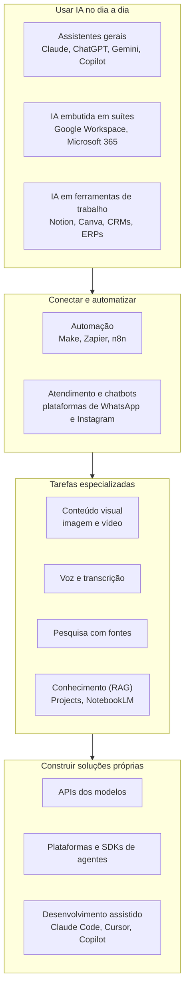
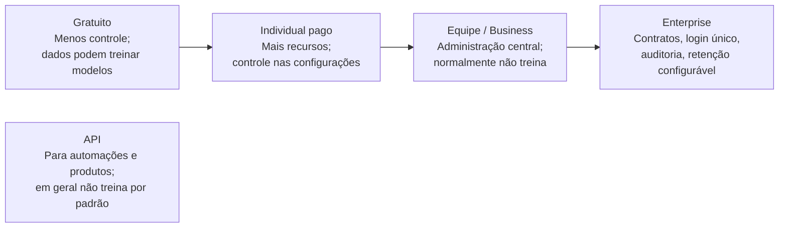
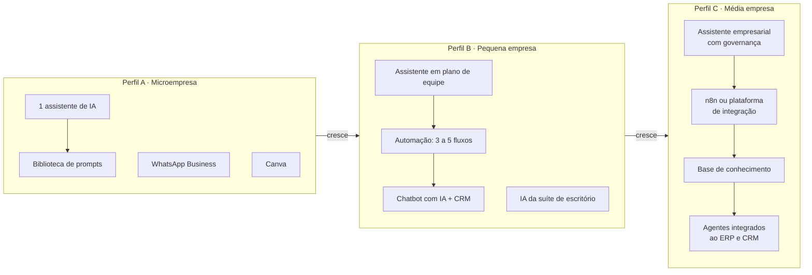
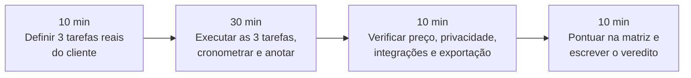

# Módulo 4: Ecossistema de ferramentas de IA

**Semana 10 · cerca de 9 horas**

## Objetivos de aprendizagem

Todo empresário vai te perguntar: "qual IA eu devo usar?". A resposta de um especialista nunca é o nome de uma ferramenta; é **um critério** aplicado ao caso daquele empresário. Este módulo te dá o mapa do ecossistema e o método para escolher.

Ao final deste módulo você será capaz de:

1. Conhecer as categorias de ferramentas de IA e os principais representantes de cada uma.
2. Avaliar ferramentas com critérios objetivos (adequação, adoção, integração, privacidade, custo, suporte, dependência).
3. Recomendar a combinação certa de ferramentas conforme o porte e a maturidade da empresa.
4. Entender planos gratuitos, individuais, de equipe e empresariais, e as implicações de privacidade de cada um.
5. Testar uma ferramenta nova em 1 hora com um protocolo padronizado.

> ⚠️ **Ferramentas mudam rápido.** Os nomes citados aqui são exemplos atuais. O que você deve dominar são as **categorias e os critérios de escolha**: eles continuam valendo quando as ferramentas mudarem.

---

## Aula 4.1: O mapa do ecossistema

### As categorias

*Figura: as categorias, das mais simples de adotar (em cima) às que exigem mais conhecimento técnico (embaixo). A maioria das PMEs começa no primeiro bloco.*

| Categoria | Para que serve | Exemplos |
|---|---|---|
| **Assistentes gerais** | Conversar, escrever, analisar, criar | [Claude](https://claude.ai/), [ChatGPT](https://chatgpt.com/), [Gemini](https://gemini.google.com/), Microsoft Copilot |
| **IA embutida em suítes** | IA dentro do e-mail, documentos e planilhas | Gemini no Google Workspace, Copilot no Microsoft 365 |
| **IA em ferramentas de trabalho** | IA dentro do app que a equipe já usa | [Notion](https://www.notion.com/) AI, [Canva](https://www.canva.com/), CRMs e ERPs com IA |
| **Automação** | Conectar sistemas e rodar fluxos | Make, Zapier, n8n (Módulo 5) |
| **Atendimento e chatbots** | Assistentes no WhatsApp, Instagram e site | Plataformas de atendimento com IA e API oficial do WhatsApp (Módulo 6) |
| **Conteúdo visual** | Imagens, vídeos, design | Canva, geradores de imagem dos assistentes, ferramentas de vídeo |
| **Voz e transcrição** | Transcrever reuniões e áudios; gerar voz | Gravadores com transcrição, assistentes de reunião, sintetizadores de voz |
| **Pesquisa** | Pesquisar com fontes citadas | Modos de pesquisa dos assistentes, [Perplexity](https://www.perplexity.ai/) |
| **Conhecimento (RAG)** | Perguntar aos documentos da empresa | Projects do Claude, GPTs, [NotebookLM](https://notebooklm.google.com/), bases no n8n (Módulo 8) |
| **Construção de soluções** | Criar assistentes e agentes próprios | APIs dos modelos, SDKs de agentes, plataformas de agentes (Módulo 9) |
| **Desenvolvimento assistido** | Criar software com ajuda da IA | [Claude Code](https://code.claude.com/docs/en/overview), Cursor, GitHub Copilot |

### Os assistentes gerais em mais detalhe

Os três grandes assistentes têm capacidades parecidas e se revezam na liderança a cada lançamento. As diferenças práticas costumam estar em:

| Aspecto | O que comparar |
|---|---|
| Qualidade de escrita em português | Teste com as tarefas reais do cliente |
| Tamanho de documentos aceitos | Quantas páginas de PDF e planilhas grandes |
| Assistentes personalizados | Projects (Claude), GPTs (ChatGPT), Gems (Gemini) |
| Integração com o ecossistema | Gemini com Google; Copilot com Microsoft; conectores dos demais |
| Recursos extras | Pesquisa na web, geração de imagem, voz, análise de dados com código |
| Planos de equipe e privacidade | Controles de administração e uso dos dados |

**Recomendação prática:** conheça bem os três. Para o cliente, recomende **um principal** (para padronizar prompts e treinamento) e explique por quê.

### A IA que o cliente já tem e não usa

Uma das oportunidades mais rápidas: muitas empresas já pagam por ferramentas que têm IA embutida e não sabem. Exemplos comuns:
- Planos do Google Workspace ou do Microsoft 365 com recursos de IA.
- Canva com recursos de geração e edição de imagem.
- CRMs e ERPs que lançaram assistentes internos.
- WhatsApp Business com respostas automáticas e catálogo (sem IA, mas muitas vezes subutilizado).

No diagnóstico (Módulo 3), sempre levante as ferramentas atuais e verifique quais recursos de IA estão disponíveis. Às vezes o primeiro quick win custa zero.

> 📌 **Em resumo**
> - As categorias vão do uso diário (assistentes) à construção de soluções (APIs e agentes).
> - Os três grandes assistentes são parecidos; recomende um principal e padronize.
> - Procure a IA que o cliente já paga e não usa.

---

## Aula 4.2: Critérios de avaliação

### Os 7 critérios

Avalie cada ferramenta de 1 a 5 em cada critério:

| Critério | Pergunta | Nota 1 | Nota 5 |
|---|---|---|---|
| **1. Adequação** | Resolve bem o problema específico? | Resolve parcialmente | Resolve com folga |
| **2. Facilidade de adoção** | A equipe consegue usar sem treinamento pesado? Tem interface em português? | Complexa, só em inglês | Intuitiva, em português |
| **3. Integração** | Conecta com o que a empresa já usa? Tem API? | Isolada | Integra com tudo, API aberta |
| **4. Privacidade e segurança** | Os dados são usados para treinar modelos? Tem controles de administração? | Sem controles | Plano empresarial com garantias claras |
| **5. Custo total** | Preço por usuário + uso + implementação + manutenção. Cobra em dólar? | Caro para o porte | Custo baixo e previsível |
| **6. Suporte e maturidade** | A empresa é estável? Tem suporte? Comunidade ativa? | Startup recente sem suporte | Empresa estável, suporte e comunidade |
| **7. Dependência** | Se trocar de ferramenta, perde tudo? Os dados são exportáveis? | Dados presos | Exportação fácil, padrões abertos |

### Pesos: cada cliente é diferente

Os critérios têm pesos diferentes para cada cliente. Multiplique a nota pelo peso e some:

| Critério | Peso: clínica | Peso: loja virtual | Peso: escritório de contabilidade |
|---|---|---|---|
| Adequação | 3 | 3 | 3 |
| Adoção | 2 | 2 | 3 |
| Integração | 2 | **3** | 2 |
| Privacidade | **3** | 2 | **3** |
| Custo | 2 | 2 | 2 |
| Suporte | 2 | 1 | 2 |
| Dependência | 1 | 2 | 1 |

A clínica pesa mais privacidade (dados de saúde são sensíveis); a loja virtual pesa mais integração (loja, estoque, frete, pagamentos); o escritório pesa privacidade e adoção (dados de clientes e equipe com rotina pesada).

### Exemplo de matriz preenchida

| Critério (peso) | Ferramenta A | Ferramenta B | Ferramenta C |
|---|---|---|---|
| Adequação (3) | 5 → 15 | 4 → 12 | 3 → 9 |
| Adoção (2) | 4 → 8 | 5 → 10 | 3 → 6 |
| Integração (3) | 3 → 9 | 4 → 12 | 5 → 15 |
| Privacidade (2) | 4 → 8 | 4 → 8 | 3 → 6 |
| Custo (2) | 3 → 6 | 4 → 8 | 5 → 10 |
| Suporte (1) | 5 → 5 | 4 → 4 | 3 → 3 |
| Dependência (2) | 3 → 6 | 3 → 6 | 5 → 10 |
| **Total** | **57** | **60** | **59** |

Quando os totais ficam próximos, como aqui, a decisão vai para o critério de maior peso para aquele cliente e para o teste prático (Aula 4.5). Números não substituem julgamento; eles o organizam.

> 📌 **Em resumo**
> - Sete critérios, de 1 a 5, com pesos ajustados ao cliente.
> - Privacidade pesa mais em setores com dados sensíveis; integração pesa mais em operações conectadas.
> - Totais próximos se decidem pelo teste prático.

---

## Aula 4.3: Planos e privacidade (ponto crítico)

### Os tipos de plano

*Figura: quanto mais à direita, mais controle sobre os dados. A API fica à parte porque é usada por sistemas, não por pessoas.*

| Tipo de plano | Uso dos dados | Recomendação |
|---|---|---|
| **Gratuito** | Frequentemente pode ser usado para melhorar modelos (verifique as configurações) | Uso pessoal; **nunca** dados de clientes |
| **Individual pago** | Geralmente há controle para desativar o uso em treinamento | Profissionais autônomos, com as configurações ajustadas |
| **Equipe / Business** | Normalmente **não** usa os dados para treinar; administração centralizada | **Padrão recomendado para PMEs** |
| **Enterprise** | Contratos específicos, login único (SSO), auditoria, retenção configurável | Empresas maiores ou reguladas |
| **API** | Em geral não usada para treinamento por padrão; retenção limitada | Automações e produtos próprios |

### Por que o plano de equipe é o padrão para PMEs

1. **Privacidade:** os dados da empresa normalmente não treinam modelos.
2. **Administração:** o dono controla quem tem acesso; quando alguém sai, o acesso é removido.
3. **Compartilhamento:** assistentes personalizados e prompts compartilhados entre a equipe (a biblioteca do Módulo 2 funciona melhor assim).
4. **Custo previsível:** um valor por usuário por mês.

### Como verificar a privacidade de uma ferramenta

Antes de recomendar, responda a estas perguntas lendo os termos e a política de privacidade atuais:

| Pergunta | Onde procurar |
|---|---|
| Os dados enviados são usados para treinar modelos? | Política de privacidade; configurações da conta |
| Como desativar esse uso, se houver? | Configurações de privacidade ou de dados |
| Por quanto tempo as conversas ficam guardadas? | Política de retenção |
| Onde os dados são processados? | Termos de serviço; página de segurança |
| Há termos específicos de proteção de dados para empresas? | Página de planos empresariais ou de segurança |

> ✅ **Anote a data da consulta.** Políticas mudam. Registrar "consultado em 12/03" protege você e o cliente, e é parte da conformidade com a LGPD (Módulo 10, Parte B).

> 📌 **Em resumo**
> - Planos gratuitos não servem para dados de clientes.
> - Plano de equipe é o padrão para PMEs: privacidade, administração e compartilhamento.
> - Leia os termos atuais e registre a data da consulta.

---

## Aula 4.4: Stacks recomendadas por perfil

**Stack** é o conjunto de ferramentas que uma empresa usa. Estas são três combinações de referência:

*Figura: as stacks crescem com a empresa. Cada perfil herda o anterior e acrescenta uma camada de integração.*

### Perfil A: Microempresa (1 a 5 pessoas, maturidade baixa)

| Ferramenta | Função |
|---|---|
| 1 assistente de IA pago (individual ou equipe) | Produtividade diária, com a biblioteca de prompts |
| WhatsApp Business com respostas rápidas e catálogo | Atendimento organizado |
| Canva | Conteúdo visual |
| Google Workspace ou equivalente | E-mail, documentos e planilhas |

**Custo:** baixo. **Foco:** produtividade individual padronizada. **Primeiro projeto típico:** biblioteca de prompts e um assistente personalizado com as informações da empresa.

### Perfil B: Pequena empresa (6 a 30 pessoas, maturidade média)

| Ferramenta | Função |
|---|---|
| Assistente de IA em plano de equipe | Projects/GPTs compartilhados |
| Make ou n8n | 3 a 5 automações |
| Chatbot com IA no WhatsApp + CRM simples | Atendimento e qualificação |
| IA embutida na suíte de escritório | Resumos de e-mail, planilhas, apresentações |

**Foco:** automação de processos e atendimento. **Primeiro projeto típico:** follow-up automático ou atendimento de perguntas frequentes.

### Perfil C: Média empresa (30 pessoas ou mais, maturidade média a alta)

| Ferramenta | Função |
|---|---|
| Assistente em plano empresarial com governança | Controles, auditoria, política formal |
| n8n (hospedado pela empresa ou em nuvem) ou plataforma de integração | Integrações robustas |
| Base de conhecimento interna (RAG) | Manuais, políticas, procedimentos |
| Agentes integrados ao ERP e CRM via API | Tarefas de várias etapas |

**Foco:** sistemas e agentes, com governança. **Primeiro projeto típico:** base de conhecimento interna ou agente comercial.

### Regras para montar a stack de um cliente

1. **Parta do que já existe.** Troque ferramentas só quando houver motivo forte.
2. **Menos é mais.** Cada ferramenta nova é mais uma senha, um custo e um treinamento.
3. **Uma ferramenta por função.** Dois assistentes diferentes na mesma equipe dividem a biblioteca de prompts.
4. **Considere o câmbio.** Muitas ferramentas cobram em dólar; o custo mensal varia.
5. **Documente a stack** no relatório: ferramenta, plano, custo, responsável e data da última revisão.

> 📌 **Em resumo**
> - Três perfis de referência: microempresa, pequena e média.
> - A stack cresce com a maturidade; cada perfil acrescenta integração.
> - Parta do que existe, use poucas ferramentas e documente.

---

## Aula 4.5: Como testar uma ferramenta em 1 hora

Novas ferramentas surgem toda semana. Você precisa de um **protocolo** para avaliá-las rapidamente, sem se deixar levar por demonstrações bonitas.

*Figura: o protocolo de 1 hora. O ponto central é testar com tarefas reais do cliente, e não com os exemplos do site da ferramenta.*

### O protocolo em detalhe

**1. Defina 3 tarefas reais (10 min).** Use tarefas do cliente, com dados de exemplo (anonimizados). Exemplo para uma ferramenta de transcrição: (a) transcrever um áudio de 3 minutos com barulho de fundo; (b) transcrever uma reunião com 3 pessoas; (c) gerar a ata a partir da transcrição.

**2. Execute e cronometre (30 min).** Anote: quanto tempo levou, quantos erros, o que foi difícil, o que surpreendeu.

**3. Verifique o que não aparece na demonstração (10 min):**
- Preço atual e em qual moeda.
- Política de privacidade (Aula 4.3).
- Integrações: conecta com as ferramentas do cliente? Tem API?
- Exportação: dá para tirar os dados se o cliente quiser sair?

**4. Pontue e escreva o veredito (10 min).** Use a matriz da Aula 4.2 e escreva 3 linhas:

> "Recomendo para ___ porque ___. Cuidado com ___."

**Exemplo de veredito:**
> "Recomendo para escritórios que fazem muitas reuniões com clientes, porque transcreve bem em português e gera atas em 2 minutos. Cuidado com a política de retenção: as gravações ficam 90 dias no servidor do fornecedor; não usar em reuniões com dados de saúde."

> 📌 **Em resumo**
> - Teste com tarefas reais do cliente, não com exemplos do fornecedor.
> - Verifique preço, privacidade, integrações e exportação.
> - Termine com um veredito de 3 linhas.

---

## Exercícios

### Exercício 1: Teste de 3 assistentes (90 min)

Aplique o protocolo da Aula 4.5 em [Claude](https://claude.ai/), [ChatGPT](https://chatgpt.com/) e [Gemini](https://gemini.google.com/) com as mesmas 3 tarefas da empresa-laboratório. Use tarefas que representem o dia a dia real (uma resposta a cliente, uma análise de planilha e um documento longo para resumir). Escreva o veredito de cada um e uma recomendação final.

### Exercício 2: Auditoria de privacidade (45 min)

Para 3 ferramentas, leia os termos e a política de privacidade atuais e preencha:

| Ferramenta | Usa dados para treinar? | Como desativar? | Retenção | Onde processa | Plano adequado para dados de clientes | Data da consulta |
|---|---|---|---|---|---|---|
| | | | | | | |

### Exercício 3: IA embutida (45 min)

Teste a IA dentro do Google Workspace ou do Microsoft 365 (resumo de e-mails, criação de planilha a partir de uma descrição, criação de apresentação). Compare com fazer a mesma tarefa em um assistente separado: qual é mais rápido? Qual dá melhor resultado? Qual a equipe usaria mais?

### Exercício 4: Custo total (30 min)

Monte o custo mensal da Stack B para uma empresa de 15 pessoas, consultando os preços oficiais atuais e convertendo para reais. Considere: quantos usuários realmente precisam do assistente pago? Quanto de automação e de mensagens por mês?

---

## Tarefa de campo

Levante **todas as ferramentas** que a empresa-laboratório usa hoje, inclusive planilhas, WhatsApp pessoal e aplicativos de celular. Para cada uma, identifique:
- Tem IA embutida **não utilizada**?
- Tem API ou integração com Make e n8n?
- Quem usa, quanto custa e em que plano?

Esse inventário é a base da stack recomendada no entregável.

---

## Entregável: Matriz de ferramentas

Uma planilha com:
- De 12 a 15 ferramentas avaliadas nos 7 critérios.
- Recomendação para os 3 perfis (A, B e C).
- Stack recomendada para a empresa-laboratório, com custo mensal estimado.
- Data da última revisão. **Atualize a cada trimestre**: esse material vai te acompanhar pela carreira.

---

## Autoavaliação

Meta: pelo menos 6 de 8.

1. Cite 5 categorias de ferramentas de IA.
2. Qual o risco de usar planos gratuitos com dados de clientes?
3. Qual tipo de plano é o padrão recomendado para PMEs? Por quê?
4. Por que o critério "dependência" importa?
5. Uma clínica odontológica com 10 funcionários quer começar. Qual perfil de stack e quais cuidados?
6. Por que os pesos dos critérios mudam de cliente para cliente?
7. Quais as 4 etapas do protocolo de teste de 1 hora?
8. Por que procurar a IA que o cliente já tem antes de recomendar ferramentas novas?

<strong>Gabarito</strong>

1. Assistentes gerais, IA embutida em suítes, IA em ferramentas de trabalho, automação, atendimento e chatbots, conteúdo visual, voz e transcrição, pesquisa, conhecimento (RAG), construção de soluções, desenvolvimento assistido (quaisquer 5).
2. Os dados podem ser usados para treinar modelos, e há menos controle sobre retenção e acesso: risco de LGPD e de confidencialidade.
3. O plano de Equipe/Business: normalmente não treina com os dados, tem administração centralizada, permite compartilhar assistentes e prompts e tem custo previsível.
4. Porque trocar de ferramenta pode significar perder dados, fluxos e investimento. Prefira ferramentas com dados exportáveis e padrões abertos.
5. Perfil B inicial (ou A evoluindo para B): assistente em plano de equipe e atendimento para agendamento. Cuidados: dados de saúde são **sensíveis** pela LGPD; nada de planos gratuitos; a IA não dá orientação clínica; revisão dos termos de privacidade.
6. Porque cada negócio tem prioridades diferentes: privacidade pesa mais com dados sensíveis, integração pesa mais em operações conectadas, adoção pesa mais em equipes sobrecarregadas.
7. Definir 3 tarefas reais; executar e cronometrar; verificar preço, privacidade, integrações e exportação; pontuar e escrever o veredito.
8. Porque muitas empresas já pagam por recursos de IA que não usam: o primeiro ganho pode custar zero e exigir pouco treinamento.

---

## Para aprofundar (opcional)

| Material | Por que vale |
|---|---|
| [Visão geral dos modelos Claude](https://platform.claude.com/docs/en/models/overview) | Comparar portes, preços e recursos |
| [Preços da Anthropic](https://claude.com/pricing), [da OpenAI](https://openai.com/api/pricing/) e [do Google](https://ai.google.dev/pricing) | Base para os custos da matriz |
| [NotebookLM](https://notebooklm.google.com/) | Testar uma ferramenta de conhecimento sobre documentos |
| [Academia da Anthropic](https://academy.claude.com/) | Cursos sobre uso de IA no trabalho |
