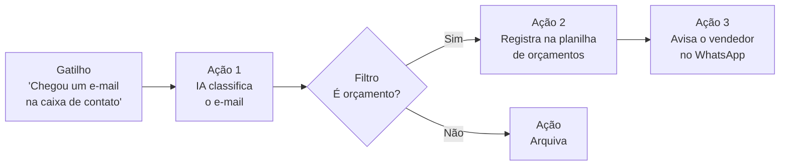
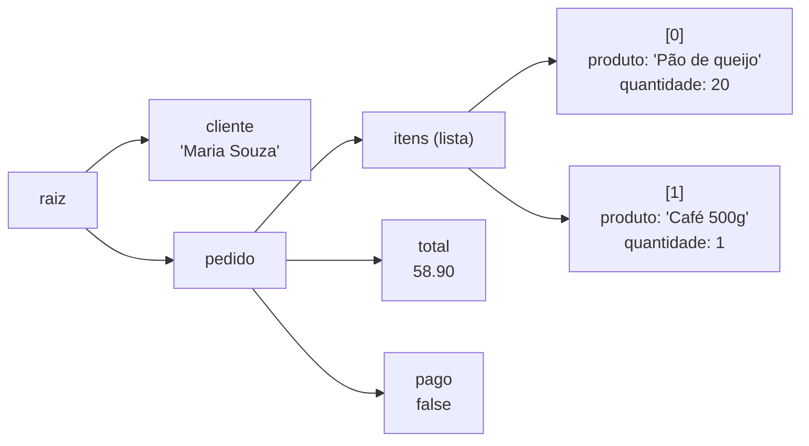
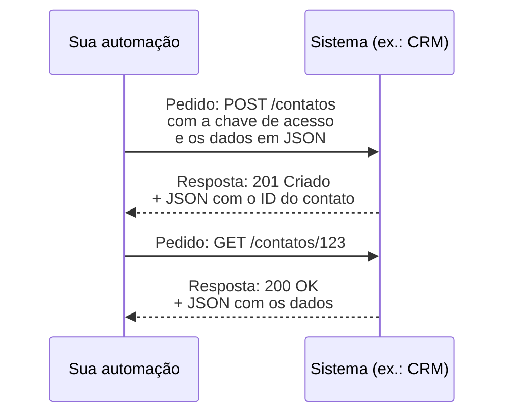
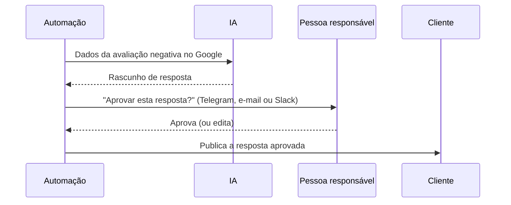
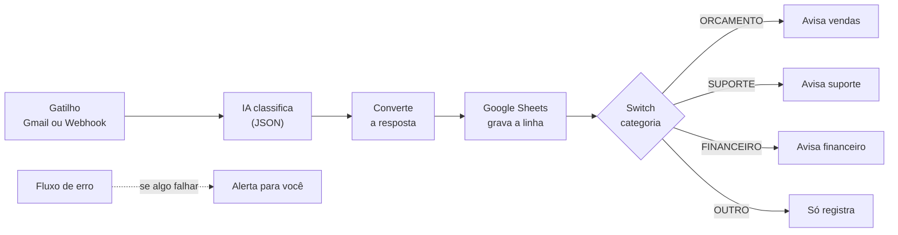
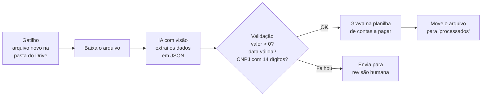
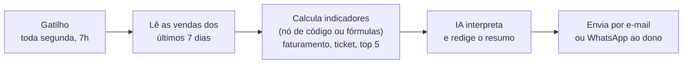
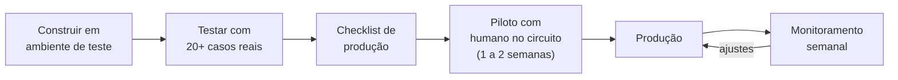

# Módulo 5: Automação no-code e low-code com IA

**Semanas 11 a 13 · cerca de 27 horas**

## Objetivos de aprendizagem

Até aqui, a IA só trabalhava quando alguém abria um chat e pedia. Neste módulo ela passa a trabalhar **sozinha, dentro dos processos da empresa**: quando chega um e-mail, quando um cliente preenche um formulário, toda segunda às 7h. É o salto do nível 2 (uso padronizado) para o nível 3 (automação) da escada do Módulo 1.

Ao final deste módulo você será capaz de:

1. Entender os conceitos de automação: gatilhos, ações, mapeamento de dados, filtros, roteadores, webhooks e APIs.
2. Ler e escrever JSON com segurança.
3. Construir fluxos no n8n e no Make com etapas de IA.
4. Tratar erros, monitorar e controlar custos.
5. Colocar em produção 3 automações reais e medir o resultado.

> 💡 **Não se assuste com a parte técnica.** "No-code" significa que você monta os fluxos arrastando blocos, sem programar. Você vai precisar entender alguns conceitos (JSON, API), mas não precisa ser programador. Cada conceito é explicado do zero.

### Plano das 3 semanas

| Semana | Estudo | Construção |
|---|---|---|
| 11 | Aulas 5.1 a 5.4 | Exercícios 1 a 3 + Automação 1 |
| 12 | Aula 5.5 | Automação 2 |
| 13 | Aula 5.6 | Automação 3 + fichas + medição |

---

## Aula 5.1: Conceitos fundamentais

### O que é uma automação

Uma automação é uma **receita**: *quando* algo acontece, *faça* uma sequência de passos, sem ninguém precisar apertar um botão.



*Figura: a anatomia de uma automação. Um gatilho inicia; ações executam; filtros e roteadores decidem o caminho.*

### O vocabulário

| Conceito | O que é | Exemplo |
|---|---|---|
| **Gatilho (trigger)** | Evento que inicia o fluxo | Chegou um e-mail; nova linha na planilha; formulário enviado; todo dia às 8h |
| **Ação** | Algo que o fluxo executa | Criar tarefa, enviar mensagem, chamar a IA, gravar na planilha |
| **Módulo / nó** | Cada bloco do fluxo | "Gmail: novo e-mail", "Anthropic: enviar mensagem" |
| **Mapeamento de dados** | Passar dados de um passo para outro | Usar o "assunto do e-mail" do passo 1 como entrada do passo 2 |
| **Filtro / condição** | Só continua se uma regra for verdadeira | Só se o e-mail vier de fora da empresa |
| **Roteador (router / switch)** | Divide o fluxo em caminhos | Se reclamação → caminho A; se orçamento → caminho B |
| **Iterador / loop** | Repete para cada item de uma lista | Para cada anexo, extraia os dados |
| **Webhook** | Uma URL que recebe dados de outro sistema em tempo real | O formulário do site envia os dados para o webhook |
| **API** | Uma "porta" para um sistema conversar com outro | A API do CRM permite criar contatos automaticamente |
| **Execução** | Cada vez que o fluxo roda | 150 execuções no mês |
| **Credencial** | O acesso guardado a um sistema (login, chave) | A conexão com o Gmail da empresa |

### Tipos de gatilho

| Tipo | Como funciona | Exemplo |
|---|---|---|
| **Evento (tempo real)** | O sistema avisa na hora que algo aconteceu (via webhook) | Formulário enviado, pagamento aprovado |
| **Verificação periódica** | O fluxo verifica de tempos em tempos se há novidade | A cada 5 minutos, ver se há e-mail novo |
| **Agendado** | Roda em horários fixos | Toda segunda às 7h |
| **Manual** | Alguém clica para rodar | Botão "gerar relatório agora" |

### Make, Zapier e n8n

| | Make | Zapier | n8n |
|---|---|---|---|
| Curva de aprendizado | Média | Fácil | Média a alta |
| Visual | Fluxo visual detalhado | Lista linear de passos | Fluxo visual (nós) |
| Custo | Cobra por operação; bom custo-benefício | Mais caro em volume | Gratuito se hospedado por você; nuvem paga |
| Flexibilidade | Alta | Média | Muito alta (aceita código em JavaScript e Python) |
| IA e agentes | Módulos de IA | Módulos de IA | Nós de IA, **agentes** e bases de conhecimento nativos |
| Recomendação | Ótimo para começar | Clientes que querem simplicidade | **Aprenda a fundo**: é o mais versátil para projetos de IA |

**Recomendação da formação:** aprenda o **n8n** como ferramenta principal e o **Make** no básico, porque muitos clientes já usam.

**Como começar no n8n:** crie uma conta na versão em nuvem (há período de teste) para aprender sem se preocupar com servidor. Mais tarde, quando tiver clientes, avalie a versão hospedada por você (mais barata e com mais controle dos dados, mas exige manutenção).

> 📌 **Em resumo**
> - Automação = gatilho + ações, com filtros e roteadores decidindo o caminho.
> - Gatilhos podem ser eventos, verificações periódicas, agendamentos ou manuais.
> - n8n como ferramenta principal; Make no básico.

**Para ir além**
- [Documentação do n8n](https://docs.n8n.io/) e [cursos gratuitos do n8n](https://learn.n8n.io/) (em inglês): faça o curso de nível 1 durante esta semana.
- [Make Academy](https://academy.make.com/) (em inglês): cursos gratuitos do Make.
- [Central de ajuda do Zapier](https://help.zapier.com/hc/en-us).

---

## Aula 5.2: JSON e APIs sem medo

### JSON: o idioma dos sistemas

**JSON** é o formato que os sistemas usam para trocar dados. É texto organizado em pares de **"chave": valor**.

```json
{
  "cliente": "Maria Souza",
  "telefone": "+5531999998888",
  "pedido": {
    "itens": [
      {"produto": "Pão de queijo", "quantidade": 20},
      {"produto": "Café 500g", "quantidade": 1}
    ],
    "total": 58.90,
    "pago": false
  }
}
```

### As 6 regras do JSON

| Elemento | Como se escreve | Exemplo |
|---|---|---|
| **Objeto** (um "registro") | Entre chaves `{ }` | `{"nome": "Maria"}` |
| **Lista** | Entre colchetes `[ ]` | `["pão", "café"]` |
| **Texto** | Entre aspas duplas | `"Maria Souza"` |
| **Número** | Sem aspas, com ponto decimal | `58.90` |
| **Verdadeiro/falso** | `true` ou `false`, sem aspas | `"pago": false` |
| **Vazio** | `null`, sem aspas | `"observação": null` |

Os erros mais comuns: aspas simples (`'Maria'` é inválido), vírgula sobrando depois do último item, e número com vírgula decimal (`58,90` é inválido; use `58.90`).

### Como "navegar" em um JSON

Para acessar um dado, você descreve o caminho até ele:



*Figura: o JSON do pedido como uma árvore. O caminho até um dado é a sequência de galhos, e as listas começam a contar do zero.*

| Quero... | Caminho | Resultado |
|---|---|---|
| O nome do cliente | `cliente` | "Maria Souza" |
| O total | `pedido.total` | 58.90 |
| O primeiro produto | `pedido.itens[0].produto` | "Pão de queijo" |
| A quantidade do segundo item | `pedido.itens[1].quantidade` | 1 |

No n8n, você arrasta o campo desejado para o próximo nó, e ele escreve o caminho para você, no formato `{{ $json.pedido.total }}`. No Make, você clica no campo no painel de mapeamento. Entender o caminho ajuda quando algo dá errado.

### O que é uma API

Uma **API** (*Application Programming Interface*) é uma porta que um sistema abre para que outros sistemas conversem com ele. Pense em um balcão de atendimento: você faz um pedido em um formato combinado e recebe uma resposta em um formato combinado.



*Figura: uma conversa com uma API. Cada pedido tem método, endereço, credencial e dados; cada resposta tem um código de status e dados.*

### As partes de uma chamada de API

```
Método:   POST (criar/enviar) | GET (consultar) | PUT ou PATCH (atualizar) | DELETE (apagar)
Endereço: https://api.sistema.com/v1/contatos
Cabeçalhos (headers):
          a chave de acesso (ex.: Authorization: Bearer SUA_CHAVE)
          Content-Type: application/json
Corpo (body): {"nome": "Maria", "telefone": "+5531999998888"}
```

### Os códigos de resposta mais comuns

| Código | Significado | O que fazer |
|---|---|---|
| **200 / 201** | Deu certo (201 = criado) | Seguir o fluxo |
| **400** | Pedido mal formado | Conferir o JSON e os campos obrigatórios |
| **401** | Não autorizado | Conferir a chave de acesso |
| **403** | Proibido | A chave não tem permissão para essa ação |
| **404** | Não encontrado | Conferir o endereço ou o ID |
| **429** | Limite de pedidos excedido | Esperar e tentar de novo (configurar novas tentativas) |
| **500 a 503** | Erro no servidor do sistema | Tentar de novo depois; se persistir, avisar alguém |

### Chamando um modelo de IA via API

Toda automação com IA, no fundo, faz um pedido como este (exemplo da API da Anthropic):

```
POST https://api.anthropic.com/v1/messages
Cabeçalhos:
  x-api-key: SUA_CHAVE
  anthropic-version: 2023-06-01
  content-type: application/json
Corpo:
{
  "model": "<id-do-modelo>",
  "max_tokens": 500,
  "system": "Você classifica e-mails de uma distribuidora...",
  "messages": [{"role": "user", "content": "Texto do e-mail aqui"}]
}
```

No n8n e no Make você **não escreve isso à mão**: preenche campos em um módulo pronto ("Anthropic", "OpenAI" etc.). Mas entender a estrutura permite usar **qualquer** API, mesmo sem módulo pronto, pelo módulo genérico "HTTP Request".

> 🔐 **Chaves de API são senhas.** Nunca as coloque em planilhas compartilhadas, prints de tela ou código público. Use o cofre de credenciais da ferramenta de automação. Se uma chave vazar, **revogue-a imediatamente** no painel do fornecedor e gere outra.

> 📌 **Em resumo**
> - JSON: objetos `{ }`, listas `[ ]`, textos entre aspas duplas, números com ponto.
> - Caminho até um dado: `pedido.itens[0].produto` (listas começam em zero).
> - API: método + endereço + credencial + corpo; a resposta tem um código de status.
> - Chaves de API são senhas.

**Para ir além**
- [Introdução ao JSON](https://www.json.org/json-pt.html) (em português).
- [Trabalhando com JSON, na MDN](https://developer.mozilla.org/pt-BR/docs/Learn_web_development/Core/Scripting/JSON) (em português).
- [Códigos de status HTTP, na MDN](https://developer.mozilla.org/pt-BR/docs/Web/HTTP/Reference/Status) (em português).
- [BrasilAPI](https://brasilapi.com.br/docs): APIs públicas brasileiras gratuitas (CEP, CNPJ, feriados), ótimas para treinar.

---

## Aula 5.3: O padrão "IA dentro do fluxo"

Quase toda automação com IA segue um de 5 padrões. Reconhecê-los acelera muito o desenho de soluções.

```mermaid
flowchart TB
    subgraph P1["1. Classificar e rotear"]
        a1["Entrada"] --> a2["IA classifica"] --> a3{"Roteador"} --> a4["Ações diferentes"]
    end
    subgraph P2["2. Extrair e registrar"]
        b1["Documento"] --> b2["IA extrai JSON"] --> b3["Valida"] --> b4["Grava no sistema"]
    end
    subgraph P3["3. Gerar e enviar"]
        c1["Dados"] --> c2["IA redige"] --> c3["Aprovação<br/>(opcional)"] --> c4["Envia"]
    end
    subgraph P4["4. Resumir e notificar"]
        d1["Muitos dados"] --> d2["IA resume"] --> d3["Alerta"]
    end
    subgraph P5["5. Enriquecer"]
        e1["Registro"] --> e2["IA analisa"] --> e3["Atualiza o registro"]
    end
```



*Figura: os 5 padrões. Soluções maiores costumam combinar dois ou três deles.*

| Padrão | Fluxo | Exemplo |
|---|---|---|
| **1. Classificar e rotear** | Entrada → IA classifica → roteador → ações diferentes | E-mails: financeiro, comercial, suporte |
| **2. Extrair e registrar** | Documento → IA extrai JSON → valida → grava no sistema | Nota fiscal → planilha financeira |
| **3. Gerar e enviar** | Dados → IA redige → aprovação (opcional) → envio | Relatório semanal, follow-up personalizado |
| **4. Resumir e notificar** | Muitos dados → IA resume → alerta | Resumo diário das avaliações do Google para o dono |
| **5. Enriquecer** | Registro → IA analisa e acrescenta informação → atualiza | Lead no CRM → IA pontua o potencial e sugere a abordagem |

### Humano no circuito

Para saídas de risco, adicione uma etapa de **aprovação humana** antes da ação final:



*Figura: o humano no circuito. A IA faz o trabalho pesado (o rascunho), e a pessoa só confere e aprova, o que leva segundos.*

**Regra prática:** comece **sempre** com aprovação humana. Remova-a só quando os dados mostrarem qualidade consistente por algumas semanas, e apenas em saídas de baixo risco.

| Tipo de saída | Aprovação humana |
|---|---|
| Classificação interna (vai para uma planilha) | Não precisa |
| Resposta a cliente sobre dúvida simples | No início, sim; depois, amostragem |
| Resposta a reclamação ou avaliação negativa | Sempre |
| Envio em massa (campanha, cobrança) | Sempre |
| Qualquer valor financeiro | Sempre |

> 📌 **Em resumo**
> - 5 padrões: classificar e rotear, extrair e registrar, gerar e enviar, resumir e notificar, enriquecer.
> - Humano no circuito para saídas de risco; comece sempre com ele.

---

## Aula 5.4: Construindo a automação 1 (passo a passo)

### Triagem inteligente de mensagens de contato

**Objetivo:** mensagens que chegam por e-mail ou pelo formulário do site são classificadas pela IA, registradas em uma planilha, e o responsável certo é avisado.



*Figura: o fluxo completo da automação 1. O fluxo de erro, pontilhado, roda à parte quando qualquer passo falha.*

### Passo a passo no n8n (a lógica é a mesma no Make)

**Passo 1. Gatilho.** Adicione o nó **Gmail Trigger** (novo e-mail na caixa de contato) **ou** o nó **Webhook** (se o formulário do site puder enviar dados para uma URL). Conecte a credencial do Gmail pelo assistente de conexão do n8n.

**Passo 2. IA.** Adicione o nó do modelo de IA (por exemplo, o nó da Anthropic ou o nó "Basic LLM Chain" com um modelo conectado). Use este prompt:

```
Classifique a mensagem abaixo. Responda APENAS em JSON, sem texto antes ou depois:
{"categoria": "ORCAMENTO|SUPORTE|FINANCEIRO|OUTRO",
 "urgencia": "ALTA|MEDIA|BAIXA",
 "resumo": "até 20 palavras",
 "nome_cliente": "string ou null"}

Critérios de urgência:
- ALTA: cliente irritado, prazo para hoje ou amanhã, problema que impede o uso do produto.
- MEDIA: pedido de orçamento com prazo definido; dúvida sobre pedido em andamento.
- BAIXA: dúvidas gerais, sugestões, mensagens sem prazo.

Mensagem:
"""{{ $json.text }}"""
```

**Passo 3. Converter a resposta em dados.** A IA responde com texto que *parece* JSON. Use o nó **Structured Output Parser** (acoplado à cadeia de IA) ou um nó **Code** com `JSON.parse(...)` para transformar em campos utilizáveis.

**Passo 4. Registrar.** Adicione o nó **Google Sheets → Append Row** e mapeie: data, remetente, categoria, urgência, resumo.

**Passo 5. Rotear.** Adicione o nó **Switch** com 4 saídas, uma por categoria.

**Passo 6. Notificar.** Em cada saída, um nó de mensagem (e-mail, Telegram ou WhatsApp) para o responsável. Para urgência ALTA, acrescente "🔴 URGENTE" no início.

**Passo 7. Tratamento de erro.** Crie um fluxo separado com o nó **Error Trigger** e configure-o como "Error Workflow" nas configurações do fluxo principal. Ele deve te avisar quando algo falhar, com o nome do fluxo e a mensagem de erro.

### Testando

1. Monte **20 mensagens reais** (anonimizadas) com a categoria correta anotada.
2. Rode cada uma e compare a classificação da IA com a sua.
3. Calcule a taxa de acerto. **Meta: 90% ou mais.**
4. Para cada erro, pergunte: o critério estava claro no prompt? Ajuste e rode as 20 de novo (lembre da regressão, Módulo 2).

> 📌 **Em resumo**
> - Gatilho → IA com saída em JSON → conversão → registro → roteamento → notificação.
> - Fluxo de erro sempre configurado.
> - 20 casos reais de teste, meta de 90% de acerto.

**Para ir além**
- [Guia de IA do n8n](https://docs.n8n.io/build/integrate-ai) (em inglês): nós de IA, agentes e cadeias.
- [Galeria de fluxos prontos do n8n](https://n8n.io/workflows/): milhares de exemplos para estudar e adaptar.

---

## Aula 5.5: Automações 2 e 3 (projetos guiados)

### Automação 2: extração de documentos para o sistema

**Problema típico:** alguém digita à mão os dados de notas fiscais, boletos ou pedidos em uma planilha ou sistema. Leva tempo e gera erros.



*Figura: a extração com validação. A validação por regras (fora da IA) pega os erros de leitura antes que eles cheguem ao sistema.*

**Prompt de extração:**
```
Extraia os dados deste documento fiscal. Responda APENAS em JSON:
{"fornecedor": string, "cnpj": string (só números), "numero_documento": string,
 "data_emissao": "AAAA-MM-DD", "vencimento": "AAAA-MM-DD" ou null,
 "valor_total": number, "itens": [{"descricao": string, "quantidade": number, "valor": number}]}
Se algum campo não estiver legível, use null. Não invente valores.
```

**A validação** é feita com regras simples (nó **IF** ou **Code**): o valor é maior que zero? A data existe? O CNPJ tem 14 dígitos? A soma dos itens bate com o total (com tolerância de centavos)? Se qualquer regra falhar, o documento vai para revisão.

**Métrica:** minutos de digitação economizados por documento × volume mensal; taxa de erros antes e depois.

### Automação 3: relatório executivo automático

**Problema típico:** o dono não acompanha os números ou gasta horas montando relatórios.



*Figura: o relatório automático. Os cálculos ficam fora da IA; ela só recebe os números prontos para interpretar e escrever.*

**Prompt de redação:**
```
Você é o analista de negócios da {{empresa}}. Com base nos indicadores abaixo,
escreva o resumo semanal para o dono, que lê no celular.

Estrutura:
1. Três números principais (com variação em relação à semana anterior)
2. O que melhorou
3. O que piorou
4. Três pontos de atenção
5. Uma sugestão de ação para esta semana

Máximo de 200 palavras. Linguagem direta. Não recalcule nada: use os números fornecidos.

Indicadores:
{{ $json.indicadores }}
```

> 🎯 **Regra de ouro:** **faça os cálculos fora da IA** (fórmula ou código) e passe os números prontos. A IA é ótima para **interpretar e redigir**, mas pode errar contas, como você viu no Módulo 1.

### Outras ideias de automação para escolher

| Ideia | Padrão | Gatilho |
|---|---|---|
| Follow-up de orçamentos sem resposta em 48h | Gerar e enviar | Agendado (verifica diariamente) |
| Resposta a avaliações do Google (rascunho para aprovação) | Gerar e enviar + humano | Nova avaliação |
| Áudio do WhatsApp → transcrição → resumo → tarefa | Extrair e registrar | Nova mensagem de áudio |
| Novo lead no formulário → IA pontua → CRM → boas-vindas | Enriquecer | Webhook do formulário |
| Cobrança escalonada (lembrete amigável → firme → aviso) | Gerar e enviar | Agendado |
| Resumo diário de menções e avaliações | Resumir e notificar | Agendado |

> 📌 **Em resumo**
> - Extração: IA com visão + validação por regras + revisão humana quando falhar.
> - Relatório: cálculos fora da IA; ela interpreta e redige.
> - Escolha as automações a partir do diagnóstico do Módulo 3.

---

## Aula 5.6: Produção, monitoramento e custos

### Do teste à produção



*Figura: o caminho até a produção. O piloto com humano no circuito é a rede de proteção antes de a automação rodar sozinha.*

### Checklist antes de colocar em produção

- [ ] Testado com pelo menos 20 casos reais, incluindo casos estranhos (e-mail vazio, anexo corrompido, idioma diferente)
- [ ] Tratamento de erro configurado (alerta quando falha)
- [ ] Registro de execuções ativo (a ferramenta guarda o histórico)
- [ ] Credenciais no cofre, e não em texto
- [ ] Teto de gasto configurado na conta da API
- [ ] Humano no circuito para saídas de risco
- [ ] Ficha de documentação preenchida ([modelo de ficha de automação](templates/ficha-de-automacao.md))
- [ ] Responsável na empresa definido e treinado
- [ ] Processo manual de contingência conhecido ("se parar, fazemos assim")

### Monitoramento semanal (primeiro mês)

| Pergunta | Onde ver |
|---|---|
| Quantas execuções? Quantas falhas? Por quê? | Histórico de execuções da ferramenta |
| As saídas da IA continuam boas? | Amostra de 10 saídas por semana |
| Quanto custou? | Painel de uso da API + painel da ferramenta |
| Alguém reclamou ou percebeu algo estranho? | Conversa rápida com o responsável |

### Controle de custos

- **Teto de gasto:** configure um limite mensal no painel do fornecedor da API. Se uma automação entrar em laço, o prejuízo fica limitado.
- **Modelo certo para cada etapa:** classificação usa modelo pequeno; redação importante usa modelo maior (Módulo 1).
- **Contagem de operações:** no Make, cada módulo executado conta como operação. Filtros no início do fluxo evitam gastar operações com itens que serão descartados.

### Medição de resultado (antes × depois)

| Indicador | Antes | Depois | Ganho |
|---|---|---|---|
| Tempo por item | 15 min | 1 min (revisão) | −93% |
| Volume mensal | 400 | 400 | — |
| Horas por mês | 100h | 6,7h | **93h liberadas** |
| Erros de digitação | cerca de 4% | cerca de 1% | −75% |

Esses números vão para a ficha da automação, para o caso de estudo (Módulo 6) e para as suas palestras.

> 📌 **Em resumo**
> - Checklist de produção, piloto com humano no circuito, depois produção.
> - Monitoramento semanal: execuções, falhas, qualidade e custo.
> - Teto de gasto na API, sempre.
> - Meça antes e depois: os números são a prova do seu trabalho.

---

## Exercícios

### Exercício 1: JSON (30 min)

1. Escreva à mão o JSON de um pedido com 3 itens, cliente, endereço (rua, número, bairro, cidade) e forma de pagamento.
2. Valide no [JSONLint](https://jsonlint.com/). Corrija os erros até ficar válido.
3. Escreva o caminho para acessar: o nome do 2º item; a cidade; a forma de pagamento.
4. Introduza de propósito 3 erros comuns (aspas simples, vírgula sobrando, número com vírgula decimal) e veja as mensagens do validador.

### Exercício 2: Primeira API (45 min)

1. No n8n (ou no Make), crie um fluxo com o nó **HTTP Request**.
2. Configure: método GET, endereço `https://brasilapi.com.br/api/cep/v1/01001000`.
3. Execute e veja a resposta em JSON.
4. Adicione um nó de planilha e grave a cidade e o bairro.
5. Troque o CEP por um lido de uma planilha com 5 CEPs, usando um iterador.

### Exercício 3: Primeira chamada de IA em uma automação (45 min)

1. Crie uma conta de API em um fornecedor de IA (Anthropic, OpenAI ou Google), gere uma chave e **configure um teto de gasto** baixo.
2. Guarde a chave como credencial no n8n.
3. Monte o fluxo: planilha com 10 frases de clientes → IA classifica o sentimento (positivo, neutro, negativo) → escreve o resultado na coluna ao lado.
4. Confira as 10 classificações.

### Exercícios 4 a 6: As 3 automações

Construa as automações 1, 2 e 3 (Aulas 5.4 e 5.5), primeiro em ambiente de teste e depois na empresa-laboratório. Se as automações 2 e 3 não fizerem sentido para a empresa-laboratório, escolha outras da lista da Aula 5.5 que vieram do diagnóstico.

---

## Tarefa de campo

Implemente **3 automações** na empresa-laboratório, escolhidas entre as oportunidades do diagnóstico (Módulo 3). Rode cada uma por pelo menos **1 semana** e meça o antes e o depois.

---

## Entregável

- 3 automações em produção.
- 3 **fichas de automação** completas ([modelo](templates/ficha-de-automacao.md)), com objetivo, fluxo (print ou diagrama), prompts usados, casos de teste, métricas antes e depois, custo mensal, responsável e plano de contingência.
- Um vídeo de 3 a 5 minutos (tela gravada) mostrando uma automação funcionando. É ótimo para o portfólio e para palestras.

---

## Autoavaliação

Meta: pelo menos 10 de 12.

1. Qual a diferença entre gatilho e ação?
2. Cite os 4 tipos de gatilho.
3. O que é um webhook?
4. No JSON `{"pedido":{"itens":[{"produto":"A"},{"produto":"B"}]}}`, como acessar "B"?
5. Cite 3 erros comuns que tornam um JSON inválido.
6. O que significam os códigos 401 e 429?
7. Cite os 5 padrões de "IA dentro do fluxo".
8. Por que fazer cálculos fora da IA?
9. O que é "humano no circuito" e quando removê-lo?
10. Cite 5 itens do checklist de produção.
11. Por que recomendar o n8n como ferramenta principal?
12. Onde guardar chaves de API, e o que fazer se uma vazar?

<details>
<summary><strong>Gabarito</strong></summary>

1. O gatilho é o evento que inicia o fluxo; a ação é o que o fluxo executa.
2. Evento em tempo real, verificação periódica, agendado e manual.
3. Uma URL que recebe dados de outro sistema em tempo real, quando um evento acontece.
4. `pedido.itens[1].produto`.
5. Aspas simples; vírgula sobrando depois do último item; número com vírgula decimal.
6. 401 = não autorizado (credencial inválida); 429 = limite de pedidos excedido.
7. Classificar e rotear; extrair e registrar; gerar e enviar; resumir e notificar; enriquecer.
8. Porque modelos de linguagem podem errar contas. Fórmulas e código são exatos; a IA interpreta os números prontos.
9. Uma etapa de aprovação humana antes da ação final. Remova quando os dados mostrarem qualidade consistente por algumas semanas, e apenas em saídas de baixo risco.
10. Testes com 20 casos; tratamento de erro; registro de execuções; credenciais no cofre; teto de gasto; humano no circuito; documentação; responsável definido; contingência manual (quaisquer 5).
11. É flexível, aceita código, tem agentes e bases de conhecimento nativos, pode ser hospedado pela própria empresa (menor custo e mais controle dos dados) e tem comunidade ativa.
12. No cofre de credenciais da ferramenta, nunca em texto aberto. Se vazar, revogar a chave imediatamente no painel do fornecedor e gerar outra.
</details>

---

## Para aprofundar (opcional)

| Material | Por que vale |
|---|---|
| [Cursos gratuitos do n8n](https://learn.n8n.io/) | Níveis 1 e 2, com exercícios práticos |
| [Documentação do n8n](https://docs.n8n.io/) e [guia de IA do n8n](https://docs.n8n.io/build/integrate-ai) | Referência de nós e recursos de IA |
| [Galeria de fluxos do n8n](https://n8n.io/workflows/) | Exemplos prontos para estudar |
| [Make Academy](https://academy.make.com/) | Cursos gratuitos do Make |
| [BrasilAPI](https://brasilapi.com.br/docs) | APIs públicas brasileiras para praticar |
| [Uso de ferramentas com Claude](https://platform.claude.com/docs/en/agents-and-tools/tool-use/overview) | Preparação para o Módulo 9 (agentes) |
