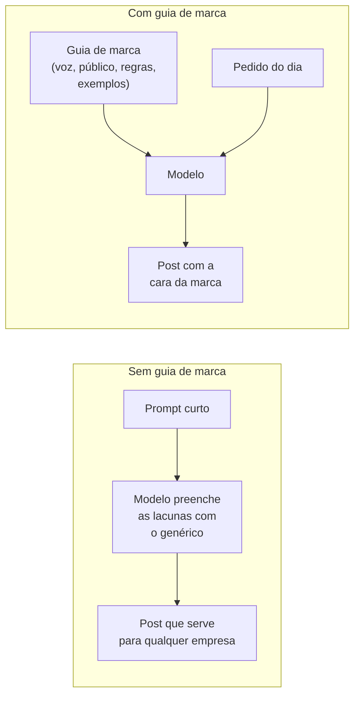
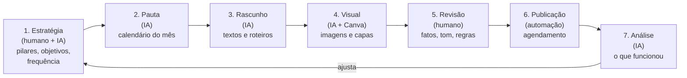
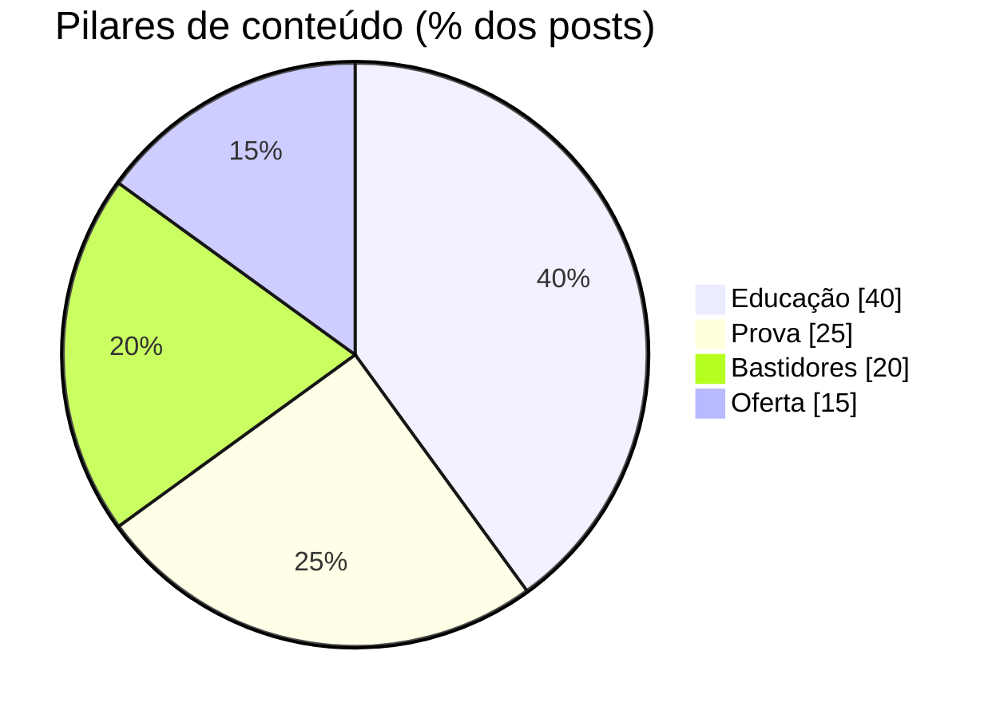
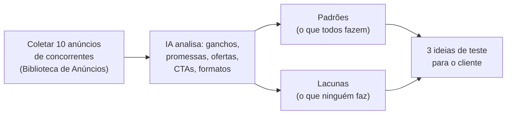

# Módulo 7: Marketing e conteúdo com IA

**Semana 17 · cerca de 9 horas**

## Objetivos de aprendizagem

Marketing é a área em que mais gente já usa IA, e também a área com mais conteúdo genérico, repetitivo e sem cara de marca. Neste módulo você aprende a montar um **sistema** que produz conteúdo com identidade, com processo e com revisão, e que a equipe do cliente consegue operar sozinha.

Ao final deste módulo você será capaz de:

1. Criar um **guia de marca para IA** (voz, público, regras) que garanta consistência.
2. Usar frameworks de copy (AIDA, PAS e outros) com a IA.
3. Produzir conteúdo com um processo de 7 etapas, com revisão humana.
4. Usar IA para pesquisar o público e analisar concorrentes e criativos.
5. Conhecer os cuidados legais e éticos (direitos autorais, imagem de pessoas, publicidade enganosa).

---

## Aula 7.1: O problema do "conteúdo de IA genérico"

### Por que tanto conteúdo parece igual

Abra o Instagram de dez pequenas empresas que usam IA sem método e você verá os mesmos padrões: "🚀 Transforme seu negócio!", "Você sabia que...?", listas de "5 dicas incríveis", emojis em todas as linhas. É o resultado previsível do que você aprendeu no Módulo 2: **quando o prompt não dá contexto, o modelo escolhe o mais genérico**.

A solução não é "um prompt melhor" a cada post. É criar **uma vez** um documento com tudo o que a IA precisa saber sobre a marca, e usá-lo em **todo** pedido: o **guia de marca para IA**.



*Figura: o guia de marca faz o papel do contexto permanente. Cada pedido do dia pode ser curto, porque o contexto já está lá.*

### A estrutura do guia de marca para IA

```markdown
# Marca: [Nome]

## Quem somos (3 linhas)

## Público principal (persona)
- Quem é, idade, rotina, dores, desejos, objeções, palavras que usa

## Promessa / proposta de valor (1 frase)

## Tom de voz
- Somos: [ex.: próximos, bem-humorados, especialistas sem arrogância]
- Não somos: [ex.: formais, agressivos, "coach"]
- Palavras que usamos: ...
- Palavras proibidas: ...

## Exemplos de textos aprovados (3 a 5)

## Produtos e serviços, com diferenciais

## Regras
- Emojis: [quantidade e estilo]
- Promessas proibidas (ex.: "resultado garantido")
- Regras do setor (ex.: publicidade médica, alimentos, financeiro)
```

### Exemplo preenchido (resumo)

> **Marca:** Pão da Vila, padaria artesanal no bairro Santa Tereza, em Belo Horizonte.
> **Público:** moradores do bairro, 30 a 60 anos, que valorizam o "pão de verdade" e a conversa no balcão; reclamam de pão industrializado "sem gosto".
> **Promessa:** pão de fermentação natural, feito todo dia de madrugada, a dois quarteirões da sua casa.
> **Somos:** afetuosos, bem-humorados, orgulhosos do bairro. **Não somos:** gourmetizados, formais, "influencers".
> **Palavras que usamos:** fornada, casca crocante, vizinho, "saiu agora". **Proibidas:** gourmet, imperdível, incrível.
> **Emojis:** no máximo 2 por post; nunca 🚀 nem 💯.

Com esse guia configurado em um Project (Claude), GPT (ChatGPT) ou Gem (Gemini), um pedido como "post sobre a fornada de sexta" já sai com a cara da padaria.

> 📌 **Em resumo**
> - Conteúdo genérico é falta de contexto.
> - O guia de marca é o contexto permanente: público, voz, palavras, exemplos e regras.
> - Configure-o em um assistente personalizado e use em todo pedido.

---

## Aula 7.2: Frameworks de copy que a IA executa muito bem

**Copy** é o texto persuasivo de marketing. Frameworks de copy são estruturas testadas há décadas, e a IA as executa muito bem quando você diz qual usar.

| Framework | Estrutura | Uso ideal |
|---|---|---|
| **AIDA** | Atenção → Interesse → Desejo → Ação | Anúncios, posts de venda |
| **PAS** | Problema → Agitação → Solução | Anúncios diretos, e-mails |
| **Antes-Depois-Ponte** | Situação atual → situação desejada → como chegar | Serviços, transformação |
| **Gancho-História-Oferta** | Gancho forte → história curta → oferta | Vídeos curtos (Reels, TikTok) |
| **4U** (para títulos) | Útil, Urgente, Único, Ultra-específico | Títulos, assuntos de e-mail |

### Exemplo: o mesmo produto em dois frameworks

**Produto:** aula experimental gratuita em uma academia de bairro.

**AIDA:**
> **Atenção:** Faz quanto tempo que você promete "segunda eu começo"?
> **Interesse:** Aqui, a primeira aula é com um professor só para você, no horário que couber na sua rotina.
> **Desejo:** Em 30 dias, nossos alunos novos relatam mais disposição e menos dor nas costas.
> **Ação:** Chama no WhatsApp e agende a sua aula grátis desta semana.

**PAS:**
> **Problema:** A dor nas costas depois de 8 horas sentado.
> **Agitação:** Ela começa leve, depois aparece no fim de semana, e um dia você percebe que evita brincar com seus filhos.
> **Solução:** Uma rotina de 3 treinos por semana, acompanhada, a 5 minutos da sua casa. A primeira aula é por nossa conta.

### Prompt modelo para anúncios

```
Com base no guia de marca, crie 5 variações de anúncio para {{produto}} usando o
framework PAS. Público: {{persona}}. Objetivo: gerar mensagens no WhatsApp.

Cada variação com um gancho diferente:
(1) dor, (2) curiosidade, (3) prova social, (4) número, (5) pergunta.

Regras: no máximo 125 caracteres no texto principal; título com até 40 caracteres;
nenhuma promessa de resultado garantido.
Formato: tabela com colunas Variação, Gancho, Texto principal, Título.
```

> 💡 **Peça variações, e não "o melhor anúncio".** O melhor anúncio quem decide é o público, com testes. A IA é excelente em gerar variações para testar.

> 📌 **Em resumo**
> - Frameworks de copy dão estrutura persuasiva: AIDA, PAS, Antes-Depois-Ponte, Gancho-História-Oferta e 4U.
> - Diga à IA qual framework usar e peça variações com ganchos diferentes.

---

## Aula 7.3: Processo de produção de conteúdo com IA

### As 7 etapas



*Figura: o processo em ciclo. A revisão humana (etapa 5) é obrigatória, e a análise (etapa 7) alimenta a estratégia do mês seguinte.*

| Etapa | Quem faz | Tempo típico (1 mês de conteúdo) |
|---|---|---|
| 1. Estratégia | Dono ou responsável + IA | 1h (revisada a cada trimestre) |
| 2. Pauta | IA, com aprovação | 20 min |
| 3. Rascunho | IA | 40 min |
| 4. Visual | IA + Canva | 1h a 2h |
| 5. Revisão | Humano | 1h |
| 6. Publicação | Automação ou agendador | 20 min |
| 7. Análise | IA, com os números exportados | 30 min |

### Pilares de conteúdo

Pilares são os **temas fixos** da marca, com uma proporção definida. Evitam o "o que eu posto hoje?" e equilibram conteúdo de valor com ofertas.

**Exemplo: academia de bairro**



*Figura: a distribuição dos pilares. Só 15% do conteúdo é oferta direta; o restante constrói confiança para que a oferta funcione.*

| Pilar | % | O que é | Exemplo |
|---|---|---|---|
| **Educação** | 40% | Dicas úteis para o público | "3 exercícios para quem trabalha sentado" |
| **Prova** | 25% | Resultados e depoimentos | Transformação de um aluno (com autorização) |
| **Bastidores** | 20% | Equipe, estrutura, rotina | "Conheça a professora Ana" |
| **Oferta** | 15% | Planos, aulas experimentais, promoções | "Aula experimental grátis esta semana" |

### Roteiro de vídeo curto

```
[0 a 3 s]    GANCHO: frase ou cena que faz a pessoa parar de rolar
[3 a 20 s]   CONTEÚDO: 3 pontos rápidos, com cortes a cada 2 ou 3 segundos
[20 a 30 s]  CTA: uma única ação clara
Legenda na tela: sim (muita gente assiste sem som). Duração total: 20 a 40 s.
```

**Prompt para roteiros:**
```
Com base no guia de marca, crie 4 roteiros de vídeo curto para o pilar {{pilar}}.
Use a estrutura Gancho (0-3s) / Conteúdo (3-20s) / CTA (20-30s).
Para cada roteiro: texto falado, texto na tela, sugestão de cena para cada trecho.
Os ganchos devem ser diferentes entre si (pergunta, afirmação polêmica, erro comum, número).
```

> 📌 **Em resumo**
> - Sete etapas em ciclo, com revisão humana obrigatória.
> - Pilares com proporção definida; a oferta é a menor parte.
> - Vídeo curto: gancho em 3 segundos, 3 pontos, 1 CTA.

---

## Aula 7.4: Pesquisa e análise com IA

### Pesquisa de público

> "Liste as 20 principais dúvidas, medos e desejos de {{persona}} em relação a {{produto}}, com as palavras que essas pessoas usam no dia a dia."

**Valide com dados reais:** compare com os comentários do Instagram, as avaliações do Google e as conversas do WhatsApp da empresa. A IA dá hipóteses; os clientes reais confirmam.

### Análise de concorrentes

A [Biblioteca de Anúncios da Meta](https://www.facebook.com/ads/library/) mostra os anúncios ativos de qualquer página no Facebook e no Instagram. É pública e gratuita.



*Figura: a análise de concorrentes. As lacunas costumam ser mais valiosas que os padrões: são o espaço onde o cliente pode se diferenciar.*

**Prompt:**
```
Analise estes 10 anúncios de concorrentes de {{segmento}} em {{cidade}}.
Para cada um: gancho, promessa principal, oferta, CTA e formato.
Depois: (1) os padrões que se repetem; (2) as lacunas que ninguém explora;
(3) 3 ideias de anúncio para testarmos, alinhadas ao nosso guia de marca.
```

### Análise de criativos

Envie o print ou o vídeo de um anúncio (seu ou de concorrente) e peça a decomposição: gancho, estrutura, gatilhos de persuasão, CTA e por que funciona (ou não).

### Análise de desempenho

Exporte as métricas das redes sociais (alcance, salvamentos, compartilhamentos, cliques, mensagens) e peça:

> "Estes são os resultados dos 20 posts do último mês. Quais temas e formatos performaram melhor em salvamentos e mensagens? Que hipóteses testamos no próximo mês?"

### SEO local

Para negócios físicos, o **Perfil de Empresa no Google** é muitas vezes o canal mais importante. A IA ajuda a escrever a descrição do perfil, as respostas a avaliações (sempre revisadas), as publicações do perfil e os textos do site com as palavras que o cliente busca ("padaria artesanal em Santa Tereza").

> 📌 **Em resumo**
> - Pesquisa de público com IA, validada com dados reais.
> - Biblioteca de Anúncios da Meta para analisar concorrentes; procure as lacunas.
> - Análise de desempenho mensal alimenta a estratégia.

**Para ir além**
- [Biblioteca de Anúncios da Meta](https://www.facebook.com/ads/library/).
- [Ajuda do Perfil de Empresa no Google](https://support.google.com/business/).
- [Google Trends](https://trends.google.com.br/trends/): o que as pessoas estão buscando, por região.

---

## Aula 7.5: Imagem, vídeo e cuidados legais

### Geração visual: onde a IA ajuda

| Uso | Recomendação |
|---|---|
| Ideias de composição e estilo | ✅ Excelente |
| Fundos, texturas, ilustrações | ✅ Excelente |
| Variações de um criativo para teste | ✅ Muito bom |
| Mockups (produto em um ambiente) | ⚠️ Com cuidado, sem enganar |
| Fotos de produtos reais | ❌ Prefira fotos reais melhoradas (luz, fundo, recorte) |
| Pessoas reais | ❌ Nunca sem autorização por escrito |

**Por que fotos reais para produtos:** uma imagem gerada pode mostrar um produto mais bonito, maior ou diferente do real. O cliente compra, recebe outra coisa e se frustra. Além de ruim para a marca, isso pode configurar publicidade enganosa.

Mantenha a identidade visual com um **kit de marca** no Canva (cores, fontes, logotipos e modelos).

### Os cuidados obrigatórios

| Cuidado | O que fazer |
|---|---|
| **Direitos autorais** | Não peça "no estilo de [artista vivo]" para uso comercial; não use marcas e personagens de terceiros |
| **Imagem e voz de pessoas** | Nunca gere imagem ou voz de pessoas reais sem autorização por escrito |
| **Publicidade enganosa** | Respeite o Código de Defesa do Consumidor e as normas do CONAR |
| **Conselhos profissionais** | Medicina, odontologia, advocacia, nutrição e outras profissões têm regras próprias de publicidade |
| **Transparência** | Indique uso de IA quando a plataforma exigir ou quando a imagem puder confundir o consumidor |
| **Checagem de fatos** | Números, estatísticas e afirmações técnicas devem ser verificados antes de publicar |

### Regras de setores regulados

Se o cliente for de saúde, advocacia, alimentos ou finanças, **pesquise as regras do conselho profissional ou do órgão regulador** antes de produzir qualquer conteúdo. Exemplos comuns de restrições: proibição de "antes e depois" em alguns tratamentos, de promessas de resultado, de preços em determinados formatos. Coloque essas regras no guia de marca, na seção "Regras do setor", para que a IA as siga em todo pedido.

> 📌 **Em resumo**
> - IA para ideias, fundos e variações; fotos reais para produtos.
> - Nunca imagem ou voz de pessoas reais sem autorização.
> - Respeite CDC, CONAR e regras dos conselhos profissionais.

**Para ir além**
- [CONAR](https://www.conar.org.br/): Código Brasileiro de Autorregulamentação Publicitária.
- [Código de Defesa do Consumidor](https://www.planalto.gov.br/ccivil_03/leis/l8078compilado.htm): regras sobre oferta e publicidade.

---

## Exercícios

### Exercício 1: Guia de marca (60 min)

Crie o guia de marca para IA da empresa-laboratório. Entreviste o dono por 20 minutos usando a estrutura da Aula 7.1 como roteiro. Configure o guia em um Project, GPT ou Gem.

### Exercício 2: Teste cego (45 min)

1. Gere 5 posts **sem** o guia e 5 **com** o guia, para os mesmos temas.
2. Misture e mostre a 3 pessoas que conhecem a empresa, sem dizer qual é qual.
3. Peça que escolham os que "têm a cara da marca".
4. Registre o resultado. Ele é um ótimo argumento de venda para o seu serviço.

### Exercício 3: Calendário (45 min)

Crie o calendário do próximo mês: pilares, 12 posts, 4 roteiros de vídeo e 2 e-mails. Inclua datas comemorativas relevantes ao segmento e ao calendário comercial brasileiro.

### Exercício 4: Análise de concorrentes (45 min)

Analise 10 anúncios de concorrentes na [Biblioteca de Anúncios da Meta](https://www.facebook.com/ads/library/) com o prompt da Aula 7.4. Liste 5 aprendizados e 3 ideias de teste.

---

## Tarefa de campo

Entregue à empresa-laboratório **um mês de conteúdo** produzido com o sistema e treine a pessoa responsável para operar sozinha. Depois de 30 dias, compare as métricas (alcance, engajamento, mensagens recebidas) com o mês anterior.

---

## Entregável: Sistema de conteúdo

- Guia de marca para IA.
- Assistente personalizado configurado (Project, GPT ou Gem).
- 10 prompts de conteúdo (posts, roteiros, anúncios, e-mail, resposta a avaliações, análise de desempenho).
- Modelos visuais no Canva.
- Processo de 7 etapas documentado, com responsáveis.
- Calendário do mês.

**Critério de qualidade:** a pessoa responsável produz uma semana de conteúdo em até 2 horas, com aprovação do dono.

---

## Autoavaliação

Meta: pelo menos 8 de 10.

1. Qual a causa principal do conteúdo genérico?
2. Cite 6 elementos de um guia de marca para IA.
3. Descreva o framework PAS.
4. Por que pedir variações, e não "o melhor anúncio"?
5. Quais as 7 etapas do processo de produção e qual delas é obrigatoriamente humana?
6. Qual a distribuição recomendada por pilares no exemplo da academia?
7. Como usar a IA para analisar concorrentes, e por que as lacunas importam?
8. Cite 3 cuidados legais ao usar imagens geradas por IA.
9. Por que preferir fotos reais para produtos?
10. O que fazer antes de produzir conteúdo para um cliente de setor regulado?

<details>
<summary><strong>Gabarito</strong></summary>

1. A IA não conhece a marca, o público e o objetivo: falta contexto.
2. Quem somos, público (persona), proposta de valor, tom de voz (somos e não somos), palavras usadas e proibidas, exemplos aprovados, produtos e diferenciais, regras (quaisquer 6).
3. Problema → Agitação (intensificar a dor) → Solução.
4. Porque o melhor anúncio é decidido pelo público, em testes. A IA é excelente em gerar variações para testar.
5. Estratégia, pauta, rascunho, visual, revisão, publicação e análise. A revisão é obrigatoriamente humana.
6. Educação 40%, Prova 25%, Bastidores 20%, Oferta 15%.
7. Coletando anúncios públicos (por exemplo, na Biblioteca de Anúncios da Meta) e pedindo à IA que analise ganchos, promessas, ofertas, padrões e lacunas. As lacunas mostram onde o cliente pode se diferenciar.
8. Não imitar artistas vivos nem usar marcas de terceiros; não usar imagem ou voz de pessoas reais sem autorização; não enganar o consumidor (CDC e CONAR); respeitar regras de conselhos profissionais; transparência (quaisquer 3).
9. Porque imagens geradas podem não representar o produto real, o que frustra o cliente e pode configurar publicidade enganosa.
10. Pesquisar as regras do conselho profissional ou órgão regulador e colocá-las no guia de marca, na seção de regras do setor.
</details>

---

## Para aprofundar (opcional)

| Material | Por que vale |
|---|---|
| [Biblioteca de Anúncios da Meta](https://www.facebook.com/ads/library/) | Pesquisa gratuita de anúncios ativos |
| [Google Trends](https://trends.google.com.br/trends/) | Tendências de busca por região |
| [Ajuda do Perfil de Empresa no Google](https://support.google.com/business/) | SEO local para negócios físicos |
| [CONAR](https://www.conar.org.br/) | Regras de publicidade no Brasil |
| [Sebrae](https://sebrae.com.br/) | Conteúdos de marketing para pequenos negócios |
