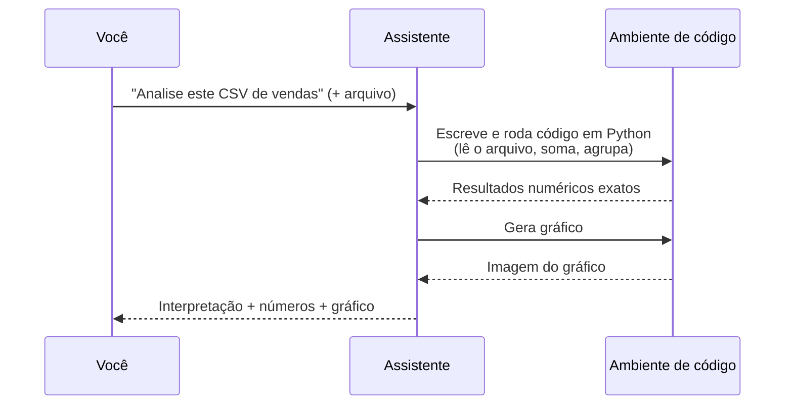
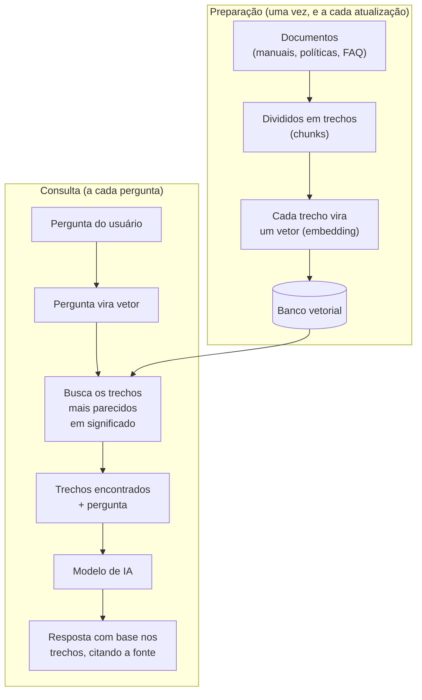
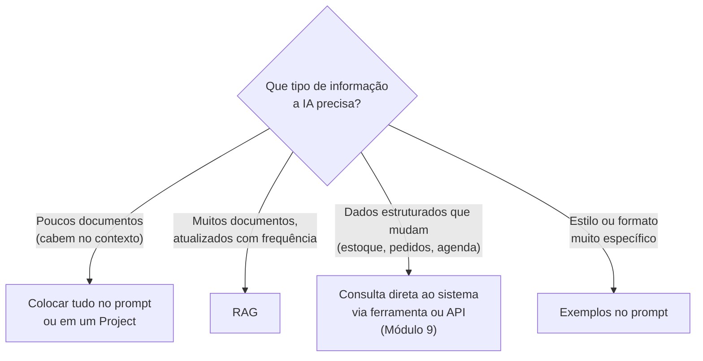
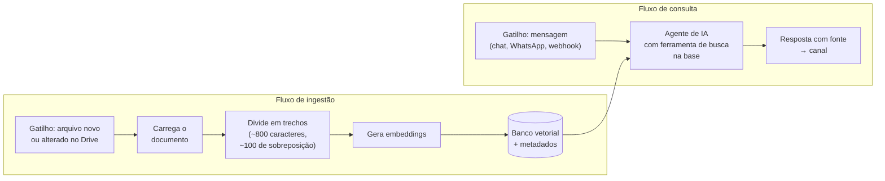
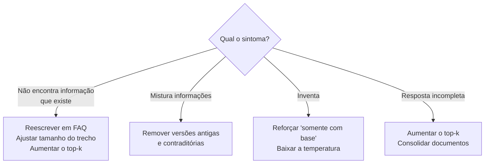

# Módulo 8: Dados e base de conhecimento (RAG)

**Semanas 18 e 19 · cerca de 18 horas**

## Objetivos de aprendizagem

Lembra do estagiário do Módulo 1, que "começou hoje na empresa"? Neste módulo você dá a ele **acesso aos arquivos da empresa**: manuais, políticas, tabelas, procedimentos. É isso que transforma um assistente genérico em alguém que sabe responder "qual o nosso prazo de troca?" com a política real, citando a fonte.

Ao final deste módulo você será capaz de:

1. Usar IA para analisar planilhas e dados com confiabilidade.
2. Explicar como o RAG funciona: documentos, divisão em trechos, embeddings, busca e geração.
3. Decidir quando usar RAG, quando colocar tudo no prompt e quando consultar um sistema.
4. Preparar documentos da empresa para uma base de conhecimento de qualidade.
5. Construir uma base de conhecimento com ferramenta pronta e com n8n.
6. Avaliar a qualidade da base com um conjunto de perguntas de teste.

---

## Aula 8.1: IA para análise de dados

### O que a IA faz bem com dados

| Tarefa | Exemplo |
|---|---|
| **Explicar** planilhas, fórmulas e relatórios | "O que esta fórmula faz?" |
| **Escrever fórmulas** e tabelas dinâmicas | PROCV/XLOOKUP, SOMASES, filtros |
| **Analisar arquivos com execução de código** | O assistente escreve e roda um programa em Python sobre o seu CSV; os números são calculados, não "chutados" |
| **Interpretar** resultados e sugerir hipóteses | "Por que as vendas caíram em março?" |
| **Limpar dados** | Padronizar nomes, datas e telefones; remover duplicados |
| **Criar gráficos** | Gráficos a partir de um arquivo |

### Como funciona a análise com execução de código



*Figura: com execução de código, a conta é feita por um programa, não pelo modelo "de cabeça". Por isso é confiável, e por isso você deve conferir se o código de fato rodou.*

### Regras de confiabilidade

1. **Prefira assistentes que executam código** para cálculos, e confira se o código de fato rodou (normalmente aparece um bloco de código ou uma indicação de "análise").
2. **Valide 2 ou 3 números à mão** (um total, uma contagem, uma média).
3. **Peça as premissas:** "Quais suposições você fez sobre os dados? Houve linhas descartadas?"
4. **Anonimize dados pessoais** antes de enviar (semáforo do Módulo 10, Parte B).

### Prompt modelo: análise de vendas

```
Você é um analista de dados de varejo. Anexei as vendas de janeiro a junho (CSV).
1. Descreva a estrutura dos dados e aponte problemas de qualidade
   (linhas vazias, datas inválidas, duplicados).
2. Calcule: faturamento por mês, ticket médio, os 10 produtos mais vendidos e a curva ABC.
3. Identifique sazonalidade e valores fora do padrão.
4. Gere 2 gráficos úteis para o dono.
5. Liste 5 conclusões acionáveis, cada uma com a evidência numérica.
Use execução de código para todos os cálculos.
```

**Curva ABC**, caso você não conheça: classifica os produtos pela participação no faturamento. Os produtos A (cerca de 20% dos itens) respondem por cerca de 80% do faturamento; os B e C pelo restante. É uma das análises mais úteis para PMEs, porque mostra onde focar estoque e esforço de venda.

> 📌 **Em resumo**
> - A IA explica, calcula (com código), interpreta e limpa dados.
> - Cálculos só com execução de código; valide alguns números à mão.
> - Peça as premissas e anonimize os dados pessoais.

**Para ir além**
- [Primeiros passos com pandas](https://pandas.pydata.org/docs/getting_started/index.html) (em inglês): a biblioteca de Python que os assistentes usam para analisar planilhas.

---

## Aula 8.2: O que é RAG e por que ele importa

**RAG** (*Retrieval-Augmented Generation*, geração aumentada por recuperação) é a técnica que permite à IA responder **com base nos documentos da empresa**, sem que eles precisem caber inteiros no prompt e sem retreinar o modelo.

### A analogia da biblioteca

Imagine um atendente que, a cada pergunta, **vai até o arquivo, pega as 5 páginas mais relevantes, lê e responde com base nelas**. Ele não decorou os 3.000 documentos da empresa; ele sabe **encontrar** o que precisa. Isso é RAG.

### Como funciona



*Figura: as duas fases do RAG. A preparação transforma documentos em vetores; a consulta encontra os trechos certos e os entrega ao modelo junto com a pergunta.*

### Os conceitos

| Conceito | O que é | Analogia |
|---|---|---|
| **Embedding** | Representação numérica do **significado** de um texto | As "coordenadas" de uma ideia em um mapa de significados |
| **Banco vetorial** | Banco especializado em encontrar vetores próximos | O índice da biblioteca, organizado por assunto, não por título |
| **Chunking** | A divisão dos documentos em trechos (tipicamente de 300 a 1.000 tokens, com alguma sobreposição) | Separar o manual em fichas |
| **Top-k** | Quantos trechos recuperar por pergunta (tipicamente de 3 a 8) | Quantas fichas o atendente pega do arquivo |

### Por que embeddings são poderosos

A busca por embeddings encontra **significado**, não palavras iguais:

| Pergunta do cliente | Trecho encontrado | Palavras em comum |
|---|---|---|
| "Quanto tempo demora pra chegar?" | "O prazo de entrega é de 3 a 5 dias úteis." | Nenhuma |
| "Comprei e não gostei, e agora?" | "Trocas de produtos sem defeito em até 30 dias." | Nenhuma |
| "Aceita cartão?" | "Formas de pagamento: Pix, débito e crédito em até 3x." | Nenhuma |

Uma busca comum por palavras-chave não encontraria nenhum desses trechos. A busca semântica encontra todos.

### Quando usar cada abordagem



*Figura: a decisão mais importante do módulo. RAG é uma das opções, não a resposta para tudo.*

| Situação | Solução | Por quê |
|---|---|---|
| Poucos documentos (ex.: FAQ de 20 páginas) | **Tudo no prompt ou em um Project** | Mais simples e muitas vezes mais preciso: o modelo vê tudo |
| Muitos documentos, atualizados com frequência | **RAG** | Não cabe no contexto; a busca encontra o relevante |
| Dados estruturados que mudam (estoque, pedidos, preços) | **Consulta direta ao sistema** | Precisa estar exato e atualizado no momento da pergunta |
| Estilo ou formato muito específico | **Exemplos no prompt** | Few-shot resolve (Módulo 2) |

> 💡 **Erro comum:** construir RAG para 10 páginas de documentos. **Comece sempre pelo mais simples.** Se tudo cabe em um Project, use o Project.

> 📌 **Em resumo**
> - RAG busca os trechos relevantes e os entrega ao modelo junto com a pergunta.
> - Embeddings encontram significado, não palavras iguais.
> - Poucos documentos: tudo no prompt. Muitos documentos: RAG. Dados que mudam: consulta ao sistema.

**Para ir além**
- Vídeo [What is Retrieval-Augmented Generation (RAG)?](https://www.youtube.com/watch?v=T-D1OfcDW1M) (IBM Technology, 6 minutos, em inglês com legendas).
- [Embeddings na documentação da Anthropic](https://platform.claude.com/docs/en/build-with-claude/embeddings) (em inglês).

---

## Aula 8.3: Preparação de documentos (80% da qualidade)

"Lixo entra, lixo sai." A qualidade de uma base de conhecimento depende muito mais **dos documentos** do que da tecnologia. A maior parte do seu trabalho em um projeto de RAG é aqui.

### Os problemas mais comuns

| Problema | Consequência | Exemplo |
|---|---|---|
| Versões antigas junto com as novas | A IA mistura informações | Três tabelas de preço de anos diferentes |
| Documentos contraditórios | Respostas inconsistentes | O manual diz 7 dias; o site diz 30 dias |
| PDF escaneado sem texto | A IA não consegue ler | Contrato digitalizado como imagem |
| Referências soltas | Trechos sem sentido isolado | "Conforme o item anterior..." |
| Tabelas complexas | Dados embaralhados na divisão em trechos | Tabela com células mescladas |
| Informação só "na cabeça" das pessoas | Não há o que buscar | Política de troca nunca escrita |

### O checklist de preparação

- [ ] **Inventário:** liste todos os documentos (manuais, políticas, FAQ, tabelas, contratos-modelo, procedimentos).
- [ ] **Atualidade:** remova versões antigas e contraditórias. Uma fonte única por assunto.
- [ ] **Formato:** prefira texto (Markdown, Google Docs, PDF com texto selecionável). PDFs escaneados precisam de OCR (reconhecimento de texto).
- [ ] **Estrutura:** títulos e subtítulos claros; uma ideia por seção.
- [ ] **Autossuficiência:** cada seção faz sentido sozinha. Em vez de "conforme o item anterior", escreva a regra completa.
- [ ] **Tabelas:** converta tabelas complexas em linhas descritivas ou mantenha-as simples, em Markdown.
- [ ] **Metadados:** para cada documento, registre título, área, data de atualização e responsável.
- [ ] **Sensibilidade:** retire dados pessoais e informações que nem todos podem ver.

### Técnica: FAQ reescrito

A técnica que mais melhora a qualidade: converter manuais longos em **perguntas e respostas autossuficientes**.

**Antes (trecho de manual):**
> 4.2. Nos casos previstos no item 4.1, o prazo será contado a partir do recebimento, observadas as exceções da seção 7.

**Depois (FAQ):**
> **Qual o prazo para trocar um produto sem defeito?**
> O cliente pode trocar produtos sem defeito em até 30 dias corridos a partir da data em que recebeu o produto. Produtos em promoção e peças íntimas não podem ser trocados, exceto em caso de defeito.

A IA ajuda: *"Transforme este manual em 40 perguntas e respostas autossuficientes, na linguagem que um cliente ou um funcionário novo usaria. Cada resposta deve fazer sentido sozinha, sem referências a outros itens."* **Revise com o responsável pelo documento.**

### Metadados: o inventário

| Documento | Área | Atualizado em | Responsável | Público | Classificação |
|---|---|---|---|---|---|
| Política de trocas | Atendimento | 10/02 | Gerente | Clientes e equipe | 🟢 Público |
| Manual do caixa | Operações | 03/01 | Supervisora | Equipe | 🟡 Interno |
| Tabela de preços | Comercial | 01/03 | Dono | Clientes e equipe | 🟢 Público |

A coluna "Público" define **quem pode receber aquela informação**: uma base para clientes não deve conter documentos internos.

> 📌 **Em resumo**
> - A qualidade da base depende mais dos documentos que da tecnologia.
> - Fonte única, texto legível, seções autossuficientes e metadados.
> - Reescrever manuais como FAQ é a técnica que mais melhora os resultados.

---

## Aula 8.4: Construindo a base de conhecimento

### Opção 1: ferramentas prontas (comece aqui)

| Ferramenta | Melhor para | Limite |
|---|---|---|
| **Projects** (Claude) | Assistente interno da equipe, com documentos e instruções | Uso dentro do Claude |
| **GPTs** (ChatGPT) | O mesmo, no ecossistema ChatGPT | Uso dentro do ChatGPT |
| **Gems** (Gemini) | O mesmo, no ecossistema Google | Uso dentro do Gemini |
| **[NotebookLM](https://notebooklm.google.com/)** (Google) | Estudar e consultar documentos com citações | Não é um canal de atendimento |

**Vantagem:** rápido, sem código. **Limite:** menos controle e integração limitada com outros canais (WhatsApp, site).

### Opção 2: RAG com n8n (para integrar a canais e sistemas)



*Figura: os dois fluxos no n8n. O de ingestão mantém a base atualizada sozinho; o de consulta responde às perguntas em qualquer canal.*

**Fluxo de ingestão (passo a passo):**
1. **Gatilho:** arquivo novo ou atualizado em uma pasta do Google Drive.
2. **Carregar** o documento (nó "Default Data Loader").
3. **Dividir em trechos** (nó "Text Splitter", por exemplo "Recursive Character", com tamanho de cerca de 800 caracteres e sobreposição de cerca de 100).
4. **Gerar embeddings** (nó de embeddings do provedor escolhido).
5. **Gravar no banco vetorial** (por exemplo, Supabase Vector Store), com metadados: nome do arquivo, data e área.

**Fluxo de consulta (passo a passo):**
1. **Gatilho:** mensagem (chat do n8n para testes, WhatsApp ou webhook).
2. Nó **AI Agent**, com uma ferramenta de busca no banco vetorial ("Vector Store Tool").
3. **Prompt de sistema** com as instruções abaixo.
4. **Resposta** → canal.

### Instruções essenciais para o assistente com RAG

```
- Use SOMENTE as informações recuperadas da base de conhecimento.
- Ao final de cada resposta, indique: "Fonte: [nome do documento], atualizado em [data]".
- Se as informações recuperadas forem insuficientes ou contraditórias, diga isso
  e sugira quem procurar: [responsável por área].
- Não complete lacunas com conhecimento geral quando o assunto for política interna.
```

### Uma técnica avançada: recuperação contextual

Um problema do RAG é que um trecho isolado pode perder o contexto ("O prazo é de 30 dias" — prazo de quê?). A **recuperação contextual** acrescenta a cada trecho, antes de gerar o embedding, uma frase que o situa no documento ("Este trecho é da Política de Trocas, seção de produtos sem defeito"). A Anthropic publicou resultados mostrando redução significativa de falhas de recuperação com essa técnica. Use-a quando a base for grande e as respostas estiverem falhando por falta de contexto.

> 📌 **Em resumo**
> - Comece com ferramentas prontas (Projects, GPTs, Gems, NotebookLM).
> - Use n8n quando precisar integrar a base a canais e sistemas.
> - Instrua o assistente a usar só a base, citar a fonte e admitir quando não sabe.

**Para ir além**
- [Recuperação contextual, pela Anthropic](https://www.anthropic.com/engineering/contextual-retrieval) (em inglês).
- [Guia de IA do n8n](https://docs.n8n.io/build/integrate-ai) e [nó AI Agent](https://docs.n8n.io/integrations/builtin/cluster-nodes/root-nodes/n8n-nodes-langchain.agent) (em inglês).
- [Supabase para IA e vetores](https://supabase.com/docs/guides/ai) (em inglês): um banco vetorial com plano gratuito.

---

## Aula 8.5: Avaliando a qualidade do RAG

### O conjunto de 30 perguntas

Crie **30 perguntas com a resposta correta conhecida**:

| Quantidade | Tipo | Exemplo | O que testa |
|---|---|---|---|
| 15 | Perguntas diretas | "Qual o prazo de troca?" | Recuperação básica |
| 5 | Com outras palavras | "Comprei e não gostei, e agora?" | Busca semântica |
| 5 | Que exigem combinar 2 documentos | "Posso trocar um produto da promoção comprado com cupom?" | Recuperação de vários trechos |
| 5 | **Sem resposta na base** | "Vocês vendem vale-presente?" (quando não vendem nem há informação) | Recusa correta (não inventar) |

### As métricas

| Métrica | Pergunta | Meta |
|---|---|---|
| **Precisão** | A resposta está correta? | 90% ou mais |
| **Fidelidade** | A resposta usa só o que está nos documentos (sem invenção)? | 100% |
| **Recuperação** | O trecho certo foi encontrado? | 90% ou mais |
| **Recusa correta** | Nas perguntas sem resposta, disse que não sabe? | 100% |

### Se falhar, onde mexer



*Figura: o diagnóstico de problemas. Note que a maioria das soluções está nos documentos, não na tecnologia.*

| Sintoma | Causa provável | Ajuste |
|---|---|---|
| Não encontra a informação que existe | Trecho ruim; vocabulário diferente da pergunta | Reescrever em FAQ; ajustar o tamanho do trecho; aumentar o top-k |
| Mistura informações | Documentos contraditórios ou desatualizados | Limpar versões antigas |
| Inventa | Instrução fraca | Reforçar "somente com base"; baixar a temperatura |
| Resposta incompleta | Top-k baixo; informação espalhada | Aumentar o top-k; consolidar documentos |

> 📌 **Em resumo**
> - 30 perguntas: diretas, com outras palavras, combinadas e sem resposta.
> - Fidelidade e recusa correta: meta de 100%.
> - A maioria das correções está nos documentos.

---

## Exercícios

### Exercício 1: Análise de planilha (60 min)

Use um CSV de vendas (real e anonimizado, ou gere um fictício com 500 linhas pedindo a um assistente). Aplique o prompt da Aula 8.1 e valide 3 números à mão. Registre: o assistente usou execução de código? Os números bateram?

### Exercício 2: Preparação de documentos (60 min)

Pegue 3 documentos da empresa-laboratório e aplique o checklist da Aula 8.3. Converta um deles em FAQ com a ajuda da IA e revise com o responsável.

### Exercício 3: Base em ferramenta pronta (45 min)

Monte uma base em um Project, GPT, Gem ou NotebookLM com os documentos preparados. Teste 10 perguntas, incluindo 2 sem resposta na base.

### Exercício 4: RAG no n8n (2 a 3 h)

Construa os fluxos de ingestão e de consulta da Aula 8.4, usando um banco vetorial com plano gratuito (por exemplo, o Supabase). Teste pelo chat do próprio n8n.

### Exercício 5: Avaliação comparativa (60 min)

Aplique as 30 perguntas nas duas versões (pronta e n8n) e compare as 4 métricas. Qual foi melhor? Por quê?

---

## Tarefa de campo

Construa o **"cérebro da empresa"** para a empresa-laboratório: uma base com manuais, políticas e FAQ que a equipe consulta (ou que alimenta o agente do Módulo 6). Treine 2 funcionários e colete o feedback depois de 1 semana: "Quantas vezes usou? Encontrou o que precisava? O que faltou?"

---

## Entregável

- Base de conhecimento funcionando.
- Inventário de documentos com metadados.
- Planilha de avaliação com as 30 perguntas e as métricas (antes e depois dos ajustes).
- Ficha de automação dos fluxos de ingestão e consulta ([modelo](templates/ficha-de-automacao.md)).

---

## Autoavaliação

Meta: pelo menos 8 de 10.

1. O que é RAG, em uma frase?
2. O que é um embedding e por que ele encontra "significado"?
3. Quando **não** usar RAG?
4. Por que a preparação dos documentos importa mais que a tecnologia?
5. O que é a técnica do "FAQ reescrito"?
6. Quais os 4 tipos de perguntas no conjunto de teste?
7. O RAG está misturando preços antigos e novos. Qual a causa e a solução?
8. Por que dados de estoque não devem ir para o RAG?
9. Qual a regra de confiabilidade mais importante para cálculos com IA?
10. O que é a recuperação contextual?

<details>
<summary><strong>Gabarito</strong></summary>

1. Técnica que busca os trechos relevantes dos documentos da empresa e os entrega ao modelo para que ele responda com base neles.
2. Uma representação numérica do significado de um texto. Textos com sentido parecido ficam próximos, mesmo com palavras diferentes.
3. Quando os documentos cabem no contexto (é mais simples colocar tudo no prompt) e para dados estruturados que mudam (use consulta direta ao sistema).
4. Porque documentos desatualizados, contraditórios ou mal estruturados geram respostas erradas, qualquer que seja a tecnologia.
5. Converter manuais longos em perguntas e respostas autossuficientes, na linguagem de quem pergunta.
6. Diretas; com outras palavras; que combinam 2 documentos; e sem resposta na base.
7. Há documentos desatualizados ou contraditórios na base. Solução: remover as versões antigas e manter uma fonte única com data.
8. Porque mudam constantemente e exigem exatidão no momento da pergunta. O correto é consultar o sistema em tempo real por ferramenta ou API.
9. Usar execução de código (ou fórmulas) para os cálculos e validar alguns números à mão.
10. Acrescentar a cada trecho, antes de gerar o embedding, uma frase que o situa no documento, para que ele não perca o contexto quando for recuperado isoladamente.
</details>

---

## Para aprofundar (opcional)

| Material | Por que vale |
|---|---|
| [What is RAG? (IBM Technology)](https://www.youtube.com/watch?v=T-D1OfcDW1M) | Explicação visual em 6 minutos |
| [Recuperação contextual (Anthropic)](https://www.anthropic.com/engineering/contextual-retrieval) | Técnica avançada com resultados medidos |
| [Embeddings (Anthropic)](https://platform.claude.com/docs/en/build-with-claude/embeddings) | Conceitos e provedores |
| [Guia de IA do n8n](https://docs.n8n.io/build/integrate-ai) | Construir RAG sem programar |
| [Supabase para IA](https://supabase.com/docs/guides/ai) | Banco vetorial com plano gratuito |
| [NotebookLM](https://notebooklm.google.com/) | Consulta a documentos com citações |
