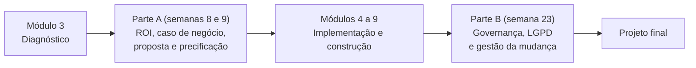
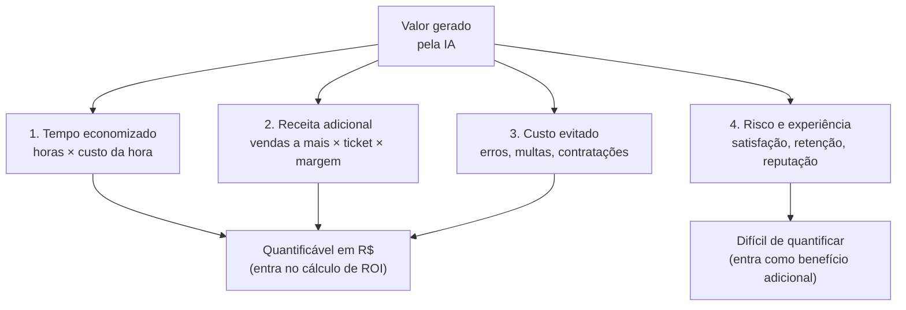
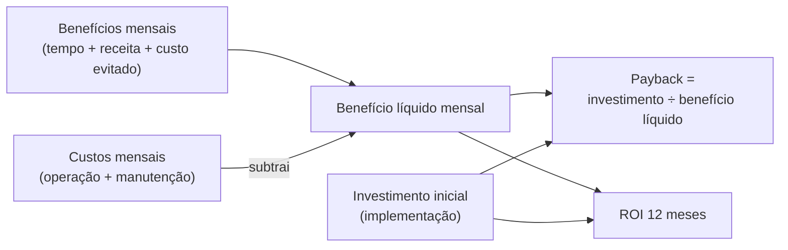
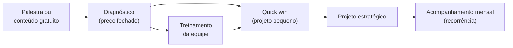
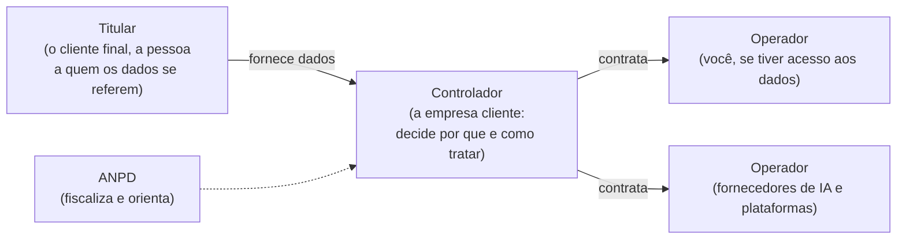
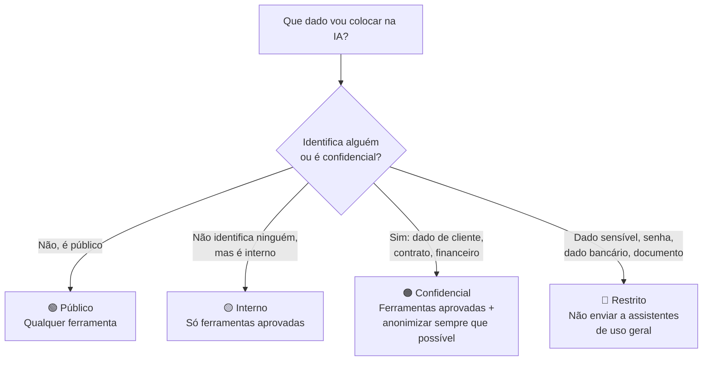
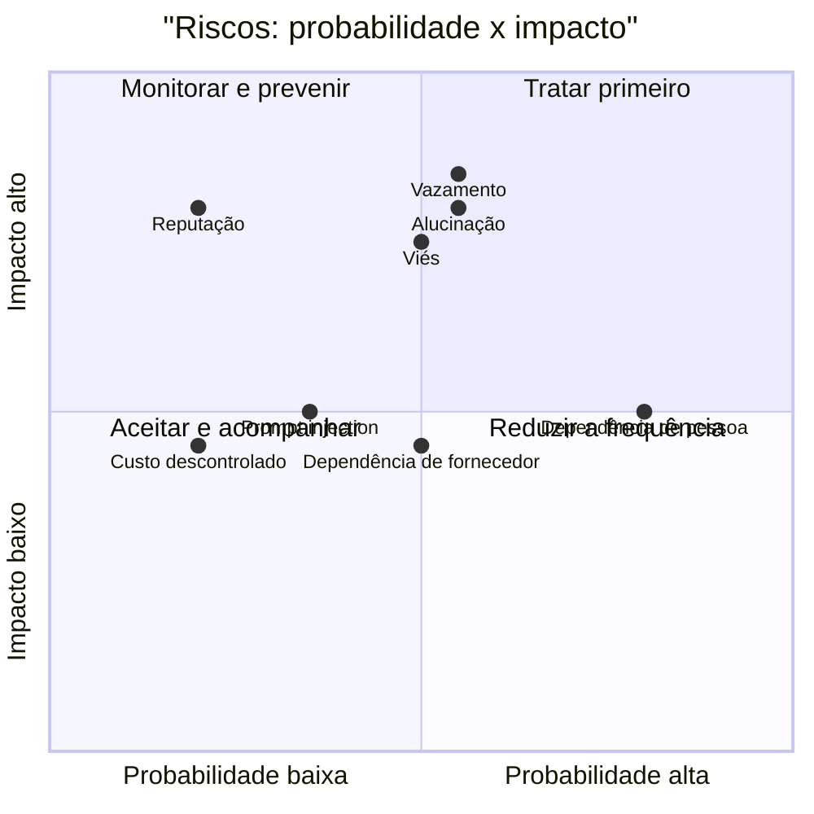
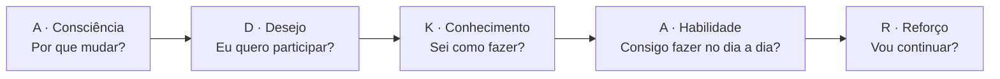

# Módulo 10: ROI, governança, LGPD e gestão da mudança

**Parte A (semanas 8 e 9): ROI e caso de negócio · Parte B (semana 23): governança, LGPD e gestão da mudança**

Este módulo tem duas partes, estudadas em momentos diferentes da formação:



*Figura: a Parte A transforma o diagnóstico em uma proposta com números; a Parte B garante que as soluções construídas sejam seguras, legais e usadas de verdade.*

---

# PARTE A: ROI e caso de negócio

## Objetivos de aprendizagem

Um diagnóstico sem números é uma opinião. Esta parte ensina a transformar oportunidades em **dinheiro**: quanto a empresa ganha, quanto investe e em quanto tempo recupera o investimento. É isso que faz um empresário dizer "sim".

Ao final da Parte A você será capaz de:

1. Calcular o retorno de iniciativas de IA com premissas explícitas e conservadoras.
2. Estimar o custo total (implementação + operação + manutenção).
3. Construir um caso de negócio de 1 página e uma proposta comercial.
4. Precificar seus serviços de consultoria e implementação.

---

## Aula A.1: As 4 fontes de valor

Toda iniciativa de IA gera valor por pelo menos um destes caminhos. Seu trabalho é **quantificar** cada um.



*Figura: as três primeiras fontes entram no cálculo; a quarta aparece na proposta como benefício qualitativo, sem inflar os números.*

| Fonte | Como calcular | Exemplo |
|---|---|---|
| **1. Tempo economizado** | Horas economizadas por mês × custo da hora | 80h × R$ 35 = R$ 2.800/mês |
| **2. Receita adicional** | Vendas a mais × ticket médio × margem | 3 vendas/semana × 4,3 semanas × R$ 400 × 40% = R$ 2.064/mês |
| **3. Custo evitado** | Erros, multas, retrabalho, contratações evitadas | Não contratar 1 atendente: R$ 3.500/mês |
| **4. Risco e experiência** | Mais difícil de medir: satisfação, retenção, reputação | Queda de reclamações; nota no Google sobe |

### O custo da hora

O erro mais comum é usar o salário como custo da hora. O custo real inclui encargos e benefícios:

```
Custo da hora = (salário + encargos e benefícios) / horas trabalhadas no mês
```

**Regra prática para CLT:** encargos e benefícios somam de 60% a 100% do salário, conforme o regime tributário da empresa (Simples Nacional costuma ficar na faixa mais baixa). Confirme com o contador do cliente quando possível.

**Exemplo:**
- Salário: R$ 2.500
- Fator de encargos: 1,8 (80% sobre o salário)
- Custo mensal: R$ 2.500 × 1,8 = R$ 4.500
- Horas por mês: 176 (44 horas semanais × 4 semanas)
- **Custo da hora: R$ 4.500 ÷ 176 ≈ R$ 25,57**

### Receita adicional: cuidado com a margem

Quando a IA ajuda a vender mais, o ganho da empresa **não é o valor da venda**, e sim a **margem** (o que sobra depois dos custos do produto). Uma venda de R$ 400 com margem de 40% gera R$ 160 de ganho, não R$ 400. Usar o faturamento em vez da margem infla o retorno e destrói sua credibilidade quando o dono faz as contas.

### Tempo economizado não é dinheiro economizado

> ⚠️ **Honestidade que gera confiança:** tempo economizado só vira dinheiro se for **realocado** para algo produtivo (vender mais, atender melhor, crescer sem contratar) ou se **evitar um custo** (uma contratação, horas extras). Se a atendente economiza 2 horas por dia e passa esse tempo ociosa, a empresa não ganhou dinheiro.

Na proposta, diga para onde o tempo vai: "as 70 horas liberadas por mês permitem que a Júlia assuma o pós-venda, hoje inexistente". Isso transforma horas em valor concreto.

> 📌 **Em resumo**
> - Valor vem de tempo, receita, custo evitado e experiência.
> - Custo da hora inclui encargos (fator de 1,6 a 2,0 sobre o salário, na CLT).
> - Receita adicional se calcula pela margem, não pelo faturamento.
> - Tempo economizado precisa ser realocado para virar dinheiro.

---

## Aula A.2: Custo total da solução

### Os 4 tipos de custo

| Tipo | Itens | Quando ocorre |
|---|---|---|
| **Implementação** | Seu serviço (diagnóstico, construção, testes), configuração, treinamento | Uma vez, no início |
| **Operação** | Licenças (assistentes, plataformas), uso de API, mensagens de WhatsApp, hospedagem | Todo mês |
| **Manutenção** | Ajustes de prompt e base de conhecimento, monitoramento, suporte, atualizações | Todo mês |
| **Custos internos** | Tempo da equipe do cliente em reuniões, testes e treinamento | Principalmente no início |

Os custos internos são frequentemente esquecidos. Mencione-os na proposta: "serão necessárias cerca de 6 horas da equipe nas primeiras 3 semanas". Isso evita a sensação de que o projeto "atrapalhou a operação".

### As fórmulas

```
Benefício líquido mensal = Benefícios mensais − Custos mensais (operação + manutenção)

Payback (meses) = Investimento inicial ÷ Benefício líquido mensal

ROI em 12 meses (%) = (Benefício líquido em 12 meses − Investimento inicial) ÷ Investimento inicial × 100
```



*Figura: como os números se combinam. O investimento inicial só entra no payback e no ROI; os custos mensais saem do benefício todo mês.*

### Exemplo completo: atendimento com IA em uma loja

| Item | Cálculo | Valor |
|---|---|---|
| Horas economizadas | 70h/mês × R$ 25,57 | R$ 1.790 |
| Receita adicional (respostas à noite e nos fins de semana) | 6 vendas/mês × R$ 300 × 45% de margem | R$ 810 |
| **Benefício mensal** | | **R$ 2.600** |
| Plataforma + API + mensagens | | R$ 450/mês |
| Manutenção (seu serviço) | | R$ 600/mês |
| **Benefício líquido mensal** | R$ 2.600 − R$ 1.050 | **R$ 1.550** |
| Investimento inicial (implementação) | | R$ 5.000 |
| **Payback** | R$ 5.000 ÷ R$ 1.550 | **cerca de 3,2 meses** |
| **ROI em 12 meses** | (R$ 1.550 × 12 − R$ 5.000) ÷ R$ 5.000 | **272%** |

### Os 3 cenários (sempre apresente)

Nenhuma estimativa é exata. Apresente três cenários, aplicando um percentual sobre os benefícios:

| Cenário | Benefício considerado | Benefício mensal | Líquido mensal | Payback |
|---|---|---|---|---|
| **Conservador** | 50% | R$ 1.300 | R$ 250 | 20 meses |
| **Provável** | 75% | R$ 1.950 | R$ 900 | 5,6 meses |
| **Otimista** | 100% | R$ 2.600 | R$ 1.550 | 3,2 meses |

**Decida pelo conservador.** Neste exemplo, o cenário conservador tem payback de 20 meses, o que é longo. Isso é um sinal para **reduzir custos** (por exemplo, uma manutenção mais barata) ou **escolher outra oportunidade**. Um consultor que mostra isso ao cliente ganha uma confiança que nenhuma apresentação bonita compra.

Use a [calculadora de ROI](templates/calculadora-roi.md) desta formação para montar a planilha.

> 📌 **Em resumo**
> - Custos: implementação, operação, manutenção e custos internos.
> - Payback = investimento ÷ benefício líquido mensal.
> - Apresente 3 cenários e decida pelo conservador.

---

## Aula A.3: O caso de negócio (1 página)

O caso de negócio resume **por que** vale a pena fazer o projeto. É o documento que o dono lê para decidir, e muitas vezes o que ele mostra ao sócio ou ao contador.

### Estrutura

```
PROBLEMA: dor em números
  Ex.: "40% dos orçamentos ficam sem follow-up; cerca de R$ 18 mil/mês em propostas perdidas."

SOLUÇÃO: o que será feito, em linguagem de negócio
  Ex.: "Mensagens automáticas e personalizadas de acompanhamento 48h após o envio do orçamento."

BENEFÍCIOS: 3 cenários, com as premissas
INVESTIMENTO: inicial + mensal
PAYBACK E ROI: no cenário conservador
RISCOS E MITIGAÇÃO: os 2 ou 3 principais
INDICADORES DE SUCESSO: como vamos medir; meta em 90 dias
PRÓXIMO PASSO: decisão pedida + data
```

### Exemplo preenchido

> **PROBLEMA.** A Serralheria Aço Forte envia cerca de 60 orçamentos por mês. 40% (24 orçamentos) ficam sem nenhum acompanhamento. Com ticket médio de R$ 3.000 e margem de 35%, cada orçamento recuperado vale R$ 1.050.
>
> **SOLUÇÃO.** Uma automação envia, 48 horas após o orçamento, uma mensagem personalizada no WhatsApp perguntando se ficou alguma dúvida. Se o cliente não responder em mais 3 dias, envia um segundo contato. As respostas chegam para a atendente.
>
> **BENEFÍCIOS.** Premissa: recuperar 3 dos 24 orçamentos esquecidos por mês (12,5%).
> Conservador (50%): 1,5 × R$ 1.050 = R$ 1.575/mês. Provável (75%): R$ 2.363/mês. Otimista: R$ 3.150/mês.
>
> **INVESTIMENTO.** Implementação: R$ 2.500. Operação: R$ 150/mês. Manutenção: R$ 200/mês.
>
> **PAYBACK (conservador).** R$ 2.500 ÷ (R$ 1.575 − R$ 350) = cerca de 2 meses.
>
> **RISCOS.** Mensagens percebidas como insistentes → limite de 2 contatos e tom consultivo. Número bloqueado pelo WhatsApp → uso da API oficial e templates aprovados.
>
> **INDICADORES.** Taxa de resposta aos orçamentos: de 60% para 75% em 90 dias.
>
> **PRÓXIMO PASSO.** Aprovar até sexta, 14/03, para iniciarmos na segunda.

> 📌 **Em resumo**
> - O caso de negócio cabe em 1 página e termina com uma decisão pedida.
> - Premissas sempre explícitas: o dono precisa ver de onde vêm os números.

---

## Aula A.4: Precificação dos seus serviços

### Modelos de cobrança

| Modelo | Quando usar | Vantagens | Cuidados |
|---|---|---|---|
| **Diagnóstico (preço fechado)** | Porta de entrada | Baixo risco para o cliente; gera confiança | Pode ser abatido do projeto se o cliente contratar |
| **Projeto (preço fechado)** | Implementação com escopo claro | Previsível para os dois lados | Defina muito bem o escopo e o que está fora |
| **Recorrência mensal** | Manutenção, melhoria contínua, suporte | Estabilidade para o seu negócio | Deixe claro o que está incluído por mês |
| **Hora de consultoria** | Mentorias, dúvidas pontuais | Simples | Difícil de escalar |
| **Treinamento e workshop** | Equipes e eventos | Ótimo gerador de clientes | Material precisa ser adaptado ao público |
| **Por resultado** | Só com medição inequívoca | Alinhamento total com o cliente | Arriscado; combine com um valor fixo |

### A esteira de serviços



*Figura: a esteira típica de um consultor de IA. Cada etapa gera confiança para a próxima, e a recorrência mensal é onde o negócio se estabiliza.*

### Como calcular o preço de um projeto

```
Preço mínimo (por custo) = horas estimadas × seu valor-hora × 1,3 (margem para imprevistos)
Preço por valor         = 10% a 30% do benefício líquido do 1º ano do cliente

Cobre o MAIOR dos dois, desde que o payback do cliente fique abaixo de cerca de 6 meses.
```

**Exemplo:** o follow-up automático da serralheria.
- Por custo: 16 horas × R$ 120/hora × 1,3 = R$ 2.496.
- Por valor: benefício líquido conservador do 1º ano = (R$ 1.575 − R$ 350) × 12 = R$ 14.700. Entre 10% e 30%: de R$ 1.470 a R$ 4.410.
- Preço sugerido: R$ 2.500 a R$ 3.000, com payback do cliente de cerca de 2 meses.

### Como definir seu valor-hora no início

- Some seus custos mensais (pessoais e do negócio) e o quanto quer ganhar.
- Divida pelas horas **faturáveis** por mês (normalmente 50% a 60% do tempo; o resto vai para vendas, estudo e administração).
- Compare com o mercado: pesquise consultores e agências de automação e IA na sua região.
- **No início, cobre menos em troca de depoimentos e autorização para usar os resultados.** Os primeiros 3 casos valem mais que o dinheiro.

### Pacotes (exemplo de estrutura)

| Pacote | Escopo | Prazo |
|---|---|---|
| **Diagnóstico IA** | Entrevistas, mapeamento, relatório, roadmap e apresentação | 2 semanas |
| **Quick win** | 1 automação ou assistente, com treinamento | 2 a 4 semanas |
| **Projeto estratégico** | Agente ou atendimento completo | 4 a 8 semanas |
| **Acompanhamento mensal** | Monitoramento, melhorias, novos prompts, suporte | Contínuo |
| **Treinamento de equipe** | 4h a 8h, com a biblioteca de prompts da empresa | 1 a 2 dias |

Os valores dependem da sua região, experiência e público. Defina os seus no Exercício A4.

> 📌 **Em resumo**
> - Diagnóstico como porta de entrada; recorrência como base do negócio.
> - Preço = o maior entre custo e valor, com payback do cliente abaixo de 6 meses.
> - No início, troque desconto por depoimentos e casos.

**Para ir além**
- [Modelo de proposta comercial](templates/proposta-comercial.md) desta formação.

---

## Exercícios (Parte A)

### Exercício A1: Custo da hora (45 min)

Calcule o custo da hora de 3 cargos da empresa-laboratório (por exemplo, atendente, vendedor e o próprio dono). Pergunte os salários (ou use faixas de mercado) e confirme o regime tributário. Registre as premissas.

### Exercício A2: ROI em 3 cenários (90 min)

Calcule o ROI das 3 principais oportunidades do seu diagnóstico (Módulo 3), nos 3 cenários, usando a [calculadora de ROI](templates/calculadora-roi.md). Para cada uma, responda: ela se paga no cenário conservador em menos de 6 meses?

### Exercício A3: Caso de negócio (60 min)

Escreva o caso de negócio de 1 página da oportunidade nº 1, seguindo a estrutura da Aula A.3. Peça a alguém que não conhece o projeto para ler e responder: "Você aprovaria? O que te deixou em dúvida?"

### Exercício A4: Seus pacotes (60 min)

Defina seus 5 pacotes de serviço, com escopo, prazo e preço inicial. Pesquise pelo menos 3 concorrentes (consultores e agências de automação e IA) para calibrar os valores. Registre sua tabela e revise-a a cada 3 projetos.

## Entregável (Parte A)

- **Calculadora de ROI** preenchida com as 3 oportunidades.
- **Proposta comercial** completa ([modelo](templates/proposta-comercial.md)) para a empresa-laboratório.
- **Tabela de pacotes** dos seus serviços.

---

# PARTE B: Governança, LGPD e gestão da mudança

## Objetivos de aprendizagem

Até aqui você aprendeu a encontrar oportunidades e a construir soluções. Esta parte garante que elas sejam **seguras, legais e usadas de verdade**. Muitos projetos de IA não fracassam pela tecnologia: fracassam por vazamento de dados, por uma resposta desastrosa ou porque a equipe simplesmente não adotou.

Ao final da Parte B você será capaz de:

1. Aplicar a LGPD ao uso de IA (bases legais, dados sensíveis, direitos dos titulares).
2. Classificar dados e definir o que pode ser usado em cada ferramenta.
3. Redigir uma política de uso de IA para PMEs.
4. Identificar e mitigar os riscos de IA (alucinação, vazamento, viés, dependência).
5. Conduzir a adoção pela equipe (gestão da mudança).

---

## Aula B.1: LGPD aplicada à IA

A **Lei Geral de Proteção de Dados** (Lei nº 13.709/2018) se aplica sempre que uma solução de IA trata **dados pessoais**: qualquer informação que identifique ou possa identificar uma pessoa, como nome, CPF, telefone, e-mail, endereço, foto, voz ou mesmo um conjunto de dados que permita chegar a alguém.

> ⚖️ Esta aula dá base prática para o seu trabalho. **Não substitui assessoria jurídica.** Em projetos com dados sensíveis ou grande volume de dados pessoais, recomende ao cliente validar com advogado ou com o encarregado de dados (DPO).

### Os papéis



*Figura: quem é quem na LGPD em um projeto de IA. O controlador responde pelas decisões; operadores tratam dados em nome dele e seguem suas instruções.*

### Os conceitos essenciais

| Conceito | Significado para projetos de IA |
|---|---|
| **Controlador** | A empresa cliente: decide por que e como tratar os dados |
| **Operador** | Quem trata os dados em nome do controlador: você (se tiver acesso) e os fornecedores de IA |
| **Bases legais** (art. 7º) | Todo tratamento precisa de uma: consentimento, execução de contrato, legítimo interesse, obrigação legal, entre outras. Ex.: responder o cliente que chamou no WhatsApp se apoia na execução de contrato ou em procedimentos preliminares a ele |
| **Dados sensíveis** (art. 5º, II, e art. 11) | Origem racial ou étnica, convicção religiosa, opinião política, filiação sindical, saúde, vida sexual, dados genéticos e biométricos. **Regras mais rígidas** e bases legais mais restritas |
| **Princípios** (art. 6º) | Finalidade, adequação, **necessidade (minimização)**, livre acesso, qualidade dos dados, transparência, segurança, prevenção, não discriminação, responsabilização |
| **Direitos dos titulares** (art. 18) | Confirmação, acesso, correção, eliminação, informação sobre compartilhamento, entre outros |
| **Decisões automatizadas** (art. 20) | O titular pode pedir revisão de decisões tomadas unicamente com base em tratamento automatizado que afetem seus interesses (ex.: crédito, perfil de consumo) |
| **Transferência internacional** (arts. 33 a 36) | Muitas ferramentas de IA processam dados fora do Brasil; isso exige atenção às hipóteses legais e aos termos do fornecedor |
| **ANPD** | Autoridade Nacional de Proteção de Dados: fiscaliza, orienta e aplica sanções |

### Os princípios que mais importam no dia a dia

- **Finalidade:** os dados só podem ser usados para o propósito informado. Dados coletados para entrega não devem alimentar, sem base legal, uma campanha de marketing.
- **Necessidade (minimização):** use o mínimo de dados necessário. Para classificar a intenção de uma mensagem, a IA não precisa do CPF do cliente.
- **Transparência:** o cliente deve saber que fala com uma IA e como seus dados são tratados.
- **Segurança:** proteja credenciais, limite acessos, escolha fornecedores com boas práticas.

### Checklist LGPD para cada projeto de IA

- [ ] Quais dados pessoais a solução trata? Todos são necessários (minimização)?
- [ ] Há dados sensíveis? Se sim, qual base legal e quais salvaguardas adicionais?
- [ ] Qual a base legal de cada finalidade?
- [ ] O fornecedor de IA usa os dados para treinar modelos? (prefira planos que não usam)
- [ ] Onde os dados são processados e armazenados? Os termos do fornecedor cobrem a proteção de dados?
- [ ] Por quanto tempo os dados (registros, conversas) ficam guardados?
- [ ] O titular é informado (aviso de privacidade, aviso de atendimento por IA)?
- [ ] Há forma de atender pedidos de acesso ou eliminação?
- [ ] Quem tem acesso aos registros e às conversas?
- [ ] Há decisão automatizada relevante? Existe revisão humana?

> 📌 **Em resumo**
> - A LGPD se aplica a qualquer IA que trate dados pessoais.
> - A empresa cliente é a controladora; você e os fornecedores são operadores.
> - Dados sensíveis (como saúde) exigem cuidado redobrado.
> - Minimização é o princípio mais útil: envie à IA só o necessário.

**Para ir além**
- [Texto integral da LGPD](https://www.planalto.gov.br/ccivil_03/_ato2015-2018/2018/lei/l13709.htm) (Planalto). Leia pelo menos os artigos 5º, 6º, 7º, 11, 18 e 20.
- [Site da ANPD](https://www.gov.br/anpd/pt-br): guias orientativos, perguntas frequentes e publicações sobre IA e proteção de dados.

---

## Aula B.2: Classificação de dados (o "semáforo")

A LGPD diz **o que** proteger; o semáforo diz **como** a equipe decide, no dia a dia, o que pode ir para cada ferramenta.



*Figura: a pergunta que todo funcionário deve fazer antes de colar algo em uma ferramenta de IA.*

| Classe | Exemplos | Onde pode ser usado |
|---|---|---|
| 🟢 **Público** | Site, catálogo, posts, preços públicos | Qualquer ferramenta |
| 🟡 **Interno** | Processos, manuais, metas, relatórios sem dados pessoais | Ferramentas **aprovadas**, em planos que não treinam com os dados |
| 🟠 **Confidencial** | Dados de clientes, contratos, financeiro detalhado, estratégia | Só ferramentas corporativas aprovadas, com controle de acesso; minimizar e anonimizar |
| 🔴 **Restrito** | Dados sensíveis (saúde etc.), senhas, dados bancários completos, documentos de identidade | **Não enviar** a assistentes de uso geral. Só em soluções específicas avaliadas, com base legal e salvaguardas |

### Técnicas de proteção

| Técnica | Como fazer | Exemplo |
|---|---|---|
| **Anonimizar ou pseudonimizar** | Trocar identificadores por códigos | "Maria Souza, CPF 123..." vira "Cliente A" |
| **Minimizar** | Enviar só o necessário | "O valor e a data", não a planilha inteira |
| **Agregar** | Enviar totais em vez de registros individuais | "120 vendas em março, ticket médio de R$ 85" |
| **Separar** | Manter os dados pessoais fora do prompt e reinseri-los depois | A IA escreve "Olá, {{nome}}"; o sistema preenche o nome |

A técnica de **separar** é especialmente útil em automações: a IA gera o texto com variáveis, e a automação (Módulo 5) insere os dados pessoais só no momento do envio.

> 📌 **Em resumo**
> - Quatro classes: público, interno, confidencial e restrito.
> - Dados restritos não vão para assistentes de uso geral.
> - Anonimizar, minimizar, agregar e separar reduzem o risco sem impedir o uso.

---

## Aula B.3: Política de uso de IA

Toda empresa que você atender deve sair com uma **política de uso de IA** de 2 a 4 páginas. Ela protege a empresa, orienta a equipe e demonstra cuidado com a LGPD.

Use o [modelo de política de uso de IA](templates/politica-de-uso-de-ia.md) desta formação. O conteúdo mínimo:

| Seção | O que define |
|---|---|
| 1. Objetivo e abrangência | Por que a política existe e a quem se aplica |
| 2. Ferramentas aprovadas | Quais podem ser usadas, em quais planos, e quais são proibidas |
| 3. Classificação de dados | O semáforo e o que pode ir para cada ferramenta |
| 4. Regras de uso | Revisão humana, checagem de fatos, transparência com clientes |
| 5. Usos proibidos | Decisões sobre pessoas só pela IA, imagem de pessoas sem autorização etc. |
| 6. Propriedade e confidencialidade | De quem são os prompts e conteúdos criados |
| 7. Responsáveis | Quem aprova ferramentas e tira dúvidas |
| 8. Incidentes | O que fazer se dados forem expostos |
| 9. Treinamento e revisão | Treinamento obrigatório e revisão periódica |

### Como implantar a política

1. **Redija com o dono**, não para o dono. A política precisa refletir a realidade da empresa.
2. **Apresente à equipe em um encontro**, com exemplos concretos ("isto pode, isto não pode").
3. **Colete a ciência por escrito** (termo ao final do documento).
4. **Revise a cada 6 meses**, ou quando uma nova ferramenta for adotada.

> 📌 **Em resumo**
> - Política de 2 a 4 páginas, com ferramentas, semáforo, regras, proibições e incidentes.
> - Redigida com o dono, apresentada com exemplos, assinada pela equipe e revisada.

---

## Aula B.4: Matriz de riscos de IA

### Os principais riscos

| Risco | Exemplo | Probabilidade | Impacto | Mitigação |
|---|---|---|---|---|
| **Alucinação** | Assistente informa preço errado | Média | Alto | Base de conhecimento com fonte única; "não sei"; testes; revisão semanal |
| **Vazamento de dados** | Funcionário cola a planilha de clientes em ferramenta gratuita | Média | Alto | Política + semáforo + ferramentas corporativas + treinamento |
| **Manipulação por instruções** (*prompt injection*) | Cliente manipula o assistente para dar desconto | Baixa/Média | Médio | Permissões mínimas; regras de negócio fora da IA |
| **Viés e discriminação** | Triagem de currículos favorece um perfil | Média | Alto | Critérios objetivos; revisão humana; auditoria de amostras |
| **Dependência de fornecedor** | Ferramenta aumenta o preço ou sai do mercado | Média | Médio | Dados exportáveis; documentação; arquitetura modular |
| **Dependência de pessoa** | Só o consultor sabe manter | Alta | Médio | Documentação + treinamento de um responsável interno |
| **Custo descontrolado** | Uma automação em laço consome a API | Baixa | Médio | Teto de gasto; alertas; monitoramento |
| **Reputação** | Resposta inadequada viraliza | Baixa | Alto | Tom testado; encaminhamento para humano; transparência |

### Visualizando os riscos



*Figura: a matriz de riscos. Alucinação, vazamento e viés ficam no quadrante de tratamento prioritário; é por eles que o plano de mitigação começa.*

### Um quadro de referência internacional

Para projetos maiores, vale conhecer o [Marco de Gestão de Riscos de IA do NIST](https://www.nist.gov/itl/ai-risk-management-framework) (em inglês), referência internacional que organiza a gestão de riscos em 4 funções: governar, mapear, medir e gerenciar. Para PMEs, a matriz desta aula é suficiente; o NIST ajuda quando o cliente é maior ou regulado.

> 📌 **Em resumo**
> - Oito riscos principais; alucinação, vazamento e viés são os prioritários.
> - Cada risco tem uma mitigação concreta, que deve aparecer no projeto.

**Para ir além**
- [OWASP Top 10 para aplicações com LLMs](https://owasp.org/projects/top-10-for-large-language-model-applications): os riscos de segurança mais comuns em sistemas com IA.
- [NIST AI Risk Management Framework](https://www.nist.gov/itl/ai-risk-management-framework).

---

## Aula B.5: Gestão da mudança (onde a maioria dos projetos falha)

### Ferramenta instalada não é ferramenta adotada

Você pode construir a melhor automação do mundo. Se a equipe continuar fazendo do jeito antigo, o retorno é zero. Os principais motivos de fracasso são **humanos**:

- **Medo de substituição:** "se a IA faz isso, para que eu sirvo?"
- **Falta de tempo para aprender:** a operação não para.
- **Hábito:** o jeito antigo é conhecido e confortável.
- **Desconfiança:** "e se a IA errar e a culpa cair em mim?"

### O modelo ADKAR, adaptado

O **ADKAR** é um modelo de gestão da mudança criado pela Prosci. Ele descreve as 5 etapas que **cada pessoa** precisa percorrer para mudar:



*Figura: as 5 etapas do ADKAR (em inglês: Awareness, Desire, Knowledge, Ability, Reinforcement). Se uma pessoa trava em uma etapa, as seguintes não acontecem.*

| Etapa | Pergunta | Ação prática |
|---|---|---|
| **Consciência** | Por que mudar? | Mostre a dor e o ganho **para o funcionário** ("menos digitação chata") |
| **Desejo** | Eu quero participar? | Envolva a equipe desde o diagnóstico; ouça os medos |
| **Conhecimento** | Sei como fazer? | Treinamento prático com as tarefas reais deles |
| **Habilidade** | Consigo fazer no dia a dia? | Acompanhamento nas 2 primeiras semanas; guias rápidos |
| **Reforço** | Vou continuar? | Métricas visíveis; reconhecimento; "campeões de IA" |

### Táticas que funcionam em PMEs

1. **Campeões de IA:** 1 ou 2 funcionários entusiastas que recebem treinamento extra e ajudam os colegas. São o seu "braço" dentro da empresa depois que o projeto termina.
2. **Comece pela tarefa mais odiada:** a adesão é imediata quando a IA tira de alguém a parte chata do trabalho.
3. **Discurso honesto sobre empregos:** "A IA vai tirar as tarefas repetitivas para vocês fazerem o que importa." Se houver redução de quadro planejada, **não engane**: recomende ao dono transparência e requalificação.
4. **Treinamento em 3 tempos:** demonstração (30 min) → prática guiada com as tarefas deles (60 min) → desafio da semana.
5. **Ritual semanal de 15 minutos:** "o que a IA resolveu esta semana?"
6. **Métricas no mural:** horas economizadas, respostas automáticas, vendas geradas.

### Plano de treinamento modelo (empresa de 15 pessoas)

| Semana | Atividade | Público |
|---|---|---|
| 1 | Workshop "IA na prática" (2h): conceitos + política de uso + prompts básicos | Todos |
| 2 | Oficinas por área (1h cada) com a biblioteca de prompts da área | Por área |
| 3 | Treinamento dos campeões (3h): automações e manutenção | Campeões |
| 4 | Plantão de dúvidas + desafio | Todos |
| Mensal | Ritual de 15 min + novidades | Todos |

> 📌 **Em resumo**
> - Projetos fracassam mais por pessoas que por tecnologia.
> - ADKAR: consciência, desejo, conhecimento, habilidade e reforço.
> - Campeões internos, tarefas odiadas primeiro, honestidade e métricas visíveis.

**Para ir além**
- [O modelo ADKAR, da Prosci](https://www.prosci.com/methodology/adkar) (em inglês).

---

## Exercícios (Parte B)

### Exercício B1: Checklist LGPD (45 min)

Aplique o checklist LGPD da Aula B.1 ao agente de atendimento que você construiu no Módulo 6. Para cada item "não" ou "não sei", registre a ação necessária.

### Exercício B2: Semáforo (30 min)

Liste 20 tipos de dados da empresa-laboratório (cadastro de clientes, notas fiscais, folha de pagamento, tabela de preços, conversas de WhatsApp etc.) e classifique cada um no semáforo.

### Exercício B3: Política de uso (60 min)

Redija a política de uso de IA da empresa-laboratório com o [modelo](templates/politica-de-uso-de-ia.md). Revise com o dono.

### Exercício B4: Matriz de riscos (45 min)

Monte a matriz de riscos das soluções que você implementou (Módulos 5, 6, 8 e 9). Para cada risco, defina a mitigação e o responsável.

### Exercício B5: Workshop (60 min de preparação + 2h de aplicação)

Planeje e **aplique** o workshop "IA na prática" de 2 horas para a equipe da empresa-laboratório. Use a Aula B.5 como roteiro e colete feedback ao final.

## Entregável (Parte B): Kit de governança

- Política de uso de IA.
- Semáforo de classificação de dados.
- Checklist LGPD aplicado a cada solução.
- Matriz de riscos.
- Plano de treinamento + material do workshop.

---

## Autoavaliação (Partes A e B)

Meta: pelo menos 10 de 12.

1. Por que "tempo economizado" não é necessariamente "dinheiro economizado"?
2. Por que a receita adicional deve ser calculada pela margem, e não pelo faturamento?
3. Calcule o payback: investimento de R$ 8.000; benefício líquido de R$ 2.000/mês.
4. Por que decidir pelo cenário conservador?
5. Como calcular o preço de um projeto (dois métodos)?
6. Quem é o controlador e quem é o operador em um projeto de IA para uma PME?
7. O que são dados sensíveis pela LGPD? Dê 4 exemplos.
8. O que diz o art. 20 da LGPD e qual a relevância para IA?
9. O que pode ser colocado em uma ferramenta de IA gratuita, segundo o semáforo?
10. Cite 5 itens de uma política de uso de IA.
11. Quais as etapas do ADKAR?
12. O que são campeões de IA e por que são importantes depois que o projeto termina?

<details>
<summary><strong>Gabarito</strong></summary>

1. Porque só vira dinheiro se o tempo for realocado para atividades que geram valor ou se evitar custos (como uma contratação).
2. Porque o ganho real da empresa é o que sobra depois do custo do produto; usar o faturamento infla o retorno.
3. R$ 8.000 ÷ R$ 2.000 = 4 meses.
4. Porque protege contra premissas otimistas: se o projeto se paga no pior cenário, é uma boa decisão.
5. Por custo: horas × valor-hora × 1,3. Por valor: 10% a 30% do benefício líquido do 1º ano. Cobra-se o maior, mantendo o payback do cliente razoável.
6. A empresa cliente é a controladora; você (se tiver acesso aos dados) e os fornecedores de IA são operadores.
7. Origem racial ou étnica, convicção religiosa, opinião política, filiação sindical, saúde, vida sexual, dados genéticos e biométricos (quaisquer 4).
8. O titular pode pedir revisão de decisões tomadas unicamente por tratamento automatizado que afetem seus interesses. Por isso, IA que decide (crédito, seleção) precisa de revisão humana e transparência.
9. Apenas dados públicos (🟢).
10. Objetivo; ferramentas aprovadas; classificação de dados; regras de uso; usos proibidos; confidencialidade; responsáveis; incidentes; treinamento e revisão (quaisquer 5).
11. Consciência, Desejo, Conhecimento, Habilidade e Reforço.
12. Funcionários entusiastas que recebem treinamento extra e apoiam os colegas. Depois que o projeto termina, são eles que mantêm o uso vivo e fazem pequenos ajustes.
</details>

---

## Para aprofundar (opcional)

| Material | Formato | Por que vale |
|---|---|---|
| [LGPD, texto integral](https://www.planalto.gov.br/ccivil_03/_ato2015-2018/2018/lei/l13709.htm) | Lei (português) | A fonte primária; leia os artigos citados |
| [ANPD](https://www.gov.br/anpd/pt-br) | Guias e publicações (português) | Orientações oficiais sobre proteção de dados |
| [Código de Defesa do Consumidor](https://www.planalto.gov.br/ccivil_03/leis/l8078compilado.htm) | Lei (português) | Relevante para atendimento e marketing com IA |
| [NIST AI Risk Management Framework](https://www.nist.gov/itl/ai-risk-management-framework) | Referência (inglês) | Gestão de riscos de IA em organizações maiores |
| [OWASP Top 10 para LLMs](https://owasp.org/projects/top-10-for-large-language-model-applications) | Referência (inglês) | Riscos de segurança em sistemas com IA |
| [ISO/IEC 42001](https://www.iso.org/standard/81230.html) | Norma (inglês) | Norma internacional de sistemas de gestão de IA, para clientes grandes |
| [ADKAR (Prosci)](https://www.prosci.com/methodology/adkar) | Artigo (inglês) | Gestão da mudança |
