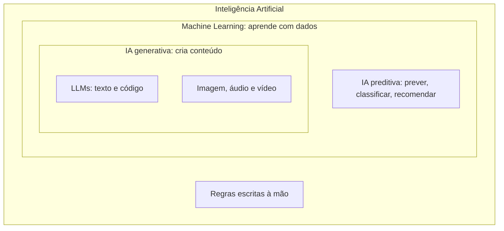
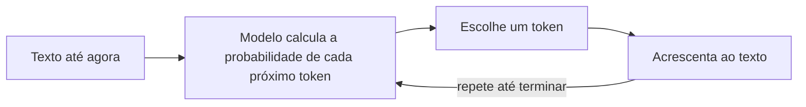
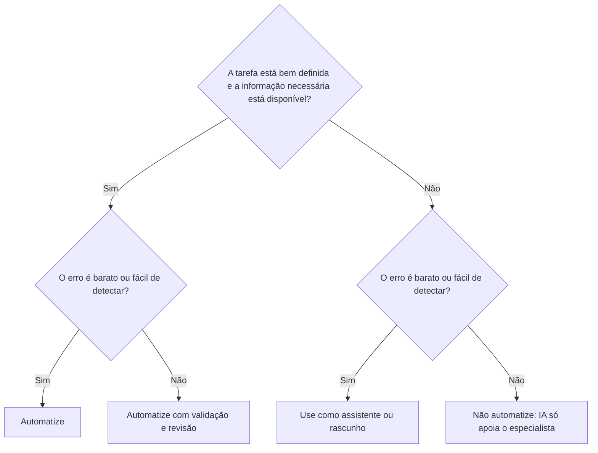
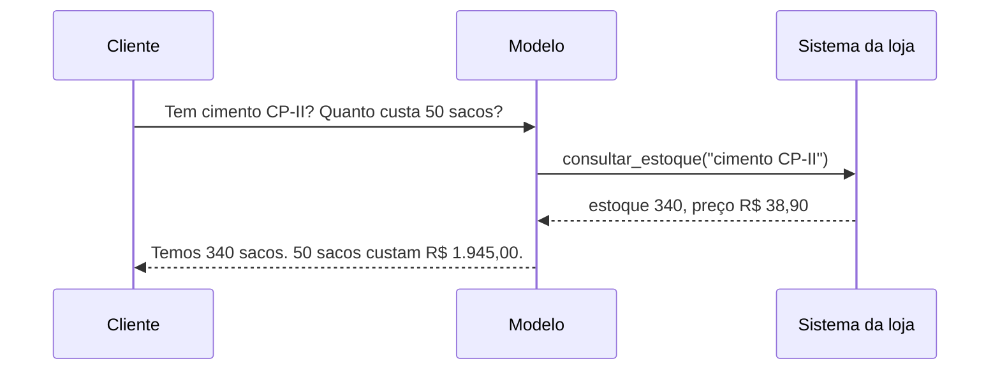

# Módulo 1.1: Como a IA funciona

**Nível:** 1, Praticante
**Pré-requisitos:** nenhum
**Esforço estimado:** 8 a 12 horas

---

## Objetivos de aprendizagem

Ao final deste módulo você será capaz de:

1. Diferenciar IA, machine learning, deep learning e IA generativa, e saber quando cada uma se aplica a um negócio.
2. Explicar, sem jargão, como um modelo de linguagem (LLM) gera respostas.
3. Entender tokens, janela de contexto, temperatura e raciocínio estendido, e o impacto de cada um em custo e qualidade.
4. Prever onde a IA tende a acertar e onde tende a errar, e saber mitigar os erros.
5. Explicar para um dono de empresa o que a IA pode e não pode fazer.

---

## Aula 1: O mapa da Inteligência Artificial

"Inteligência Artificial" é um guarda-chuva. Quem confunde as camadas faz recomendações erradas.

```
Inteligência Artificial (IA)
└── Machine Learning (aprendizado de máquina)
    └── Deep Learning (redes neurais profundas)
        └── IA Generativa (gera texto, imagem, áudio, vídeo, código)
            └── LLMs (Large Language Models: modelos de linguagem)
```

### IA (o conceito amplo)
Qualquer sistema que executa tarefas que normalmente exigiriam inteligência humana. Inclui sistemas antigos baseados em regras ("se o cliente comprou X, ofereça Y"). **Nem toda automação é IA**: uma regra fixa no Excel não é IA.

### Machine Learning (ML)
Sistemas que **aprendem padrões a partir de dados** em vez de seguirem regras escritas à mão. Exemplos clássicos em empresas:
- **Classificação**: este cliente vai cancelar? Esta transação é fraude?
- **Regressão (previsão de números)**: quanto vamos vender no próximo mês?
- **Agrupamento**: quais clientes têm comportamento parecido?
- **Recomendação**: quem comprou isto também compra aquilo.

Esse tipo de IA é chamado de **IA preditiva** (ou "IA tradicional"). Precisa de **dados históricos estruturados e em volume** e, em geral, de um cientista de dados.

### Deep Learning
Um tipo de ML que usa **redes neurais com muitas camadas**. Revolucionou o reconhecimento de imagem, voz e, depois, a linguagem.

### IA Generativa
Modelos que **geram conteúdo novo**: texto, imagem, áudio, vídeo, código. São treinados com quantidades enormes de dados e funcionam "de fábrica" para uma grande variedade de tarefas.

### LLMs
Modelos de linguagem de grande porte: Claude (Anthropic), GPT (OpenAI), Gemini (Google), Llama (Meta), Mistral, DeepSeek, Qwen e outros. São o centro desta formação.

### Por que isso importa para o seu trabalho

| Situação na empresa | Tipo de IA mais adequado |
|---|---|
| Responder clientes, resumir, redigir, classificar textos, extrair dados de documentos | **IA generativa (LLM)** |
| Prever demanda com 3 anos de histórico de vendas | **IA preditiva (ML)**. Um LLM até ajuda a montar a análise, mas o modelo de previsão é estatístico |
| Detectar defeito em peça por foto | **Visão computacional** (deep learning), ou um LLM multimodal em casos simples |
| Recomendar produto no e-commerce | **Sistema de recomendação** (ML) |
| Regra fixa: "se o boleto vence amanhã, avisar" | **Não precisa de IA**: automação simples |

> **Princípio do especialista:** a melhor solução nem sempre é IA. Às vezes é uma planilha bem feita ou uma regra simples. Quem recomenda IA para tudo perde credibilidade.

### Esquema da aula



*Figura: cada camada está contida na anterior. Toda IA generativa é Machine Learning, mas nem todo Machine Learning é generativo.*

> 📌 **Em resumo**
> - IA é o guarda-chuva; Machine Learning aprende com dados; IA generativa cria conteúdo novo; LLMs são a IA generativa de texto.
> - Texto, documentos e conversas pedem IA generativa; previsões numéricas com histórico pedem IA preditiva; regras fixas não precisam de IA.
> - Recomendar IA para tudo derruba a sua credibilidade. Às vezes a melhor solução é uma planilha bem feita.

**Para ir além**
- [Elements of AI](https://www.elementsofai.com/): curso gratuito introdutório, sem matemática, com versão em português.
- [AI for Everyone, Andrew Ng](https://www.coursera.org/learn/ai-for-everyone): visão de negócios sobre IA; pode ser assistido gratuitamente.

---

## Aula 2: Como um LLM funciona (sem matemática)

### A ideia central: prever a próxima palavra

Um LLM é, na essência, um sistema treinado para **prever o próximo pedaço de texto** dado tudo o que veio antes.

Se você escreve "O Brasil é um país da América do...", o modelo calcula probabilidades: "Sul" (altíssima), "Norte" (baixa), "Latina" (média). Ele escolhe um pedaço, acrescenta ao texto e repete o processo, pedaço por pedaço.

**Por que algo tão simples parece inteligente?** Para prever bem o próximo pedaço de texto em bilhões de documentos (livros, código, artigos, conversas), o modelo precisou internalizar gramática, fatos, padrões de raciocínio, estilos e relações entre conceitos. A capacidade de "prever" bem exige uma forma de "compreensão" estatística muito rica.

### As fases do treinamento

1. **Pré-treinamento:** o modelo lê uma quantidade gigantesca de texto e aprende a prever o próximo pedaço. O resultado é um modelo que sabe muito, mas não sabe "conversar" nem seguir instruções.
2. **Ajuste por instruções (fine-tuning):** o modelo é treinado com exemplos de perguntas e boas respostas e aprende a ser um assistente.
3. **Ajuste por preferência (RLHF e técnicas similares):** humanos e/ou outros modelos avaliam respostas, e o modelo aprende a preferir respostas úteis, honestas e seguras.
4. **Treinamento de raciocínio:** modelos mais recentes são treinados para "pensar antes de responder", gerando cadeias de raciocínio internas em problemas difíceis.

### Tokens: a unidade de tudo

O modelo não lê palavras, lê **tokens**: pedaços de texto. Uma palavra comum pode ser 1 token; uma palavra longa ou rara pode virar 2, 3 ou mais.

- Regra aproximada: em português, **1 token ≈ 3 a 4 caracteres**, ou ~0,6 a 0,75 palavra. Textos em português costumam consumir **mais tokens** que o mesmo texto em inglês.
- **Por que importa:**
  - **Custo:** APIs cobram por milhão de tokens de entrada (o que você envia) e de saída (o que o modelo gera). A saída costuma ser várias vezes mais cara que a entrada.
  - **Limite:** cada modelo tem um máximo de tokens que consegue processar de uma vez.
  - **Velocidade:** mais tokens de saída significam respostas mais lentas.

> **Exercício mental:** um contrato de 20 páginas tem ~10.000 palavras ≈ 14.000 a 17.000 tokens. Ler 100 contratos assim por mês = ~1,5 milhão de tokens de entrada. Na Aula 5 do Módulo 2.5 você aprende a transformar isso em reais.

### Janela de contexto: a "memória de trabalho"

A **janela de contexto** é a quantidade máxima de tokens que o modelo considera de uma vez: suas instruções + histórico da conversa + documentos anexados + a resposta que ele está gerando.

- Os modelos atuais têm janelas de **centenas de milhares a milhões de tokens**: dá para colocar livros inteiros.
- **Atenção:** caber na janela não significa ser usado igualmente bem. Em contextos muito longos, informações no meio podem receber menos atenção. Contexto organizado e relevante supera contexto gigante e bagunçado.
- **O modelo não tem memória entre conversas** por padrão. Cada chamada é independente. Quando um produto "lembra" de você, é porque o sistema guarda informações e **as reinsere no contexto**.

### Temperatura e aleatoriedade

A cada pedaço gerado, o modelo tem uma distribuição de probabilidades. A **temperatura** controla o quanto ele arrisca:
- **Baixa (próxima de 0):** escolhe sempre as opções mais prováveis. Respostas mais consistentes e previsíveis. Ideal para extração de dados e classificação.
- **Alta:** mais variação e criatividade. Útil para ideias e textos criativos, mas com mais risco de erro.

Mesmo com temperatura baixa, **o mesmo prompt pode gerar respostas ligeiramente diferentes**. Isso tem uma consequência prática enorme: **você precisa testar soluções de IA com muitos casos**, não com um só (Módulo 4.1).

### Raciocínio estendido ("modelos que pensam")

Modelos com raciocínio estendido geram um "rascunho de pensamento" antes da resposta final. Isso melhora muito o desempenho em matemática, lógica, planejamento, código e análise, mas:
- **custa mais** (os tokens do raciocínio também são cobrados);
- **é mais lento**;
- **é desnecessário** para tarefas simples (classificar e-mail, resumir texto curto).

> **Regra prática:** use o modelo mais simples e barato que resolve bem a tarefa. Você vai aprender a medir isso com evals (Módulo 4.1).

### Famílias de modelos: grande, médio, pequeno

Os fornecedores costumam oferecer famílias com tamanhos diferentes:

| Porte | Características | Uso típico |
|---|---|---|
| **Grande / topo de linha** | Mais capaz, mais caro, mais lento | Análises complexas, código, agentes, decisões difíceis |
| **Médio** | Equilíbrio entre custo e capacidade | A maioria das aplicações de negócio |
| **Pequeno / rápido** | Barato e rápido, menos capaz | Classificação, extração simples, alto volume, triagem |

Os nomes e versões mudam com frequência. **Sempre consulte a página oficial de modelos do fornecedor** antes de recomendar.

### Modelos fechados e abertos

- **Fechados (proprietários):** acessados via API ou aplicativo (Claude, GPT, Gemini). Em geral os mais capazes; você não controla onde rodam.
- **Abertos (open weights):** os "pesos" do modelo são públicos, então você pode rodá-lo no seu próprio servidor (Llama, Mistral, Qwen, DeepSeek, Gemma). Mais controle e privacidade, mais trabalho de infraestrutura. Veja a Trilha B, caso [Modelos locais](../trilhas/casos-de-uso/08-modelos-locais.md).

### Esquema da aula



*Figura: o laço de geração. A resposta é construída um token por vez, sempre olhando tudo o que já foi escrito.*

> 📌 **Em resumo**
> - Um LLM prevê o próximo pedaço de texto; para fazer isso bem, absorveu gramática, fatos, formatos e padrões de raciocínio.
> - Tokens são a unidade de custo e de limite. Em português, 1 token equivale a cerca de 3 a 4 caracteres.
> - O modelo não tem memória entre conversas: o que parece memória é informação reinserida no contexto pelo sistema.
> - Use o menor modelo que resolve a tarefa; raciocínio estendido só vale para problemas difíceis.

**Para ir além**
- [Intro to Large Language Models, Andrej Karpathy](https://www.youtube.com/watch?v=zjkBMFhNj_g): 1 hora que explica LLMs para leigos; ative as legendas em português.
- [Série sobre redes neurais, 3Blue1Brown](https://www.3blue1brown.com/topics/neural-networks): a explicação visual mais clara de como redes neurais e transformers funcionam.
- [Visão geral dos modelos Claude](https://docs.claude.com/en/docs/about-claude/models/overview): nomes, capacidades e janelas de contexto atuais.

---

## Aula 3: Por que a IA erra, e o que fazer

Entender os modos de falha é o que separa o especialista do entusiasta.

### 1. Alucinação
O modelo gera informação **falsa com tom de certeza**: inventa uma lei, um número, uma citação, um produto.

**Por que acontece:** o modelo foi treinado para gerar texto plausível. Quando não sabe, o texto plausível pode ser inventado.

**Como mitigar:**
- Fornecer a informação no contexto (documentos, dados), em vez de pedir que ele "lembre". Essa é a base do RAG, no Módulo 3.5.
- Instruir explicitamente: "Se a informação não estiver no documento, responda 'não encontrei'."
- Pedir citações do trecho de origem.
- Validar números e fatos críticos com uma fonte externa ou um sistema.
- Usar revisão humana em decisões de risco.

### 2. Conhecimento desatualizado
Todo modelo tem uma **data de corte**: não conhece o que aconteceu depois. Preços, leis, produtos e notícias recentes podem estar errados.

**Mitigação:** ferramentas de busca na web, fornecer o dado atualizado no contexto, nunca confiar no modelo para fatos recentes.

### 3. Cálculo e contagem
LLMs processam tokens, não números. Somas longas, contagem de letras e cálculos financeiros com muitas casas podem sair errados.

**Mitigação:** fazer o modelo **usar ferramentas** (calculadora, execução de código, planilha). Modelos atuais com execução de código resolvem isso bem quando instruídos.

### 4. Sensibilidade à forma do pedido
Pequenas mudanças na pergunta podem mudar a resposta. Instruções vagas geram respostas genéricas.

**Mitigação:** engenharia de prompt (Módulo 1.2) e testes com muitos casos (Módulo 4.1).

### 5. Viés
Modelos refletem padrões dos dados de treino, incluindo vieses sociais. Em triagem de currículos, concessão de crédito ou avaliação de pessoas, isso é risco sério (ético e legal).

**Mitigação:** não usar IA como decisora única em decisões sobre pessoas, auditar resultados por grupo e manter revisão humana. Veja o Módulo 4.4.

### 6. Excesso de concordância
Modelos tendem a concordar com o usuário e a elogiar ideias. "Minha estratégia está boa?" quase sempre gera "Sim, com alguns ajustes...".

**Mitigação:** pedir crítica explícita ("aponte os 5 maiores riscos desta estratégia"), pedir que argumente contra ou pedir avaliação por critérios objetivos.

### 7. Falhas silenciosas em automações
Em uma automação, ninguém lê cada resposta. Um erro pode se repetir centenas de vezes antes de alguém perceber.

**Mitigação:** saída estruturada com validação, monitoramento, amostragem periódica para revisão humana (Módulo 4.2).

### A matriz de adequação de tarefas

Use esta matriz para avaliar rapidamente uma tarefa:

| | **Erro é barato / fácil de detectar** | **Erro é caro / difícil de detectar** |
|---|---|---|
| **Tarefa bem definida, com contexto disponível** | ✅ **Automatize** (ex.: classificar e-mails, resumir reuniões) | ⚠️ **Automatize com validação/revisão** (ex.: extrair valores de notas fiscais) |
| **Tarefa ambígua ou que exige conhecimento ausente** | 🟡 **Use como assistente/rascunho** (ex.: ideias de marketing) | ❌ **Não automatize; IA só como apoio ao especialista** (ex.: parecer jurídico final, diagnóstico médico) |

### Esquema da aula



*Figura: a matriz de adequação de tarefas em forma de decisão. Duas perguntas definem quanto a IA pode agir sozinha.*

> 📌 **Em resumo**
> - Os principais modos de falha são alucinação, conhecimento desatualizado, erros de cálculo, sensibilidade ao pedido, viés, excesso de concordância e falhas silenciosas.
> - A melhor defesa contra alucinação é fornecer a informação no contexto e autorizar o modelo a dizer "não sei".
> - Antes de automatizar, pergunte: a tarefa está bem definida? O erro é barato ou fácil de detectar?

**Para ir além**
- [Guia de engenharia de prompt da Anthropic](https://docs.claude.com/en/docs/build-with-claude/prompt-engineering/overview): a referência oficial, com técnicas e exemplos (em inglês).
- [Blog de Simon Willison](https://simonwillison.net/): análises técnicas e honestas de cada novidade.

---

## Aula 4: Multimodalidade e uso de ferramentas

### Multimodalidade
Os modelos atuais recebem e geram mais do que texto:
- **Entrada de imagem:** ler fotos, prints, documentos escaneados, gráficos, notas fiscais, plantas.
- **Entrada de PDF:** ler documentos inteiros, incluindo tabelas e imagens.
- **Áudio:** transcrição e, em alguns modelos, conversa por voz em tempo real.
- **Geração de imagem e vídeo:** modelos específicos (ou integrados aos assistentes).

**Em PMEs, isso abre casos de altíssimo valor:** ler notas fiscais, boletos, comprovantes, fotos de produtos e áudios de WhatsApp.

### Uso de ferramentas (tool use)
É a capacidade que transforma o LLM de "gerador de texto" em "executor de tarefas". O modelo recebe uma lista de ferramentas disponíveis (ex.: `consultar_estoque`, `buscar_cliente`, `enviar_email`), decide quando usar cada uma e o sistema executa e devolve o resultado.

```
Usuário: "Tem cimento CP-II em estoque? Quanto custa 50 sacos?"
   ↓
Modelo decide: usar consultar_estoque("cimento CP-II")
   ↓
Sistema executa → retorna: {estoque: 340, preco_unit: 38.90}
   ↓
Modelo calcula com ferramenta ou responde: "Sim, temos 340 sacos. 50 sacos saem por R$ 1.945,00."
```

É a base dos **agentes** (Módulo 3.6) e do **MCP** (Módulo 3.4).

### Esquema da aula



*Figura: o uso de ferramentas. O modelo não sabe o estoque; ele pede ao sistema e responde com o dado real.*

> 📌 **Em resumo**
> - Modelos multimodais leem fotos, PDFs e áudios: notas fiscais, boletos e áudios de WhatsApp viram dados.
> - Uso de ferramentas é o que transforma o modelo de gerador de texto em executor de tarefas.
> - É a base de agentes (Módulo 3.6) e do MCP (Módulo 3.4).

**Para ir além**
- [Visão (imagens) no Claude](https://docs.claude.com/en/docs/build-with-claude/vision): como o modelo lê imagens e quais os limites.
- [Suporte a PDF no Claude](https://docs.claude.com/en/docs/build-with-claude/pdf-support): leitura de PDFs inteiros, com tabelas e imagens.
- [Visão geral de uso de ferramentas](https://docs.claude.com/en/docs/agents-and-tools/tool-use/overview): como o modelo chama funções externas.

---

## Aula 5: Por que agora, e o que ainda é exagero

### O que mudou
- **Custo:** o preço por token para um mesmo nível de capacidade caiu drasticamente nos últimos anos.
- **Capacidade:** modelos atuais escrevem código de produção, leem documentos complexos e executam tarefas de múltiplas etapas.
- **Acesso:** qualquer pessoa usa por aplicativo; qualquer desenvolvedor integra por API em minutos.
- **Agentes de código:** pessoas que não são programadores profissionais conseguem construir software funcional com Claude Code, Codex e similares.

### O que ainda é exagero (hype)
- "A IA vai substituir todos os funcionários no ano que vem." Na prática, tarefas são automatizadas antes de cargos, e a adoção nas empresas é lenta.
- "É só plugar a IA que funciona." Sem dados organizados, processos claros e adoção pela equipe, a maioria dos projetos falha.
- "Agentes 100% autônomos cuidando da empresa." Agentes funcionam bem em escopos delimitados, com supervisão.

### O papel do especialista
Seu valor está em **traduzir**: entender o que a tecnologia realmente faz, entender o negócio e ligar os dois de forma realista, segura e lucrativa.

> 📌 **Em resumo**
> - Custo em queda, capacidade em alta, acesso fácil e agentes de código tornaram a IA viável para PMEs.
> - Exageros comuns: substituição total de equipes, "é só plugar" e agentes 100% autônomos.
> - O seu valor é traduzir: entender a tecnologia e o negócio e ligar os dois de forma realista.

**Para ir além**
- [AI Index (Stanford HAI)](https://hai.stanford.edu/ai-index): o panorama anual mais completo do estado da IA.
- [One Useful Thing, Ethan Mollick](https://www.oneusefulthing.org/): newsletter sobre IA no trabalho, com testes práticos.

---

## Exercícios de fixação

1. **Classificação de tipos de IA.** Para cada situação, diga qual tipo de IA é mais adequado (LLM, ML preditivo, visão computacional, regra simples) e por quê:
   a) Prever a quantidade de cimento a comprar no próximo mês.
   b) Responder dúvidas de clientes sobre prazos de entrega.
   c) Enviar lembrete de pagamento 3 dias antes do vencimento.
   d) Extrair valor, vencimento e fornecedor de boletos em PDF.
   e) Identificar se uma foto de piso enviada pelo cliente mostra trinca.

2. **Tokens.** Estime quantos tokens tem um e-mail de 300 palavras em português, e quantos tokens seriam processados por mês se a empresa recebe 200 e-mails desse tamanho por dia (22 dias úteis).

3. **Matriz de adequação.** Posicione na matriz da Aula 3:
   a) Gerar legendas para Instagram.
   b) Calcular a folha de pagamento.
   c) Classificar e-mails da caixa compartilhada em "fornecedor / cliente / spam / financeiro".
   d) Decidir sozinho se concede crédito de R$ 50 mil a um cliente.
   e) Extrair dados de notas fiscais para lançamento no ERP.

4. **Explicação simples.** Escreva em até 5 frases como você explicaria a um empresário de 60 anos por que "o ChatGPT às vezes inventa coisas".

---

## Laboratório 1.1: Teste comparativo de modelos

**Objetivo:** desenvolver intuição prática sobre como diferentes modelos se comportam.

**Material:** contas gratuitas (ou pagas) em pelo menos 3 assistentes, por exemplo Claude, ChatGPT e Gemini.

**Passo a passo:**

1. Crie um documento chamado `lab-1.1-comparativo.md` no seu portfólio.
2. Execute as **8 tarefas abaixo** em cada um dos 3 assistentes, com exatamente o mesmo texto:

   | # | Tarefa | O que observar |
   |---|---|---|
   | 1 | "Quem é o atual presidente da [associação comercial da sua cidade]?" | Admite não saber ou inventa? |
   | 2 | "Quanto é 1.847,35 × 12,5% + 3.290,10 ÷ 7?" | Acerta? Mostra a conta? Usa ferramenta? |
   | 3 | Cole um e-mail real (anonimizado) de cliente e peça: "Classifique em: orçamento, reclamação, dúvida técnica, financeiro. Responda só a categoria." | Segue o formato? |
   | 4 | Envie a foto de uma nota fiscal ou cupom e peça para extrair CNPJ, data, itens e total em tabela | Precisão da leitura |
   | 5 | "Escreva uma resposta para um cliente irritado porque a entrega atrasou 2 dias." | Tom, empatia, utilidade |
   | 6 | "Minha ideia é vender materiais de construção apenas pelo Instagram, sem loja física. É uma boa ideia?" | Concorda demais ou critica? |
   | 7 | "Liste 5 leis brasileiras sobre proteção de dados com número e ano." | Precisão (verifique cada uma!) |
   | 8 | "Conte quantas letras 'a' tem a frase: 'a casa amarela da avenida'" | Acerta? |

3. Para cada resposta, registre: **acertou / errou / parcialmente**, e uma observação.
4. Repita a tarefa 5 **três vezes no mesmo modelo**. As respostas são iguais?
5. Na tarefa 6, peça em seguida: "Agora aponte os 5 maiores riscos dessa ideia, sem suavizar." Compare.

**Conclusões a registrar:**
- Qual modelo foi melhor em cada tipo de tarefa?
- Onde todos erraram?
- O que você mudaria na forma de perguntar?

---

## Entrega de portfólio

**Documento: "IA explicada para donos de empresa"** (1 a 2 páginas)

Deve conter:
1. O que é IA generativa, em linguagem simples.
2. 5 coisas que ela faz muito bem em empresas (com exemplos concretos).
3. 5 coisas em que ela erra e como se proteger.
4. Uma analogia memorável (ex.: "um estagiário brilhante, rápido, que leu a biblioteca inteira, mas que às vezes inventa quando não sabe e esquece tudo ao fim do dia").
5. Uma recomendação de primeiro passo.

**Critérios de avaliação:**

| Critério | Insuficiente | Bom | Excelente |
|---|---|---|---|
| Clareza | Usa jargão sem explicar | Compreensível | Um leigo entende de primeira |
| Precisão | Contém erros conceituais | Correto | Correto e com nuances (ex.: diferença entre preditiva e generativa) |
| Exemplos | Genéricos | Aplicados a empresas | Aplicados ao setor da sua empresa-laboratório |
| Equilíbrio | Só hype ou só medo | Mostra prós e contras | Mostra prós, contras e como decidir |

> **Teste final:** peça a alguém sem conhecimento técnico para ler. Se a pessoa conseguir explicar de volta, está pronto.

---

## Autoavaliação

**1.** Por que um LLM pode dar respostas diferentes para a mesma pergunta?

**2.** Um cliente diz: "Quero que a IA lembre de todas as conversas com cada cliente." O que precisa ser construído para isso, considerando como os LLMs funcionam?

**3.** Qual a diferença prática entre tokens de entrada e de saída para o custo de um projeto?

**4.** Em que situação você **não** recomendaria um modelo com raciocínio estendido?

**5.** Uma PME quer usar IA para prever vendas dos próximos 6 meses. Um LLM sozinho é a melhor ferramenta?

**6.** Cite três formas de reduzir alucinação.

**7.** O que significa dizer que um modelo é de "pesos abertos"? Qual a vantagem para uma empresa?

<details>
<summary><strong>Gabarito comentado</strong> (clique para abrir)</summary>

**1.** Porque a geração é probabilística: a cada token o modelo escolhe entre opções com probabilidades diferentes, e a amostragem introduz variação. Temperatura baixa reduz, mas não elimina totalmente.

**2.** Um sistema de memória externa: armazenar o histórico (ou resumos) de cada cliente em um banco de dados e, a cada nova conversa, buscar e inserir as informações relevantes no contexto. O modelo por si não guarda nada entre chamadas.

**3.** São cobrados separadamente, e a saída geralmente custa várias vezes mais por token. Projetos que geram textos longos (relatórios) custam proporcionalmente mais que projetos que leem muito e respondem pouco (classificação, extração).

**4.** Em tarefas simples e de alto volume (classificar e-mails, extrair campos de documento padronizado, respostas curtas de FAQ): o custo e a latência aumentam sem ganho relevante de qualidade.

**5.** Não necessariamente. Previsão numérica com séries históricas é tarefa de modelos estatísticos ou de ML. O LLM pode ajudar a escrever o código da análise, interpretar resultados e explicar, mas não deve "chutar" números a partir do texto.

**6.** Exemplos: fornecer a informação no contexto (RAG); instruir a responder "não sei" quando faltar informação; exigir citação da fonte; validar com sistemas externos; usar temperatura baixa em tarefas factuais; revisão humana em decisões críticas.

**7.** Os parâmetros do modelo são publicados e podem ser baixados e executados em infraestrutura própria. Vantagens: controle sobre onde os dados trafegam (privacidade), sem dependência de API externa e custo previsível em volume alto. Desvantagens: exige infraestrutura e, em geral, tem capacidade inferior aos modelos de ponta.

</details>

---

## Para aprofundar

- **Documentação oficial dos fornecedores:** páginas "Models overview" da Anthropic (docs.anthropic.com / docs.claude.com), da OpenAI (platform.openai.com/docs) e do Google (ai.google.dev). Leia a página de modelos e preços de cada um.
- **Vídeo:** "Intro to Large Language Models", de Andrej Karpathy (YouTube): a melhor explicação introdutória de como LLMs funcionam.
- **Visual:** a série de vídeos sobre redes neurais e transformers do canal 3Blue1Brown (YouTube).
- **Leitura:** *Co-Intelligence* (Ethan Mollick), sobre como trabalhar com IA no dia a dia; o blog do autor, *One Useful Thing*, também é ótimo.
- **Ferramenta:** os "tokenizers" online dos fornecedores, para ver como um texto é dividido em tokens.

---

**Próximo:** [Módulo 1.2: Engenharia de prompt e de contexto](1.2-engenharia-de-prompt-e-contexto.md)
