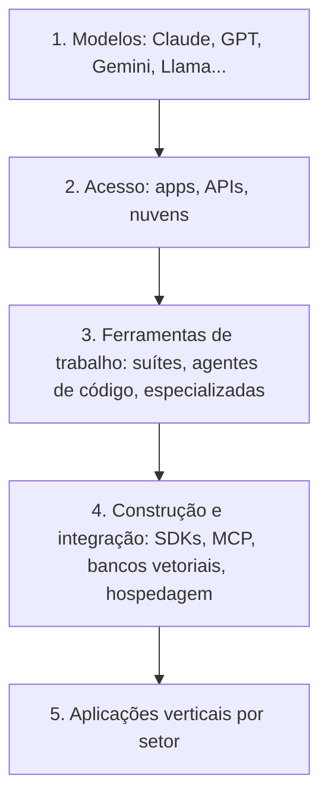
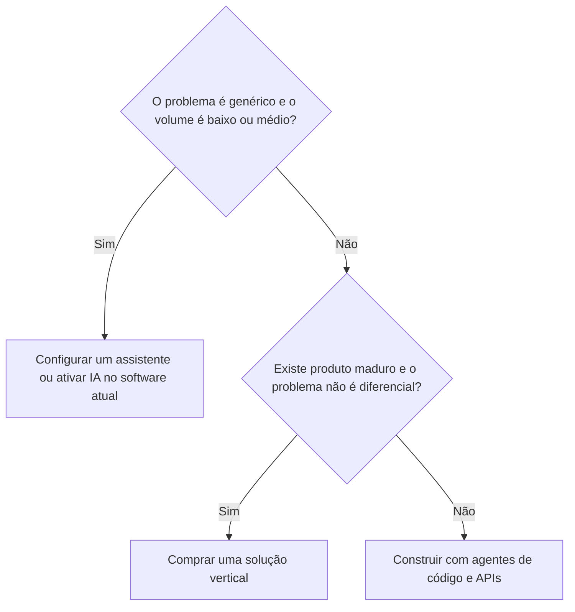

# Módulo 1.3: O ecossistema de ferramentas

**Nível:** 1, Praticante
**Pré-requisitos:** Módulos 1.1 e 1.2
**Esforço estimado:** 8 a 10 horas

---

## Objetivos de aprendizagem

1. Conhecer as categorias de ferramentas de IA e o papel de cada uma.
2. Escolher ferramentas com critérios objetivos (capacidade, custo, privacidade, integração, suporte).
3. Configurar assistentes personalizados com documentos da empresa.
4. Saber quando uma ferramenta pronta resolve e quando é preciso construir algo.

> **Aviso:** este é o módulo que mais envelhece. Nomes, preços e recursos mudam todo mês. Aprenda as **categorias e os critérios**; os produtos você verifica na hora.

---

## Aula 1: O mapa do ecossistema

```
┌────────────────────────────────────────────────────────────────┐
│ CAMADA 1: MODELOS (o "motor")                                  │
│ Claude, GPT, Gemini, Llama, Mistral, DeepSeek, Qwen...         │
├────────────────────────────────────────────────────────────────┤
│ CAMADA 2: ACESSO                                               │
│ Apps de assistente (web, desktop, celular) | APIs | Nuvens     │
│ (AWS Bedrock, Google Vertex AI, Azure AI)                      │
├────────────────────────────────────────────────────────────────┤
│ CAMADA 3: FERRAMENTAS DE TRABALHO                              │
│ IA embutida em suítes (Workspace, Microsoft 365)               │
│ Agentes de código (Claude Code, Codex, Cursor...)              │
│ Ferramentas especializadas (transcrição, imagem, vídeo, voz)   │
├────────────────────────────────────────────────────────────────┤
│ CAMADA 4: CONSTRUÇÃO E INTEGRAÇÃO                              │
│ SDKs e frameworks | MCP | Plataformas no-code/low-code         │
│ Bancos vetoriais | Hospedagem                                  │
├────────────────────────────────────────────────────────────────┤
│ CAMADA 5: APLICAÇÕES VERTICAIS                                 │
│ Produtos prontos com IA para um setor/função                   │
│ (atendimento, jurídico, contábil, RH, vendas...)               │
└────────────────────────────────────────────────────────────────┘
```

**Como especialista, você precisa saber transitar entre as camadas.** O cliente quer resolver um problema; cabe a você decidir se a solução é configurar uma ferramenta da camada 3, contratar um produto da camada 5 ou construir algo nas camadas 2 e 4.

### Esquema da aula



*Figura: as cinco camadas do ecossistema. O especialista decide em qual camada resolver o problema do cliente.*

> 📌 **Em resumo**
> - Cinco camadas: modelos, acesso, ferramentas de trabalho, construção e aplicações verticais.
> - O cliente quer resolver um problema; você decide se configura, compra ou constrói.
> - Este é o módulo que mais envelhece: aprenda categorias e critérios, não nomes.

**Para ir além**
- [Visão geral dos modelos Claude](https://docs.claude.com/en/docs/about-claude/models/overview): nomes, capacidades e janelas de contexto atuais.
- [Modelos Gemini](https://ai.google.dev/gemini-api/docs/models): a família de modelos do Google, para comparação.

---

## Aula 2: Assistentes de uso geral

Claude (Anthropic), ChatGPT (OpenAI), Gemini (Google), Copilot (Microsoft) e outros.

### Recursos que você precisa conhecer (presentes, em formas variadas, nos principais)
| Recurso | O que é | Uso em empresa |
|---|---|---|
| **Projetos / Gems / GPTs personalizados** | Espaços com instruções fixas e documentos anexados | Assistente de atendimento, de RH, de vendas, com a base da empresa |
| **Upload de arquivos** | Ler PDF, planilha, imagem | Analisar contratos, relatórios, notas |
| **Análise de dados / execução de código** | O assistente roda código para analisar planilhas e gerar gráficos | Análise de vendas, financeiro |
| **Busca na web** | Pesquisa informações atuais | Pesquisa de mercado, concorrentes |
| **Pesquisa aprofundada (deep research)** | Pesquisa autônoma em dezenas de fontes, com relatório | Estudos de mercado, inteligência setorial |
| **Artefatos / canvas** | Criação de documentos, páginas e apps simples dentro do chat | Protótipos, relatórios, ferramentas internas |
| **Conectores** | Ligação com Drive, e-mail, agenda, CRM etc. | Assistente que consulta dados da empresa |
| **Voz** | Conversa falada | Uso em campo, acessibilidade |
| **Memória** | Lembra preferências entre conversas | Personalização |
| **Agentes/computer use** | O assistente navega e executa ações | Tarefas em sites e sistemas |

### Planos: pessoal × equipe × empresa
Esta é uma das recomendações mais importantes que você vai fazer.

| Aspecto | Plano gratuito/pessoal | Planos de equipe/empresa |
|---|---|---|
| Uso dos dados para treinar modelos | Varia; frequentemente permitido por padrão ou com opção de desativar | Em geral **não usado** para treino, por contrato |
| Administração | Nenhuma | Painel do administrador, gestão de usuários |
| Compartilhamento | Individual | Projetos compartilhados entre a equipe |
| Segurança | Básica | SSO, logs, retenção configurável (em planos superiores) |
| LGPD/contrato | Termos de consumidor | Termos comerciais, aditivos de proteção de dados |

> **Regra:** funcionário colando dados de clientes em conta pessoal gratuita é um risco real de LGPD e de vazamento. A primeira recomendação a quase toda PME é **padronizar uma ferramenta em plano de equipe e criar uma política de uso** (Módulo 4.4).

**Sempre verifique os termos atuais** na página de privacidade e de planos de cada fornecedor.

> 📌 **Em resumo**
> - Projetos, análise de dados, busca, pesquisa aprofundada, conectores e agentes já vêm nos principais assistentes.
> - Planos de equipe e empresa costumam garantir por contrato que os dados não treinam modelos.
> - Primeira recomendação a quase toda PME: uma ferramenta padronizada em plano de equipe e uma política de uso.

**Para ir além**
- [Central de ajuda do Claude](https://support.claude.com/): guias de Projetos, planos e recursos.
- [Trust Center da Anthropic](https://trust.anthropic.com/): certificações, segurança e privacidade.

---

## Aula 3: IA embutida nas ferramentas de trabalho

### Suítes de escritório
- **Google Workspace com Gemini:** Gmail, Docs, Sheets, Meet (resumos e transcrições), Drive.
- **Microsoft 365 com Copilot:** Outlook, Word, Excel, Teams, PowerPoint.

**Quando recomendar:** a empresa já usa intensamente a suíte e o ganho vem de tarefas do dia a dia (e-mail, reunião, documentos). A integração nativa reduz o atrito de adoção.

### IA em softwares que a empresa já usa
CRMs, ERPs, plataformas de atendimento, e-commerce e ferramentas de design (Canva etc.) estão adicionando IA. Antes de construir algo, **verifique o que os sistemas atuais já oferecem**: às vezes basta ativar.

### Ferramentas especializadas (exemplos de categorias)
| Categoria | Para quê |
|---|---|
| Transcrição e notas de reunião | Gravar, transcrever e resumir reuniões e ligações |
| Geração de imagem | Criativos, mockups, fotos de produto |
| Geração de vídeo e avatar | Vídeos de treinamento, anúncios |
| Voz sintética | Narração, atendimento telefônico |
| Apresentações | Gerar slides a partir de texto |
| Atendimento omnichannel com IA | WhatsApp, Instagram e site com bot e humano |

> 📌 **Em resumo**
> - Se a empresa vive no Google Workspace ou no Microsoft 365, a IA embutida reduz o atrito de adoção.
> - Antes de construir, verifique o que CRM, ERP e outros sistemas já oferecem de IA.
> - Ferramentas especializadas cobrem transcrição, imagem, vídeo, voz e atendimento.

**Para ir além**
- [Anthropic Academy](https://www.anthropic.com/learn): cursos gratuitos sobre uso do Claude e da API.

---

## Aula 4: Ferramentas de construção

Você vai aprofundar cada uma no Nível 3. Por enquanto, conheça o mapa.

| Ferramenta | O que é | Módulo |
|---|---|---|
| **APIs dos modelos** | Acesso programático aos modelos | 3.1 |
| **Agentes de código** (Claude Code, Codex, Cursor e similares) | IA que escreve, executa e corrige código para você | 3.2 |
| **MCP (Model Context Protocol)** | Padrão aberto para conectar IA a sistemas e dados | 3.4 |
| **Bancos vetoriais** | Armazenam embeddings para busca semântica (RAG) | 3.5 |
| **SDKs de agentes** | Bibliotecas para construir agentes | 3.6 |
| **Plataformas no-code/low-code** (n8n, Make, Zapier) | Automação visual | 3.2 (comparativo) |
| **Hospedagem** (Vercel, Railway, Cloudflare, VPS) | Onde suas soluções rodam | 4.2 |

> 📌 **Em resumo**
> - APIs, agentes de código, MCP, bancos vetoriais, SDKs de agentes, plataformas visuais e hospedagem são as peças de construção.
> - Cada uma é aprofundada no Nível 3.

**Para ir além**
- [Anthropic Academy](https://www.anthropic.com/learn): cursos gratuitos sobre uso do Claude e da API.
- [Cursos curtos da DeepLearning.AI](https://www.deeplearning.ai/short-courses/): cursos gratuitos de 1 a 2 horas sobre temas específicos.

---

## Aula 5: Critérios de escolha

Nunca recomende uma ferramenta "porque é a melhor". Use critérios.

### Matriz de avaliação de ferramentas
| Critério | Perguntas |
|---|---|
| **Adequação** | Resolve o problema específico? Testamos com casos reais? |
| **Qualidade** | Qual a taxa de acerto nos testes? (Módulo 4.1) |
| **Custo total** | Licença + uso + implantação + manutenção + treinamento |
| **Privacidade e LGPD** | Onde os dados ficam? São usados para treino? Há contrato de tratamento de dados? |
| **Integração** | Conecta com os sistemas da empresa? Tem API? |
| **Usabilidade** | A equipe vai conseguir usar? Está em português? |
| **Fornecedor** | Estabilidade, suporte, roadmap, risco de descontinuar |
| **Dependência (lock-in)** | Dá para trocar depois? Os dados saem facilmente? |

### Construir × comprar × configurar
| Opção | Quando escolher |
|---|---|
| **Configurar** (assistente com projeto/GPT, ativar IA no software existente) | O problema é genérico, o volume é baixo ou médio e não precisa de integração profunda |
| **Comprar** (produto vertical pronto) | Existe produto maduro para o problema, e o problema não é diferencial da empresa |
| **Construir** (com agentes de código e APIs) | Processo específico da empresa, integração com sistemas próprios, volume alto, ou o produto pronto é caro ou inadequado |

> **Na dúvida, comece configurando.** Muitas vezes um projeto bem configurado num assistente resolve 70% do problema por uma fração do custo, e ainda revela os requisitos reais para uma solução construída depois.

### Esquema da aula



*Figura: a decisão entre configurar, comprar e construir. Na dúvida, comece configurando.*

> 📌 **Em resumo**
> - Avalie adequação, qualidade, custo total, privacidade, integração, usabilidade, fornecedor e dependência.
> - Configure quando for genérico; compre quando há produto maduro; construa quando o processo é específico ou o volume é alto.
> - Configurar primeiro revela os requisitos reais de uma solução construída depois.

**Para ir além**
- [Trust Center da Anthropic](https://trust.anthropic.com/): certificações, segurança e privacidade.

---

## Aula 6: Configurando um assistente da empresa (passo a passo)

Este é o primeiro "produto" que você entrega a um cliente, e frequentemente o de maior impacto imediato.

### Etapas
1. **Defina o propósito.** Um assistente por função funciona melhor que um "assistente para tudo". Ex.: "Assistente de Vendas Casa Aurora".
2. **Reúna a base de conhecimento:**
   - catálogo/tabela de produtos (resumida, com o essencial);
   - políticas comerciais (frete, pagamento, trocas, crédito);
   - FAQ (as 30 a 50 perguntas mais comuns, com respostas aprovadas);
   - guia técnico básico (ex.: tipos de argamassa e onde usar);
   - modelos de mensagens aprovados.
3. **Prepare os documentos:**
   - prefira texto limpo (Markdown, DOCX, PDF com texto selecionável) a PDF escaneado;
   - um assunto por documento, com títulos claros;
   - remova informações desatualizadas (pior que ausência é informação errada).
4. **Escreva as instruções** (prompt de sistema, Módulo 1.2, Aula 6).
5. **Teste com 20 a 30 perguntas reais**, incluindo perguntas cuja resposta não está na base (ele deve dizer que não sabe).
6. **Ajuste** documentos e instruções.
7. **Treine a equipe** em 30 a 60 minutos: o que ele faz, o que não faz, como verificar.
8. **Defina um responsável** por manter a base atualizada.

### Limitações a comunicar ao cliente
- O assistente responde com base nos documentos **no momento em que foram enviados**. Preço e estoque mudam; ele não "vê" o ERP sem integração.
- Para dados vivos (estoque, pedidos), é preciso integração (Nível 3).
- A equipe deve conferir informações críticas antes de enviar ao cliente.

> 📌 **Em resumo**
> - Um assistente por função funciona melhor que um assistente para tudo.
> - Documentos limpos, um assunto por documento, sem informação desatualizada.
> - Teste com 20 a 30 perguntas, inclusive algumas cuja resposta não está na base.
> - Defina um responsável por manter a base atualizada.

**Para ir além**
- [Central de ajuda do Claude](https://support.claude.com/): guias de Projetos, planos e recursos.

---

## Exercícios de fixação

1. Para cada necessidade, indique se você **configuraria, compraria ou construiria**, e por quê:
   a) Escritório de contabilidade com 8 pessoas quer ajuda para redigir e-mails a clientes.
   b) Loja com 180 conversas/dia no WhatsApp quer responder automaticamente consultas de preço e estoque do ERP.
   c) Clínica quer transcrever e resumir consultas.
   d) Indústria quer extrair dados de 300 pedidos de compra por dia, que chegam em PDF de formatos diferentes, e lançar no ERP.

2. Liste 5 riscos de uma empresa em que cada funcionário usa uma ferramenta de IA diferente, em conta pessoal.

3. Monte uma tabela comparativa de **3 assistentes** usando a matriz de avaliação da Aula 5, com base nas páginas oficiais atuais de planos e privacidade.

---

## Laboratório 1.3: Assistente da empresa-laboratório

**Objetivo:** configurar um assistente funcional com a base de conhecimento da empresa.

**Passo a passo:**
1. Escolha **uma função** (vendas, atendimento, RH ou operação).
2. Reúna de 4 a 8 documentos (se a empresa não tiver, **crie-os** entrevistando as pessoas, o que já é um enorme valor entregue).
3. Escreva o prompt de sistema.
4. Monte o assistente em uma ferramenta de sua escolha (Projeto no Claude, GPT personalizado, Gem no Gemini).
5. Crie um **conjunto de 25 perguntas de teste**:
   - 15 perguntas comuns;
   - 5 perguntas difíceis ou ambíguas;
   - 5 perguntas cuja resposta **não** está na base.
6. Registre o desempenho e ajuste até atingir pelo menos 85% de respostas corretas, com 100% de "não sei" nas perguntas fora da base.
7. Entregue a uma ou duas pessoas da empresa para usar por uma semana e colete feedback.

---

## Entrega de portfólio

1. **Assistente configurado** + documento de configuração (propósito, documentos, instruções, resultados de teste, limitações).
2. **Mapa do Ecossistema de IA**: uma página visual (você mesmo pode criar com IA) com categorias, exemplos de ferramentas e quando usar cada uma. Essa página será usada em palestras.

| Critério | Insuficiente | Bom | Excelente |
|---|---|---|---|
| Base de conhecimento | Documentos soltos, desatualizados | Organizados | Organizados, revisados, com responsável por atualizar |
| Testes | Sem teste formal | 25 perguntas testadas | Testes + feedback de usuários reais + versão ajustada |
| Mapa | Lista de ferramentas | Categorias claras | Categorias + critérios de escolha + atualizado |

---

## Autoavaliação

**1.** Por que um assistente "para tudo" costuma funcionar pior que assistentes por função?

**2.** Qual a principal diferença, para LGPD, entre um plano pessoal gratuito e um plano de equipe/empresa?

**3.** O cliente pergunta: "Por que o assistente não sabe o estoque atual?" Como você explica?

**4.** Quando faz mais sentido **comprar** um produto vertical do que construir?

**5.** Que critério da matriz de avaliação é mais frequentemente esquecido, e por que é perigoso?

<details>
<summary><strong>Gabarito comentado</strong></summary>

**1.** Porque instruções e documentos de várias funções se misturam, gerando conflitos de regras, contexto poluído e respostas menos precisas. Assistentes focados têm contexto relevante, instruções mais claras e são mais fáceis de testar e manter.

**2.** Em planos de equipe/empresa, os fornecedores geralmente garantem por contrato que os dados não serão usados para treinar modelos e oferecem controles administrativos e termos comerciais com cláusulas de proteção de dados. Em planos pessoais, as condições são de consumidor e variam. Sempre confira os termos vigentes.

**3.** O assistente consulta apenas os documentos que foram enviados a ele, como uma "fotografia" daquele momento. Para ver o estoque em tempo real, é preciso conectá-lo ao ERP por integração (API ou MCP), o que é um projeto de construção.

**4.** Quando o problema é comum a muitas empresas, existe produto maduro e com bom custo, não é um diferencial competitivo do cliente e a integração necessária é suportada pelo produto. Construir algo que já existe barato e pronto é desperdício.

**5.** Dependência (lock-in) e/ou custo total. Ferramentas que prendem os dados ou cujo custo escala com o uso podem se tornar caras e difíceis de abandonar, e a empresa só descobre depois.

</details>

---

## Para aprofundar

- **Páginas oficiais de planos e privacidade** (Anthropic/Claude, OpenAI/ChatGPT, Google/Gemini, Microsoft/Copilot). Leia de verdade a parte de uso de dados.
- **Central de ajuda** de cada assistente: guias de Projetos/GPTs/Gems.
- **Diretórios de ferramentas de IA** são úteis para descoberta, mas desconfie de listas patrocinadas.
- **Hábito:** a cada mês, teste uma ferramenta nova em uma tarefa real e registre a avaliação no seu Mapa do Ecossistema.

---

**Anterior:** [Módulo 1.2](1.2-engenharia-de-prompt-e-contexto.md) | **Próximo:** [Módulo 1.4: Estado da arte e atualização contínua](1.4-estado-da-arte-e-atualizacao.md)
