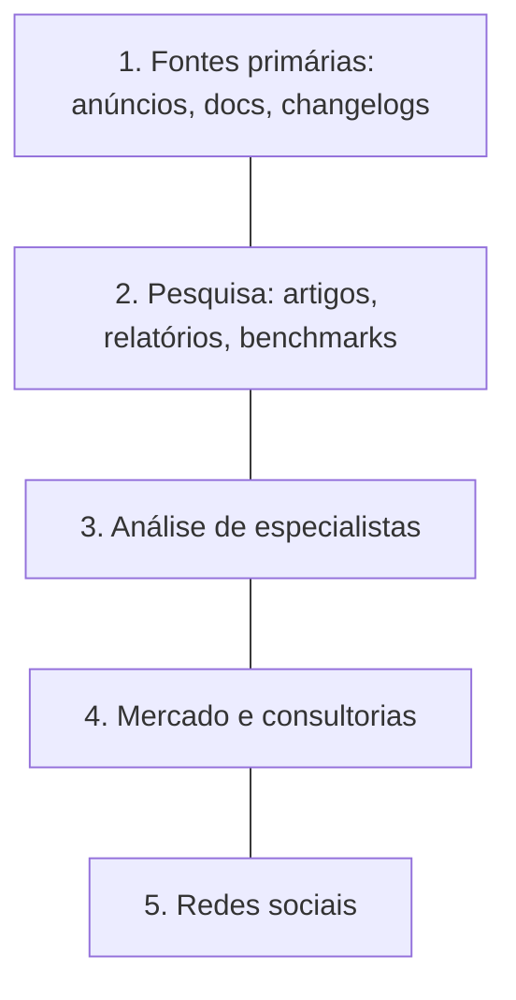
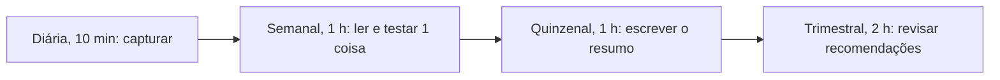

# Módulo 1.4: Estado da arte e atualização contínua

**Nível:** 1, Praticante
**Pré-requisitos:** Módulos 1.1 a 1.3
**Esforço estimado:** 6 a 8 horas + 1 a 2 horas/semana permanentes

---

## Objetivos de aprendizagem

1. Montar um sistema pessoal de curadoria para acompanhar a IA sem se afogar em informação.
2. Distinguir sinal de ruído: o que é avanço relevante para negócios e o que é hype.
3. Ler documentação técnica, anúncios e pesquisas de forma prática.
4. Transformar atualização em conteúdo (base da sua autoridade).

---

## Aula 1: O problema da velocidade

A área de IA lança modelos, recursos e ferramentas toda semana. Dois erros são comuns:
- **Erro 1, tentar acompanhar tudo:** ansiedade, dispersão, nenhuma profundidade.
- **Erro 2, parar de acompanhar:** em 6 meses você recomenda ferramentas ultrapassadas e perde credibilidade.

**O especialista acompanha com método:** poucas fontes de qualidade, rotina fixa, e filtro pelo critério "isso muda algo para os meus clientes?".

> 📌 **Em resumo**
> - Tentar acompanhar tudo gera dispersão; parar de acompanhar gera recomendações ultrapassadas.
> - Filtro do especialista: isso muda algo para os meus clientes?

**Para ir além**
- [AI Index (Stanford HAI)](https://hai.stanford.edu/ai-index): o panorama anual mais completo do estado da IA.

---

## Aula 2: Hierarquia de fontes

| Nível | Tipo de fonte | Confiabilidade | Exemplos |
|---|---|---|---|
| **1. Primária** | Anúncio, documentação e changelog oficiais | Alta (mas com viés comercial) | Blogs e docs da Anthropic, OpenAI, Google, Meta, Microsoft; notas de versão |
| **2. Pesquisa** | Artigos científicos, relatórios técnicos, benchmarks | Alta, exige leitura crítica | arXiv, model cards, AI Index (Stanford HAI) |
| **3. Análise especializada** | Pesquisadores e praticantes reconhecidos | Média-alta | Newsletters e blogs de especialistas (ex.: Ethan Mollick, Simon Willison) |
| **4. Mercado e negócios** | Consultorias, relatórios setoriais | Média (atenção a vieses) | Relatórios de consultorias sobre adoção de IA |
| **5. Redes sociais** | Posts, vídeos, threads | Variável, muito hype | LinkedIn, X, YouTube |

**Regra:** antes de repetir algo para um cliente ou numa palestra, **suba na hierarquia** até a fonte primária.

### Fontes brasileiras relevantes
- **ANPD** (Autoridade Nacional de Proteção de Dados): guias e orientações sobre dados e IA.
- **Sebrae**: pesquisas sobre adoção de tecnologia em pequenos negócios.
- **Associações setoriais** (varejo, saúde, indústria, contabilidade) e seus estudos.
- **Acompanhamento do marco legal da IA** no Congresso (PL 2338/2023 e eventuais sucessores). Verifique o status atual.

### Esquema da aula



*Figura: a hierarquia de fontes, da mais confiável (topo) à menos confiável. Antes de repetir algo, suba até a fonte primária.*

> 📌 **Em resumo**
> - Fontes primárias e pesquisa estão no topo da confiabilidade; redes sociais, na base.
> - Inclua fontes brasileiras: ANPD, Sebrae, associações setoriais e o marco legal da IA.

**Para ir além**
- [Blog de Simon Willison](https://simonwillison.net/): análises técnicas e honestas de cada novidade.
- [One Useful Thing, Ethan Mollick](https://www.oneusefulthing.org/): newsletter sobre IA no trabalho, com testes práticos.

---

## Aula 3: Como ler sem perder tempo

### Lendo um anúncio de novo modelo ou recurso
Faça 6 perguntas:
1. **O que mudou de fato?** (capacidade, preço, velocidade, contexto, novo recurso)
2. **Para quem está disponível?** (API, app, planos pagos, só nos EUA?)
3. **Quanto custa?**
4. **Que problema de cliente isso resolve melhor que antes?**
5. **Quais as limitações declaradas?**
6. **O que testes independentes dizem?** (espere alguns dias)

### Lendo benchmarks com senso crítico
Benchmarks são testes padronizados (matemática, código, raciocínio etc.). Cuidados:
- O benchmark mede **aquilo que mede**, não o desempenho no seu caso.
- Fornecedores escolhem os benchmarks que favorecem o próprio modelo.
- Diferenças pequenas raramente importam em aplicações de negócio.
- **O único benchmark que importa para o seu cliente é a avaliação com os casos dele** (Módulo 4.1).

### Lendo um artigo científico (modo prático)
1. Título e resumo (abstract)
2. Figuras e tabelas de resultados
3. Conclusão e limitações
4. Só então, se relevante, a metodologia

Use um assistente de IA para resumir e explicar trechos difíceis, sempre conferindo no original.

> 📌 **Em resumo**
> - Para cada anúncio: o que mudou, para quem está disponível, quanto custa, que problema resolve, limitações e testes independentes.
> - Benchmarks medem o que medem; o único que importa é o teste com os casos do cliente.
> - Artigo científico: resumo, figuras, conclusão e só então a metodologia.

**Para ir além**
- [AI Index (Stanford HAI)](https://hai.stanford.edu/ai-index): o panorama anual mais completo do estado da IA.

---

## Aula 4: Sinal × ruído

### Sinais de que algo é relevante para negócios
- Reduz custo de forma significativa para uma tarefa comum.
- Torna viável algo que antes não funcionava (ex.: leitura confiável de documentos manuscritos).
- Está disponível em produção, com preço e termos claros.
- Tem casos de uso reais documentados.

### Sinais de hype
- "Isso muda tudo" sem demonstração reproduzível.
- Demos perfeitas e editadas, sem acesso público.
- Promessas de autonomia total ("substitui sua equipe").
- Métricas de vaidade ("1 milhão de usuários em 1 dia").
- Ninguém fala de limitações.

### O teste das 3 perguntas
Para cada novidade, pergunte:
1. **Funciona?** (consigo reproduzir?)
2. **Importa?** (resolve um problema real de cliente?)
3. **Agora?** (está maduro o suficiente para recomendar?)

Se as três respostas forem "sim", vira recomendação. Se só a primeira for, vira teste no seu laboratório.

> 📌 **Em resumo**
> - Relevante é o que reduz custo, viabiliza algo novo, está em produção e tem casos reais.
> - Hype: promessas de autonomia total, demos editadas, ausência de limitações.
> - Teste das 3 perguntas: funciona? importa? agora?

**Para ir além**
- [One Useful Thing, Ethan Mollick](https://www.oneusefulthing.org/): newsletter sobre IA no trabalho, com testes práticos.

---

## Aula 5: Seu sistema de curadoria

### Componentes
1. **Fontes selecionadas:** no máximo 10 a 15, cobrindo os níveis da hierarquia.
2. **Captura:** um lugar único para salvar o que achar interessante (Notion, Obsidian, leitor RSS, pasta).
3. **Rotina:**
   - **Diária (10 min):** passar os olhos nas fontes e salvar links.
   - **Semanal (1 h):** ler o que salvou, testar 1 coisa, registrar aprendizados.
   - **Quinzenal (1 h):** escrever o resumo "o que mudou e o que importa" (vira conteúdo).
   - **Trimestral (2 h):** revisar o Mapa do Ecossistema e as recomendações padrão.
4. **Registro:** um "diário de laboratório" com testes feitos e conclusões.

### Modelo de registro de novidade
```markdown
## [Data] Nome da novidade
**Fonte primária:** [link]
**O que é:** ...
**O que mudou:** ...
**Teste que fiz:** ...
**Resultado:** ...
**Impacto para clientes:** alto / médio / baixo / nenhum
**Ação:** recomendar / monitorar / ignorar
```

### Use IA para se atualizar
- Peça a um assistente com busca na web um resumo semanal de anúncios de fontes específicas.
- Use pesquisa aprofundada para entender um tema novo.
- **Mas sempre leia a fonte primária do que for recomendar.**

### Esquema da aula



*Figura: o ritmo do sistema de curadoria. Cada nível alimenta o seguinte e o resumo quinzenal vira conteúdo.*

> 📌 **Em resumo**
> - Componentes: 10 a 15 fontes, um lugar de captura, rotina fixa e diário de laboratório.
> - O resumo quinzenal transforma atualização em conteúdo e autoridade.
> - Use IA para se atualizar, mas leia a fonte primária do que for recomendar.

**Para ir além**
- [Blog de Simon Willison](https://simonwillison.net/): análises técnicas e honestas de cada novidade.
- [AI Index (Stanford HAI)](https://hai.stanford.edu/ai-index): o panorama anual mais completo do estado da IA.

---

## Exercícios de fixação

1. Liste as suas 10 a 15 fontes, classificadas pela hierarquia da Aula 2. Justifique cada uma.
2. Escolha o anúncio mais recente de um modelo ou recurso e responda às 6 perguntas da Aula 3.
3. Aplique o teste das 3 perguntas a 3 novidades do último mês.

---

## Laboratório 1.4: Montando o sistema e publicando a primeira edição

1. Configure a ferramenta de captura e cadastre as fontes.
2. Faça a rotina diária por 2 semanas.
3. Teste pelo menos 2 novidades na prática e registre no diário de laboratório.
4. Escreva a **primeira edição** do seu resumo quinzenal.

### Estrutura sugerida do resumo quinzenal
```markdown
# IA para Negócios: Quinzena [data]

## As 3 novidades que importam
### 1. [Novidade]
- O que é (2 linhas)
- Por que importa para empresas (2 linhas)
- Testei: [resultado]

## Uma ferramenta que testei
...

## Um caso real de uso
...

## Para ignorar com tranquilidade
(o hype da quinzena e por que ele não muda nada agora)
```

---

## Entrega de portfólio

1. **Lista de fontes** documentada.
2. **Diário de laboratório** com pelo menos 4 registros.
3. **Primeira edição publicada** do resumo quinzenal (LinkedIn, newsletter ou blog), início da [Trilha A](../trilhas/trilha-a-autoridade.md).

| Critério | Insuficiente | Bom | Excelente |
|---|---|---|---|
| Fontes | Só redes sociais | Mistura de níveis | Fontes primárias + análise + Brasil |
| Diário | Links sem análise | Análise de cada item | Análise + teste prático + ação definida |
| Publicação | Não publicou | Publicou | Publicou com testes próprios e opinião fundamentada |

---

## Autoavaliação

**1.** Um fornecedor anuncia que seu novo modelo é "o melhor do mundo em raciocínio". O que você faz antes de recomendá-lo?

**2.** Por que benchmarks públicos não substituem testes com os casos do cliente?

**3.** Dê dois exemplos de sinais de hype.

**4.** Qual a função da revisão trimestral no seu sistema de curadoria?

<details>
<summary><strong>Gabarito comentado</strong></summary>

**1.** Lê a fonte primária (anúncio, model card, preço, disponibilidade), espera avaliações independentes, testa com casos reais dos clientes e compara custo e qualidade com o modelo atualmente recomendado. Só então atualiza a recomendação.

**2.** Porque medem tarefas genéricas e padronizadas, escolhidas muitas vezes pelos próprios fornecedores; o desempenho real depende dos dados, do idioma, do domínio e do formato específicos do cliente.

**3.** Promessas de autonomia total; demos editadas sem acesso público; ausência de limitações declaradas; métricas de vaidade; "isso muda tudo" sem evidência reproduzível.

**4.** Atualizar o Mapa do Ecossistema e as recomendações padrão: substituir ferramentas ultrapassadas, ajustar preços e critérios, garantir que você não recomende algo desatualizado.

</details>

---

## Para aprofundar

- **AI Index Report** (Stanford HAI), publicado anualmente: o panorama mais completo do estado da IA.
- **Blogs oficiais e páginas de changelog** dos fornecedores de modelos.
- **Newsletters de praticantes** (escolha 2 ou 3 e leia com regularidade).
- **Pesquisas do Sebrae e do IBGE** sobre adoção de tecnologia por empresas brasileiras.

---

**Anterior:** [Módulo 1.3](1.3-ecossistema-de-ferramentas.md) | **Próximo:** [Projeto Integrador 1](projeto-integrador-1.md)
