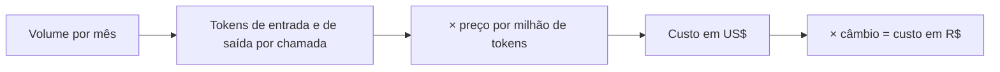
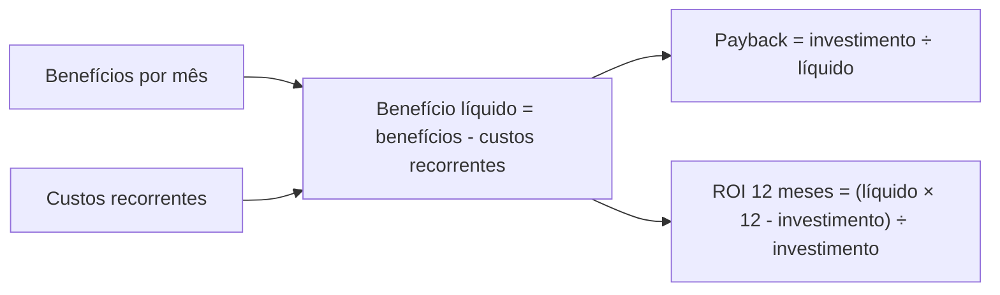

# Módulo 2.5: Economia da IA, ROI e custos

**Nível:** 2, Analista
**Pré-requisitos:** Módulos 2.1 a 2.4
**Esforço estimado:** 12 a 15 horas

---

## Objetivos de aprendizagem

1. Calcular o custo de uso de modelos de IA (tokens) para um caso real.
2. Estimar o **custo total** de uma solução (não só a IA).
3. Quantificar benefícios: tempo, receita, custo evitado, risco.
4. Calcular ROI e payback, e fazer análise de sensibilidade.
5. Escolher o modelo certo pelo equilíbrio custo × qualidade.
6. Apresentar um business case convincente e honesto.

> **Aviso sobre números:** os preços deste módulo servem para treinar o raciocínio e mudam com frequência. Antes de qualquer cálculo real, **consulte a página oficial de preços** do fornecedor e a cotação do dólar do dia.

---

## Aula 1: Como a IA é cobrada

### Modelos de cobrança
| Modelo | Como funciona | Exemplos |
|---|---|---|
| **Assinatura por usuário** | Valor fixo mensal por pessoa | Planos de equipe de assistentes, Copilot, Gemini no Workspace |
| **Uso por token (API)** | Paga pelo volume processado | APIs de modelos |
| **Por tarefa/conversa** | Paga por atendimento, documento, minuto | Plataformas de atendimento, transcrição, voz |
| **Plataforma + uso** | Mensalidade + consumo | Ferramentas de automação, plataformas verticais |
| **Infraestrutura própria** | Servidor/GPU + energia + manutenção | Modelos locais |

### Preço por token: a lógica
Os fornecedores de API cobram por **milhão de tokens (MTok)**, separando:
- **Entrada (input):** tudo o que você envia (instruções + documentos + histórico).
- **Saída (output):** o que o modelo gera, geralmente **várias vezes mais caro** que a entrada.

Recursos que **reduzem custo** (verifique a disponibilidade no fornecedor):
- **Cache de prompt:** partes repetidas do prompt (instruções, catálogo) cobradas com grande desconto quando reutilizadas.
- **Processamento em lote (batch):** tarefas que não precisam de resposta imediata, com desconto significativo.
- **Modelos menores** para tarefas simples.

> 📌 **Em resumo**
> - Formas de cobrança: assinatura por usuário, uso por token, por tarefa, plataforma mais uso e infraestrutura própria.
> - Tokens de saída custam várias vezes mais que os de entrada.
> - Cache, lote e modelos menores reduzem o custo.

**Para ir além**
- [Preços da API do Claude](https://docs.claude.com/en/docs/about-claude/pricing): tabela oficial de preços por milhão de tokens.
- [Cache de prompt](https://docs.claude.com/en/docs/build-with-claude/prompt-caching): como reduzir o custo de contexto repetido.
- [Processamento em lote (batch)](https://docs.claude.com/en/docs/build-with-claude/batch-processing): como pagar menos em tarefas sem urgência.

---

## Aula 2: Calculando o custo de uso (passo a passo)

### Exemplo: classificação e extração de e-mails da Casa Aurora

**Premissas:**
- 200 e-mails/dia × 22 dias = **4.400 e-mails/mês**
- Prompt de instruções + exemplos: **1.500 tokens** (igual em todas as chamadas)
- E-mail médio: **600 tokens**
- Resposta (JSON com categoria e campos): **150 tokens**

**Tokens por mês:**
- Entrada: (1.500 + 600) × 4.400 = **9,24 milhões de tokens**
- Saída: 150 × 4.400 = **0,66 milhão de tokens**

**Preços de referência (US$ por milhão de tokens), Claude em outubro de 2026. Confira a página oficial antes de usar:**
| Modelo | Entrada | Saída |
|---|---|---|
| Pequeno/rápido (ex.: Haiku 4.5) | 1 | 5 |
| Médio (ex.: Sonnet 5.5) | 2 | 10 |
| Grande (ex.: Opus 5.5) | 4 | 20 |

**Custo mensal:**
| Modelo | Entrada | Saída | **Total US$** | **Total R$** (US$ 1 = R$ 5,50, ilustrativo) |
|---|---|---|---|---|
| Pequeno | 9,24 × 1 = 9,24 | 0,66 × 5 = 3,30 | **12,54** | **~R$ 69** |
| Médio | 9,24 × 2 = 18,48 | 0,66 × 10 = 6,60 | **25,08** | **~R$ 138** |
| Grande | 9,24 × 4 = 36,96 | 0,66 × 20 = 13,20 | **50,16** | **~R$ 276** |

**Com cache de prompt** (os 1.500 tokens fixos, quando lidos do cache, custam ~10% do preço normal): a entrada do modelo médio cai de US$ 18,48 para cerca de US$ 6,60, e o total vai para **~US$ 13**.

### Lições do exemplo
1. **O custo de tokens em PME costuma ser pequeno** perto do custo de pessoas. Para tarefas típicas, fala-se em dezenas ou centenas de reais por mês.
2. **A escolha do modelo pode multiplicar o custo por 4 ou mais** (e a diferença entre fornecedores e gerações pode ser ainda maior). Use o menor modelo que atinge a qualidade necessária (medida com evals, Módulo 4.1).
3. **A saída pesa.** Respostas longas (relatórios, textos) encarecem.
4. **Contexto grande repetido pesa.** Colocar o catálogo inteiro em cada chamada é caro; use cache ou busca (RAG).

### Planilha de cálculo
Use o template [`templates/business-case.md`](../templates/business-case.md), ou monte a sua com as colunas: volume/mês, tokens de entrada por chamada, tokens de saída por chamada, preço de entrada, preço de saída, % em cache, desconto do cache, câmbio.

### Esquema da aula

*Figura: o cálculo de custo de uso. Some entrada e saída separadamente, porque têm preços diferentes.*

> 📌 **Em resumo**
> - Custo = volume × tokens por chamada × preço por milhão, separando entrada e saída.
> - Em PMEs, o custo de tokens costuma ser pequeno perto do custo de pessoas.
> - A escolha do modelo e o contexto repetido são as maiores alavancas de custo.

**Para ir além**
- [Preços da API do Claude](https://docs.claude.com/en/docs/about-claude/pricing): tabela oficial de preços por milhão de tokens.

---

## Aula 3: Custo total da solução (TCO)

O custo de tokens é só uma parte. O **custo total de propriedade** inclui:

| Categoria | Itens | Tipo |
|---|---|---|
| **Implantação** | Diagnóstico, desenho, construção, integração, testes, treinamento | Único |
| **Licenças** | Assinaturas de ferramentas, plataformas | Mensal |
| **Uso de IA** | Tokens, minutos de voz, páginas processadas | Mensal (variável) |
| **Infraestrutura** | Hospedagem, banco de dados, domínio, WhatsApp API | Mensal |
| **Manutenção** | Ajustes, atualização de modelos, correções, suporte | Mensal |
| **Pessoas internas** | Tempo da equipe para revisar, alimentar base, supervisionar | Mensal (frequentemente esquecido!) |
| **Mudança** | Tempo de treinamento, queda temporária de produtividade | Único |

### Exemplo: atendimento de WhatsApp com IA (Casa Aurora), valores ilustrativos
| Item | Valor |
|---|---|
| Implantação (construção + integração + testes + treinamento) | R$ 18.000 (único) |
| API oficial do WhatsApp (custo por conversa/mensagem, conforme política vigente da Meta) | R$ 400/mês |
| Uso de IA (tokens) | R$ 350/mês |
| Hospedagem e banco | R$ 150/mês |
| Manutenção e suporte (consultor) | R$ 1.500/mês |
| Tempo interno de supervisão (2 h/semana do Rafael) | R$ 300/mês |
| **Total mensal recorrente** | **R$ 2.700/mês** |

> 📌 **Em resumo**
> - O custo total inclui implantação, licenças, uso, infraestrutura, manutenção, tempo interno e mudança.
> - O tempo da equipe para revisar e supervisionar é o custo mais esquecido.

---

## Aula 4: Quantificando benefícios

### Os 4 tipos de benefício
| Tipo | Como medir | Exemplo |
|---|---|---|
| **1. Tempo economizado** | Horas × custo da hora | 5 h/dia de orçamento economizadas |
| **2. Receita adicional** | Aumento de conversão, ticket, retenção, novos canais | +3 pontos de conversão em orçamentos |
| **3. Custo evitado** | Multas, erros, retrabalho, contratações adiadas | R$ 1.800/mês de juros por atraso eliminados |
| **4. Risco reduzido** | Probabilidade × impacto | Dependência da Célia; vazamento de dados |

### Atenção ao "tempo economizado"
Horas economizadas **só viram dinheiro** se:
- a empresa **deixa de contratar** alguém que precisaria contratar (crescimento sem aumento de equipe);
- as pessoas **realocam** o tempo para atividades que geram receita (ex.: vendedor que deixa de digitar orçamento e passa a ligar para clientes);
- reduz horas extras ou terceirização.

Caso contrário, o ganho é real (qualidade de vida, menos erro), mas **não aparece no caixa**. Seja honesto com o cliente sobre isso.

### Calculando o custo da hora
**Custo da hora** = (salário + encargos + benefícios) ÷ horas trabalhadas no mês

Regra prática para CLT: o custo total costuma ficar entre **1,7 e 2 vezes o salário bruto**, dependendo do regime tributário e dos benefícios. Confirme com o financeiro ou a contabilidade do cliente.

### Exemplo: benefícios do atendimento WhatsApp (Casa Aurora)
| Benefício | Cálculo | Valor/mês |
|---|---|---|
| Tempo economizado nos orçamentos | 60 orç./dia × 17 min economizados × 22 dias = 374 h × R$ 25,57 | R$ 9.560 (mas **só conta se realocado**) |
| Realocação conservadora (50% do tempo vira vendas ativas ou evita uma contratação) | 50% × R$ 9.560 | **R$ 4.780** |
| Aumento de conversão (22% → 25%) | 60 × 22 dias × 3% × ticket R$ 900 × margem 25% | **R$ 8.910** |
| Atendimento fora de horário | (conservador) 3 vendas/semana × 4,3 × R$ 900 × 25% | **R$ 2.900** |
| **Total de benefícios (conservador)** | | **R$ 16.590/mês** |

> Note o uso de **margem**, e não de faturamento, no ganho de vendas. Vender R$ 900 a mais não coloca R$ 900 no bolso, e sim a margem.

> 📌 **Em resumo**
> - Quatro tipos de benefício: tempo economizado, receita adicional, custo evitado e risco reduzido.
> - Horas economizadas só viram dinheiro se forem realocadas ou evitarem contratações.
> - Use margem, e não faturamento, no ganho de vendas.

---

## Aula 5: ROI, payback e sensibilidade

### Fórmulas
- **Benefício líquido mensal** = benefícios mensais − custos recorrentes mensais
- **Payback (meses)** = investimento inicial ÷ benefício líquido mensal
- **ROI em 12 meses** = (benefício líquido × 12 − investimento inicial) ÷ investimento inicial × 100

### Exemplo (Casa Aurora, WhatsApp)
- Benefício líquido = 16.590 − 2.700 = **R$ 13.890/mês**
- Payback = 18.000 ÷ 13.890 = **1,3 mês**
- ROI 12 meses = (13.890 × 12 − 18.000) ÷ 18.000 = **826%**

### Análise de sensibilidade (obrigatória)
Números assim parecem bons demais, e o cliente vai desconfiar. Mostre cenários:

| Cenário | Premissas | Benefício/mês | Líquido/mês | Payback |
|---|---|---|---|---|
| **Pessimista** | Conversão +1 pt; realocação de 20%; fora do horário = 1 venda/sem | R$ 5.850 | R$ 3.150 | 5,7 meses |
| **Base** | Como acima | R$ 16.590 | R$ 13.890 | 1,3 mês |
| **Otimista** | Conversão +5 pts; realocação de 70% | R$ 24.440 | R$ 21.740 | 0,8 mês |

**Pergunta-chave:** "Mesmo no pior cenário, o projeto se paga?" Se sim, a decisão fica fácil para o cliente.

### Seja conservador por padrão
- Use estimativas **abaixo** do que você acredita.
- Explicite **todas as premissas**.
- Prefira medir com um **piloto** antes de projetar para a empresa toda.
- Melhor entregar acima do prometido do que o contrário. Sua reputação depende disso.

### Esquema da aula

*Figura: as fórmulas de payback e ROI a partir do benefício líquido mensal.*

> 📌 **Em resumo**
> - Sempre mostre três cenários: pessimista, base e otimista.
> - A pergunta-chave: mesmo no pior cenário, o projeto se paga?
> - Seja conservador e explicite todas as premissas.

---

## Aula 6: Escolhendo o modelo pelo custo × qualidade

### Processo
1. Monte o conjunto de teste da tarefa (Módulo 4.1).
2. Rode em 2 ou 3 modelos (pequeno, médio, grande).
3. Meça a qualidade (taxa de acerto) e o custo por tarefa.
4. Escolha o **mais barato que atinge a meta de qualidade**.

| Modelo | Acerto | Custo/1.000 tarefas | Decisão |
|---|---|---|---|
| Pequeno | 91% | R$ 15 | ❌ Meta é 95% |
| Médio | 96% | R$ 30 | ✅ **Escolhido** |
| Grande | 97% | R$ 60 | ❌ +1 pt não justifica o dobro do custo |

### Estratégias de otimização
- **Roteamento:** modelo pequeno para os casos fáceis, grande só para os difíceis.
- **Cache** de instruções e documentos fixos.
- **Lote** para tarefas sem urgência (relatórios noturnos, processamento de histórico).
- **Enxugar contexto:** mandar só o necessário.
- **Limitar a saída:** pedir respostas curtas e estruturadas.

> 📌 **Em resumo**
> - Rode o mesmo conjunto de testes em 2 ou 3 modelos e escolha o mais barato que atinge a meta.
> - Roteamento, cache, lote, contexto enxuto e saída curta reduzem o custo.

**Para ir além**
- [Visão geral dos modelos Claude](https://docs.claude.com/en/docs/about-claude/models/overview): nomes, capacidades e janelas de contexto atuais.
- [Cache de prompt](https://docs.claude.com/en/docs/build-with-claude/prompt-caching): como reduzir o custo de contexto repetido.

---

## Aula 7: Apresentando o business case

### Estrutura de uma página
1. **Problema** (com números do AS-IS)
2. **Solução** (em linguagem de negócio, sem jargão)
3. **Investimento** (inicial + mensal)
4. **Retorno** (benefícios com premissas, nos 3 cenários)
5. **Payback e ROI**
6. **Riscos e como serão tratados**
7. **Como vamos medir** (indicadores antes × depois)
8. **Próximo passo** (geralmente um piloto)

### Dicas
- Fale a língua do dono: **reais, clientes, horas, risco**, e não tokens e modelos.
- Mostre o **custo de não fazer** ("hoje vocês perdem cerca de R$ X por mês com...").
- Proponha um **piloto com critério de sucesso** claro ("se em 60 dias a conversão não subir pelo menos 1 ponto, revemos").

> 📌 **Em resumo**
> - Uma página: problema, solução, investimento, retorno, payback, riscos, medição e próximo passo.
> - Fale de reais, clientes, horas e risco, e mostre o custo de não fazer.
> - Proponha um piloto com critério de sucesso claro.

---

## Exercícios de fixação

1. Calcule o custo mensal (com os preços ilustrativos da Aula 2) de resumir **40 reuniões/mês**, com transcrição média de 12.000 tokens, instruções de 800 tokens e resumo de 700 tokens, nos 3 modelos.
2. Calcule o custo da hora de um funcionário com salário de R$ 3.200, fator de encargos de 1,8 e 176 h/mês.
3. Monte o business case completo (benefícios, custos, ROI, payback, 3 cenários) para a **OP-07: conferência de NF-e × pedido** da Casa Aurora. Defina e explicite suas premissas.
4. Explique em 3 frases a um dono de empresa por que "economizar 300 horas por mês" não significa necessariamente "economizar R$ 7.000 por mês".

---

## Laboratório 2.5: Business cases da empresa-laboratório

1. Para as **3 oportunidades prioritárias** (Laboratório 2.3):
   - levante os dados do AS-IS (volumes, tempos, custos, conversões);
   - estime custos (implantação, recorrente, uso de IA com preços **oficiais atuais**);
   - estime benefícios por tipo;
   - calcule ROI e payback em 3 cenários;
   - liste premissas e riscos.
2. Monte a **planilha-modelo** reutilizável (você vai usar em todos os clientes).
3. Escreva o **business case de 1 página** da oportunidade principal.
4. Apresente para o seu contato na empresa e colete objeções. Ajuste.

---

## Entrega de portfólio

1. **Planilha-modelo de business case de IA** (reutilizável).
2. **Business cases** das 3 oportunidades prioritárias.
3. **One-pager** da oportunidade principal.

| Critério | Insuficiente | Bom | Excelente |
|---|---|---|---|
| Custos | Só tokens | TCO completo | TCO + tempo interno + fontes de preço citadas |
| Benefícios | Faturamento como ganho | Margem e tempo | Margem, tempo realocado, custo evitado, risco, com premissas |
| Sensibilidade | Cenário único | 3 cenários | 3 cenários + ponto de equilíbrio ("precisa de X para se pagar") |
| Comunicação | Planilha crua | One-pager | One-pager validado com o cliente, objeções tratadas |

---

## Autoavaliação

**1.** Por que tokens de saída costumam pesar mais no custo que os de entrada?

**2.** Cite 3 técnicas para reduzir o custo de uso de IA sem perder qualidade.

**3.** Por que usar margem, e não faturamento, ao calcular o ganho de vendas adicionais?

**4.** O que é análise de sensibilidade e por que ela aumenta a credibilidade do business case?

**5.** O pequeno modelo acerta 93%, o médio 95%, o grande 96%. A meta é 95%. Qual escolher e por quê?

<strong>Gabarito comentado</strong>

**1.** Porque o preço por token de saída é várias vezes maior (gerar é computacionalmente mais caro que ler), e tarefas de geração produzem muitos tokens.

**2.** Usar o menor modelo que atinge a meta; cache de prompt para partes fixas; processamento em lote para tarefas sem urgência; enxugar o contexto (RAG em vez de enviar tudo); limitar o tamanho da saída; roteamento entre modelos.

**3.** Porque o faturamento adicional tem custos associados (mercadoria, impostos, comissão, frete). O que de fato melhora o resultado da empresa é a margem de contribuição.

**4.** É mostrar o resultado em diferentes cenários de premissas (pessimista, base, otimista). Ela demonstra honestidade, mostra o risco e permite ao cliente ver se o projeto se paga mesmo no pior caso.

**5.** O médio: é o mais barato que atinge a meta. O grande custa mais para um ganho que não é necessário; o pequeno não atinge a meta (a menos que exista revisão humana que compense, mas isso também tem custo).

---

## Para aprofundar

- **Páginas oficiais de preços** das APIs (Anthropic, OpenAI, Google) e a documentação de cache e de batch de cada uma.
- **Calculadoras de tokens** dos fornecedores.
- **Finanças para não financeiros:** conceitos de margem de contribuição, ponto de equilíbrio, ROI e payback (qualquer bom material introdutório, por exemplo os conteúdos do Sebrae).

---

**Anterior:** [Módulo 2.4](2.4-dados-da-empresa.md) | **Próximo:** [Módulo 2.6: Inteligência setorial](2.6-inteligencia-setorial.md)
