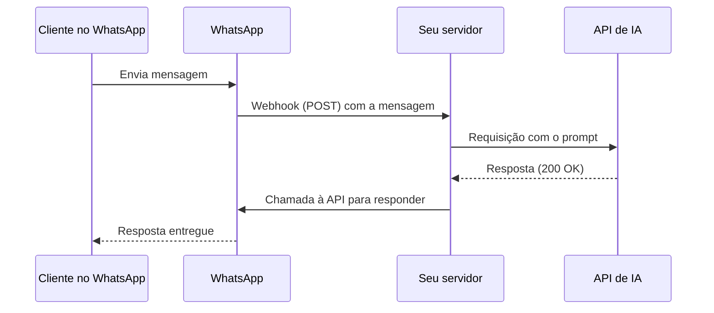
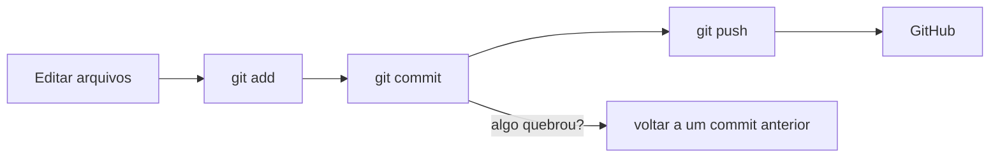

# Módulo 3.1: Fundamentos técnicos

**Nível:** 3, Construtor
**Pré-requisitos:** Nível 2 concluído
**Esforço estimado:** 20 a 30 horas

> **Para quem não é programador:** você não precisa virar desenvolvedor. Precisa **entender o suficiente** para (1) dar boas instruções a agentes de código, (2) ler e avaliar o que eles produzem, (3) diagnosticar problemas e (4) conversar com equipes técnicas. Este módulo dá essa base.

---

## Objetivos de aprendizagem

1. Entender como sistemas se comunicam: cliente/servidor, HTTP, APIs, webhooks.
2. Ler e escrever JSON.
3. Entender o básico de bancos de dados e SQL.
4. Usar o terminal, variáveis de ambiente e gerenciar chaves de API com segurança.
5. Usar Git e GitHub para versionar trabalho.
6. Fazer chamadas à API de um modelo de IA, incluindo saída estruturada.

---

## Aula 1: Como os sistemas conversam

### Cliente e servidor
- **Cliente:** quem pede (seu navegador, um app, um script).
- **Servidor:** quem responde (o sistema da empresa, a API da IA).

### HTTP: a língua da web
Toda comunicação na web é uma **requisição** e uma **resposta**.

**Partes de uma requisição:**
| Parte | O que é | Exemplo |
|---|---|---|
| **Método** | O tipo de ação | `GET` (buscar), `POST` (enviar/criar), `PUT`/`PATCH` (atualizar), `DELETE` (apagar) |
| **URL (endpoint)** | O endereço | `https://api.exemplo.com/v1/produtos/123` |
| **Cabeçalhos (headers)** | Metadados | Autenticação, formato do conteúdo |
| **Corpo (body)** | Os dados enviados | Um JSON com o pedido |

**Códigos de resposta (status) mais importantes:**
| Código | Significado | O que fazer |
|---|---|---|
| **200/201** | Sucesso / criado | Tudo certo |
| **400** | Requisição inválida | Revise os dados enviados |
| **401/403** | Não autenticado / sem permissão | Verifique a chave de API e as permissões |
| **404** | Não encontrado | URL ou recurso errado |
| **429** | Muitas requisições (limite de taxa) | Espere e tente de novo, mais devagar |
| **500/502/503** | Erro no servidor | Problema do outro lado; tente de novo depois |

> Saber ler esses códigos já resolve metade dos problemas que você vai encontrar.

### API (Application Programming Interface)
Uma **API** é um "cardápio" que um sistema oferece para outros sistemas usarem. Ela define:
- quais endpoints existem;
- o que cada um recebe e devolve;
- como autenticar.

**Exemplos de APIs que você vai usar:** API dos modelos de IA, API do WhatsApp Business, API do Gmail/Google Drive, APIs de CRMs, ERPs, gateways de pagamento.

> **Pergunta-chave no diagnóstico:** "Esse sistema tem API?" Se sim, integrar é viável. Se não, veja o Módulo 3.7.

### Webhooks: a API "ao contrário"
- **API:** você pergunta ("tem mensagem nova?").
- **Webhook:** o sistema **avisa você** quando algo acontece ("chegou mensagem nova!"), fazendo um `POST` para uma URL sua.

Exemplo: o WhatsApp Business envia um webhook para o seu servidor a cada mensagem recebida. O servidor processa com IA e responde pela API.

```
Cliente manda mensagem → WhatsApp → [webhook] → Seu servidor → IA → [API] → WhatsApp → Cliente
```

### Esquema da aula



*Figura: webhook e API trabalhando juntos num bot de WhatsApp. O webhook avisa; a API responde.*

> 📌 **Em resumo**
> - Toda comunicação na web é requisição e resposta: método, URL, cabeçalhos e corpo.
> - Saber ler 401, 404, 429 e 5xx já resolve metade dos problemas.
> - API: você pergunta. Webhook: o sistema avisa você.

**Para ir além**
- [HTTP na MDN (em português)](https://developer.mozilla.org/pt-BR/docs/Web/HTTP): referência clara sobre requisições, métodos e códigos de status.

---

## Aula 2: JSON, o formato universal

**JSON** (JavaScript Object Notation) é o formato mais usado para trocar dados entre sistemas e para saídas estruturadas de IA.

```json
{
  "pedido_id": 4521,
  "cliente": {
    "nome": "Maria Souza",
    "telefone": "+55 19 99999-0000"
  },
  "itens": [
    {"produto": "Cimento CP-II 50kg", "quantidade": 30, "preco_unitario": 38.90},
    {"produto": "Areia média (m³)", "quantidade": 2, "preco_unitario": 165.00}
  ],
  "entrega": true,
  "observacao": null
}
```

### Regras
| Elemento | Sintaxe | Exemplo |
|---|---|---|
| Objeto | `{ "chave": valor }` | `{"nome": "Maria"}` |
| Lista (array) | `[ valor, valor ]` | `[1, 2, 3]` |
| Texto (string) | Entre aspas **duplas** | `"Cimento"` |
| Número | Sem aspas, **ponto** decimal | `38.90` |
| Booleano | `true` / `false` | `true` |
| Nulo | `null` | `null` |

**Erros comuns:** aspas simples, vírgula sobrando no último item, vírgula como separador decimal (`38,90`) e comentários (JSON não aceita comentários).

### JSON Schema
É a "especificação" de como um JSON deve ser. Você vai usá-lo para obrigar a IA a responder num formato exato (Aula 6).

```json
{
  "type": "object",
  "properties": {
    "categoria": {"type": "string", "enum": ["ORCAMENTO", "RECLAMACAO", "DUVIDA", "FINANCEIRO", "OUTRO"]},
    "urgente": {"type": "boolean"}
  },
  "required": ["categoria", "urgente"],
  "additionalProperties": false
}
```

> 📌 **Em resumo**
> - JSON tem objetos, listas, textos entre aspas duplas, números com ponto, booleanos e null.
> - Erros comuns: aspas simples, vírgula sobrando e vírgula como separador decimal.
> - JSON Schema descreve o formato exato que você quer receber da IA.

**Para ir além**
- [Saídas estruturadas](https://docs.claude.com/en/docs/build-with-claude/structured-outputs): como garantir respostas em JSON válido.

---

## Aula 3: Bancos de dados e SQL básico

### Por que bancos de dados
Planilhas são ótimas para pessoas; **bancos de dados** são melhores para sistemas: aguentam volume, acesso simultâneo, consistência e consultas rápidas.

### Conceitos
- **Tabela:** como uma aba de planilha (ex.: `produtos`).
- **Linha (registro):** um item (um produto).
- **Coluna (campo):** um atributo (preço).
- **Chave primária:** identificador único (`id`).
- **Relacionamento:** ligação entre tabelas (o `pedido` tem um `cliente_id`).

### Tipos que você vai encontrar
| Tipo | Exemplos | Uso |
|---|---|---|
| **Relacional (SQL)** | PostgreSQL, MySQL, SQLite, SQL Server | Dados estruturados de negócio. Os ERPs usam esse tipo |
| **Documentos (NoSQL)** | MongoDB, Firestore | Dados flexíveis |
| **Vetorial** | pgvector (extensão do PostgreSQL), Pinecone, Qdrant, Chroma | Busca semântica para RAG (Módulo 3.5) |
| **Plataformas "backend pronto"** | Supabase, Firebase | Banco + autenticação + API prontos: ótimo para projetos de PME |

### SQL em 10 minutos
```sql
-- Buscar todos os produtos da categoria "Cimento"
SELECT codigo, descricao, preco, estoque
FROM produtos
WHERE categoria = 'Cimento';

-- Produtos com estoque abaixo do mínimo, ordenados
SELECT descricao, estoque, estoque_minimo
FROM produtos
WHERE estoque < estoque_minimo
ORDER BY estoque ASC;

-- Total vendido por categoria no mês
SELECT p.categoria, SUM(v.quantidade * v.preco) AS total
FROM vendas v
JOIN produtos p ON p.id = v.produto_id
WHERE v.data >= '2026-09-01'
GROUP BY p.categoria
ORDER BY total DESC;
```

| Comando | Faz |
|---|---|
| `SELECT ... FROM` | Busca colunas de uma tabela |
| `WHERE` | Filtra |
| `ORDER BY` | Ordena |
| `JOIN` | Junta tabelas relacionadas |
| `GROUP BY` + `SUM/COUNT/AVG` | Agrega |
| `INSERT`, `UPDATE`, `DELETE` | Cria, altera e apaga (**cuidado!**) |

> **Use IA para escrever SQL**, mas entenda o que a consulta faz antes de executar, principalmente `UPDATE` e `DELETE`. **Nunca** dê a um agente de IA permissão de escrita em banco de produção sem controle (Módulo 4.3).

> 📌 **Em resumo**
> - Tabelas, linhas, colunas, chave primária e relacionamentos são a base dos bancos relacionais.
> - SELECT, WHERE, ORDER BY, JOIN e GROUP BY cobrem a maioria das consultas.
> - Nunca dê a um agente permissão de escrita em banco de produção sem controle.

**Para ir além**
- [SQLBolt](https://sqlbolt.com/): exercícios interativos e gratuitos de SQL.
- [Tutorial de SQL da W3Schools](https://www.w3schools.com/sql/): consulta rápida de comandos com exemplos.

---

## Aula 4: Terminal, ambiente e segredos

### Terminal (linha de comando)
Agentes de código como o Claude Code trabalham no terminal. Comandos essenciais:

| Comando (Mac/Linux) | Windows (PowerShell) | Faz |
|---|---|---|
| `pwd` | `pwd` | Mostra a pasta atual |
| `ls` | `ls` / `dir` | Lista arquivos |
| `cd pasta` | `cd pasta` | Entra na pasta |
| `cd ..` | `cd ..` | Volta uma pasta |
| `mkdir nome` | `mkdir nome` | Cria pasta |
| `cat arquivo` | `cat arquivo` | Mostra o conteúdo |

### Python: ambiente mínimo
Python é a linguagem mais usada em IA e a mais fácil de ler. Instalação recomendada:
1. Instale o Python (versão 3.10 ou superior), em python.org ou pelo gerenciador do sistema.
2. Crie um **ambiente virtual** por projeto (isola as dependências):
   ```bash
   python -m venv .venv
   source .venv/bin/activate      # Mac/Linux
   .venv\Scripts\activate         # Windows
   ```
3. Instale bibliotecas:
   ```bash
   pip install anthropic python-dotenv
   ```

> JavaScript/TypeScript (Node.js) é a outra opção muito usada, principalmente para aplicações web. Os conceitos são os mesmos.

### Variáveis de ambiente e segredos
**Chaves de API são senhas.** Quem tem a sua chave gasta o seu dinheiro e pode acessar os seus dados.

**Regras inegociáveis:**
1. **Nunca** coloque chaves dentro do código.
2. **Nunca** envie chaves para o GitHub (nem em repositório privado).
3. Use **variáveis de ambiente**, num arquivo `.env` local, listado no `.gitignore`.
4. Em produção, use o gerenciador de segredos da plataforma de hospedagem.
5. Crie **chaves separadas** por projeto/cliente, com limite de gasto.
6. Se uma chave vazar: **revogue imediatamente** no painel do fornecedor.

**Arquivo `.env`:**
```
ANTHROPIC_API_KEY=sk-ant-...
```

**Arquivo `.gitignore`:**
```
.env
.venv/
__pycache__/
```

> 📌 **Em resumo**
> - Agentes de código trabalham no terminal: aprenda os comandos básicos.
> - Use um ambiente virtual por projeto em Python.
> - Chaves de API são senhas: ficam no .env, fora do Git, com limite de gasto.

**Para ir além**
- [Tutorial oficial de Python (em português)](https://docs.python.org/pt-br/3/tutorial/): a base da linguagem, direto da fonte.
- [CS50's Introduction to Programming with Python](https://cs50.harvard.edu/python/): curso gratuito de Harvard, muito didático.

---

## Aula 5: Git e GitHub

### Por que versionar
- **Histórico:** voltar a uma versão que funcionava.
- **Segurança:** o código não se perde se o computador quebrar.
- **Colaboração:** trabalhar com outras pessoas e com agentes de código.
- **Portfólio:** seus projetos ficam visíveis (repositórios públicos).

### Conceitos
| Conceito | O que é |
|---|---|
| **Repositório (repo)** | A pasta do projeto, com todo o histórico |
| **Commit** | Uma "fotografia" salva das mudanças, com mensagem |
| **Branch** | Uma linha paralela de trabalho (experimentar sem estragar a principal) |
| **Push / Pull** | Enviar / buscar mudanças no GitHub |
| **Pull Request (PR)** | Proposta de juntar uma branch à principal, com revisão |

### Comandos essenciais
```bash
git init                         # inicia um repositório
git status                       # o que mudou?
git add .                        # prepara as mudanças
git commit -m "Adiciona classificador de e-mails"   # salva
git push                         # envia ao GitHub
git log --oneline                # histórico
git checkout -b nova-funcao      # cria e entra em uma branch
```

> Agentes de código fazem commits por você, mas **você** precisa entender o que está sendo salvo e conseguir voltar atrás.

### Esquema da aula



*Figura: o ciclo básico do Git. Cada commit é uma fotografia para a qual você pode voltar.*

> 📌 **Em resumo**
> - Repositório, commit, branch, push e pull request são os conceitos essenciais.
> - Agentes de código fazem commits, mas você precisa entender o que foi salvo e saber voltar.

**Para ir além**
- [Pro Git (em português)](https://git-scm.com/book/pt-br/v2): livro gratuito e completo sobre Git.

---

## Aula 6: Sua primeira integração com IA via API

### Conta e chave
1. Crie uma conta no console do fornecedor (para a Anthropic: platform.claude.com, antigo console.anthropic.com).
2. Adicione créditos e **configure limite de gasto**.
3. Gere uma chave de API e guarde-a no `.env`.

### Modelos disponíveis (referência de outubro de 2026, **verifique a página oficial**)
| Modelo | ID | Perfil | Preço por milhão de tokens (entrada / saída) |
|---|---|---|---|
| Claude Opus 5.5 | `claude-opus-5-5` | Mais capaz da linha principal | US$ 4 / US$ 20 |
| Claude Sonnet 5.5 | `claude-sonnet-5-5` | Equilíbrio entre capacidade e custo | US$ 2 / US$ 10 |
| Claude Haiku 4.5 | `claude-haiku-4-5` | Rápido e barato, alto volume | US$ 1 / US$ 5 |

Outros fornecedores (OpenAI, Google) têm famílias equivalentes. Os conceitos deste módulo valem para todos.

### Chamada básica (Python)
```python
# primeiro_teste.py
from dotenv import load_dotenv
import anthropic

load_dotenv()                      # carrega ANTHROPIC_API_KEY do .env
client = anthropic.Anthropic()     # lê a chave da variável de ambiente

response = client.messages.create(
    model="claude-opus-5-5",
    max_tokens=1024,
    system="Você é atendente de uma loja de materiais de construção. Responda em até 4 linhas.",
    messages=[
        {"role": "user", "content": "Qual a diferença entre argamassa AC1, AC2 e AC3?"}
    ],
)

# A resposta pode ter vários blocos; pegamos os de texto
for block in response.content:
    if block.type == "text":
        print(block.text)

# Quanto custou? (tokens usados)
print(response.usage.input_tokens, response.usage.output_tokens)
```

Rode com `python primeiro_teste.py`.

**Entenda cada parte:**
- `model`: qual modelo usar.
- `max_tokens`: limite de tamanho da resposta (se for pequeno demais, a resposta é cortada).
- `system`: o prompt de sistema (Módulo 1.2).
- `messages`: a conversa. A API **não guarda histórico**: para continuar uma conversa, você reenvia as mensagens anteriores.
- `response.usage`: tokens consumidos, a base do cálculo de custo (Módulo 2.5).

### Saída estruturada com JSON Schema
Para automações, obrigue a resposta a seguir um formato exato:

```python
# classificar.py
import json
from dotenv import load_dotenv
import anthropic

load_dotenv()
client = anthropic.Anthropic()

SCHEMA = {
    "type": "object",
    "properties": {
        "categoria": {
            "type": "string",
            "enum": ["ORCAMENTO", "RECLAMACAO", "DUVIDA_TECNICA", "FINANCEIRO", "OUTRO"],
        },
        "urgente": {"type": "boolean"},
        "resumo": {"type": "string"},
    },
    "required": ["categoria", "urgente", "resumo"],
    "additionalProperties": False,
}

def classificar(mensagem: str) -> dict:
    response = client.messages.create(
        model="claude-opus-5-5",
        max_tokens=1024,
        system=(
            "Você classifica mensagens de clientes de uma loja de materiais de construção. "
            "Marque urgente=true apenas para reclamações de entrega/produto ou problemas de pagamento "
            "com prazo vencendo. O resumo deve ter no máximo 15 palavras."
        ),
        messages=[{"role": "user", "content": mensagem}],
        output_config={"format": {"type": "json_schema", "schema": SCHEMA}},
    )
    if response.stop_reason == "refusal":       # o modelo recusou o pedido
        return {"categoria": "OUTRO", "urgente": False, "resumo": "RECUSADO - revisar manualmente"}
    texto = next(b.text for b in response.content if b.type == "text")
    return json.loads(texto)

print(classificar("o motorista largou o porcelanato na chuva e metade molhou!!! quero troca"))
# {"categoria": "RECLAMACAO", "urgente": true, "resumo": "..."}
```

**Por que isso é poderoso:** com o formato garantido, o resultado pode ser gravado direto num banco, numa planilha ou disparar outra ação, sem uma pessoa no meio.

### Boas práticas de produção (que você vai cobrar dos agentes de código)
- **Tratar erros:** limite de taxa (429), servidor indisponível (5xx) e recusas (`stop_reason == "refusal"`). O SDK já faz algumas novas tentativas automaticamente.
- **Recusa com fallback:** a API da Anthropic permite que um pedido recusado seja refeito automaticamente em outro modelo (parâmetro `fallbacks`, recurso beta). Consulte a documentação ao montar soluções de produção.
- **Registrar (logar)** entradas, saídas, tokens e erros (Módulo 4.2).
- **Não enviar dados desnecessários** (LGPD e custo).
- **Definir tempo máximo de espera** e o que fazer quando falha.

> 📌 **Em resumo**
> - Crie conta, adicione créditos, configure limite de gasto e guarde a chave no .env.
> - A API não guarda histórico: para continuar a conversa, reenvie as mensagens.
> - Saída estruturada com JSON Schema permite gravar o resultado direto num sistema.
> - Trate recusas, limites de taxa e erros de servidor, e registre tokens usados.

**Para ir além**
- [Primeiros passos com a API do Claude](https://docs.claude.com/en/docs/get-started): criar conta, chave e fazer a primeira chamada.
- [Saídas estruturadas](https://docs.claude.com/en/docs/build-with-claude/structured-outputs): como garantir respostas em JSON válido.
- [Visão geral dos modelos Claude](https://docs.claude.com/en/docs/about-claude/models/overview): nomes, capacidades e janelas de contexto atuais.

---

## Exercícios de fixação

1. Escreva em JSON um pedido com: cliente (nome, CPF mascarado), 3 itens, endereço de entrega e forma de pagamento.
2. Encontre os 3 erros neste JSON: `{'nome': 'Ana', "valor": 10,50, "itens": [1, 2, 3,]}`
3. Escreva uma consulta SQL que retorne os 10 clientes que mais compraram em valor no último trimestre (tabelas `clientes` e `vendas`).
4. Explique com suas palavras a diferença entre API e webhook, com um exemplo de atendimento por WhatsApp.
5. Você recebeu erro 429 ao rodar seu script em 1.000 e-mails. O que significa e o que fazer?
6. Por que uma chave de API não pode ir para o GitHub, mesmo em repositório privado?

---

## Laboratório 3.1: Classificador de mensagens em lote

**Objetivo:** construir seu primeiro script real, que lê mensagens de clientes de uma planilha, classifica com IA e salva o resultado.

**Passo a passo:**
1. Prepare o ambiente: Python, ambiente virtual, `anthropic` e `python-dotenv` instalados, chave no `.env`, `.gitignore` criado.
2. Crie (ou gere com IA) um arquivo `mensagens.csv` com **50 mensagens** reais (anonimizadas) ou simuladas da empresa-laboratório. Colunas: `id`, `mensagem`.
3. Escreva (pode pedir ajuda a um assistente de IA, mas **entenda cada linha**) um script que:
   - leia o CSV;
   - classifique cada mensagem com a função `classificar` da Aula 6;
   - salve `mensagens_classificadas.csv` com as colunas originais + `categoria`, `urgente`, `resumo`;
   - mostre no final: total por categoria, quantas urgentes, tokens totais e custo estimado.
4. **Avalie a qualidade:** classifique manualmente as 50 mensagens antes (o seu "gabarito") e compare. Qual a taxa de acerto?
5. Ajuste o prompt para melhorar e rode de novo.
6. Crie um repositório no GitHub e faça commits a cada etapa (sem a chave!).

**Desafio extra:** rode as mesmas 50 mensagens com `claude-haiku-4-5` e com `claude-opus-5-5`. Compare acerto e custo. Qual você recomendaria e por quê?

---

## Entrega de portfólio

**Repositório no GitHub** com:
- o script do classificador;
- um README explicando o que faz, como rodar e os resultados (acerto, custo);
- o histórico de commits mostrando a evolução;
- **nenhuma chave ou dado pessoal real**.

| Critério | Insuficiente | Bom | Excelente |
|---|---|---|---|
| Funciona | Não roda | Roda | Roda, trata erros e mostra custo |
| Qualidade medida | Não medida | Taxa de acerto calculada | Acerto + comparação de modelos + melhoria documentada |
| Segurança | Chave no código | Chave no .env | .env + .gitignore + dados anonimizados |
| Documentação | Sem README | README básico | README claro, para outra pessoa conseguir rodar |

---

## Autoavaliação

**1.** O que significam os códigos 401, 404, 429 e 500?

**2.** A API de IA "lembra" das mensagens anteriores? Como manter uma conversa?

**3.** Para que serve o JSON Schema numa chamada à IA?

**4.** Onde guardar uma chave de API em desenvolvimento e em produção?

**5.** O que é um webhook e por que ele é central em bots de WhatsApp?

**6.** Por que você deve entender o SQL que a IA escreve antes de executá-lo?

<details>
<summary><strong>Gabarito comentado</strong></summary>

**1.** 401: não autenticado (chave inválida/ausente). 404: recurso/URL não encontrado. 429: limite de requisições excedido (espere e reduza o ritmo). 500: erro interno do servidor (problema do outro lado; tente depois).

**2.** Não. A API é sem estado (stateless). Para manter uma conversa, você reenvia todo o histórico relevante em `messages` a cada chamada, ou mantém resumos/memória num banco e insere no contexto.

**3.** Para garantir que a resposta siga exatamente uma estrutura (campos, tipos, valores permitidos), de modo que um programa possa processá-la de forma confiável.

**4.** Desenvolvimento: arquivo `.env` local, listado no `.gitignore`. Produção: gerenciador de segredos/variáveis de ambiente da plataforma de hospedagem. Nunca no código nem no repositório.

**5.** É uma notificação automática que um sistema envia para uma URL sua quando ocorre um evento. No WhatsApp Business, cada mensagem recebida gera um webhook para o seu servidor, que então processa e responde. Sem webhook, você teria que perguntar o tempo todo se há mensagens novas.

**6.** Porque consultas de alteração (`UPDATE`, `DELETE`) podem apagar ou corromper dados de forma irreversível, e mesmo consultas de leitura podem estar logicamente erradas (ex.: `JOIN` incorreto duplicando valores), gerando decisões erradas.

</details>

---

## Para aprofundar

- **Documentação da API da Anthropic** (docs.claude.com / platform.claude.com/docs): "Get started", "Messages", "Structured outputs".
- **Curso gratuito de Python:** "Python para Zumbis" (Fernando Masanori, em português) ou o tutorial oficial em python.org.
- **SQL:** SQLBolt (exercícios interativos gratuitos) ou o "SQL Tutorial" do W3Schools.
- **Git:** o livro *Pro Git* (gratuito, git-scm.com/book, com versão em português).
- **HTTP:** a documentação da MDN (developer.mozilla.org) sobre HTTP, em português.

---

**Anterior:** [Projeto Integrador 2](../nivel-2-analista/projeto-integrador-2.md) | **Próximo:** [Módulo 3.2: Construir com agentes de código](3.2-agentes-de-codigo.md)
