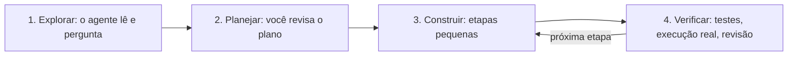

# Módulo 3.2: Construir com agentes de código

**Nível:** 3, Construtor
**Pré-requisitos:** Módulo 3.1
**Esforço estimado:** 25 a 35 horas

---

## Objetivos de aprendizagem

1. Entender o que são agentes de código e como trabalham.
2. Usar um fluxo de trabalho confiável: **explorar → planejar → construir → verificar**.
3. Escrever **especificações** que geram bons resultados.
4. Configurar o projeto com arquivos de instrução (ex.: `CLAUDE.md`).
5. Revisar, testar e depurar o que o agente produz.
6. Decidir quando usar agentes de código e quando usar ferramentas visuais (n8n, Make, Zapier).
7. Construir e entregar a primeira automação real.

---

## Aula 1: O que muda com os agentes de código

### O que são
Agentes de código (Claude Code, OpenAI Codex, Cursor, GitHub Copilot em modo agente e similares) são assistentes que:
- **leem** os arquivos do projeto;
- **escrevem e editam** código;
- **executam** comandos (instalar bibliotecas, rodar testes, executar o programa);
- **observam os erros** e corrigem;
- **usam Git** (commits, branches, pull requests);
- trabalham em ciclos até concluir a tarefa.

### O que isso significa para você
| Antes | Agora |
|---|---|
| Integração sob medida = contratar desenvolvedor, semanas, dezenas de milhares de reais | Integração simples = horas ou dias, feita por você com o agente |
| Plataformas no-code eram a única opção para não programadores | Você constrói código real, flexível, sem mensalidade de plataforma |
| O gargalo era escrever código | O gargalo é **especificar bem, verificar e operar** |

### O que **não** mudou
- Você ainda é responsável pelo que vai para produção.
- Código precisa ser hospedado, monitorado e mantido (Módulo 4.2).
- Segurança e LGPD continuam sendo sua responsabilidade (Módulos 4.3 e 4.4).
- Sistemas complexos e críticos ainda pedem engenheiros experientes.

> **Seu novo papel:** você é o **arquiteto e o revisor**. O agente é um desenvolvedor muito rápido que precisa de direção clara e revisão.

> 📌 **Em resumo**
> - Agentes de código leem, escrevem, executam e corrigem código em ciclos.
> - O gargalo deixou de ser escrever código e passou a ser especificar, verificar e operar.
> - Você é o arquiteto e o revisor; o agente é um desenvolvedor rápido que precisa de direção.

**Para ir além**
- [Documentação do Claude Code](https://code.claude.com/docs): instalação, CLAUDE.md, permissões, hooks e skills.

---

## Aula 2: O fluxo de trabalho confiável

### As 4 fases
```
1. EXPLORAR  → O agente lê o projeto/contexto e entende o que existe
2. PLANEJAR  → O agente propõe um plano; você revisa e ajusta ANTES de codificar
3. CONSTRUIR → O agente implementa em etapas pequenas
4. VERIFICAR → Testes, execução real, revisão do código, conferência do resultado
```

### Fase 1: Explorar
> "Leia os arquivos deste projeto e me explique como ele está organizado. Ainda não altere nada."

Em projeto novo, explique o contexto de negócio:
> "Vamos construir uma automação para a Casa Aurora, loja de materiais de construção. Antes de qualquer código, leia o arquivo `contexto.md` e me faça as perguntas que precisar."

### Fase 2: Planejar
> "Proponha um plano de implementação em etapas, com os arquivos que serão criados, as bibliotecas e como vamos testar. Não implemente ainda."

**Revise o plano com olhar crítico:**
- Está resolvendo o problema certo?
- Está complexo demais? (agentes às vezes "superconstroem")
- Como lida com erros e exceções?
- Onde ficam as chaves e os dados sensíveis?
- Como vamos saber que funciona?

A maioria dos agentes tem um **modo de planejamento**, que só propõe e não altera arquivos. Use-o.

### Fase 3: Construir em etapas pequenas
Peça uma etapa por vez, verificando cada uma:
> "Implemente a etapa 1 (leitura dos e-mails). Rode com 3 e-mails de teste e me mostre o resultado."

**Por que etapas pequenas:** quando algo dá errado, fica fácil saber o quê. Pedidos gigantes geram código gigante e difícil de revisar.

### Fase 4: Verificar
- **Rode de verdade**, com dados reais (ou realistas).
- **Peça testes automatizados:** "Escreva testes para a função de extração cobrindo boleto normal, boleto com campo ilegível e arquivo que não é boleto."
- **Revise o código** (Aula 5).
- **Confira o resultado de negócio:** os dados extraídos estão certos? A mensagem enviada faz sentido?

### Esquema da aula



*Figura: as quatro fases do fluxo confiável. Corrigir o plano custa minutos; corrigir código construído errado custa horas.*

> 📌 **Em resumo**
> - Explorar, planejar, construir em etapas pequenas e verificar.
> - Use o modo de planejamento e revise o plano com olhar crítico.
> - Verifique com execução real, testes e conferência do resultado de negócio.

**Para ir além**
- [Boas práticas com o Claude Code](https://www.anthropic.com/engineering/claude-code-best-practices): o fluxo explorar, planejar, codificar e verificar na prática.

---

## Aula 3: Especificações que funcionam

O agente é tão bom quanto a sua especificação. Use o template [`templates/especificacao-solucao.md`](../templates/especificacao-solucao.md).

### Estrutura de uma boa especificação
```markdown
# Especificação: Extrator de boletos da Casa Aurora

## Contexto de negócio
A Casa Aurora recebe ~15 boletos por dia por e-mail (caixa financeiro@...).
Hoje um assistente abre cada e-mail, lê o boleto e digita na planilha de
contas a pagar. Atrasos geram ~R$ 1.800/mês de juros.

## Objetivo
Automatizar a leitura dos boletos e o registro na planilha, com alerta de vencimentos.

## Escopo
### Faz
- Lê e-mails não lidos com anexo PDF da caixa financeiro@
- Extrai: beneficiário, CNPJ, valor, vencimento, linha digitável
- Registra numa planilha Google (aba "A pagar")
- Marca o e-mail com a etiqueta "Processado"
- Envia resumo diário às 8h com os vencimentos dos próximos 3 dias

### Não faz (fora do escopo)
- Não paga boletos
- Não processa boletos recebidos por WhatsApp (fase 2)

## Regras de negócio
- Boleto com valor acima de R$ 10.000: marcar "REVISAR" e notificar o Marcos
- Se algum campo não for lido com confiança: marcar "REVISAR"
- Não registrar duplicado (mesma linha digitável)

## Dados e integrações
- Gmail API (leitura e etiquetas)
- Google Sheets API (escrita)
- API Claude para extração (saída estruturada)

## Requisitos não funcionais
- Rodar a cada 30 minutos em horário comercial
- Registrar log de cada processamento
- Chaves em variáveis de ambiente
- Custo de IA estimado < R$ 50/mês

## Critérios de aceite
- [ ] Processa corretamente 20 boletos de teste (taxa de acerto ≥ 95% nos campos)
- [ ] Não duplica registros
- [ ] Boletos ilegíveis vão para "REVISAR"
- [ ] Resumo diário chega no e-mail certo
- [ ] README explica como instalar, configurar e operar

## Exemplos
(anexar 3 boletos de exemplo anonimizados e o resultado esperado)
```

### Princípios
1. **Contexto de negócio primeiro.** O agente toma decisões melhores quando entende o porquê.
2. **Escopo com "não faz".** Evita que o agente invente funcionalidades.
3. **Regras explícitas**, especialmente as de exceção.
4. **Critérios de aceite verificáveis.** "Funcionar bem" não é critério.
5. **Exemplos reais** de entrada e saída esperada.

> 📌 **Em resumo**
> - Contexto de negócio primeiro: o agente decide melhor quando entende o porquê.
> - Escopo com "não faz", regras de exceção, critérios de aceite verificáveis e exemplos reais.

**Para ir além**
- [Boas práticas com o Claude Code](https://www.anthropic.com/engineering/claude-code-best-practices): o fluxo explorar, planejar, codificar e verificar na prática.

---

## Aula 4: Configurando o projeto para o agente

### Arquivo de instruções do projeto
Agentes de código leem automaticamente um arquivo de instruções na raiz do projeto: no Claude Code, o **`CLAUDE.md`**; outros agentes usam nomes como `AGENTS.md`. Ele funciona como o "prompt de sistema" do projeto.

**Exemplo de `CLAUDE.md`:**
```markdown
# Projeto: Automações Casa Aurora

## Sobre
Automações de IA para a Casa Aurora (loja de materiais de construção, ~28 funcionários).
Usuários finais não são técnicos: mensagens de erro e relatórios em português simples.

## Stack
- Python 3.12, ambiente virtual em .venv
- Bibliotecas: anthropic, google-api-python-client, python-dotenv
- Testes: pytest

## Comandos
- Instalar: `pip install -r requirements.txt`
- Testar: `pytest`
- Rodar extrator: `python -m automacoes.boletos`

## Regras
- Nunca colocar chaves no código; usar variáveis de ambiente (.env)
- Nunca usar dados reais de clientes em testes; usar a pasta tests/exemplos/
- Toda chamada à IA deve registrar tokens usados no log
- Funções pequenas, com nomes em português
- Antes de concluir uma tarefa, rodar os testes
```

### Outras configurações úteis
- **Permissões:** defina o que o agente pode fazer sem pedir (ex.: rodar testes) e o que exige aprovação (ex.: apagar arquivos, acessar a internet, comandos de deploy).
- **Comandos e skills personalizados:** tarefas recorrentes empacotadas (ex.: "criar nova automação no padrão do projeto"). Veja o Módulo 3.4.
- **Conexões MCP:** dar ao agente acesso a ferramentas (banco de dados, documentação). Também no Módulo 3.4.

> 📌 **Em resumo**
> - O CLAUDE.md é o prompt de sistema do projeto: contexto, stack, comandos e regras.
> - Configure permissões: o que o agente faz sozinho e o que exige aprovação.

**Para ir além**
- [Documentação do Claude Code](https://code.claude.com/docs): instalação, CLAUDE.md, permissões, hooks e skills.

---

## Aula 5: Revisando o que o agente produziu

Você não precisa escrever código, mas precisa **conseguir avaliá-lo**.

### Checklist de revisão para não programadores
**Faça o agente explicar:**
> "Explique, em português simples, o que cada arquivo faz e o fluxo completo de execução."
> "Quais situações de erro esse código trata? Quais não trata?"
> "Que dados saem da empresa e para onde vão?"

**Verifique:**
- [ ] Há chaves, senhas ou dados reais escritos no código? (deve ser **não**)
- [ ] O que acontece se a API da IA falhar? E se o e-mail vier sem anexo?
- [ ] Há algum `DELETE`, sobrescrita de arquivo ou ação irreversível? Está protegida?
- [ ] O código registra logs suficientes para entender um problema depois?
- [ ] Os testes cobrem os casos de exceção da especificação?
- [ ] O README permite que outra pessoa rode o projeto?
- [ ] Há dependências desnecessárias ou complexidade sem motivo?

**Peça uma segunda opinião:**
> "Faça uma revisão crítica deste código como um engenheiro sênior focado em segurança e confiabilidade. Liste problemas por gravidade."

Uma sessão nova (sem o viés de quem escreveu) costuma encontrar mais problemas.

### Sinais de alerta
- O agente diz que "funcionou" sem mostrar a execução.
- Testes que foram alterados para passar (em vez de corrigir o código).
- Tratamento de erro que "engole" falhas silenciosamente.
- Código muito maior do que o problema exige.

> 📌 **Em resumo**
> - Peça ao agente para explicar o código em português simples e listar os erros que não trata.
> - Procure chaves no código, ações irreversíveis sem proteção e testes alterados para passar.
> - Uma sessão nova, sem o viés de quem escreveu, encontra mais problemas.

---

## Aula 6: Depuração com o agente

Quando algo não funciona:
1. **Copie o erro completo** (a mensagem inteira, não um resumo).
2. **Dê contexto:** o que você fez, o que esperava, o que aconteceu.
3. **Peça diagnóstico antes de correção:**
   > "Aqui está o erro. Antes de corrigir, explique a causa provável e como confirmar."
4. **Reproduza com o menor caso possível** (um e-mail, um boleto).
5. **Uma correção por vez**, com teste.
6. Se o agente entrar em círculos (tenta, falha, tenta de novo igual): **pare**, recomece numa sessão nova com um resumo do problema, ou divida o problema em partes menores.

> 📌 **Em resumo**
> - Copie o erro completo, dê contexto e peça diagnóstico antes da correção.
> - Reproduza com o menor caso possível e corrija uma coisa por vez.
> - Se o agente entrar em círculos, recomece com um resumo do problema.

---

## Aula 7: Agentes de código × plataformas visuais (n8n, Make, Zapier)

| Critério | Agentes de código | Plataformas visuais |
|---|---|---|
| **Flexibilidade** | Total | Limitada aos conectores e blocos disponíveis |
| **Custo recorrente** | Hospedagem (baixo) | Mensalidade por execução/fluxo (pode escalar) |
| **Velocidade de construção** | Muito rápida com agente | Rápida para fluxos simples |
| **Quem mantém** | Precisa de alguém que entenda o básico de código | Usuário de negócio consegue ajustar |
| **Visibilidade** | Logs e código | Fluxo visual, fácil de explicar |
| **Lógica complexa** | Excelente | Fica confusa rapidamente |
| **Testes e versionamento** | Nativos (Git, testes) | Limitados |
| **Dependência** | Baixa (código é seu) | Alta (fluxo preso à plataforma) |

### Quando escolher cada um
- **Agentes de código** (padrão recomendado): lógica de negócio específica, volume relevante, necessidade de testes, integrações sob medida, custo recorrente baixo, solução que é ativo do cliente.
- **Plataforma visual:** o cliente quer **ajustar sozinho** fluxos simples; equipe sem nenhum apoio técnico; protótipo rapidíssimo entre conectores prontos; empresa que já usa e domina a plataforma.
- **Híbrido:** plataforma visual para orquestrar o fluxo simples e código (uma função na nuvem) para a parte complexa.

> **A pergunta que decide:** "Depois que eu entregar, quem vai manter isso funcionando?" Se a resposta for "ninguém técnico", você precisa de um contrato de manutenção (Módulo 5.4) ou de uma solução que o cliente consiga operar.

> 📌 **Em resumo**
> - Agentes de código: flexibilidade, custo recorrente baixo, testes e versionamento.
> - Plataformas visuais: o cliente ajusta sozinho fluxos simples.
> - A pergunta que decide: depois de entregar, quem vai manter isso funcionando?

---

## Aula 8: Boas práticas e armadilhas

| Prática | Por quê |
|---|---|
| Commits frequentes | Voltar atrás quando algo quebra |
| Uma tarefa por sessão | Contexto limpo, menos confusão |
| Sessão nova quando o contexto fica longo e confuso | O agente "se perde" em conversas muito longas |
| Especificação e CLAUDE.md versionados | Qualquer um (inclusive outro agente) retoma o projeto |
| Dados de teste anonimizados | LGPD |
| Ambiente de teste separado de produção | Não estragar dados reais |
| Pedir explicações | Você aprende e mantém o controle |

**Armadilhas:**
- Aceitar sem testar ("parece certo").
- Deixar o agente com permissão total em computador com dados sensíveis.
- Construir algo grande antes de validar a pequena versão com o usuário.
- Esquecer que **você** responde pelo que entrega.

> 📌 **Em resumo**
> - Commits frequentes, uma tarefa por sessão, CLAUDE.md versionado e dados de teste anonimizados.
> - Não aceite sem testar e não dê permissão total em computador com dados sensíveis.
> - Você responde pelo que entrega.

**Para ir além**
- [Boas práticas com o Claude Code](https://www.anthropic.com/engineering/claude-code-best-practices): o fluxo explorar, planejar, codificar e verificar na prática.

---

## Exercícios de fixação

1. Escreva a especificação completa (usando o template) para a **OP-03: follow-up automático de orçamentos** da Casa Aurora.
2. Escreva um `CLAUDE.md` para um projeto de automações da sua empresa-laboratório.
3. Liste 5 perguntas que você faria ao agente para revisar um código que envia mensagens de cobrança a clientes.
4. Para 3 cenários, decida entre agente de código, plataforma visual ou híbrido, e justifique:
   a) Escritório de 5 pessoas quer receber no Slack um resumo de cada formulário do site.
   b) Distribuidora quer extrair 300 pedidos/dia de PDFs variados e lançar no ERP via API.
   c) Clínica quer confirmar consultas por WhatsApp e atualizar a agenda.

---

## Laboratório 3.2: Primeira automação real

**Objetivo:** construir, com um agente de código, uma automação completa para a empresa-laboratório, seguindo as 4 fases.

**Sugestões** (escolha uma das oportunidades priorizadas no Nível 2, ou):
- **Extrator de boletos/notas** (e-mail → IA → planilha → alerta)
- **Triagem da caixa de e-mail** (classificar, etiquetar, resumir para o responsável)
- **Resumo automático de reuniões** (gravação → transcrição → resumo → tarefas → e-mail)

**Passo a passo:**
1. Escreva a **especificação** completa.
2. Crie o repositório e o `CLAUDE.md`.
3. **Explorar:** apresente a especificação ao agente e responda às perguntas dele.
4. **Planejar:** peça o plano, revise e ajuste. Registre o plano final.
5. **Construir** em etapas, com commits a cada etapa.
6. **Verificar:**
   - testes automatizados;
   - execução com pelo menos 20 casos realistas;
   - revisão com o checklist da Aula 5;
   - revisão crítica por uma sessão nova do agente.
7. **Validar com o usuário** da empresa: ele usa por 1 a 2 semanas (mesmo que você rode manualmente) e dá feedback.
8. **Documente:** README, decisões tomadas, resultados medidos.

---

## Entrega de portfólio

1. **Repositório** da automação (especificação, CLAUDE.md, código, testes, README).
2. **Relatório curto** (1 a 2 páginas): problema, solução, resultados (acerto, tempo economizado, custo), aprendizados.
3. **Template de especificação** que você refinou com a experiência (vira ferramenta do seu método).

| Critério | Insuficiente | Bom | Excelente |
|---|---|---|---|
| Processo | Pediu tudo de uma vez | Seguiu as 4 fases | 4 fases documentadas, plano revisado, commits por etapa |
| Qualidade | Funciona no caso feliz | Testes + casos de exceção | Testes + revisão crítica + métricas de acerto |
| Valor | Demonstração | Usada pelo cliente | Usada pelo cliente, com resultado medido e feedback |

---

## Autoavaliação

**1.** Quais são as 4 fases do fluxo de trabalho com agentes de código?

**2.** Por que pedir um plano antes de deixar o agente codificar?

**3.** O que deve conter uma especificação? Cite 5 elementos.

**4.** Para que serve o `CLAUDE.md`?

**5.** O agente diz "pronto, está funcionando". O que você faz?

**6.** Quando uma plataforma visual (n8n, Make) ainda é a melhor escolha?

<details>
<summary><strong>Gabarito comentado</strong></summary>

**1.** Explorar, planejar, construir (em etapas pequenas) e verificar.

**2.** Porque corrigir um plano custa minutos e corrigir código construído sobre premissas erradas custa horas. O plano revela mal-entendidos, excesso de complexidade e lacunas (tratamento de erros, segurança) antes de virarem código.

**3.** Contexto de negócio, objetivo, escopo (faz / não faz), regras de negócio e exceções, dados e integrações, requisitos não funcionais, critérios de aceite verificáveis e exemplos de entrada/saída.

**4.** É o arquivo de instruções permanentes do projeto, lido automaticamente pelo agente: contexto, stack, comandos, padrões e regras (como "nunca colocar chaves no código"). Garante consistência entre sessões e permite que qualquer pessoa ou agente retome o projeto.

**5.** Pede para ver a execução real, roda você mesmo com casos realistas (incluindo exceções), verifica os testes (e se não foram alterados para "passar"), revisa com o checklist e confere o resultado de negócio.

**6.** Quando o cliente quer manter e ajustar sozinho fluxos simples, não há nenhum apoio técnico para manter código, a empresa já domina a plataforma, ou para prototipar muito rapidamente com conectores prontos.

</details>

---

## Para aprofundar

- **Documentação do Claude Code** (code.claude.com/docs): melhores práticas, CLAUDE.md, permissões, hooks e skills.
- **Documentação do OpenAI Codex** e de outros agentes que você usar.
- **Engenharia de software para não engenheiros:** aprenda o conceito de testes automatizados (pytest em Python) e de revisão de código.
- **Prática:** reconstrua o classificador do Módulo 3.1 inteiramente com o agente, seguindo as 4 fases, e compare com a versão anterior.

---

**Anterior:** [Módulo 3.1](3.1-fundamentos-tecnicos.md) | **Próximo:** [Módulo 3.3: Arquitetura de soluções de IA](3.3-arquitetura-de-solucoes.md)
