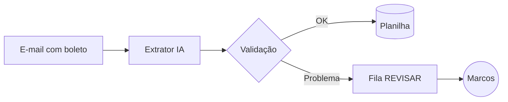

# Módulo 3.3: Arquitetura de soluções de IA

**Nível:** 3, Construtor
**Pré-requisitos:** Módulos 3.1 e 3.2
**Esforço estimado:** 15 a 20 horas

> Este módulo transforma você de "quem faz automações" em **quem desenha estruturas de IA**. A arquitetura é a decisão mais importante e mais cara de errar.

---

## Objetivos de aprendizagem

1. Conhecer os **7 padrões de arquitetura** de soluções de IA e quando usar cada um.
2. Combinar padrões em soluções completas.
3. Desenhar diagramas de arquitetura claros (componentes, fluxo de dados, pontos de falha).
4. Tomar e documentar decisões de arquitetura com justificativa.
5. Aplicar o princípio da **simplicidade suficiente**.

---

## Aula 1: O princípio da simplicidade suficiente

> **Use a arquitetura mais simples que resolve o problema com a qualidade necessária.**

A escada da complexidade:
```
Nível 1: Prompt único em assistente pronto           (mais simples)
Nível 2: Chamada única de API (classificar, extrair)
Nível 3: Workflow (etapas fixas encadeadas)
Nível 4: RAG (busca em base de conhecimento)
Nível 5: Agente (decide que ferramentas usar)
Nível 6: Multiagente                                 (mais complexo)
```

Cada degrau acima traz **mais capacidade**, mas também **mais custo, latência, imprevisibilidade e manutenção**. Suba apenas quando o degrau de baixo comprovadamente não resolve.

**Antes de propor um agente, pergunte:**
- A tarefa tem etapas previsíveis? → **Workflow** basta.
- O erro pode ser detectado e corrigido? Se não, mantenha um humano no loop.
- O valor justifica o custo e a imprevisibilidade?

---

## Aula 2: Os 7 padrões

### Padrão 1: Assistente
**O que é:** uma pessoa conversa com a IA, que tem instruções e documentos da empresa.
```
Pessoa ⇄ [IA + instruções + documentos]
```
**Quando usar:** apoio a tarefas variadas, baixo volume por tarefa, pessoa sempre revisa.
**Exemplos:** assistente do vendedor, assistente de RH, assistente de redação.
**Construção:** Projetos/GPTs (Módulo 1.3) ou interface própria com API.
**Riscos:** baixos (há sempre uma pessoa no meio).

### Padrão 2: Classificador/Extrator (chamada única)
**O que é:** entra um texto ou documento e sai um dado estruturado.
```
Entrada (texto/PDF/imagem) → [IA + schema] → JSON → Sistema
```
**Quando usar:** triagem, categorização, extração de campos, alto volume.
**Exemplos:** classificar e-mails, extrair dados de boletos e notas, ler currículos.
**Construção:** API com saída estruturada (Módulo 3.1).
**Riscos:** erros silenciosos em escala → validação + amostragem + revisão das incertezas.

### Padrão 3: Workflow (cadeia de etapas fixas)
**O que é:** sequência predefinida de etapas, algumas com IA, outras com código comum.
```
Gatilho → [Etapa 1: IA extrai] → [Etapa 2: código valida] → [Etapa 3: IA redige] → [Etapa 4: código envia]
```
**Variações:**
- **Sequencial:** A → B → C
- **Roteamento:** classifica e envia para o caminho especializado
- **Paralelo:** várias análises ao mesmo tempo e depois consolida
- **Gerar e revisar:** uma etapa gera, outra critica, a primeira melhora

**Quando usar:** processos com etapas conhecidas. **É o padrão mais útil em PMEs.**
**Exemplos:** processamento de boletos, follow-up de orçamentos, resumo de reunião → tarefas → e-mails.
**Riscos:** baixos a médios; previsível e testável.

### Padrão 4: RAG (Retrieval-Augmented Generation)
**O que é:** antes de responder, o sistema **busca** os trechos relevantes numa base de conhecimento e os entrega à IA.
```
Pergunta → [Busca na base] → trechos relevantes → [IA responde com base nos trechos] → Resposta + fontes
```
**Quando usar:** responder com base em muitos documentos da empresa (que não cabem ou não devem ir inteiros no contexto).
**Exemplos:** suporte técnico, FAQ extenso, políticas internas, catálogo técnico.
**Detalhes:** Módulo 3.5.
**Riscos:** busca traz o trecho errado → resposta errada com aparência de certa.

### Padrão 5: Agente
**O que é:** a IA recebe um objetivo e um conjunto de **ferramentas** e decide sozinha quais usar, em que ordem, até concluir.
```
Objetivo → [IA decide] → ferramenta → resultado → [IA decide] → ferramenta → ... → Resposta
```
**Quando usar:** tarefas abertas, em que o caminho varia muito de caso para caso.
**Exemplos:** atendente que consulta estoque, calcula frete, verifica pedido e agenda entrega conforme a conversa; pesquisa de mercado.
**Detalhes:** Módulo 3.6.
**Riscos:** maior imprevisibilidade, custo variável, ações indevidas → limites de permissão e aprovação humana.

### Padrão 6: Multiagente
**O que é:** vários agentes especializados colaboram, geralmente com um orquestrador.
```
Orquestrador → [Agente pesquisador] + [Agente analista] + [Agente redator] → consolidação
```
**Quando usar:** tarefas grandes e paralelizáveis, com especialidades distintas, em que um único agente se perde.
**Exemplos:** relatório de inteligência de mercado; análise de um contrato sob várias óticas.
**Riscos:** custo alto, complexidade de depuração. **Raramente necessário em PME.**

### Padrão 7: Humano no loop (sobreposto aos demais)
**O que é:** pontos definidos em que uma pessoa revisa, aprova ou corrige.
```
... → [IA prepara] → [Pessoa aprova/edita] → [Sistema executa] → ...
```
**Variações:**
- **Revisão total:** tudo passa por uma pessoa (início do projeto, alto risco).
- **Revisão por exceção:** só os casos incertos, de alto valor ou fora da regra.
- **Amostragem:** uma pessoa revisa X% aleatório para monitorar a qualidade.

**Quando usar:** sempre que o erro é caro, irreversível ou envolve decisões sobre pessoas.
**Exemplos:** cobrança acima de certo valor, resposta a reclamação grave, decisão de crédito.

---

## Aula 3: Escolhendo o padrão

### Árvore de decisão
```
A tarefa precisa de uma pessoa interagindo em tempo real?
├── Sim, e a pessoa revisa tudo → ASSISTENTE
└── Não (automação)
    ├── Entrada → saída estruturada, numa etapa? → CLASSIFICADOR/EXTRATOR
    ├── Várias etapas previsíveis? → WORKFLOW
    ├── Precisa responder com base em muitos documentos? → + RAG
    ├── O caminho varia muito e exige decidir que ferramentas usar? → AGENTE
    └── Tarefa grande com especialidades paralelas? → MULTIAGENTE (avalie bem)

O erro é caro, irreversível ou afeta pessoas? → + HUMANO NO LOOP
```

### Tabela de comparação
| Padrão | Previsibilidade | Custo | Latência | Facilidade de testar | Uso em PME |
|---|---|---|---|---|---|
| Assistente | Média | Baixo | Baixa | Média | ⭐⭐⭐⭐⭐ |
| Classificador/Extrator | Alta | Muito baixo | Baixa | Alta | ⭐⭐⭐⭐⭐ |
| Workflow | Alta | Baixo | Média | Alta | ⭐⭐⭐⭐⭐ |
| RAG | Média | Baixo-médio | Média | Média | ⭐⭐⭐⭐ |
| Agente | Baixa-média | Médio-alto | Alta | Baixa | ⭐⭐⭐ |
| Multiagente | Baixa | Alto | Alta | Baixa | ⭐ |

---

## Aula 4: Combinando padrões, exemplos completos

### Exemplo A: Atendimento WhatsApp da Casa Aurora
```
                    ┌──────────────────────────────────────┐
WhatsApp ──webhook──► Servidor                             │
                    │   │                                  │
                    │   ▼                                  │
                    │ [1. Classificador] categoria/intenção│
                    │   │                                  │
                    │   ├─ RECLAMACAO ──────────────────────► Humano (fila prioritária)
                    │   ├─ FINANCEIRO/CRÉDITO ──────────────► Humano (financeiro)
                    │   ├─ DUVIDA_TECNICA ─► [2. RAG: base técnica] ─► resposta
                    │   └─ ORCAMENTO ─► [3. Agente com ferramentas:  │
                    │                    buscar_produto,           │
                    │                    consultar_estoque,        │
                    │                    calcular_frete]           │
                    │                        │                     │
                    │                 valor > R$ 3 mil? ─sim─► Humano aprova
                    │                        │ não                 │
                    │                        ▼                     │
                    │                 envia orçamento              │
                    │                        │                     │
                    │  [4. Workflow de follow-up: 24 h e 72 h]     │
                    └──────────────────────────────────────┘
Logs + métricas → Painel (Módulo 4.2)
```
**Padrões usados:** classificador (roteamento), RAG, agente com ferramentas limitadas, workflow, humano no loop.

**Por que não um único agente "faz tudo"?** Porque o roteamento inicial (barato e previsível) separa os casos de risco (reclamação, crédito) e envia aos humanos certos, e cada caminho fica simples de testar.

### Exemplo B: Contas a pagar
```
E-mail com boleto → [Extrator] → [Validador (código): duplicado? valor > limite? campos nulos?]
     → OK: registra na planilha
     → Problema: fila "REVISAR" para o Marcos
Diariamente às 8h → [Workflow: lista vencimentos → IA redige resumo → envia e-mail]
```
**Padrões:** extrator + workflow + humano no loop por exceção. **Sem agente**: não é necessário.

---

## Aula 5: Componentes de uma solução

Toda solução de IA em produção tem, em alguma medida:

| Componente | Função | Exemplos |
|---|---|---|
| **Gatilho** | O que inicia o processo | Webhook, agenda (cron), e-mail chegando, botão |
| **Entrada** | Dados recebidos | Mensagem, documento, áudio |
| **Pré-processamento** | Limpar e preparar | Remover assinatura, converter PDF, transcrever áudio |
| **Modelo(s) de IA** | Raciocínio, extração, geração | API dos modelos |
| **Contexto/conhecimento** | O que a IA precisa saber | Prompt, documentos, RAG, memória |
| **Ferramentas/integrações** | Ações e dados externos | APIs do ERP, CRM, planilha, WhatsApp |
| **Validação** | Conferir a saída | Regras em código, schema, limites |
| **Humano no loop** | Revisão/aprovação | Fila de revisão, notificação |
| **Saída/ação** | Resultado | Mensagem enviada, registro criado |
| **Armazenamento** | Estado e histórico | Banco de dados |
| **Observabilidade** | Logs, métricas, alertas | Módulo 4.2 |
| **Segurança** | Segredos, permissões | Módulo 4.3 |

---

## Aula 6: Desenhando e documentando a arquitetura

### O diagrama
Um bom diagrama mostra:
1. **Componentes** (caixas)
2. **Fluxo de dados** (setas com o que passa)
3. **Fronteiras** (o que está dentro da empresa, o que é serviço externo)
4. **Pontos de decisão** (losangos)
5. **Humanos** (onde intervêm)
6. **Dados sensíveis** (onde passam: importante para a LGPD)

Ferramentas: Excalidraw, draw.io, Miro, ou **Mermaid** (texto → diagrama, ótimo com IA):


### Registro de decisões de arquitetura (ADR)
Para cada decisão importante, documente:
```markdown
## Decisão 003: Usar workflow em vez de agente no processamento de boletos
**Contexto:** precisamos extrair e registrar boletos de forma confiável.
**Opções:** (a) agente com ferramentas de e-mail e planilha; (b) workflow fixo.
**Decisão:** workflow fixo.
**Motivos:** etapas sempre iguais; maior previsibilidade; mais barato; mais fácil de testar.
**Consequências:** mudanças no processo exigem alterar o código (aceitável).
```

Esses registros mostram maturidade profissional e protegem você ("por que foi feito assim?").

---

## Aula 7: Atributos de qualidade

Avalie toda arquitetura nestes critérios:

| Atributo | Pergunta |
|---|---|
| **Confiabilidade** | O que acontece quando a IA erra ou o serviço cai? |
| **Custo** | Quanto custa por mês no volume esperado? E se o volume dobrar? |
| **Latência** | Quanto tempo o usuário espera? É aceitável? |
| **Segurança** | Quem acessa o quê? Que ações a IA pode executar? |
| **Privacidade** | Que dados pessoais saem da empresa e para onde? |
| **Manutenibilidade** | Outra pessoa consegue entender e alterar? |
| **Observabilidade** | Conseguimos saber se está funcionando bem? |
| **Portabilidade** | Dá para trocar de modelo/fornecedor sem reconstruir tudo? |

> **Dica de portabilidade:** isole as chamadas à IA em um único módulo do código. Trocar de modelo vira uma mudança pequena.

---

## Exercícios de fixação

1. Para cada caso, indique o(s) padrão(ões) e justifique:
   a) Resumir 40 reuniões por mês e enviar as tarefas para cada responsável.
   b) Responder dúvidas de 200 funcionários sobre um manual de RH de 80 páginas.
   c) Ler 300 currículos por vaga e selecionar candidatos para entrevista.
   d) Assistente que monta propostas comerciais consultando CRM, tabela de preços e modelos de proposta.
   e) Conferir NF-e contra pedido de compra.
2. Desenhe a arquitetura completa (com os componentes da Aula 5) da OP-07 (conferência de NF-e) da Casa Aurora.
3. Escreva um ADR justificando por que o atendimento WhatsApp do Exemplo A **não** usa um único agente para tudo.
4. Avalie a arquitetura do Exemplo A nos 8 atributos de qualidade.

---

## Laboratório 3.3: Arquiteturas da empresa-laboratório

1. Para as **3 oportunidades prioritárias** (Nível 2), desenhe:
   - o diagrama de arquitetura (com fronteiras, humanos e dados sensíveis);
   - a lista de componentes;
   - os padrões usados e a justificativa;
   - pelo menos 2 ADRs por solução;
   - a avaliação nos 8 atributos de qualidade.
2. Revise as arquiteturas com o princípio da simplicidade suficiente: "Dá para descer um degrau?"
3. Peça uma revisão crítica a um assistente de IA ("aponte riscos, pontos únicos de falha e complexidade desnecessária") e ajuste.

---

## Entrega de portfólio

1. **Arquiteturas** das 3 soluções prioritárias.
2. **Catálogo de Padrões de Arquitetura**: um documento visual com os 7 padrões, com o seu diagrama de cada um, quando usar, exemplos e riscos. **Material central para palestras e propostas.**

| Critério | Insuficiente | Bom | Excelente |
|---|---|---|---|
| Diagramas | Confusos | Claros | Claros, com fronteiras, humanos e dados sensíveis |
| Justificativa | Ausente | Padrões justificados | ADRs + simplicidade suficiente + atributos avaliados |
| Catálogo | Lista de padrões | Diagramas + quando usar | Diagramas próprios, exemplos reais, riscos e mitigação |

---

## Autoavaliação

**1.** O que é o princípio da simplicidade suficiente?

**2.** Qual a diferença essencial entre workflow e agente?

**3.** Por que o workflow é o padrão mais útil em PMEs?

**4.** Cite 3 variações de humano no loop.

**5.** Como facilitar a troca de fornecedor de modelo no futuro?

<details>
<summary><strong>Gabarito comentado</strong></summary>

**1.** Usar a arquitetura mais simples que resolve o problema com a qualidade necessária, só subindo na escada de complexidade quando a opção mais simples comprovadamente não basta.

**2.** No workflow, as etapas e a ordem são definidas no código (previsível). No agente, a IA decide quais ferramentas usar e em que ordem, conforme o caso (flexível, menos previsível).

**3.** Porque a maioria dos processos de PME tem etapas conhecidas e repetitivas; o workflow é previsível, barato, fácil de testar e de explicar, e entrega a maior parte do valor com menor risco.

**4.** Revisão total, revisão por exceção (só casos incertos/de risco) e amostragem (revisão de uma porcentagem aleatória).

**5.** Isolando as chamadas à IA num único módulo/camada do código, com interface própria, para que trocar de modelo ou fornecedor exija mudança só ali; e mantendo evals para validar o novo modelo.

</details>

---

## Para aprofundar

- **"Building effective agents"**, artigo de engenharia da Anthropic sobre workflows × agentes e padrões de composição. Leitura obrigatória.
- **Documentação de padrões de agentes** dos principais fornecedores.
- **ADR (Architecture Decision Records):** pesquise o formato original de Michael Nygard.
- **Mermaid** (mermaid.js.org), para diagramas como código.

---

**Anterior:** [Módulo 3.2](3.2-agentes-de-codigo.md) | **Próximo:** [Módulo 3.4: MCP, skills e integrações](3.4-mcp-skills-integracoes.md)
