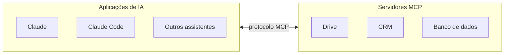

# Módulo 3.4: MCP, skills e integrações

**Nível:** 3, Construtor
**Pré-requisitos:** Módulos 3.1 a 3.3
**Esforço estimado:** 15 a 20 horas

---

## Objetivos de aprendizagem

1. Entender o que é o MCP (Model Context Protocol) e por que ele importa.
2. Conectar assistentes e agentes a sistemas da empresa usando servidores MCP prontos.
3. Construir um servidor MCP simples com a ajuda de um agente de código.
4. Entender e criar **skills**, pacotes de instruções reutilizáveis.
5. Avaliar riscos de segurança e permissões em integrações.

---

## Aula 1: O problema que o MCP resolve

Antes do MCP, cada ferramenta de IA precisava de uma integração própria com cada sistema:
```
Claude ──┐        ┌── Google Drive
ChatGPT ─┼── N×M ─┼── CRM
Cursor ──┘ integr.└── Banco de dados
```

O **MCP (Model Context Protocol)** é um **padrão aberto**, criado pela Anthropic e hoje adotado amplamente no mercado, que funciona como uma "tomada universal": um sistema expõe suas capacidades **uma vez**, via servidor MCP, e qualquer aplicação compatível pode usá-las.
```
Claude ──┐            ┌── Servidor MCP Drive
ChatGPT ─┼── MCP ─────┼── Servidor MCP CRM
Cursor ──┘ (padrão)   └── Servidor MCP Banco
```

### Analogia para clientes
> "O MCP é como o USB-C da IA: em vez de um cabo diferente para cada aparelho, um padrão único conecta a IA a qualquer sistema que ofereça essa 'porta'."

### Esquema da aula



*Figura: o MCP como tomada universal. Cada sistema expõe suas capacidades uma vez e qualquer cliente compatível usa.*

> 📌 **Em resumo**
> - Antes do MCP, cada ferramenta de IA precisava de uma integração própria com cada sistema.
> - O MCP é um padrão aberto: o USB-C da IA.

**Para ir além**
- [Site oficial do MCP](https://modelcontextprotocol.io/): especificação, SDKs e guias de início rápido.

---

## Aula 2: Como o MCP funciona

### Componentes
| Componente | O que é | Exemplo |
|---|---|---|
| **Host/Cliente** | A aplicação de IA que se conecta | Claude (app), Claude Code, outros assistentes e IDEs compatíveis |
| **Servidor MCP** | Programa que expõe capacidades de um sistema | Servidor do Google Drive, do GitHub, de um banco PostgreSQL, do seu ERP |

### O que um servidor MCP oferece
| Tipo | O que é | Exemplo |
|---|---|---|
| **Tools (ferramentas)** | Ações que a IA pode executar | `buscar_cliente`, `criar_pedido`, `consultar_estoque` |
| **Resources (recursos)** | Dados que a IA pode ler | Arquivos, registros, documentos |
| **Prompts** | Modelos de instrução prontos | "Gerar relatório semanal de vendas" |

### Formas de conexão
- **Local:** o servidor roda no computador do usuário (ex.: acesso a arquivos locais).
- **Remoto:** o servidor roda na internet, com autenticação (ex.: conectores de serviços na nuvem). É o modelo dos "conectores" que os assistentes oferecem.

### O fluxo
```
1. O usuário pergunta: "Quais clientes não compram há 90 dias?"
2. O host envia ao modelo a pergunta + a lista de ferramentas disponíveis
3. O modelo decide chamar: crm.buscar_clientes_inativos(dias=90)
4. O host executa a chamada no servidor MCP do CRM
5. O servidor consulta o CRM e devolve os dados
6. O modelo responde ao usuário com base nos dados
```

> 📌 **Em resumo**
> - Hosts (clientes) se conectam a servidores MCP, locais ou remotos.
> - Servidores oferecem tools (ações), resources (dados) e prompts (modelos de instrução).

**Para ir além**
- [Site oficial do MCP](https://modelcontextprotocol.io/): especificação, SDKs e guias de início rápido.

---

## Aula 3: Usando servidores MCP prontos

### Onde encontrar
- **Conectores** oferecidos diretamente nos assistentes (Drive, Gmail, Calendar, Slack, Notion, GitHub e muitos outros).
- **Repositório oficial de servidores de referência** do projeto MCP (github.com/modelcontextprotocol).
- **Servidores oficiais publicados pelos próprios fornecedores de software** (cada vez mais SaaS publicam o seu).
- **Diretórios/registros** de servidores MCP da comunidade.

### Critérios de segurança antes de instalar um servidor
| Critério | Pergunta |
|---|---|
| **Origem** | É oficial do fornecedor ou de fonte confiável? Tem código aberto e mantido? |
| **Permissões** | Que acessos pede? Leitura ou escrita? A tudo ou a partes? |
| **Dados** | Para onde os dados vão? |
| **Autenticação** | Usa OAuth/credenciais próprias do usuário? |
| **Ações perigosas** | Tem ferramentas de apagar, enviar, pagar? Exigem confirmação? |

> ⚠️ **Servidor MCP de origem desconhecida é como instalar um programa desconhecido com acesso aos seus dados.** Use servidores oficiais ou que você possa auditar.

### Exemplo: conectar um assistente aos dados da empresa
1. No assistente (ex.: Claude), ative os conectores de Google Drive e Gmail com a conta da empresa.
2. Teste: "Resuma os e-mails de fornecedores desta semana e liste os documentos citados que estão no Drive."
3. Configure permissões: comece com **leitura**; só libere escrita quando necessário e com confirmação.

> 📌 **Em resumo**
> - Use conectores dos assistentes, servidores de referência e servidores oficiais dos fornecedores.
> - Servidor de origem desconhecida é como instalar um programa desconhecido com acesso aos seus dados.
> - Comece com leitura; libere escrita só quando necessário, com confirmação.

**Para ir além**
- [Servidores MCP de referência](https://github.com/modelcontextprotocol/servers): exemplos oficiais e lista de servidores da comunidade.

---

## Aula 4: Construindo um servidor MCP

Quando o sistema do cliente não tem servidor MCP (ex.: o ERP local da Casa Aurora), você pode construir um, com ajuda de um agente de código.

### SDKs oficiais
O projeto MCP oferece SDKs oficiais em várias linguagens (Python, TypeScript e outras). Em Python, o SDK inclui o **FastMCP**, uma forma simples de declarar ferramentas.

### Exemplo didático (Python, com FastMCP)
Um servidor que expõe a tabela de produtos (exportada do ERP para um banco SQLite) para consulta pela IA:

```python
# servidor_produtos.py
import sqlite3
from mcp.server.fastmcp import FastMCP

mcp = FastMCP("produtos-casa-aurora")
DB = "produtos.db"   # tabela produtos(codigo, descricao, categoria, preco, estoque)

@mcp.tool()
def buscar_produto(termo: str, limite: int = 10) -> list[dict]:
    """Busca produtos pelo nome ou descrição. Use para responder perguntas
    sobre disponibilidade e preço. Retorna código, descrição, preço e estoque."""
    with sqlite3.connect(DB) as conn:
        conn.row_factory = sqlite3.Row
        linhas = conn.execute(
            "SELECT codigo, descricao, preco, estoque FROM produtos "
            "WHERE descricao LIKE ? ORDER BY estoque DESC LIMIT ?",
            (f"%{termo}%", min(limite, 50)),
        ).fetchall()
    return [dict(l) for l in linhas]

@mcp.tool()
def produtos_abaixo_do_minimo() -> list[dict]:
    """Lista produtos com estoque abaixo do mínimo, para apoiar decisões de compra."""
    with sqlite3.connect(DB) as conn:
        conn.row_factory = sqlite3.Row
        linhas = conn.execute(
            "SELECT codigo, descricao, estoque, estoque_minimo FROM produtos "
            "WHERE estoque < estoque_minimo ORDER BY estoque ASC"
        ).fetchall()
    return [dict(l) for l in linhas]

if __name__ == "__main__":
    mcp.run()
```

**Pontos importantes do exemplo:**
- **Somente leitura**: nenhuma ferramenta altera dados.
- **Consultas parametrizadas** (`?`): protege contra injeção de SQL.
- **Limite de resultados**: evita respostas gigantes (custo e contexto).
- **Descrições claras** nas ferramentas: o modelo usa a descrição (docstring) para decidir **quando** chamá-las. Uma descrição ruim leva a uso errado.

> Os detalhes de instalação e configuração mudam com as versões. **Peça ao agente de código para seguir a documentação oficial atual do SDK MCP** (modelcontextprotocol.io) e construir/testar o servidor com você.

### Boas práticas de design de ferramentas
| Prática | Exemplo |
|---|---|
| **Nomes e descrições explícitos** | `buscar_produto`: "Busca produtos pelo nome... Use para..." |
| **Poucas ferramentas, bem definidas** | 5 ferramentas claras > 30 ferramentas confusas |
| **Parâmetros simples e validados** | Tipos definidos, limites, valores permitidos |
| **Respostas enxutas** | Só os campos necessários |
| **Erros úteis** | "Produto não encontrado. Tente um termo mais genérico." |
| **Leitura antes de escrita** | Ferramentas de escrita só quando necessário, com confirmação |
| **Ações irreversíveis protegidas** | Exigir aprovação humana para enviar, apagar, pagar |

> 📌 **Em resumo**
> - Um servidor próprio expõe dados que não têm conector, como uma exportação do ERP.
> - Somente leitura, consultas parametrizadas, limite de resultados e descrições claras.
> - Peça ao agente de código para seguir a documentação atual do SDK.

**Para ir além**
- [Site oficial do MCP](https://modelcontextprotocol.io/): especificação, SDKs e guias de início rápido.
- [Writing effective tools for agents](https://www.anthropic.com/engineering/writing-tools-for-agents): como projetar ferramentas que o agente usa bem.

---

## Aula 5: Skills

### O que são
**Skills** são pacotes de instruções (e, opcionalmente, scripts e arquivos de apoio) que ensinam a IA a executar uma tarefa específica do jeito da empresa. São carregadas **sob demanda**: a IA vê um resumo de cada skill disponível e só lê o conteúdo completo quando a tarefa pede.

Skills existem em produtos como Claude (apps, Claude Code e API), e conceitos semelhantes aparecem em outras plataformas.

### MCP × Skills
| | MCP | Skills |
|---|---|---|
| **Fornece** | **Acesso** a sistemas e dados (ferramentas) | **Conhecimento** de como fazer uma tarefa (procedimento) |
| **Analogia** | Dar as chaves do arquivo e do sistema | Dar o manual de procedimentos |
| **Exemplo** | Conectar ao CRM | "Como fazemos uma proposta comercial na Casa Aurora" |

Eles se complementam: a skill diz **como** fazer a proposta; o MCP dá **acesso** aos preços e ao CRM.

### Estrutura típica de uma skill
```
proposta-comercial/
├── SKILL.md            ← instruções (com nome e descrição no cabeçalho)
├── modelo-proposta.md  ← template
├── politica-descontos.md
└── exemplos/
    ├── proposta-construtora.md
    └── proposta-pessoa-fisica.md
```

**Exemplo de `SKILL.md`:**
```markdown
---
name: proposta-comercial
description: Cria propostas comerciais no padrão da Casa Aurora para clientes
  profissionais (construtoras, empreiteiros). Use quando pedirem proposta,
  cotação formal ou orçamento para obra.
---

# Proposta comercial Casa Aurora

## Passos
1. Identifique o tipo de cliente (construtora, empreiteiro, pessoa física).
2. Liste os itens com quantidades. Se faltar quantidade, pergunte.
3. Use preços da tabela vigente (nunca invente; se não tiver acesso, deixe em branco).
4. Aplique a política de descontos em `politica-descontos.md`.
5. Preencha `modelo-proposta.md`.
6. Destaque prazo de entrega e condições de pagamento.

## Tom
Profissional, direto, sem exageros. Assinatura: equipe comercial Casa Aurora.

## Exemplos
Veja a pasta `exemplos/`.
```

### Quando criar skills
- Tarefas recorrentes com um "jeito certo" de fazer na empresa.
- Conhecimento que hoje está na cabeça de alguém (captura do Módulo 2.4).
- Padronização da qualidade entre pessoas diferentes.

> **Skills são uma forma excelente de entregar o conhecimento capturado no diagnóstico** de modo que vire uso diário.

> 📌 **Em resumo**
> - Skills são pacotes de instruções e arquivos carregados sob demanda.
> - MCP dá acesso; skills dão o procedimento. Eles se complementam.
> - Skills são ótimas para entregar o conhecimento capturado no diagnóstico.

**Para ir além**
- [Agent Skills](https://docs.claude.com/en/docs/agents-and-tools/agent-skills/overview): como criar e usar skills.

---

## Aula 6: Outras formas de integração

Nem tudo precisa de MCP. Conheça o leque:

| Forma | Quando usar |
|---|---|
| **API direta no código** | Workflows e automações (Módulos 3.1 e 3.2) |
| **MCP** | Dar a assistentes e agentes acesso flexível a sistemas |
| **Webhooks** | Reagir a eventos (mensagem recebida, pedido criado) |
| **Exportação/importação de arquivos** | Sistemas sem API (CSV agendado) |
| **Banco de dados intermediário** | Sincronizar dados de um sistema fechado para consulta |
| **Automação de interface** | Último recurso para sistemas sem API (Módulo 3.7) |

### O padrão "banco intermediário" (comum em PME)
Muitos ERPs de PME não têm API, mas exportam relatórios. Uma solução robusta:
```
ERP → exportação agendada (CSV) → script importa para banco (ex.: Supabase/PostgreSQL)
    → servidor MCP / API própria → IA consulta
```
Vantagens: não mexe no ERP, a IA só lê, dá para controlar o que é exposto. Desvantagem: o dado não é em tempo real (atualizado a cada X minutos/horas). Deixe isso claro ao cliente.

> 📌 **Em resumo**
> - Nem tudo precisa de MCP: API direta, webhooks, arquivos, banco intermediário e automação de interface.
> - O banco intermediário é comum em PMEs com ERP sem API, com a limitação de não ser em tempo real.

**Para ir além**
- [Supabase: IA e vetores](https://supabase.com/docs/guides/ai): guias de busca vetorial num banco gerenciado.

---

## Exercícios de fixação

1. Explique o MCP para um empresário em 3 frases, usando uma analogia.
2. Liste 5 ferramentas (com nome, descrição e parâmetros) que um servidor MCP do CRM de uma imobiliária deveria oferecer. Marque quais são de leitura e quais de escrita, e quais exigem confirmação.
3. Escreva o `SKILL.md` de uma skill para "responder avaliações negativas no Google" da sua empresa-laboratório.
4. A Casa Aurora quer que o assistente do vendedor consulte o estoque. O ERP não tem API, mas exporta CSV. Desenhe a solução.

---

## Laboratório 3.4: Conectando a IA à empresa-laboratório

**Parte A: servidores prontos**
1. Conecte um assistente a pelo menos **2 sistemas** da empresa usando conectores/servidores MCP prontos (ex.: Drive + e-mail, ou Drive + calendário).
2. Defina permissões mínimas.
3. Crie 10 tarefas de teste realistas e avalie o resultado.

**Parte B: servidor próprio**
1. Escolha uma fonte de dados da empresa sem conector (planilha, exportação do ERP, banco).
2. Com um agente de código, construa um servidor MCP **somente leitura** com 2 a 4 ferramentas bem descritas.
3. Teste com um cliente MCP (ex.: Claude Code ou o app de desktop do Claude).
4. Publique no GitHub (sem dados reais).

**Parte C: skill**
1. Crie **uma skill** com um procedimento da empresa (de preferência um conhecimento capturado no Lab 2.4).
2. Teste com 5 pedidos realistas.

---

## Entrega de portfólio

1. Relatório da Parte A (conexões, permissões, testes).
2. **Servidor MCP próprio** publicado no GitHub com README.
3. **Skill** documentada.

| Critério | Insuficiente | Bom | Excelente |
|---|---|---|---|
| Segurança | Permissões amplas, sem análise | Permissões mínimas | Permissões mínimas, só leitura, análise de riscos documentada |
| Servidor MCP | Não funciona | Funciona | Funciona, ferramentas bem descritas, consultas seguras, testado |
| Skill | Instruções vagas | Procedimento claro | Procedimento + templates + exemplos + testada |

---

## Autoavaliação

**1.** Qual problema o MCP resolve?

**2.** Quais são os 3 tipos de capacidade que um servidor MCP pode oferecer?

**3.** Por que a descrição de uma ferramenta é tão importante?

**4.** Qual a diferença entre MCP e skills?

**5.** Que cuidados tomar antes de instalar um servidor MCP de terceiros?

**6.** Quando o padrão "banco intermediário" é indicado e qual a sua limitação?

<details>
<summary><strong>Gabarito comentado</strong></summary>

**1.** A necessidade de criar integrações específicas entre cada aplicação de IA e cada sistema. Com um padrão único, um sistema expõe suas capacidades uma vez e qualquer cliente compatível pode usá-las.

**2.** Tools (ações), resources (dados para leitura) e prompts (modelos de instrução).

**3.** Porque o modelo decide quando e como usar uma ferramenta com base na descrição. Descrições vagas causam uso errado, ferramentas ignoradas ou chamadas desnecessárias.

**4.** MCP fornece acesso a sistemas e dados (o "como acessar"); skills fornecem conhecimento procedimental de como executar uma tarefa (o "como fazer"). São complementares.

**5.** Verificar a origem (oficial/confiável, código aberto, mantido), as permissões pedidas, para onde vão os dados, a forma de autenticação e a existência de ações perigosas sem confirmação. Preferir começar com leitura apenas.

**6.** Quando o sistema de origem não tem API, mas exporta dados. O banco intermediário permite consultas seguras e controladas, mas os dados não são em tempo real; ficam defasados de acordo com a frequência da exportação.

</details>

---

## Para aprofundar

- **Site oficial do MCP:** modelcontextprotocol.io (especificação, SDKs, guias de início rápido).
- **Repositório de servidores de referência:** github.com/modelcontextprotocol.
- **Documentação de skills** da Anthropic (Agent Skills) e do Claude Code.
- **Curso curto** sobre MCP na DeepLearning.AI (em parceria com a Anthropic).

---

**Anterior:** [Módulo 3.3](3.3-arquitetura-de-solucoes.md) | **Próximo:** [Módulo 3.5: RAG e bases de conhecimento](3.5-rag-bases-de-conhecimento.md)
