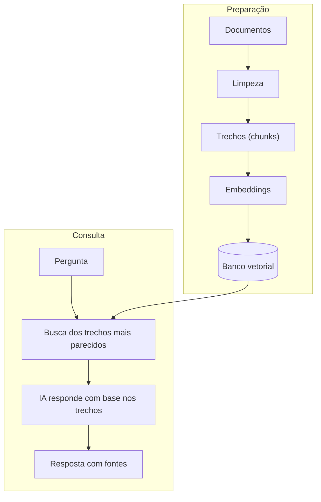

# Módulo 3.5: RAG e bases de conhecimento

**Nível:** 3, Construtor
**Pré-requisitos:** Módulos 3.1 a 3.4
**Esforço estimado:** 20 a 25 horas

---

## Objetivos de aprendizagem

1. Entender como funciona o RAG (Retrieval-Augmented Generation) e quando usá-lo.
2. Entender embeddings e busca semântica.
3. Preparar documentos (curadoria, limpeza e divisão em trechos).
4. Construir um sistema de RAG simples, com citação de fontes.
5. Avaliar e melhorar a qualidade da busca e das respostas.
6. Manter uma base de conhecimento viva.

---

## Aula 1: Por que RAG

### O problema
O modelo não conhece os documentos da empresa. Opções para que ele responda com base neles:

| Opção | Como | Quando serve |
|---|---|---|
| **Colocar tudo no contexto** | Enviar os documentos inteiros a cada pergunta | Base pequena (algumas dezenas de páginas), com cache de prompt |
| **RAG** | Buscar só os trechos relevantes e enviar | Base grande, muitos documentos, atualização frequente |
| **Fine-tuning** (ajuste fino do modelo) | Retreinar o modelo com dados da empresa | Raramente indicado em PME: caro, desatualiza, **não é bom para ensinar fatos** |

> **Regra prática:** se a base cabe confortavelmente no contexto e é estável, comece colocando tudo (com cache). Use RAG quando a base for grande, crescer ou mudar muito, ou quando o custo de enviar tudo for alto.

### Como o RAG funciona
```
PREPARAÇÃO (uma vez, e a cada atualização)
Documentos → limpeza → divisão em trechos (chunks) → embeddings → banco vetorial

CONSULTA (a cada pergunta)
Pergunta → embedding → busca dos trechos mais parecidos → [IA recebe pergunta + trechos]
         → resposta com citação das fontes
```

### Esquema da aula



*Figura: as duas fases do RAG. A preparação acontece uma vez (e a cada atualização); a consulta, a cada pergunta.*

> 📌 **Em resumo**
> - Base pequena e estável: coloque tudo no contexto com cache. Base grande ou que muda: RAG.
> - Fine-tuning raramente é indicado para ensinar fatos da empresa.

**Para ir além**
- [Contextual Retrieval](https://www.anthropic.com/engineering/contextual-retrieval): a técnica de adicionar contexto aos trechos do RAG.

---

## Aula 2: Embeddings e busca semântica

### O que é um embedding
Um **embedding** é a representação de um texto como uma lista de números (um vetor) que captura o seu **significado**. Textos com significados parecidos ficam "próximos" nesse espaço numérico.

- "Qual o prazo de entrega?" e "Em quantos dias chega meu pedido?" → vetores próximos
- "Qual o prazo de entrega?" e "Vocês vendem tinta?" → vetores distantes

### Busca semântica × busca por palavra-chave
| Tipo | Como funciona | Força | Fraqueza |
|---|---|---|---|
| **Palavra-chave** (lexical, ex.: BM25) | Procura as palavras exatas | Ótima para códigos, nomes, termos técnicos ("CP-II", "AC3") | Não entende sinônimos |
| **Semântica** (embeddings) | Procura pelo significado | Entende sinônimos e paráfrases | Pode errar em termos muito específicos |
| **Híbrida** | Combina as duas | **Melhor resultado na maioria dos casos** | Um pouco mais complexa |

### Onde obter embeddings
Modelos de embedding são oferecidos por vários provedores (por exemplo, Voyage AI, que a Anthropic recomenda para uso com o Claude, além de OpenAI, Google, Cohere e modelos abertos). Critérios: qualidade em **português**, custo e privacidade.

### Bancos vetoriais
Armazenam os embeddings e fazem a busca. Opções:
- **pgvector** (extensão do PostgreSQL; disponível no Supabase): ótimo para PME, porque usa um banco que você já tem.
- **Chroma, Qdrant, Weaviate, Pinecone**, entre outros.
- Para protótipos: bibliotecas em memória.

> 📌 **Em resumo**
> - Embedding representa o significado de um texto como números.
> - Busca semântica entende sinônimos; busca por palavra-chave acerta códigos e siglas; a híbrida combina as duas.
> - Para PMEs, o pgvector no PostgreSQL costuma bastar.

**Para ir além**
- [Embeddings na documentação do Claude](https://docs.claude.com/en/docs/build-with-claude/embeddings): o que são e quais provedores usar.
- [Voyage AI](https://www.voyageai.com/): provedor de embeddings indicado pela Anthropic.
- [pgvector](https://github.com/pgvector/pgvector): busca vetorial dentro do PostgreSQL.

---

## Aula 3: Preparando os documentos (a parte mais importante)

> **A qualidade do RAG é decidida aqui.** Documentos ruins geram respostas ruins, não importa o modelo.

### 1. Curadoria
- **Inventarie** os documentos (use o inventário do Módulo 2.4).
- **Elimine** versões antigas, duplicadas e contraditórias.
- **Defina um dono** para cada documento.
- **Preencha lacunas:** se as perguntas mais comuns não têm resposta em nenhum documento, **crie o documento** (ex.: FAQ a partir das conversas de WhatsApp).

### 2. Limpeza e conversão
- Converta tudo para **texto limpo** (Markdown é ideal).
- PDFs escaneados: use OCR, ou peça a um modelo multimodal para transcrever, e revise.
- Tabelas: mantenha em formato de tabela Markdown ou converta em frases.
- Remova cabeçalhos e rodapés repetidos, numeração de página e textos jurídicos repetitivos.

### 3. Estrutura
- Títulos e subtítulos claros (`#`, `##`).
- **Um assunto por seção.**
- Perguntas e respostas explícitas funcionam muito bem.

### 4. Metadados
Para cada documento/trecho, guarde:
- título, origem, data, versão;
- categoria (produto, política, técnico...);
- público (cliente, interno);
- dono.

Metadados permitem **filtrar** a busca (ex.: só documentos para clientes) e **citar** a fonte.

### 5. Divisão em trechos (chunking)
| Estratégia | Como | Quando |
|---|---|---|
| **Por tamanho fixo** | A cada N tokens, com sobreposição | Textos corridos sem estrutura |
| **Por estrutura** | Por seção/título, pergunta/resposta | **Documentos bem estruturados (preferível)** |
| **Por significado** | Quebra quando o assunto muda | Textos longos e variados |

**Orientações:**
- Trechos de algumas centenas de tokens costumam funcionar bem. Teste com os seus dados.
- Use **sobreposição** (10% a 20%) na divisão por tamanho para não cortar ideias ao meio.
- **Adicione contexto ao trecho:** inclua o título do documento e da seção no início de cada trecho ("Política de Trocas > Prazos: ..."). Isso melhora muito a busca (técnica conhecida como *contextual retrieval*).

> 📌 **Em resumo**
> - A qualidade do RAG é decidida nos documentos: curadoria, limpeza, estrutura e metadados.
> - Divida por estrutura (seções, perguntas e respostas) sempre que possível.
> - Prefixar cada trecho com documento e seção melhora muito a busca.

**Para ir além**
- [Contextual Retrieval](https://www.anthropic.com/engineering/contextual-retrieval): a técnica de adicionar contexto aos trechos do RAG.

---

## Aula 4: Construindo um RAG simples

### Arquitetura mínima
```
[Pasta de documentos .md] → script de indexação → [Banco vetorial]
                                                         ↑
Pergunta → [busca híbrida: top 5 trechos] ───────────────┘
        → [Claude: pergunta + trechos + instruções] → Resposta com fontes
```

### O prompt de geração
```
Você é o assistente técnico da Casa Aurora. Responda à pergunta do vendedor
usando SOMENTE as informações dos trechos abaixo.

Regras:
- Se os trechos não contêm a resposta, diga: "Não encontrei essa informação
  na base. Consulte o Rafael." Não tente adivinhar.
- Cite a fonte de cada informação no formato [Fonte: título do documento].
- Se houver informações conflitantes entre trechos, aponte o conflito.
- Responda em no máximo 8 linhas.

<trechos>
<trecho fonte="Guia de Argamassas > AC3" data="2026-03">
...
</trecho>
...
</trechos>

<pergunta>
{pergunta}
</pergunta>
```

### Construindo com o agente de código
Peça ao agente (Módulo 3.2) com uma especificação como:
```markdown
## Objetivo
Assistente técnico com RAG sobre a pasta docs/ (Markdown).

## Requisitos
- Indexação: dividir por seção (##), prefixar cada trecho com "Documento > Seção",
  gerar embeddings com [provedor escolhido], salvar em [pgvector/Chroma].
- Busca híbrida (semântica + palavra-chave), top 5.
- Geração com Claude seguindo o prompt em prompts/geracao.md.
- Comando para reindexar quando documentos mudarem.
- Script de avaliação que roda o conjunto de perguntas em eval/perguntas.csv
  e calcula: acerto da busca (trecho certo no top 5) e acerto da resposta.
```

### Alternativas sem construir do zero
- **Projetos dos assistentes** (Claude, ChatGPT, Gemini) já fazem um RAG interno quando a base é grande. É ótimo para começar.
- **Ferramentas de RAG gerenciado** dos provedores de nuvem e plataformas especializadas.
- Construa sob medida quando precisar de: integração com WhatsApp/sistemas, controle de qualidade, metadados e filtros, custo previsível, ou dados que não podem ir para uma ferramenta de terceiros sem contrato adequado.

> 📌 **Em resumo**
> - Prompt de geração: use só os trechos, cite a fonte, aponte conflitos e admita não saber.
> - Projetos dos assistentes já fazem RAG interno e servem de linha de base.
> - Construa sob medida quando precisar de integração, controle de qualidade ou filtros.

**Para ir além**
- [Supabase: IA e vetores](https://supabase.com/docs/guides/ai): guias de busca vetorial num banco gerenciado.

---

## Aula 5: Avaliando e melhorando o RAG

### As duas perguntas
1. **A busca encontrou os trechos certos?** (qualidade da recuperação)
2. **A resposta usou bem os trechos?** (qualidade da geração)

Separar as duas mostra **onde** está o problema.

### Conjunto de avaliação
Monte de 30 a 50 perguntas reais com:
- a resposta esperada;
- o(s) documento(s)/trecho(s) que contêm a resposta;
- perguntas **sem resposta na base** (para testar o "não sei").

### Métricas simples
| Métrica | Como medir |
|---|---|
| **Recuperação@5** | % de perguntas em que o trecho certo aparece entre os 5 primeiros |
| **Acerto da resposta** | % de respostas corretas (avaliadas por você ou por um LLM-juiz, Módulo 4.1) |
| **Fidelidade** | % de respostas sem informação inventada (tudo está nos trechos) |
| **"Não sei" correto** | % de perguntas sem resposta em que o sistema admitiu não saber |

### Diagnóstico e correção
| Sintoma | Causa provável | Correção |
|---|---|---|
| Trecho certo não aparece na busca | Chunking ruim, documento mal escrito, termo específico | Reestruturar documento, busca híbrida, contexto no trecho |
| Trecho certo aparece, resposta errada | Prompt de geração, trechos demais e confusos | Ajustar prompt, reduzir quantidade de trechos, reordenar |
| Resposta inventada | Falta de instrução, base incompleta | Reforçar "use só os trechos", criar documento que falta |
| Respostas contraditórias | Documentos conflitantes | Curadoria: eliminar versões antigas |
| Não encontra nada para perguntas coloquiais | Diferença de vocabulário cliente × documento | Adicionar sinônimos/FAQ na linguagem do cliente; reescrever a pergunta antes da busca |

### Técnicas avançadas (quando necessário)
- **Reescrita da pergunta:** a IA reformula a pergunta antes de buscar.
- **Reordenação (reranking):** um modelo reordena os trechos encontrados por relevância.
- **Filtros por metadados:** buscar só em documentos de determinada categoria.
- **Busca agêntica:** um agente decide fazer várias buscas até encontrar (Módulo 3.6).

> 📌 **Em resumo**
> - Avalie separadamente a busca (trecho certo encontrado?) e a resposta (usou bem os trechos?).
> - Métricas: recuperação@5, acerto, fidelidade e "não sei" correto.
> - Cada sintoma aponta uma correção: documento, busca, prompt ou curadoria.

**Para ir além**
- [Criando avaliações fortes](https://docs.claude.com/en/docs/test-and-evaluate/develop-tests): guia oficial para montar testes de qualidade.

---

## Aula 6: Mantendo a base viva

Uma base de conhecimento desatualizada é **pior que nenhuma**: gera respostas erradas com confiança.

### Processo de manutenção
1. **Dono por documento**, com data de revisão.
2. **Reindexação automática** quando um documento muda.
3. **Registro de perguntas sem resposta** ("não encontrei"): elas mostram as lacunas da base. Revise semanalmente.
4. **Feedback dos usuários** (👍/👎) nas respostas.
5. **Revisão periódica** do conjunto de avaliação.

> Ofereça ao cliente a **manutenção da base** como serviço recorrente (Módulo 5.4).

> 📌 **Em resumo**
> - Base desatualizada é pior que nenhuma: responde errado com confiança.
> - Dono por documento, reindexação automática e revisão das perguntas sem resposta.
> - Manutenção da base é um serviço recorrente.

---

## Exercícios de fixação

1. Para cada caso, decida entre "colocar tudo no contexto" e RAG, e justifique:
   a) Manual de RH de 25 páginas que muda uma vez por ano.
   b) Catálogo técnico de 6.500 produtos com fichas técnicas.
   c) Base de 3.000 contratos de clientes de um escritório.
2. Explique a um empresário, com uma analogia, o que é busca semântica.
3. Pegue um documento real da empresa-laboratório e reestruture-o para RAG: títulos, um assunto por seção, metadados.
4. Crie 10 perguntas de avaliação (incluindo 2 sem resposta) para a base de conhecimento técnico da Casa Aurora.
5. O vendedor pergunta "posso usar AC2 na área da piscina?" e o sistema responde errado, mas o trecho correto estava na base. Liste 3 hipóteses de causa e como testá-las.

---

## Laboratório 3.5: Base de conhecimento da empresa-laboratório

1. **Curadoria:** reúna, limpe e estruture de 10 a 30 documentos de uma área (técnico, atendimento ou RH).
2. **Lacunas:** analise as perguntas reais (WhatsApp, e-mails, entrevistas) e crie os documentos que faltam.
3. **Construa** o RAG com o agente de código (Aula 4), ou use um Projeto de assistente como linha de base.
4. **Avalie** com 30 a 50 perguntas: recuperação@5, acerto, fidelidade e "não sei" correto.
5. **Melhore** pelo menos 2 vezes, documentando o que mudou e o efeito nas métricas.
6. **Compare** com a linha de base (assistente com Projeto). O RAG sob medida vale o esforço neste caso?

---

## Entrega de portfólio

1. Base de conhecimento curada (documentos + metadados).
2. Sistema RAG (repositório) com script de avaliação.
3. Relatório de avaliação: métricas por versão e decisões tomadas.

| Critério | Insuficiente | Bom | Excelente |
|---|---|---|---|
| Documentos | Jogados como vieram | Limpos e estruturados | Curados, com lacunas preenchidas, metadados e donos |
| Avaliação | Testes informais | Conjunto de 30+ perguntas e métricas | Métricas separadas (busca × resposta), evolução documentada |
| Comportamento | Inventa respostas | Cita fontes | Cita fontes, admite não saber, aponta conflitos |

---

## Autoavaliação

**1.** Quando NÃO é necessário usar RAG?

**2.** O que é um embedding?

**3.** Por que a busca híbrida costuma superar a busca puramente semântica?

**4.** Por que adicionar o título do documento e da seção a cada trecho melhora a busca?

**5.** Por que avaliar separadamente a busca e a resposta?

**6.** Por que fine-tuning geralmente não é a melhor forma de ensinar fatos da empresa ao modelo?

<details>
<summary><strong>Gabarito comentado</strong></summary>

**1.** Quando a base é pequena e estável o suficiente para caber no contexto (com cache de prompt para reduzir custo), ou quando um Projeto de assistente pronto atende bem.

**2.** Uma representação numérica (vetor) do significado de um texto, que permite medir a semelhança de significado entre textos.

**3.** Porque combina a compreensão de significado (sinônimos, paráfrases) com a precisão da palavra-chave para termos específicos (códigos, nomes de produtos, siglas), comuns em bases de empresas.

**4.** Porque um trecho isolado pode perder o contexto ("o prazo é de 7 dias": prazo de quê?). O prefixo mantém o assunto explícito, aproximando o trecho das perguntas relacionadas.

**5.** Para saber onde está o problema: se o trecho certo não foi encontrado, o problema é de busca/documentos; se foi encontrado e a resposta está errada, o problema é de geração/prompt.

**6.** Porque é caro, exige dados de treino preparados, precisa ser refeito a cada mudança de informação, e o modelo pode continuar "misturando" ou inventando fatos. Para fatos, fornecer a informação no contexto (RAG) é mais barato, atualizável e verificável (com fontes).

</details>

---

## Para aprofundar

- **"Contextual Retrieval"**, artigo de engenharia da Anthropic sobre a técnica de adicionar contexto aos trechos.
- **Documentação de embeddings** dos provedores (incluindo a página da Anthropic que trata de embeddings e indica provedores).
- **pgvector** e **Supabase**: guias de busca vetorial.
- **Cursos curtos** sobre RAG e avaliação de RAG na DeepLearning.AI.

---

**Anterior:** [Módulo 3.4](3.4-mcp-skills-integracoes.md) | **Próximo:** [Módulo 3.6: Agentes de IA](3.6-agentes-de-ia.md)
