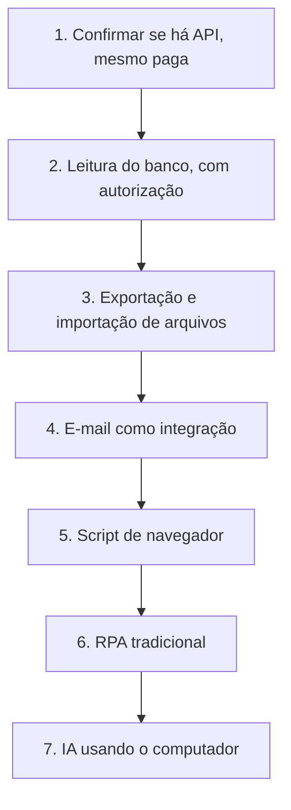

# Módulo 3.7: Automação de sistemas sem API

**Nível:** 3, Construtor
**Pré-requisitos:** Módulos 3.1 a 3.6
**Esforço estimado:** 12 a 15 horas

---

## Objetivos de aprendizagem

1. Conhecer as alternativas para integrar sistemas que não têm API.
2. Entender a automação de navegador e o uso de computador por IA (computer use).
3. Avaliar fragilidade, riscos e custo dessas abordagens.
4. Escolher a solução mais robusta disponível para cada caso.

---

## Aula 1: A realidade das PMEs

Muitas PMEs usam sistemas que **não têm API**:
- ERPs locais antigos;
- portais de prefeituras, órgãos públicos e bancos;
- sites de fornecedores;
- sistemas desenvolvidos sob medida há anos;
- planilhas com macros.

Dizer "sem API, não dá" elimina boa parte das oportunidades. O especialista conhece **a escada de alternativas**.

> 📌 **Em resumo**
> - Muitos sistemas de PMEs não têm API.
> - Dizer "sem API, não dá" elimina boa parte das oportunidades.

---

## Aula 2: A escada de alternativas (da mais robusta à mais frágil)

| # | Alternativa | Como funciona | Robustez |
|---|---|---|---|
| 1 | **Verificar de novo se há API** | Pergunte ao fornecedor; muitos têm API não divulgada, paga ou em versão nova; veja se há módulo de integração | ⭐⭐⭐⭐⭐ |
| 2 | **Acesso ao banco de dados** (somente leitura) | Com autorização, ler diretamente o banco do sistema | ⭐⭐⭐⭐ (risco se o fornecedor mudar a estrutura) |
| 3 | **Exportação/importação de arquivos** | Relatórios agendados (CSV/Excel/XML) → script processa; importação de arquivos no sistema | ⭐⭐⭐⭐ |
| 4 | **E-mail como integração** | Muitos sistemas enviam e recebem e-mails (notas, relatórios, alertas) | ⭐⭐⭐ |
| 5 | **Automação de navegador (scripts)** | Script que controla o navegador (ex.: Playwright, Selenium) clicando e preenchendo campos | ⭐⭐ |
| 6 | **RPA tradicional** | Ferramentas de "robôs" que repetem cliques e digitação gravados | ⭐⭐ |
| 7 | **IA usando o computador (computer use / agentes de navegador)** | O modelo vê a tela e decide onde clicar e o que digitar | ⭐ a ⭐⭐ (flexível, mas lento, caro e menos previsível) |

> **Sempre comece pelo topo da escada.** Desça apenas quando a opção acima não for viável.

### Sobre o acesso direto ao banco
- **Só com autorização formal** do cliente e, se possível, ciência do fornecedor (contratos de licença podem proibir).
- **Somente leitura**, com usuário específico.
- **Nunca escrever** diretamente no banco de um ERP: pode corromper dados e anular o suporte do fornecedor.

### Esquema da aula

*Figura: a escada de alternativas, da mais robusta (topo) à mais frágil (base). Desça só quando o degrau de cima não for viável.*

> 📌 **Em resumo**
> - Comece sempre pelo topo da escada.
> - Acesso direto ao banco só com autorização formal, somente leitura e nunca escrevendo.

---

## Aula 3: Automação de navegador com scripts

### Como funciona
Bibliotecas como **Playwright** e **Selenium** controlam um navegador por código: abrir página, fazer login, clicar, preencher, baixar arquivos, ler dados da tela.

**Exemplo de uso:** todo dia às 7h, entrar no portal do fornecedor, baixar a tabela de preços atualizada e importá-la para o banco intermediário.

### Pontos fortes e fracos
| Forte | Fraco |
|---|---|
| Rápido e barato para rodar | **Quebra quando a tela muda** |
| Previsível (sempre faz o mesmo) | Captchas e autenticação em duas etapas atrapalham |
| Agentes de código escrevem esses scripts muito bem | Precisa de monitoramento constante |

### Boas práticas
- Use seletores estáveis (identificadores dos elementos, e não posições na tela).
- Trate erros e tire **capturas de tela em caso de falha**, para diagnóstico.
- **Alerte** quando falhar (Módulo 4.2).
- Respeite os **termos de uso** dos sites e o volume de acessos.
- Guarde credenciais em segredos, nunca no código.

> 📌 **Em resumo**
> - Playwright e Selenium controlam o navegador por código: rápido, barato e previsível.
> - Quebram quando a tela muda: use seletores estáveis, capturas de tela em falhas e alertas.

**Para ir além**
- [Playwright](https://playwright.dev/): automação de navegador por código.

---

## Aula 4: IA usando o computador

### O que é
Modelos multimodais podem **ver capturas de tela** e **controlar mouse e teclado** (ou um navegador), decidindo os passos como uma pessoa faria. Exemplos de recursos: o *computer use* da API da Anthropic, agentes de navegador e extensões de assistentes que operam no navegador.

### Diferença para os scripts
| | Script de automação | IA usando o computador |
|---|---|---|
| Como decide | Passos fixos programados | O modelo interpreta a tela a cada passo |
| Mudança na tela | Quebra | Geralmente se adapta |
| Velocidade | Rápido | Lento (segundos por passo) |
| Custo | Muito baixo | Mais alto (cada passo envia imagens ao modelo) |
| Previsibilidade | Alta | Menor |

### Quando faz sentido
- Tarefas **variáveis** em telas que mudam ou que diferem de caso a caso.
- **Baixo volume** (dezenas, não milhares por dia).
- **Exploração e prototipagem:** entender um processo antes de escrever um script estável.
- Tarefas de **pesquisa na web** (coletar informações de vários sites).

### Riscos e cuidados (importantes)
- **Ações indevidas:** a IA pode clicar no lugar errado. Use em ambiente controlado e com permissões mínimas.
- **Prompt injection pela tela:** páginas podem conter textos que tentam manipular a IA. Não deixe a IA navegar livremente com acesso a contas sensíveis.
- **Credenciais:** evite dar à IA acesso a contas bancárias, de pagamento ou administrativas.
- **Aprovação humana** antes de qualquer ação irreversível (enviar, pagar, excluir, confirmar).
- **Ambiente isolado** (máquina virtual/contêiner) para automações recorrentes.
- Siga as orientações de segurança do fornecedor da ferramenta.

> 📌 **Em resumo**
> - A IA vê a tela e decide onde clicar: se adapta, mas é lenta e mais cara.
> - Faz sentido em tarefas variáveis e de baixo volume, ou para prototipar.
> - Ambiente isolado, sem contas sensíveis e com aprovação de ações irreversíveis.

**Para ir além**
- [Computer use na API do Claude](https://docs.claude.com/en/docs/agents-and-tools/tool-use/computer-use-tool): como funciona e os cuidados de segurança.

---

## Aula 5: Estudo de caso, ERP sem API da Casa Aurora

**Problema:** o atendimento com IA precisa consultar estoque e preço; o ERP local não tem API.

**Análise pela escada:**
1. **API?** O fornecedor oferece um "módulo de integração" pago (R$ 300/mês) com API REST de leitura de produtos. → **Opção mais robusta. Avaliar custo × benefício.**
2. **Banco de dados?** É SQL Server local; leitura possível com autorização. → Alternativa, mas com risco contratual.
3. **Exportação?** O ERP exporta o relatório de produtos em CSV e permite agendamento. → **Viável e barato.**
5. **Script de navegador?** O ERP é aplicativo de desktop, não web. → Não se aplica.
7. **IA usando o computador?** Possível, mas lento e caro para ~180 consultas/dia. → Não recomendado.

**Recomendação:**
- **Fase 1 (imediata):** exportação CSV agendada a cada 30 minutos → banco intermediário → servidor MCP somente leitura (Módulo 3.4). Atualização de até 30 minutos é aceitável para pré-orçamentos, com o aviso "sujeito a confirmação".
- **Fase 2:** se o volume e o valor crescerem, contratar o módulo de API do fornecedor para tempo real.

> Note como a análise gera **duas fases** e uma **decisão de negócio** clara para o cliente.

> 📌 **Em resumo**
> - A análise pela escada gera fases e uma decisão de negócio clara para o cliente.
> - Exportação agendada para um banco intermediário resolve a primeira fase da Casa Aurora.

---

## Exercícios de fixação

1. Aplique a escada de alternativas a:
   a) Emitir guias num portal de prefeitura que não tem API e exige certificado digital.
   b) Baixar diariamente os extratos de 3 bancos.
   c) Atualizar preços no site de um marketplace a partir da planilha da empresa.
2. Liste 5 riscos de deixar um agente de IA operar o navegador logado na conta de e-mail da empresa, e as mitigações.
3. Explique a um cliente, em linguagem simples, por que a automação de tela é "frágil".

---

## Laboratório 3.7: Integração sem API

1. Identifique na empresa-laboratório **um sistema ou site sem API** relevante para alguma oportunidade.
2. Aplique a escada de alternativas e documente a análise.
3. Implemente a alternativa mais robusta viável, com um agente de código (exportação + importação, ou script de navegador).
4. **Experimento comparativo (opcional):** faça a mesma tarefa com uma IA usando o computador/navegador. Compare tempo, custo, taxa de sucesso e riscos.
5. Implemente monitoramento: o que acontece quando falha? Quem é avisado?

---

## Entrega de portfólio

1. Análise pela escada de alternativas (documento).
2. Implementação funcionando + README + plano de monitoramento.
3. (Opcional) Relatório do experimento comparativo.

| Critério | Insuficiente | Bom | Excelente |
|---|---|---|---|
| Análise | Pulou para a solução | Escada aplicada | Escada aplicada com custos, riscos e fases |
| Robustez | Sem tratamento de falha | Trata falhas | Trata falhas, captura evidências e alerta |
| Segurança | Credenciais expostas | Credenciais em segredo | Segredos + menor privilégio + aprovação de ações de risco |

---

## Autoavaliação

**1.** Qual a primeira coisa a fazer quando o cliente diz que o sistema "não tem API"?

**2.** Por que nunca escrever diretamente no banco de dados de um ERP?

**3.** Quando a IA usando o computador é preferível a um script de automação?

**4.** Cite 3 cuidados de segurança com IA operando o navegador.

<strong>Gabarito comentado</strong>

**1.** Verificar com o fornecedor se existe API (paga, não divulgada, em versão nova ou módulo de integração), e se há exportação/importação de arquivos ou envio de e-mails que possam servir de integração.

**2.** Porque pode violar regras de integridade que o sistema controla internamente, corromper dados, quebrar com atualizações e anular o suporte ou o contrato do fornecedor.

**3.** Em tarefas variáveis, com telas que mudam ou diferem por caso, em baixo volume, ou para explorar/prototipar um processo. Para tarefas fixas e de alto volume, scripts são mais rápidos, baratos e previsíveis.

**4.** Ambiente isolado; acesso apenas às contas necessárias (sem bancárias/administrativas); aprovação humana antes de ações irreversíveis; atenção a prompt injection por conteúdo das páginas; credenciais protegidas; logs e capturas das ações.

---

## Para aprofundar

- **Playwright** (playwright.dev): documentação e guias.
- **Computer use** na documentação da API da Anthropic, com as orientações de segurança.
- **RPA:** conceitos gerais e quando ainda faz sentido em grandes volumes.

---

**Anterior:** [Módulo 3.6](3.6-agentes-de-ia.md) | **Próximo:** [Projeto Integrador 3](projeto-integrador-3.md)
