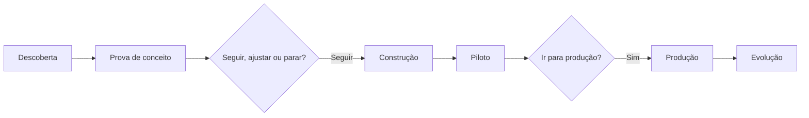

# Módulo 4.5: Gestão de projetos de IA

**Nível:** 4, Implementador
**Pré-requisitos:** Módulos 4.1 a 4.4
**Esforço estimado:** 12 a 15 horas

---

## Objetivos de aprendizagem

1. Conduzir projetos de IA com um ciclo de vida claro.
2. Definir escopo, critérios de sucesso e entregáveis antes de começar.
3. Gerenciar expectativas (a IA não é 100%) e a comunicação com o cliente.
4. Lidar com incertezas típicas de IA (qualidade, dados, integrações).
5. Construir a **sua metodologia de implementação**, com fases e templates.

---

## Aula 1: Por que projetos de IA são diferentes

| Projetos de software tradicionais | Projetos de IA |
|---|---|
| Requisitos → código → funciona ou não | Requisitos → protótipo → **medir qualidade** → iterar |
| Resultado determinístico | Resultado probabilístico (taxa de acerto) |
| Escopo de funcionalidades | Escopo de funcionalidades **e de qualidade** |
| Dados geralmente prontos | Dados frequentemente o maior risco |
| Concluído na entrega | Exige operação e melhoria contínuas |

**Consequência:** projetos de IA precisam de **experimentação controlada no início**, **critérios de qualidade explícitos** e **planejamento da operação** desde o começo.

> 📌 **Em resumo**
> - Projetos de IA têm resultado probabilístico, escopo de qualidade e dados como maior risco.
> - Exigem experimentação controlada e operação contínua.

---

## Aula 2: O ciclo de vida

```
0. DIAGNÓSTICO      → oportunidade priorizada, business case (Nível 2)
1. DESCOBERTA       → detalhar o processo, dados, casos de teste, metas      (1-2 semanas)
2. PROVA DE CONCEITO→ validar viabilidade técnica e qualidade com dados reais (1-2 semanas)
   ── PONTO DE DECISÃO: seguir, ajustar ou parar ──
3. CONSTRUÇÃO       → solução completa, integrada, testada                   (2-6 semanas)
4. PILOTO           → sombra → assistido, com usuários reais                 (2-6 semanas)
   ── PONTO DE DECISÃO: ir para produção? ──
5. PRODUÇÃO         → autônomo por exceção, monitorado                        (contínuo)
6. EVOLUÇÃO         → melhorias, expansão, novos casos                        (contínuo)
```

### Os pontos de decisão (fundamentais)
**Após a prova de conceito:**
- A qualidade atingiu ao menos X% da meta com dados reais?
- Os dados e as integrações são viáveis?
- O business case continua de pé?
→ **Seguir**, **ajustar** (escopo, meta, abordagem) ou **parar** (e o cliente gastou pouco).

> Saber **parar** um projeto inviável cedo é sinal de profissionalismo e protege a sua reputação.

**Após o piloto:**
- As metas de qualidade e de negócio foram atingidas no mundo real?
- A equipe está usando?
- A operação está estável?

### Esquema da aula



*Figura: o ciclo de vida com os dois pontos de decisão.*

> 📌 **Em resumo**
> - Descoberta, prova de conceito, construção, piloto, produção e evolução.
> - Saber parar um projeto inviável cedo protege a sua reputação.

---

## Aula 3: Escopo e critérios de sucesso

### O documento de abertura do projeto
Antes de construir, alinhe por escrito com o cliente:

```markdown
# Abertura do projeto: Atendimento WhatsApp com IA (Casa Aurora)

## Problema e objetivo
Resposta média de 47 min; perda de vendas; sem atendimento fora do horário.
Objetivo: primeira resposta < 2 min e +3 pontos de conversão em 90 dias.

## Escopo
Inclui: pré-orçamento, dúvidas técnicas (base), roteamento, follow-up.
Não inclui: vendas com crédito, negociação de desconto, pós-venda/trocas (fase 2).

## Critérios de sucesso
| Tipo | Métrica | Meta | Como medir |
|---|---|---|---|
| Qualidade | Acerto no conjunto de teste | ≥ 95%, 0 críticos | Eval |
| Operação | 1ª resposta | < 2 min | Logs |
| Negócio | Conversão de orçamentos | 22% → 25% | ERP/CRM, comparação com período anterior |
| Adoção | % de conversas atendidas pela IA sem transferência indevida | ≥ 60% | Logs |

## Premissas e dependências
- Exportação do ERP a cada 30 min (TI do cliente)
- Número de WhatsApp na API oficial (cliente contrata)
- Rafael disponível 3 h/semana para validar respostas

## Riscos
| Risco | Probabilidade | Impacto | Mitigação |
|---|---|---|---|
| Dados de produtos desatualizados | Média | Alto | Rotina de atualização + aviso "sujeito a confirmação" |
| Resistência dos atendentes | Média | Médio | Envolver desde o piloto; papel novo de "especialista" |

## Responsáveis
Patrocinador: Juliana | Ponto focal: Rafael | Implementação: [você]

## Cronograma e marcos
...

## Investimento
...
```

### Gerenciando expectativas
Diga desde o início, por escrito e em reunião:
- "A IA **vai errar** em uma pequena porcentagem dos casos. Por isso medimos, temos revisão e melhoramos continuamente."
- "A qualidade final depende dos dados e da participação da equipe."
- "Começaremos com supervisão humana e aumentaremos a autonomia conforme os resultados."
- "Depois de pronto, a solução precisa de manutenção."

> 📌 **Em resumo**
> - O documento de abertura alinha problema, escopo, critérios de sucesso, premissas, riscos e responsáveis.
> - Diga desde o início que a IA vai errar numa pequena porcentagem dos casos.

---

## Aula 4: Execução e comunicação

### Ritmo de trabalho
- **Ciclos curtos** (1 a 2 semanas), com entrega demonstrável ao final de cada um.
- **Demonstração frequente** ao cliente: mostra progresso e coleta feedback cedo.
- **Quadro de tarefas** simples (A fazer / Fazendo / Feito), compartilhado com o cliente.

### Comunicação
| Frequência | Formato | Conteúdo |
|---|---|---|
| Semanal | Mensagem curta ou reunião de 30 min | O que foi feito, próximos passos, bloqueios, decisões necessárias |
| Por marco | Demonstração | Solução funcionando, métricas, decisão de avanço |
| Mensal (produção) | Relatório | Uso, qualidade, custo, incidentes, recomendações |

### Registro de decisões e mudanças
- Toda mudança de escopo é **registrada** e avaliada quanto a prazo e custo.
- Decisões do cliente são **confirmadas por escrito** (e-mail ou mensagem).

### Riscos típicos e como lidar
| Risco | Sinal | Ação |
|---|---|---|
| Qualidade não atinge a meta | Eval estagnado | Rever abordagem (contexto, arquitetura, modelo), rever meta com o cliente, aumentar revisão humana |
| Dados piores que o esperado | Muitos erros por informação errada | Projeto paralelo de limpeza; reduzir escopo |
| Integração inviável | Fornecedor não colabora | Escada de alternativas (Módulo 3.7) |
| Cliente não participa | Validações atrasam | Escalar ao patrocinador; replanejar |
| Escopo crescendo | "Já que está fazendo, dá para..." | Registrar como fase 2 |

> 📌 **Em resumo**
> - Ciclos curtos com entrega demonstrável e comunicação semanal.
> - Registre mudanças de escopo e decisões por escrito.

---

## Aula 5: Encerramento e transição

Ao final da implementação:
1. **Relatório de resultados** (métricas antes × depois).
2. **Entrega da documentação:** especificação, arquitetura, runbook, política, análise de LGPD.
3. **Treinamento** dos usuários e do responsável interno.
4. **Transferência de acessos**: contas e chaves em nome do **cliente** (não suas!), com você como usuário autorizado.
5. **Contrato de operação/manutenção** (Módulo 5.4) ou transição para a equipe do cliente.
6. **Reunião de lições aprendidas** (com o cliente e para você).
7. **Pedido de depoimento e autorização para case** (Trilha A).

> 📌 **Em resumo**
> - Encerre com relatório de resultados, documentação, treinamento e contas em nome do cliente.
> - Peça depoimento e autorização para o case.

---

## Aula 6: A sua metodologia de implementação

Junte o que você aprendeu em uma **metodologia com nome**, complementar ao método de diagnóstico (Módulo 2.1). Ela vai ser consolidada no Módulo 5.1.

### Componentes
| Fase | Entregáveis | Templates |
|---|---|---|
| Descoberta | Especificação, conjunto de avaliação, metas | Especificação, abertura do projeto |
| Prova de conceito | Protótipo, relatório de viabilidade | Relatório de PoC |
| Construção | Solução, testes, arquitetura | ADR, CLAUDE.md, checklist de revisão |
| Piloto | Métricas de piloto, ajustes | Plano de piloto |
| Produção | Runbook, painel, política, LGPD | Runbook, checklists |
| Evolução | Relatórios mensais, backlog | Relatório mensal |

> 📌 **Em resumo**
> - Junte fases, entregáveis e templates na sua metodologia de implementação.
> - Ela se integra ao método de diagnóstico no Módulo 5.1.

---

## Exercícios de fixação

1. Escreva o documento de abertura para a OP-07 (conferência de NF-e) da Casa Aurora.
2. Defina os critérios do ponto de decisão pós-prova de conceito para o atendimento WhatsApp.
3. O cliente pede, no meio do projeto, que o bot também faça pós-venda e trocas. Como você responde?
4. Escreva o e-mail semanal de status de um projeto em que a qualidade está em 88%, com meta de 95%.

---

## Laboratório 4.5: Gerenciando um projeto completo

1. Escolha uma das soluções e conduza (ou reconstitua, se já iniciou) o ciclo completo com os artefatos de gestão:
   - documento de abertura assinado pelo cliente;
   - relatório da prova de conceito com decisão;
   - status semanais;
   - registro de mudanças e decisões;
   - plano de piloto e relatório de piloto;
   - encerramento com relatório de resultados.
2. Documente a sua **metodologia de implementação v1** (fases, entregáveis, templates).

---

## Entrega de portfólio

1. Artefatos de gestão de um projeto real.
2. **Metodologia de implementação v1**.

| Critério | Insuficiente | Bom | Excelente |
|---|---|---|---|
| Escopo | Informal | Documento de abertura | Abertura com critérios de sucesso medíveis, riscos e aceite do cliente |
| Decisões | Implícitas | Pontos de decisão realizados | Decisões com dados, registradas e comunicadas |
| Metodologia | Ausente | Fases definidas | Fases, entregáveis e templates coerentes e testados |

---

## Autoavaliação

**1.** Por que projetos de IA precisam de uma prova de conceito com ponto de decisão?

**2.** O que deve constar nos critérios de sucesso de um projeto de IA?

**3.** Por que as contas e chaves devem ficar em nome do cliente?

**4.** Como responder a um pedido de aumento de escopo no meio do projeto?

<details>
<summary><strong>Gabarito comentado</strong></summary>

**1.** Porque a viabilidade (qualidade com dados reais, integrações, dados) é incerta no início. A prova de conceito reduz a incerteza com pouco investimento e permite seguir, ajustar ou parar antes de gastar muito.

**2.** Métricas de qualidade (com meta e erros críticos), métricas operacionais, métricas de negócio e de adoção, cada uma com meta, forma de medição e linha de base.

**3.** Porque os dados, os custos e a continuidade pertencem ao cliente; evita dependência indevida, problemas de LGPD e conflitos se a relação terminar. O implementador acessa como usuário autorizado.

**4.** Reconhecer o valor da ideia, registrar formalmente, avaliar o impacto em prazo, custo e risco, e propor como fase 2 ou como mudança aprovada com novo prazo e orçamento, sem absorver silenciosamente.

</details>

---

## Para aprofundar

- **Métodos ágeis** (Scrum, Kanban) em versão leve: o essencial são ciclos curtos, demonstrações e quadro de tarefas.
- **Gestão de projetos de ML/IA:** artigos e guias sobre ciclo de vida de projetos de IA (CRISP-DM é a referência clássica para projetos de dados).
- *The Lean Startup* (Eric Ries): mentalidade de experimentação e decisão baseada em evidências.

---

**Anterior:** [Módulo 4.4](4.4-lgpd-governanca-etica.md) | **Próximo:** [Módulo 4.6: Gestão da mudança e adoção](4.6-gestao-da-mudanca.md)
