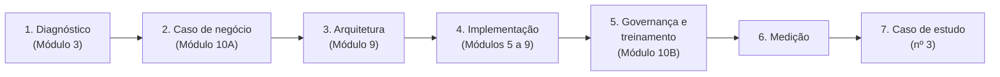
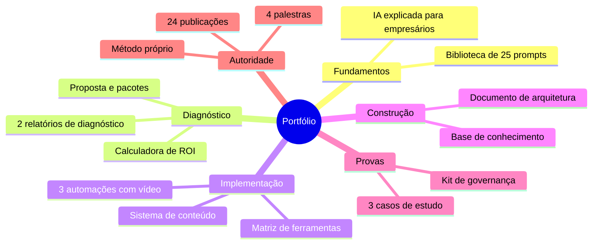

# Projeto final: implementação completa

**Semana 24 (o projeto em si pode se estender por 4 a 8 semanas, em paralelo às últimas fases)**

## O ciclo completo

O projeto final prova que você domina o **ciclo inteiro** em uma empresa **diferente** da empresa-laboratório, sem a familiaridade que você já tinha com ela, como acontecerá com clientes reais.

*Figura: as 7 etapas do projeto final, cada uma apoiada em um módulo da formação. É o mesmo ciclo que você vai repetir com cada cliente.*

### Como encontrar a empresa do projeto final

- Um dos participantes da Palestra 2 ou 3 a quem você ofereceu diagnóstico.
- Uma indicação da empresa-laboratório (peça: "você conhece outro empresário que se beneficiaria disso?").
- Um cliente que pague um valor reduzido em troca de depoimento e autorização para usar os resultados.

---

## Etapas, entregas e critérios

| # | Etapa | Entrega | Critério de aprovação |
|---|---|---|---|
| 1 | Diagnóstico (M3) | Relatório de diagnóstico | Pelo menos 10 oportunidades pontuadas; gráfico das 5 camadas; roadmap; apresentado ao dono |
| 2 | Caso de negócio (M10A) | ROI em 3 cenários + proposta | Payback conservador calculado com premissas explícitas |
| 3 | Arquitetura (M9) | Documento de arquitetura | 6 camadas, decisões justificadas, riscos, custos, contingência |
| 4 | Implementação (M5 a M9) | Solução em produção | Pelo menos 30 casos de teste; piloto com humano no circuito; fichas documentadas |
| 5 | Governança e treinamento (M10B) | Política + treinamento aplicado | Equipe treinada; política aprovada pelo dono; checklist LGPD |
| 6 | Medição | Tabela antes × depois | Pelo menos 3 indicadores com dados reais de 2 a 4 semanas |
| 7 | Caso de estudo | Caso nº 3 + depoimento | Publicável (com autorização) |

### Cronograma sugerido (6 semanas)

| Semana | Etapas |
|---|---|
| 1 | Diagnóstico: entrevistas e mapeamento |
| 2 | Diagnóstico: relatório e apresentação; caso de negócio e proposta |
| 3 | Arquitetura; início da construção |
| 4 | Construção e testes; política de uso |
| 5 | Piloto com humano no circuito; treinamento da equipe |
| 6 | Operação, medição e caso de estudo |

---

## Requisitos mínimos da solução

Escolha **pelo menos 2** componentes:

- [ ] Automação com IA (Módulo 5)
- [ ] Atendimento ou vendas com IA (Módulo 6)
- [ ] Sistema de conteúdo (Módulo 7)
- [ ] Base de conhecimento (RAG) (Módulo 8)
- [ ] Agente com ferramentas integrado a sistemas (Módulo 9)

---

## Banca de avaliação

Faça uma autoavaliação honesta, ou peça a um colega da área para avaliar. Dê uma nota de 1 a 5:

| Critério | Nota |
|---|---|
| O problema escolhido tinha impacto real de negócio? | |
| O diagnóstico foi fundamentado em dados e entrevistas (não em achismo)? | |
| A arquitetura é a mais simples que resolve? | |
| A solução está em uso de verdade pela equipe? | |
| Os resultados foram medidos com rigor? | |
| Os riscos e a LGPD foram tratados? | |
| O cliente consegue manter sem você (ou há contrato de manutenção)? | |
| O caso está pronto para ser apresentado em palestra? | |

**Aprovação:** média de 4 ou mais e nenhum critério abaixo de 3.

**Se não for aprovado:** identifique o critério mais baixo, volte ao módulo correspondente e refaça aquela etapa. O objetivo não é a nota, é a competência.

---

## Seu portfólio final (checklist)

*Figura: o portfólio completo, organizado por fase. Os 3 casos de estudo são as peças mais valiosas: são a prova verificável do seu trabalho.*

- [ ] Documento "IA explicada para empresários" (M1)
- [ ] Biblioteca de 25 prompts testados (M2)
- [ ] 2 relatórios de diagnóstico (M3 + projeto final)
- [ ] Matriz de ferramentas (M4)
- [ ] 3 automações documentadas + vídeo (M5)
- [ ] Caso de estudo nº 1: atendimento (M6)
- [ ] Sistema de conteúdo (M7)
- [ ] Base de conhecimento com avaliação (M8)
- [ ] Documento de arquitetura + caso de estudo nº 2 (M9)
- [ ] Calculadora de ROI + proposta + pacotes de serviços (M10A)
- [ ] Kit de governança (M10B)
- [ ] Caso de estudo nº 3 (projeto final)
- [ ] 4 palestras com slides e feedbacks
- [ ] Método próprio com nome e visual
- [ ] 24 publicações

---

## E depois? Os próximos 6 meses

| Prioridade | Ação | Por quê |
|---|---|---|
| 1 | **Especialize-se em um nicho** (clínicas, contabilidades, varejo, indústria, imobiliárias...) | Um especialista de nicho vende com mais facilidade, cobra mais e reaproveita soluções |
| 2 | **Transforme soluções repetidas em produtos** | O mesmo agente de agendamento, adaptado para 10 clínicas, vira um produto com receita recorrente |
| 3 | **Aprofunde a parte técnica conforme a demanda** | Python, APIs, bancos de dados, avaliação de sistemas de IA, servidores MCP próprios |
| 4 | **Mantenha a rotina de atualização** (1 hora por semana) | A área muda todo mês; revise a matriz de ferramentas a cada trimestre |
| 5 | **Ensine** | Turmas, workshops e mentorias consolidam o que você sabe e fazem de você uma referência |

> 🎓 **Você será especialista não por ter estudado 24 semanas, mas por ter 3 casos reais, com números, que qualquer pessoa pode verificar, e por saber explicar como chegou lá.**
