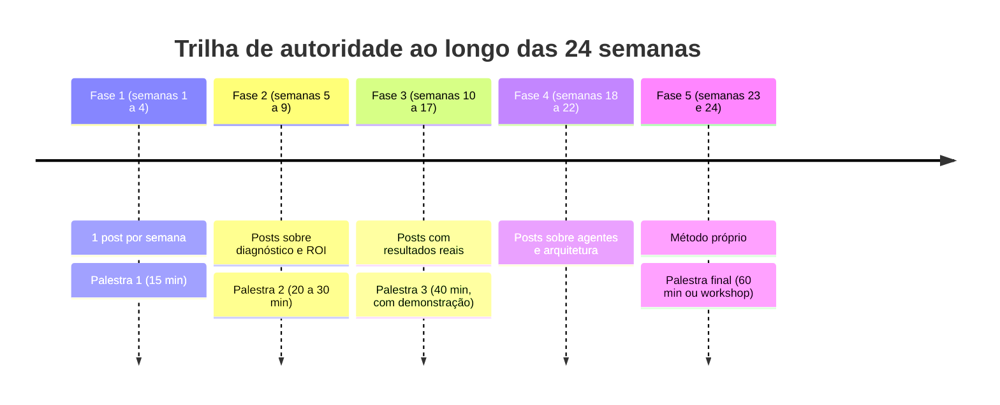
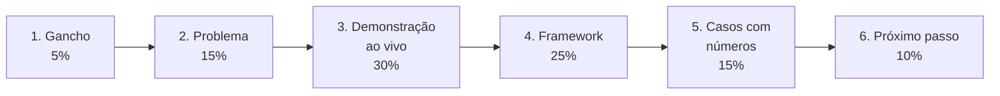
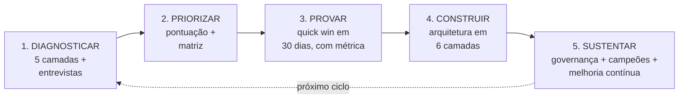
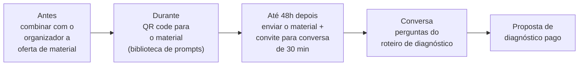

# Trilha contínua: palestras e autoridade

**Semanas 1 a 24 · cerca de 1 hora por semana + preparação das palestras**

## Objetivos

Conhecimento sem comunicação não gera oportunidades. Esta trilha roda **em paralelo** a toda a formação e transforma o que você aprende em autoridade, contatos e clientes.

Ao final da trilha você será capaz de:

1. Construir presença profissional como especialista em IA para negócios.
2. Estruturar e apresentar palestras de 15, 30, 40 e 60 minutos.
3. Fazer demonstrações ao vivo sem riscos.
4. Criar e apresentar um método próprio.
5. Transformar palestras em oportunidades de negócio.

### Como a trilha se encaixa na formação



*Figura: a trilha cresce junto com o seu conhecimento. Cada palestra usa o que você acabou de construir na fase.*

---

## Parte 1: Publicação semanal ("aprender em público")

### A regra

**1 publicação por semana** (LinkedIn e/ou Instagram) sobre o que você aprendeu ou aplicou. Três motivos:

1. **Fixa o aprendizado:** explicar obriga a entender de verdade.
2. **Cria um histórico público** da sua evolução: em 6 meses, qualquer pessoa vê 24 provas de que você sabe o assunto.
3. **Atrai oportunidades:** empresários e organizadores de eventos encontram você.

### Os 6 formatos que funcionam

| Formato | Estrutura | Exemplo de abertura |
|---|---|---|
| **"Testei e conto"** | O que testei → como → resultado → aprendizado | "Testei 3 IAs para responder clientes. O resultado me surpreendeu:" |
| **Antes × depois** | Situação antiga → o que mudou → números | "Esta tarefa levava 2 horas. Agora leva 5 minutos. Veja como:" |
| **Tutorial curto** | Problema → 3 passos → resultado | "3 prompts para quem tem uma loja" |
| **Mito × verdade** | O mito → por que é falso → o que é verdade | "A IA vai substituir seu atendente? Não exatamente." |
| **Bastidores de projeto** | Contexto → desafio → decisão → resultado (com autorização) | "Esta semana, uma serralheria me mostrou por que perdia 40% dos orçamentos." |
| **Framework** | Nome → passos → exemplo | "Como descobrir onde a IA dá dinheiro na sua empresa (em 4 perguntas)" |

### Anatomia de um bom post

```
[Linha 1] Gancho: uma frase que faz parar de rolar
[Linhas 2-3] Contexto: o problema, em uma situação concreta
[Corpo] O conteúdo: passos, números, aprendizado (frases curtas, espaço entre blocos)
[Fim] Uma pergunta ou convite: "Qual tarefa você automatizaria primeiro?"
```

**Use a IA como editora, não como autora.** Escreva o rascunho com a sua experiência real e peça: *"Revise este post: deixe o gancho mais forte, corte o que for desnecessário e mantenha o meu jeito de falar."* Posts escritos inteiramente pela IA soam genéricos, e o seu diferencial é a experiência real.

### Temas por fase

| Fase | Temas |
|---|---|
| 1 | Conceitos explicados de forma simples, testes de ferramentas, prompts |
| 2 | Diagnóstico, oportunidades por segmento, ROI |
| 3 | Automações e atendimento com resultados reais |
| 4 | Agentes, RAG e arquitetura explicados visualmente |
| 5 | Governança, LGPD, seu método, casos completos |

> 📌 **Em resumo**
> - Um post por semana, em um dos 6 formatos.
> - Gancho, contexto, conteúdo e convite.
> - A IA edita; a experiência é sua.

---

## Parte 2: Anatomia de uma boa palestra sobre IA

### A estrutura em 6 blocos



*Figura: os 6 blocos e o peso de cada um no tempo total. A demonstração é o maior bloco: é o que o público lembra.*

| Bloco | % do tempo | Objetivo | Exemplo |
|---|---|---|---|
| **1. Gancho** | 5% | Capturar a atenção | "Quantos aqui responderam a mesma pergunta de cliente mais de 10 vezes esta semana?" |
| **2. Problema** | 15% | Conectar com a dor do público | Histórias de PMEs perdendo vendas e tempo, com números |
| **3. Demonstração ao vivo** | 30% | Provar que é real e acessível | Montar um prompt ou uma automação na frente do público |
| **4. Framework** | 25% | Dar um método que a pessoa leva | Os 4 passos para descobrir oportunidades |
| **5. Casos com números** | 15% | Gerar credibilidade | "De 4 horas para 2 minutos de resposta" |
| **6. Próximo passo** | 10% | Ação + contato | "Amanhã, faça isto: ___. Para um diagnóstico completo, fale comigo." |

**Em minutos, para cada duração:**

| Bloco | 15 min | 30 min | 40 min | 60 min |
|---|---|---|---|---|
| Gancho | 1 | 2 | 2 | 3 |
| Problema | 2 | 4 | 6 | 9 |
| Demonstração | 5 | 9 | 12 | 18 |
| Framework | 4 | 8 | 10 | 15 |
| Casos | 2 | 4 | 6 | 9 |
| Próximo passo | 1 | 3 | 4 | 6 |

### As regras de ouro

1. **Uma ideia central** por palestra. Pergunte-se: "se o público lembrar de uma única frase, qual é?"
2. **Linguagem do público**, não da tecnologia: fale de vendas, tempo e clientes, não de tokens e embeddings.
3. **Slides com pouco texto:** uma ideia por slide, imagens, números grandes.
4. **Histórias vencem dados, que vencem teoria.**
5. **Interação a cada 7 a 10 minutos:** uma pergunta, uma votação com as mãos, um desafio.
6. **Termine no horário.** Sempre.

### Perguntas difíceis (prepare as respostas)

| Pergunta | Linha de resposta |
|---|---|
| "A IA vai tirar empregos?" | Ela tira tarefas, não pessoas; as empresas que usam bem crescem e realocam. Seja honesto sobre os casos em que há redução. |
| "E a segurança dos meus dados?" | Planos corretos, semáforo de dados e política de uso (Módulo 10). |
| "Quanto custa?" | Dê faixas reais e fale de payback, não só de preço. |
| "Funciona para o meu tipo de negócio?" | Cite 2 exemplos do segmento (repertório do Módulo 3, Exercício 4). |
| "E se a IA errar com meu cliente?" | Base de conhecimento, "não sei", humano no circuito e testes (Módulos 1, 5 e 6). |

> 📌 **Em resumo**
> - Gancho, problema, demonstração, framework, casos e próximo passo.
> - Uma ideia central, linguagem do público, interação e horário cumprido.
> - Prepare as 5 perguntas difíceis.

**Para ir além**
- [TED Talks](https://www.ted.com/talks): assista a 3 palestras e identifique os 6 blocos em cada uma.
- Curso [Introduction to Public Speaking](https://www.coursera.org/learn/public-speaking) (Coursera, em inglês, com legendas).

---

## Parte 3: Demonstração ao vivo sem desastre

A demonstração é o momento mais memorável da palestra, e o de maior risco. Internet que cai, ferramenta que muda de layout, resposta estranha da IA: tudo pode acontecer.

### O checklist da demonstração

- [ ] Ensaiada pelo menos 5 vezes, **no mesmo computador** que será usado.
- [ ] Internet de reserva (roteador do celular).
- [ ] Contas já conectadas; abas abertas na ordem; zoom de tela aumentado (fonte grande).
- [ ] Prompts prontos em um arquivo para copiar e colar (não digite textos longos ao vivo).
- [ ] **Vídeo gravado da demonstração como plano B**, pronto para tocar.
- [ ] Nenhum dado real de cliente na tela; notificações desligadas.
- [ ] Frase pronta se algo falhar: "E isso mostra por que sempre testamos antes de colocar em produção 😄 Vejam a versão gravada."

### Ideias de demonstrações de alto impacto

| Demonstração | Por que funciona | Duração |
|---|---|---|
| **Prompt fraco × prompt profissional**, lado a lado | Mostra em segundos que o método importa | 3 a 5 min |
| **Foto da nota fiscal → planilha** | Visual, rápido, resolve uma dor conhecida | 2 min |
| **Áudio do WhatsApp → resumo + tarefa** | Todo empresário recebe áudios demais | 3 min |
| **Agente de atendimento com o público** | Alguém da plateia manda mensagem ao vivo | 5 min |
| **Diagnóstico relâmpago** | Um participante descreve o negócio em 1 minuto e você mostra 3 oportunidades | 5 a 8 min |

> 📌 **Em resumo**
> - Ensaie no mesmo equipamento, tenha internet e vídeo de reserva.
> - Escolha demonstrações que resolvem dores conhecidas do público.

---

## Parte 4: As 4 palestras da formação

Use o [roteiro de palestra](templates/roteiro-de-palestra.md) para prepará-las.

### Palestra 1 (fim da Fase 1, semana 4): 15 minutos

| Item | Definição |
|---|---|
| **Título sugerido** | "O que a IA pode (e não pode) fazer pela sua empresa" |
| **Público** | Amigos empresários, equipe da empresa-laboratório, grupo local |
| **Base** | Entregável "IA explicada para empresários" + demonstração de prompt fraco × profissional |
| **Objetivo** | Perder o medo do palco e colher feedback |

### Palestra 2 (fim da Fase 2, semana 9): 20 a 30 minutos

| Item | Definição |
|---|---|
| **Título sugerido** | "Como descobrir onde a IA dá dinheiro na sua empresa" |
| **Público** | Meetup, associação comercial, câmara de dirigentes lojistas, grupo de networking |
| **Base** | Diagnóstico em 5 camadas + pontuação de oportunidades + exemplos por segmento |
| **Objetivo** | Posicionar-se como quem **sabe diagnosticar**. Ofereça um diagnóstico gratuito ou com desconto para 2 participantes (é a sua próxima empresa-laboratório) |

### Palestra 3 (fim da Fase 3, semana 17): 40 minutos

| Item | Definição |
|---|---|
| **Título sugerido** | "Do zero ao atendimento automatizado em 30 dias" |
| **Público** | Eventos de empreendedorismo, Sebrae, associações setoriais |
| **Base** | Caso de estudo nº 1 + demonstração do agente ao vivo |
| **Objetivo** | Gerar pedidos de implementação |

### Palestra final (semana 24): 60 minutos ou workshop de 3 horas

| Item | Definição |
|---|---|
| **Título sugerido** | "O Método [Seu Nome]: IA na prática para PMEs" |
| **Base** | Seus frameworks + 3 casos + demonstrações + kit de governança |
| **Formato workshop** | Os participantes saem com a própria biblioteca de 10 prompts e um mapa de oportunidades da empresa deles |
| **Objetivo** | Produto vendável (palestra paga, workshop dentro de empresas) |

### Como conseguir espaço para palestrar

1. **Comece pequeno:** grupos de WhatsApp de empresários, associações de bairro, igrejas e clubes com público empresarial, faculdades.
2. **Associações comerciais e CDLs:** muitas têm cafés da manhã ou encontros mensais e procuram palestrantes.
3. **Sebrae e entidades setoriais:** apresente uma proposta de palestra com título, público e resultados esperados.
4. **Eventos online:** lives com outros profissionais (contadores, agências de marketing) que atendem o mesmo público.
5. **Leve sempre um vídeo curto** de uma palestra anterior. Organizadores querem ver você falando.

> 📌 **Em resumo**
> - Quatro palestras progressivas, cada uma com um objetivo.
> - Comece em públicos pequenos e use cada palestra para conseguir a próxima.

---

## Parte 5: Seu método próprio

Especialistas reconhecidos têm um **método com nome**. Ao final da formação, organize o seu com as peças que você construiu:



*Figura: um exemplo de estrutura de método. Cada etapa corresponde a um módulo da formação; o nome e o visual devem ser seus.*

### Como criar o seu

1. **Liste as etapas** que você de fato segue nos projetos (use as do exemplo como ponto de partida).
2. **Dê um nome memorável:** um acrônimo (as iniciais das etapas formando uma palavra), uma metáfora (uma "escada", uma "bússola") ou o seu nome.
3. **Crie um visual simples:** um diagrama que caiba em um slide e seja entendido em 10 segundos.
4. **Use em tudo:** palestras, propostas, posts, relatórios. A repetição é o que torna o método conhecido.

> 📌 **Em resumo**
> - Um método com nome e visual diferencia você e torna o seu conhecimento vendável.
> - Construa-o a partir do que você realmente faz.

---

## Parte 6: Da palestra ao cliente



*Figura: o caminho da palestra ao cliente. O material gratuito é a ponte; a conversa de 30 minutos é onde a venda começa.*

1. **Antes:** combine com o organizador que você poderá oferecer um material ao público.
2. **Durante:** ofereça algo de valor em troca do contato: "Quem quiser a biblioteca de prompts e o checklist de oportunidades, aponte a câmera para o QR code."
3. **Até 48 horas depois:** envie o material e um convite para uma conversa de 30 minutos ("diagnóstico relâmpago").
4. **Na conversa:** use as perguntas do [roteiro de entrevista](templates/roteiro-entrevista-diagnostico.md) (Módulo 3) e proponha o diagnóstico pago.
5. **Registre tudo** em um CRM simples (até uma planilha): origem, data, status e próximo passo.

> 📌 **Em resumo**
> - Material gratuito na palestra, contato em até 48 horas, conversa de 30 minutos, proposta de diagnóstico.

---

## Entregáveis da trilha

- 24 publicações (1 por semana).
- 4 palestras realizadas, com slides, roteiro e gravação sempre que possível.
- Feedback escrito de pelo menos 5 participantes em cada palestra.
- Seu método próprio, com nome e visual.
- Página de apresentação profissional (perfil do LinkedIn otimizado ou site de 1 página) com os 3 casos.

---

## Autoavaliação

Meta: pelo menos 6 de 7.

1. Quais os 6 blocos de uma palestra e o peso de cada um?
2. Cite 5 itens do checklist de demonstração.
3. Qual o objetivo principal de cada uma das 4 palestras?
4. Por que usar a IA como editora, e não como autora, dos seus posts?
5. Por que ter um método com nome?
6. O que fazer nas 48 horas após uma palestra?
7. Cite 3 lugares para conseguir as primeiras palestras.

<details>
<summary><strong>Gabarito</strong></summary>

1. Gancho (5%), Problema (15%), Demonstração (30%), Framework (25%), Casos (15%), Próximo passo (10%).
2. Ensaiar 5 vezes no mesmo equipamento; internet de reserva; contas conectadas e abas prontas; prompts prontos para colar; vídeo de plano B; nenhum dado real; notificações desligadas; frase de contingência (quaisquer 5).
3. P1: perder o medo e colher feedback. P2: posicionar-se como quem sabe diagnosticar. P3: gerar pedidos de implementação. Final: produto vendável e autoridade.
4. Porque o diferencial é a sua experiência real; textos escritos inteiramente pela IA soam genéricos.
5. Diferencia você, torna o conhecimento memorável e vendável e dá consistência a palestras, propostas e conteúdo.
6. Enviar o material prometido e convidar para uma conversa de diagnóstico de 30 minutos.
7. Grupos de empresários, associações comerciais e CDLs, Sebrae e entidades setoriais, faculdades, eventos online com parceiros (quaisquer 3).
</details>
